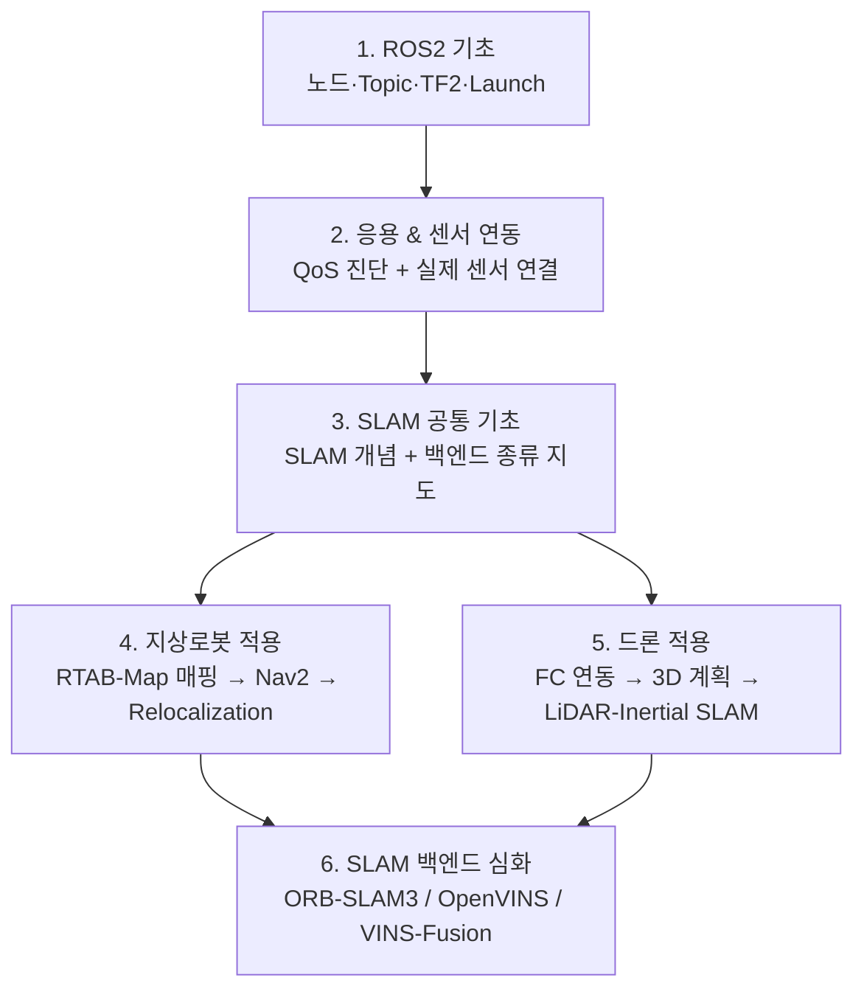

# 00. 전체 학습 지도

이 vault는 **ROS2 입문 → SLAM 공통 기초 → 지상로봇 적용 → 드론 적용 → SLAM 백엔드 심화** 순서로 학습하도록 구성되어 있다. 폴더 번호가 곧 학습 순서다.

지상로봇(Yahboom ROSMASTER X3)과 드론은 같은 ROS2 기초 위에서 갈라지는 **동등한 두 적용 갈래**다. Nav2가 "내비게이션 일반론"이 아니라 지상로봇 전용 스택이듯, 드론도 자기만의 스택(FC 연동, 3D 계획, LiDAR-Inertial SLAM 등)을 갖는다 — 한쪽이 다른 쪽의 "차이점 목록"이 아니라는 뜻이다. SLAM 백엔드(ORB-SLAM3/OpenVINS/VINS-Fusion/FAST-LIO2) 자체를 논문 수준까지 깊게 비교하는 내용은 두 갈래를 다 읽은 뒤 보는 심화 파트로 맨 뒤에 둔다.

## 전체 흐름

## 시리즈별 안내

### [1. ROS2 기초](1_ROS2%20기초) — 10편

ROS2 자체를 처음 배우는 단계. **설치부터 시작**하며, 이후 모든 시리즈의 전제가 된다.

`00` ROS2란 → `01` 개발환경·워크스페이스(설치 포함) → `02` 노드 → `03` Topic → `04` Service·Action → `05` Parameter → `06` Launch → `07` TF2 → `08` rqt/RViz2 → `09` 문제 해결

> **먼저 볼 것**: 01에 ROS2 설치와 `rosdep` 초기화가 들어 있다. 아무것도 설치되지 않은 상태라면 00 → 01 순으로 시작한다.

### [2. ROS2 응용 & 센서 연동](2_ROS2%20응용%20&%20센서%20연동) — 6편

실제 하드웨어를 붙이는 단계. **QoS를 먼저 배우는 순서**인 것이 중요하다 — 센서가 안 보이는 문제의 1순위 원인이기 때문이다.

`01` DDS·QoS → `02` RealSense D435i → `03` LiDAR C1 → `04` colcon 빌드 오류 → `05` Launch 디버깅 → `06` Composable Node

> 04~06은 참조·최적화 성격이라, 센서 두 개가 붙은 뒤 필요할 때 펼쳐봐도 된다.

### [3. SLAM 공통 기초](3_SLAM%20공통%20기초) — 2편

지상로봇/드론으로 갈라지기 전에, SLAM이 뭘 하는 기술이고 백엔드들을 어떤 축으로 구분하는지만 가볍게 정리한다. 백엔드별 상세 비교는 6번(SLAM 백엔드 심화)으로 미룬다.

`00` SLAM이란 무엇인가 → `01` SLAM 백엔드 종류 한눈에 보기

### [4. 지상로봇 적용](4_지상로봇%20적용) — 20편

Yahboom ROSMASTER X3로 지도를 만들고, 그 지도로 목적지까지 이동하고, 위치를 잃었을 때 대응하는 전체 스택. 세 하위 시리즈로 구성된다.

- **A. 지도제작**(3편) — `00` RTAB-Map 매핑 원리 → `01` 실행 파이프라인·파라미터(실습) → `02` 매핑 품질 진단(실습)
- **B. Nav2 내비게이션**(9편) — `00` 아키텍처 개요(실습) → `00-1` Action 기반 구조 → `01` 좌표계·로컬라이제이션(실습) → `02` Costmap → `03` Global Planner → `04` Controller/경로 추종(MPPI) → `05` Behavior Tree·Recovery → `06` Waypoint·Velocity Smoother → `07` Relocalization의 위치
- **C. Relocalization 심화**(8편) — `00` 학술적 정의 → `01` 트리거 5분류(일반) → `01-1` 이 프로젝트의 트리거 구현 → `02` 파라미터 대응표 → `03` Pose Jump 제어 → `04` 진단 체크리스트 → `05` Nav2 표준과의 차이 → `06` 감시 로직 구현(코드)

### [5. 드론 적용](5_드론%20적용) — 20편 + 프로젝트 12편

지상로봇 적용과 동등한 무게의 별도 스택. Nav2가 지상로봇용 내비게이션 스택이듯, 드론은 FC(PX4) 연동·3D 경로계획·LiDAR-Inertial SLAM이라는 자기 스택을 쓴다.

`00` 무엇이 다른가 → `01` 좌표계·상태 추정 → `01-1` **오도메트리 소스 선택** → `01-2` **외부 오도메트리를 PX4에 보내기** → `02` 비행 컨트롤러 연동 → `02-1` **수동 조종과 제어 인터페이스 설계** → `02-2` **PX4의 비행 모드와 시동 명령** → `03` 3D 경로 계획(개요) → `03-1` 3D 지도 표현과 장애물 비용 → `03-2` 3D 경로 계획과 궤적 생성 → `03-3` Setpoint 스트리밍과 궤적 추종 → `03-4` Failsafe와 복구 행동 → `04` SLAM 백엔드 재평가 → `04-1` VIO vs LiDAR-Inertial SLAM → `04-2` Livox Mid-360S와 비반복 스캔 → `04-3` FAST-LIO2 알고리즘 구조 → `04-4` ikd-tree와 지도 관리 → `04-5` 매핑 비행과 지도 품질 → `04-6` 재위치와 Pose Jump → `05` 안전과 실전

안에 **세 개의 하위 묶음**이 있다.

- **`03`~`03-4` 3D 내비게이션 4부작** — 지상로봇의 Nav2 시리즈(9편)에 대응하는 자리다. 지도 표현 → 경로·궤적 → setpoint 스트리밍 → failsafe 순으로, Nav2의 costmap·planner·controller·recovery가 드론에서 각각 무엇으로 바뀌는지 짚는다.
- **`04-1`~`04-6` LiDAR-Inertial SLAM 6부작** — 04-1이 "카메라냐 LiDAR냐"를 비교했다면, 이후는 **LiDAR 쪽을 논문·코드 수준까지** 파고든다(센서 원리 → 알고리즘 → 자료구조 → **매핑 실행 → 재위치**). 앞의 넷이 원리라면 **04-5·04-6은 실제로 날아서 쓰는 법**이고, 지상로봇의 지도제작(3편)·Relocalization 심화(8편)에 대응하는 자리다. 6번 시리즈가 카메라 기반 백엔드 3종을 다루는 것과 짝을 이룬다.
- **`01-2`·`02-2` 두 축** — 드론에서 PX4로 가는 길은 둘이다. **위치 축**(`01-2`: SLAM 결과를 EKF2에 넣기)과 **조종 축**(`02-2`: 비행 모드·시동 명령). **시동이 거부되는 문제는 거의 항상 조종 축이 아니라 위치 축에 있다** — 이 구분을 못 하면 엉뚱한 토픽을 몇 시간씩 뒤지게 된다.
- **`02-1`** — 지상로봇의 `teleop_twist_keyboard`에 해당하는 자리. `cmd_vel` 하나로는 드론이 안 움직이는 이유와, 그 간극을 메우는 **어댑터 노드** 설계(모드 상태 기계·조종자 중재·데드맨·계층별 상한). **수동 조종뿐 아니라 자동 비행 노드도 같은 인터페이스를 쓴다.**
- **`01-1`** — 드론 오도메트리를 **VIO로 고정해 생각하지 않도록** 선택지 전체(VIO·LIO·광류·GPS·모션캡처)를 펼치는 문서. **00~02를 읽을 때 이것을 함께 본다.**

> 지상로봇 적용을 먼저 읽고 오는 것을 권장한다 — 드론 적용 시리즈가 TF 구조·EKF·Nav2 같은 지상로봇 적용의 개념을 계속 대조군으로 쓴다.

**[P1. 둠둠 프로젝트](5_드론%20적용/P1_둠둠_프로젝트)** — 위 일반론을 실제 미션 하나(사무실 실내, Livox Mid-360S + FAST-LIO2, 매핑+재위치)에 적용하는 첫 프로젝트. 일반론(00~05)을 다 읽은 뒤 보는 것을 전제로 한다. **설계편과 실측편으로 나뉜다.**

- **설계편(00~06)** — `00` 프로젝트 개요와 시나리오 정의 → `01` 통합 노드 아키텍처 → `02` 빠른 적용 로드맵과 체크리스트 → `03` FAST-LIO2 생태계와 맵 관리 → `04` 재위치 레이어와 map→odom 보정 → `05` 정지·회피와 setpoint 처리 → `06` 자동 탐색 매핑과 확장 고려사항
- **실측편(07~11)** — `07` Mid-360S Bringup 실측 기록 → `08` 사례연구: 정지 상태 발산 → `09` 사례연구: 28km 발산과 ROS2 포팅 회귀 → `10` 실전 조사에서 배운 것 → `11` 수동 조종(가상 조이스틱) 실측

> **설계편이 예상한 것과 실측이 보여준 것이 여러 곳에서 달랐고, 그 차이를 지우지 않고 남겼다**(03의 2.3절 정정이 대표적). 08~09의 두 사고 분석은 LiDAR/SLAM을 몰라도 읽히는 **소프트웨어 엔지니어링 사례연구**이기도 하다.

### [6. SLAM 백엔드 심화](6_SLAM%20백엔드%20심화) — 21편

지상로봇·드론 양쪽에서 실전 관점으로 다룬 SLAM 백엔드들을, 이제 논문·수식 수준까지 깊게 비교한다.

- **공통 기초**: `00-1` 최소 수학 → `00-2` 특징점·기술자·매칭
- **ORB-SLAM3**: `01-1`~`01-5`
- **OpenVINS**: `02-1`~`02-8`
- **VINS-Fusion**: `03-1`~`03-5`
- **종합**: `04`

> **00-1·00-2를 건너뛰지 말 것.** 이후 18개 문서가 여기서 정의한 용어(키프레임, marginalization, ORB/KLT 등)를 설명 없이 사용한다.

## 문서 읽는 법

문서는 **튜토리얼 형식**과 **레퍼런스 형식** 두 가지로 나뉜다. 새 개념을 처음 배우는 문서는 튜토리얼로, 이미 아는 것을 찾아보는 문서는 레퍼런스로 쓴다.

| 형식 | 쓰이는 곳 | 구성 |
|---|---|---|
| **튜토리얼** | 1·2 시리즈, SLAM 공통 기초 00, 드론 적용 00·01-1·03-1~03-4·04-2~04-6, SLAM 백엔드 심화 01-1~01-5(ORB-SLAM3) | 문서 정보 → 개념 → **비유** → (실습) → 자주 발생하는 문제 → **이해도 점검** |
| **레퍼런스** | SLAM 공통 기초 01, 지상로봇 적용 전체, 드론 적용 01~03(01-2·02-1·02-2 포함)·04~04-1·05, 둠둠 프로젝트 00~06, SLAM 백엔드 심화 02~04 | 개요 → 핵심 개념 → 적용 → 파라미터 → 진단 → 연결 → 참고자료 |
| **사례연구** | 둠둠 프로젝트 07~11 | 증상 → 가설(신뢰도) → 실측 → 원인 → 채택/미채택 수정 → **이해도 점검** → 일반화 교훈 |

**형식과 무관하게 공통인 것**

- **문서 정보 표**: 학습 단계·선행 지식·학습 목표·기준 환경·관련 문서. 문서를 열자마자 "지금 이걸 읽어도 되는지, 읽으면 뭘 할 수 있게 되는지"를 판단할 수 있게 한다.
- **이전/다음 문서 링크**: 모든 문서가 앞뒤로 연결되어 있어, 순서대로 따라가면 시리즈 전체를 빠짐없이 읽게 된다.
- **진단 관점**: 실패 증상 → 확인 순서. 이 vault는 "되는 법"만큼 "안 될 때 어디부터 보는지"를 중요하게 다룬다.

> 레퍼런스 형식이라고 해서 내용이 얕은 것은 아니다 — 오히려 SLAM 백엔드 심화의 레퍼런스 문서들이 밀도가 가장 높다. 형식의 차이는 **"처음 배우는가, 찾아보는가"**의 차이지 깊이의 차이가 아니다.

**공통 원칙 — 일반 이론과 프로젝트 사례의 분리**

각 문서는 **일반적으로 통용되는 내용**을 본문으로 삼고, 이 프로젝트(Yahboom ROSMASTER X3)의 실제 사례는 "실제 로봇 관점" 또는 "이 프로젝트에서의 적용" 섹션에 모아둔다. 사례가 많은 주제는 아예 별도 문서로 분리했다(SLAM 백엔드 심화 01-5·02-7·02-8·03-5, 지상로봇 적용 Relocalization 심화 01-1).

프로젝트 실측 근거는 [ros2-nav-yahboom](ros2-nav-yahboom.md)에 색인되어 있다.

## 관련 하드웨어

| 구분 | 사양 |
|---|---|
| 플랫폼 | Yahboom ROSMASTER X3 (메카넘 휠) |
| 연산 | Jetson (로봇 본체) + 호스트 PC (RViz) |
| 카메라 | Intel RealSense D435i (RGB-D + IMU) |
| LiDAR | Slamtec RPLiDAR C1 (2D) |
| 소프트웨어 | Ubuntu 22.04, ROS2 Humble |
