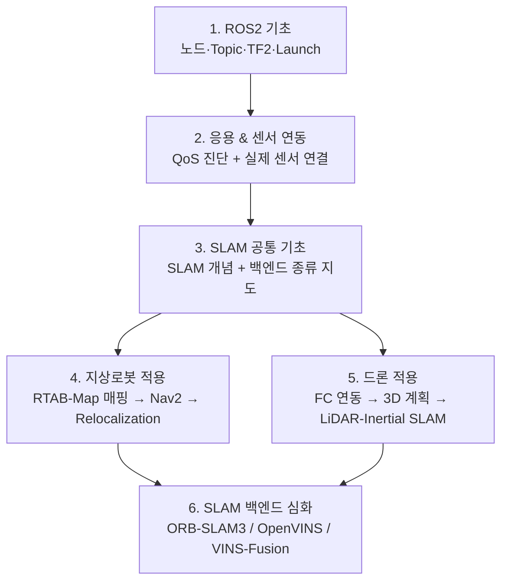

# 00. 전체 학습 지도

이 vault는 **ROS2 입문 → SLAM 공통 기초 → 지상로봇 적용 → 드론 적용 → SLAM 백엔드 심화** 순서로 학습하도록 구성되어 있다. 폴더 번호가 곧 학습 순서다.

지상로봇(Yahboom ROSMASTER X3)과 드론은 같은 ROS2 기초 위에서 갈라지는 **동등한 두 적용 갈래**다. Nav2가 "내비게이션 일반론"이 아니라 지상로봇 전용 스택이듯, 드론도 자기만의 스택(FC 연동, 3D 계획, LiDAR-Inertial SLAM 등)을 갖는다 — 한쪽이 다른 쪽의 "차이점 목록"이 아니라는 뜻이다. SLAM 백엔드(ORB-SLAM3/OpenVINS/VINS-Fusion/FAST-LIO2) 자체를 논문 수준까지 깊게 비교하는 내용은 두 갈래를 다 읽은 뒤 보는 심화 파트로 맨 뒤에 둔다.

## 전체 흐름

## 시리즈별 안내

### [1. ROS2 기초](1_ROS2%20기초) — 10편

ROS2 자체를 처음 배우는 단계. **설치부터 시작**하며, 이후 모든 시리즈의 전제가 된다.

`00` ROS2란 → `01` 개발환경·워크스페이스(설치 포함) → `02` 노드 → `03` Topic → `04` Service·Action → `05` Parameter → `06` Launch → `07` TF2 → `08` rqt/RViz2 → `09` 문제 해결

> **먼저 볼 것**: 01편에 ROS2 설치와 `rosdep` 초기화가 들어 있다. 아무것도 설치되지 않은 상태라면 00 → 01 순으로 시작한다.

### [2. ROS2 응용 & 센서 연동](2_ROS2%20응용%20&%20센서%20연동) — 6편

실제 하드웨어를 붙이는 단계. **QoS를 먼저 배우는 순서**인 것이 중요하다 — 센서가 안 보이는 문제의 1순위 원인이기 때문이다.

`01` DDS·QoS → `02` RealSense D435i → `03` LiDAR C1 → `04` colcon 빌드 오류 → `05` Launch 디버깅 → `06` Composable Node

> 04~06은 참조·최적화 성격이라, 센서 두 개가 붙은 뒤 필요할 때 펼쳐봐도 된다.

### [3. SLAM 공통 기초](3_SLAM%20공통%20기초) — 2편

지상로봇/드론으로 갈라지기 전에, SLAM이 뭘 하는 기술이고 백엔드들을 어떤 축으로 구분하는지만 가볍게 정리한다. 백엔드별 상세 비교는 6번(SLAM 백엔드 심화)으로 미룬다.

`A0` SLAM이란 무엇인가 → `A0-1` SLAM 백엔드 종류 한눈에 보기

### [4. 지상로봇 적용](4_지상로봇%20적용) — 20편

Yahboom ROSMASTER X3로 지도를 만들고, 그 지도로 목적지까지 이동하고, 위치를 잃었을 때 대응하는 전체 스택. 세 하위 시리즈로 구성된다.

- **A. 지도제작**(3편) — `A1` RTAB-Map 매핑 원리 → `A2` 실행 파이프라인·파라미터(실습) → `A3` 매핑 품질 진단(실습)
- **B. Nav2 내비게이션**(9편) — `B1` 아키텍처 개요(실습) → `B1-1` Action 기반 구조 → `B2` 좌표계·로컬라이제이션(실습) → `B3` Costmap → `B4` Global Planner → `B5` Controller/경로 추종(MPPI) → `B6` Behavior Tree·Recovery → `B7` Waypoint·Velocity Smoother → `B8` Relocalization의 위치
- **C. Relocalization 심화**(8편) — `C1` 학술적 정의 → `C2` 트리거 5분류(일반) → `C2-1` 이 프로젝트의 트리거 구현 → `C3` 파라미터 대응표 → `C4` Pose Jump 제어 → `C5` 진단 체크리스트 → `C6` Nav2 표준과의 차이 → `C7` 감시 로직 구현(코드)

### [5. 드론 적용](5_드론%20적용%20Part%20E) — 7편

지상로봇 적용과 동등한 무게의 별도 스택. Nav2가 지상로봇용 내비게이션 스택이듯, 드론은 FC(PX4) 연동·3D 경로계획·LiDAR-Inertial SLAM이라는 자기 스택을 쓴다.

`E0` 무엇이 다른가 → `E1` 좌표계·상태 추정 → `E2` 비행 컨트롤러 연동 → `E3` 3D 경로 계획 → `E4` SLAM 백엔드 재평가 → `E4-1` VIO vs LiDAR-Inertial SLAM → `E5` 안전과 실전

> 지상로봇 적용을 먼저 읽고 오는 것을 권장한다 — E 시리즈가 TF 구조·EKF·Nav2 같은 지상로봇 적용의 개념을 계속 대조군으로 쓴다.

### [6. SLAM 백엔드 심화](6_SLAM%20백엔드%20심화%20Part%20D) — 20편

지상로봇·드론 양쪽에서 실전 관점으로 다룬 SLAM 백엔드들을, 이제 논문·수식 수준까지 깊게 비교한다.

- **공통 기초**: `D0-1` 최소 수학 → `D0-2` 특징점·기술자·매칭
- **ORB-SLAM3**: `D1-1`~`D1-5`
- **OpenVINS**: `D2-1`~`D2-8`
- **VINS-Fusion**: `D3-1`~`D3-5`
- **종합**: `D4`

> **D0-1·D0-2를 건너뛰지 말 것.** 이후 18개 문서가 여기서 정의한 용어(키프레임, marginalization, ORB/KLT 등)를 설명 없이 사용한다.

## 문서 읽는 법

**두 가지 형식이 섞여 있다.**

| 형식 | 쓰이는 곳 | 특징 |
|---|---|---|
| **16섹션 튜토리얼** | 1·2 시리즈, A0, D1 시리즈 | 비유·실습·이해도 점검 포함. 처음 배우는 개념에 적용 |
| **7섹션 레퍼런스** | A0-1, A1~A3, B, C, D2~D4, E | 개요·핵심개념·적용·파라미터·진단·연결·참고자료. 찾아보는 용도 |

**공통 원칙 — 일반 이론과 프로젝트 사례의 분리**

각 문서는 **일반적으로 통용되는 내용**을 본문으로 삼고, 이 프로젝트(Yahboom ROSMASTER X3)의 실제 사례는 "실제 로봇 관점" 또는 "이 프로젝트에서의 적용" 섹션에 모아둔다. 사례가 많은 주제는 아예 별도 문서로 분리했다(D1-5, D2-7, D2-8, D3-5, C2-1).

프로젝트 실측 근거는 [[ros2-nav-yahboom]]에 색인되어 있다.

## 관련 하드웨어

| 구분 | 사양 |
|---|---|
| 플랫폼 | Yahboom ROSMASTER X3 (메카넘 휠) |
| 연산 | Jetson (로봇 본체) + 호스트 PC (RViz) |
| 카메라 | Intel RealSense D435i (RGB-D + IMU) |
| LiDAR | Slamtec RPLiDAR C1 (2D) |
| 소프트웨어 | Ubuntu 22.04, ROS2 Humble |
