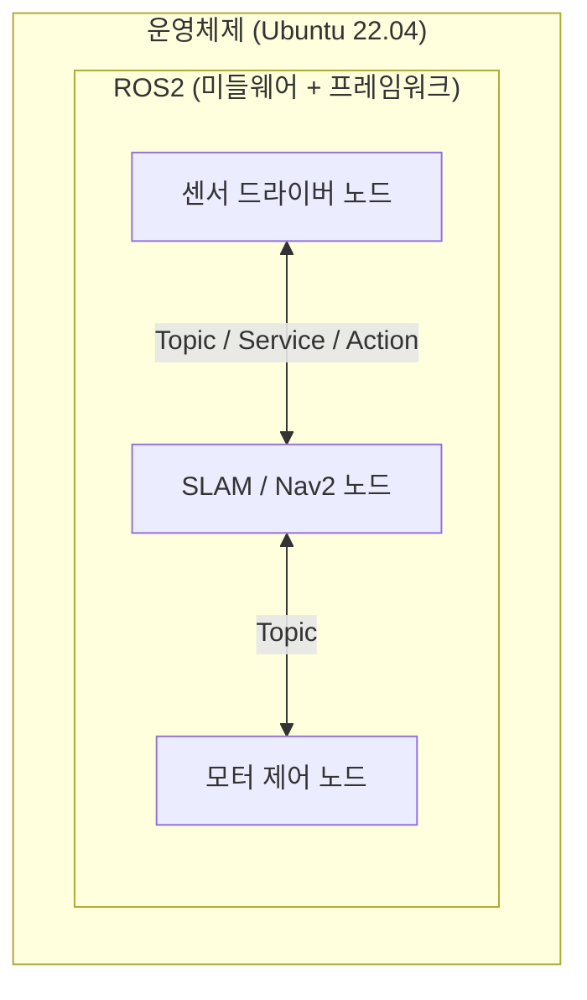

# ROS2 기초 - ROS2란 무엇이고 왜 쓰는가

> 이 문서를 읽으면 ROS2가 정확히 무엇인지(운영체제가 아니라는 것부터), 로봇 개발에 왜 필요한지, 그리고 ROS1과 무엇이 다른지 이해하게 된다.

## 문서 정보

| 항목 | 내용 |
|---|---|
| 학습 단계 | Level 1 — 입문 |
| 예상 선행 지식 | 없음 (프로그래밍 기초 정도만 있으면 충분) |
| 학습 목표 | ROS2가 무엇인지 설명할 수 있다 / ROS2 없이 로봇을 만들 때의 어려움을 설명할 수 있다 / ROS1과 ROS2의 핵심 차이를 안다 |
| 기준 환경 | Ubuntu 22.04, ROS2 Humble (설치 전 단계이므로 개념 위주) |
| 관련 문서 | 이전: 없음 (시리즈 시작점) / 다음: [[01_개발_환경과_워크스페이스_구조\|ROS2 기초 - 개발 환경과 워크스페이스 구조]] |

---

## 1. 먼저 알아야 할 핵심

1. ROS2는 운영체제(OS)가 아니라, 로봇 소프트웨어를 만들기 위한 **미들웨어이자 개발 프레임워크**다.
2. ROS2는 "로봇 하나를 완성해주는 프로그램"이 아니라, 로봇 소프트웨어를 구성하는 여러 조각(노드)을 서로 연결해주는 **통신 규약과 도구 모음**이다.
3. ROS는 원래 ROS1으로 시작했고, 실시간성·보안·상업용 로봇 지원 등의 한계를 해결하기 위해 ROS2가 새로 설계되었다.
4. ROS2는 특정 회사 제품이 아니라 오픈소스 생태계이며, Open Robotics(현재는 Open Source Robotics Foundation/Alliance 산하)가 표준을 관리한다.
5. 이 프로젝트에서 다루는 ROSMASTER X3, RealSense D435i, LiDAR 00, Nav2, ORB-SLAM3는 모두 ROS2라는 공통 언어 위에서 서로 연결된다.

---

## 2. 이 개념은 무엇인가

ROS2(Robot Operating System 2)는 이름과 달리 **운영체제가 아니다.** Ubuntu 같은 진짜 OS 위에서 돌아가는 **소프트웨어 프레임워크**로, 로봇을 구성하는 여러 프로그램(카메라 처리, 경로 계획, 모터 제어 등)이 서로 데이터를 주고받을 수 있도록 표준화된 통신 방법과 개발 도구를 제공한다.

**비유로 이해하기**

회사 조직을 떠올려보자.

- 회사에는 영업팀, 개발팀, 회계팀처럼 서로 다른 역할을 하는 팀(노드)들이 있다.
- 이 팀들이 협업하려면 공통 언어, 메신저 시스템, 회의 규칙(통신 규약)이 필요하다.
- ROS2는 바로 이 "메신저 시스템 + 회의 규칙 + 신입사원 교육 자료(도구와 문서)"에 해당한다. 회사가 실제로 만드는 제품(로봇의 특정 기능)은 각 팀이 직접 만든다.

**비유가 실제와 다른 부분**

- 회사 조직은 사람이 직접 판단해서 소통하지만, ROS2의 통신은 미리 정의된 데이터 형식(Message)과 규칙을 벗어나지 않는 기계적인 통신이다.
- 회사는 하나의 건물 안에 있다고 가정하기 쉽지만, ROS2 노드들은 물리적으로 다른 컴퓨터(예: 로봇 위 미니PC와 개발자의 노트북)에 나뉘어 있어도 네트워크로 자연스럽게 연결된다.

---

## 3. 왜 필요한가

**ROS 시스템 관점 (ROS2 없이 개발한다면)**

- 카메라 데이터를 읽는 코드, 그 데이터를 처리하는 코드, 모터에 명령을 보내는 코드를 모두 직접 연결하는 통신 코드를 처음부터 만들어야 한다.
- 다른 사람이 만든 LiDAR 드라이버나 SLAM 알고리즘을 가져다 쓰려 해도, 데이터 형식과 통신 방식이 서로 달라 통합하는 데 많은 시간이 든다.
- 여러 프로그램을 동시에 실행하고 상태를 확인하는 표준 도구가 없어, 문제가 생겼을 때 어디서부터 확인해야 할지 알기 어렵다.

**실제 로봇 관점 (ROSMASTER X3 기준)**

X3에는 LiDAR, 카메라, 모터, IMU 등 서로 다른 제조사의 하드웨어가 붙어 있다. ROS2가 없다면 각 하드웨어마다 제조사가 제공하는 서로 다른 SDK와 통신 방식을 따로 배우고, 이들을 직접 연결하는 코드를 처음부터 작성해야 한다. ROS2를 사용하면 대부분의 하드웨어가 "ROS2 드라이버 패키지" 형태로 이미 제공되므로, 표준화된 방식(Topic, TF 등)으로 곧바로 연결할 수 있다. Nav2(경로 계획), ORB-SLAM3(위치 추정) 같은 복잡한 알고리즘도 직접 구현하지 않고 ROS2 생태계의 기존 패키지를 가져다 쓸 수 있는 것도 이 표준화 덕분이다.

---

## 4. ROS2 시스템에서의 위치

**그림 읽는 방법**

- 가장 바깥쪽 상자는 실제 컴퓨터의 운영체제(Ubuntu)다. ROS2는 그 위에 설치되는 소프트웨어 계층이다.
- ROS2 상자 안의 각 노드(센서 드라이버, SLAM/Nav2, 모터 제어)는 지난 문서에서 배운 "노드" 개념이다.
- 노드들을 이어주는 화살표가 ROS2가 제공하는 통신 규약(Topic/Service/Action)이며, 이 부분이 바로 ROS2의 핵심 역할이다. ROS2는 "노드를 직접 만들어주는 것"이 아니라 "노드들이 서로 대화할 수 있게 해주는 것"임을 기억하면 된다.

---

## 5. 주요 구성 요소

| 구성 요소 | 역할 | 초보자가 기억할 점 |
|---|---|---|
| 노드(Node) | 개별 기능을 담당하는 실행 단위 | 이전 문서에서 학습 완료 |
| 통신 규약(Topic/Service/Action) | 노드 간 데이터 교환 방식 | 다음 문서들에서 자세히 학습 |
| DDS | 노드 간 통신을 실제로 처리하는 표준 미들웨어 | ROS2가 ROS1과 가장 크게 달라진 핵심 부분 |
| 패키지(Package) | 노드, 설정, 실행 파일을 묶은 배포 단위 | apt로 설치하거나 직접 빌드해서 사용 |
| colcon | ROS2 전용 빌드 도구 | 다음 문서에서 실습으로 다룸 |
| RViz2 / rqt | 데이터 시각화 및 디버깅 도구 | 센서 연동부터 본격적으로 사용 |

---

## 6. 기본 동작 과정 (ROS2 설치부터 로봇 동작까지의 큰 흐름)

1. **설치**: Ubuntu에 ROS2 Humble을 설치하면, 노드를 만들고 실행할 수 있는 라이브러리와 도구(`ros2` CLI, colcon 등)가 설치된다.
2. **패키지 작성/설치**: 필요한 기능(카메라 드라이버, 경로 계획 등)을 패키지 형태로 직접 만들거나, 이미 만들어진 패키지를 설치한다.
3. **노드 실행**: `ros2 run` 또는 launch 파일로 여러 노드를 동시에 실행한다.
4. **통신 연결**: 실행된 노드들이 DDS를 통해 서로를 자동으로 발견하고, Topic/Service/Action으로 데이터를 주고받기 시작한다.
5. **로봇 동작**: 센서 데이터가 처리 노드로 흐르고, 처리 결과가 모터 제어 노드로 전달되어 실제 로봇이 움직인다.

---

## 7. 기본 실습

이 문서는 개념 이해가 목적이므로, 이번 실습은 설치 없이 **ROS2 생태계의 규모를 눈으로 확인**하는 것으로 진행한다. 실제 설치와 첫 실행은 다음 문서([[01_개발_환경과_워크스페이스_구조|개발 환경과 워크스페이스 구조]])에서 다룬다.

### 실습 목표

ROS2가 실제로 얼마나 많은 검증된 패키지를 갖춘 생태계인지 공식 사이트에서 확인한다.

### 준비 사항

* 인터넷이 연결된 브라우저

### 확인

1. [index.ros.org](https://index.ros.org) 접속
2. 검색창에 `realsense2_camera` 입력 → 우리 프로젝트에서 쓸 RealSense 카메라 드라이버 패키지가 이미 존재하는지 확인
3. 검색창에 `nav2` 입력 → 경로 계획 관련 패키지들이 이미 준비되어 있는지 확인

### 예상 결과

각 패키지가 어떤 ROS2 배포판(Humble 포함)을 지원하는지 표시된 페이지가 검색된다. 이를 통해 "필요한 기능을 직접 다 만드는 게 아니라, 이미 있는 패키지를 ROS2 표준 방식으로 가져다 쓰는 것"이 ROS2 개발의 기본 흐름임을 확인할 수 있다.

---

## 8. 코드 및 설정 해설

이 문서는 아직 실행 코드를 다루지 않는다. 코드 수준의 실습은 다음 문서([[01_개발_환경과_워크스페이스_구조|워크스페이스 구성]])와 그 다음 문서([[02_노드란_무엇인가|노드 실행]], 이미 학습 완료)부터 본격적으로 진행한다.

---

## 9. 자주 사용하는 명령어

| 목적 | 명령어 | 설명 |
|---|---|---|
| ROS2 버전 확인 | `ros2 --version` | 설치가 정상적으로 되었는지, 어떤 배포판인지 확인할 때 사용 (다음 문서에서 사용) |
| 배포판 확인 | `echo $ROS_DISTRO` | 현재 터미널에 로드된 ROS2 배포판 이름을 확인할 때 사용 |

---

## 10. 자주 발생하는 문제

이 문서는 설치 전 개념 문서이므로 트러블슈팅 항목은 다음 문서([[01_개발_환경과_워크스페이스_구조|개발 환경과 워크스페이스 구조]])로 이어진다. 다만 초보자가 이 시점에서 흔히 갖는 오해를 짚고 넘어간다.

### 문제(오해): "ROS2를 설치하면 로봇이 알아서 움직인다"

**증상**

ROS2 설치 후 아무 노드도 실행하지 않았는데 왜 로봇이 동작하지 않는지 궁금해한다.

**가능한 원인**

1. ROS2를 운영체제나 완성된 로봇 제어 프로그램으로 오해함
2. ROS2가 "통신 규약 + 도구"이며, 실제 기능은 패키지(노드)로 별도 실행해야 한다는 점을 모름

**해결 방법**

ROS2는 뼈대와 도구를 제공할 뿐, 실제 동작은 그 위에서 실행하는 노드(패키지)가 담당한다는 점을 이해한다. 이는 [[02_노드란_무엇인가|2편에서 배운 "노드"]] 개념과 직결된다.

---

## 11. 개념 간 연결

* 이 문서에서 다룬 "노드 간 통신 규약"의 실제 주체가 바로 [[02_노드란_무엇인가|이전 문서에서 배운 노드]]다. 즉 "ROS2 = 노드들이 대화하는 규칙", "노드 = 그 규칙을 따르는 실행 프로그램"으로 연결된다.
* 다음 문서에서 배울 **[[01_개발_환경과_워크스페이스_구조|워크스페이스/colcon]]**은 이러한 노드(패키지)를 실제로 빌드하고 실행 가능하게 만드는 절차다.
* ROS1과의 차이(DDS 도입, 실시간성, 보안)는 이후 [[09_문제_해결_자주_발생하는_오류_모음|문제 해결 문서]]에서 "왜 이런 오류가 ROS1 자료에는 없는데 ROS2에는 있는지" 설명할 때 다시 참조한다.

---

## 12. 한 단계 더 깊게 보기

> **심화 학습**
>
> 이 부분은 기본 개념을 이해한 후 읽는 것을 권장한다.

**ROS1과 ROS2의 핵심 차이 (공식 문서 기준)**

| 구분 | ROS1 | ROS2 |
|---|---|---|
| 통신 방식 | 자체 개발한 TCPROS/UDPROS, 중앙 마스터(roscore) 필요 | 표준 DDS 기반, 중앙 마스터 없이 노드들이 자동으로 서로를 발견 |
| 실시간성 | 제한적 | DDS QoS 설정을 통한 실시간성 지원 강화 |
| 다중 로봇/보안 | 취약 | DDS 기반 보안(SROS2), 다중 로봇 환경 지원 강화 |
| 지원 플랫폼 | 주로 Linux | Linux, Windows, macOS, 임베디드(micro-ROS) 등 확장 |

> **공식 문서 기준**: ROS2는 roscore 같은 중앙 마스터 프로세스가 없다는 점이 ROS1과 가장 큰 구조적 차이다. 노드들은 DDS의 "디스커버리(discovery)" 기능을 통해 별도의 중앙 서버 없이 서로를 자동으로 찾는다.

이 프로젝트는 처음부터 ROS2로 학습하므로 ROS1 문법을 알 필요는 없지만, 인터넷에서 오래된 ROS1 자료(`roscore`, `catkin_make` 등)를 접했을 때 혼동하지 않도록 위 표를 참고하면 된다.

---

## 13. 핵심 요약

1. ROS2는 운영체제가 아니라, 로봇 소프트웨어의 통신 규약과 개발 도구를 제공하는 프레임워크다.
2. ROS2 자체는 로봇을 움직이지 않으며, 실제 기능은 그 위에서 실행되는 노드(패키지)가 담당한다.
3. ROS2를 쓰는 이유는 "표준화된 통신 방식" 덕분에 서로 다른 하드웨어와 알고리즘을 빠르게 통합할 수 있기 때문이다.
4. ROS2는 ROS1과 달리 중앙 마스터 없이 DDS 기반으로 노드들이 자동으로 서로를 발견한다.
5. 이 프로젝트의 모든 구성 요소(X3, D435i, LiDAR 00, Nav2, ORB-SLAM3)는 ROS2라는 공통 표준 위에서 통합된다.

---

## 14. 이해도 점검

1. ROS2를 "운영체제"라고 부르면 왜 정확하지 않은가?
2. ROS2가 없다면 서로 다른 제조사의 센서를 통합할 때 어떤 어려움이 생기는가?
3. ROS2에서 로봇이 실제로 동작하려면 ROS2 설치 외에 무엇이 더 필요한가?
4. ROS1과 ROS2의 가장 큰 통신 구조상의 차이는 무엇인가?
5. 이 프로젝트에서 ROS2가 담당하는 역할은 구체적으로 무엇인가? (X3, D435i, LiDAR 00, Nav2를 예로 설명)

> [!info]- 정답 및 해설 보기
> 1. 운영체제는 하드웨어 자원을 직접 관리하는 소프트웨어지만, ROS2는 Ubuntu 같은 실제 운영체제 위에서 동작하는 미들웨어/프레임워크이기 때문이다.
> 2. 각 제조사가 제공하는 서로 다른 SDK와 통신 방식을 개별적으로 배우고 직접 연결 코드를 작성해야 하는 어려움이 생긴다.
> 3.  실제 기능을 수행하는 노드(패키지)를 작성하거나 설치해서 실행해야 한다.
> 4. ROS1은 중앙 마스터(roscore)가 필요했지만, ROS2는 DDS 기반으로 중앙 마스터 없이 노드들이 자동으로 서로를 발견한다.
> 5. ROS2는 LiDAR 00, RealSense D435i 드라이버 노드와 Nav2, SLAM 노드들이 서로 데이터를 표준화된 방식으로 주고받을 수 있도록 통신 규약과 실행/디버깅 도구를 제공하는 공통 기반 역할을 한다.

---

## 15. 다음 학습 주제

1. **바로 다음**: [[01_개발_환경과_워크스페이스_구조|ROS2 기초 - 개발 환경과 워크스페이스 구조]] — ROS2 개념을 실제로 손으로 만져보려면 워크스페이스를 만들고 빌드하는 절차부터 익혀야 한다.
2. **함께 보면 좋은 주제**: [[02_노드란_무엇인가|ROS2 기초 - 노드란 무엇인가]]— ROS2라는 틀 안에서 실제로 실행되는 단위를 복습하며 연결해서 읽으면 좋다.
3. **나중에 학습할 심화 주제**: [[01_DDS와_QoS_이해하기|ROS2 통신 심화 - DDS와 QoS 이해하기]] — 실제 로봇에서 통신이 끊기거나 지연되는 문제를 진단하려면 DDS의 QoS 개념을 알아야 한다.

---

## 16. 참고자료

| 구분 | 자료 | 핵심 내용 |
|---|---|---|
| 공식 문서 | [ROS2 Documentation (Humble) – The ROS 2 Project (About ROS 2)](https://docs.ros.org/en/humble/The-ROS2-Project.html) | ROS2가 미들웨어 및 도구 모음이라는 정의, ROS1 대비 설계 목표(실시간성, 보안, 다중 플랫폼) 확인 |
| 공식 문서 | [ROS2 Documentation (Humble) – Migrating from ROS1](https://docs.ros.org/en/humble/How-To-Guides/Migrating-from-ROS1.html) | ROS1의 중앙 마스터(roscore) 구조와 ROS2의 DDS 기반 디스커버리 구조 차이 확인 |
| 패키지 색인 | [index.ros.org](https://index.ros.org) | Humble을 지원하는 `realsense2_camera`, `nav2` 등 패키지 존재 여부 확인 |
