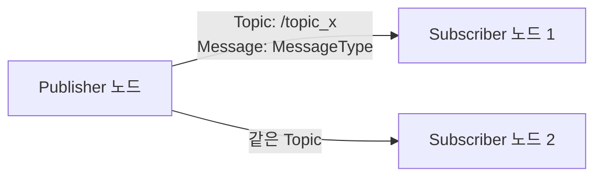

# ROS2 통신 - Topic과 Message

> 이 문서를 읽으면 노드끼리 실제로 데이터를 주고받는 가장 기본적인 방법인 Topic과 Message를 이해하고, Publisher와 Subscriber를 직접 만들어 실행할 수 있게 된다.

## 문서 정보

| 항목 | 내용 |
|---|---|
| 학습 단계 | Level 2 — 기초 실습 |
| 예상 선행 지식 | [[00_ROS2란_무엇이고_왜_쓰는가|ROS2 기초 - ROS2란 무엇이고 왜 쓰는가]], [[02_노드란_무엇인가|ROS2 기초 - 노드란 무엇인가]], [[01_개발_환경과_워크스페이스_구조|ROS2 기초 - 개발 환경과 워크스페이스 구조]] |
| 학습 목표 | Topic과 Message의 개념을 설명할 수 있다 / Publisher/Subscriber 노드를 직접 작성·실행할 수 있다 / `ros2 topic` 명령으로 통신 상태를 진단할 수 있다 |
| 기준 환경 | Ubuntu 22.04, ROS2 Humble |
| 관련 문서 | 이전: [[01_개발_환경과_워크스페이스_구조|ROS2 기초 - 개발 환경과 워크스페이스 구조]] / 다음: [[04_Service와_Action|ROS2 통신 - Service와 Action]] |

---

## 1. 먼저 알아야 할 핵심

1. 노드끼리 데이터를 주고받는 가장 기본적인 방법이 **Topic**이다.
2. Topic은 노드 간 직접 연결이 아니라, 이름이 붙은 **정보 통로**를 통해 데이터를 흘려보내는 방식이다.
3. 이 통로로 흐르는 데이터의 형식을 **Message**라고 하며, 미리 정의된 구조를 따른다.
4. Topic 통신은 "누가 보내는지, 누가 받는지" 서로 몰라도 동작하는 **비동기(asynchronous)** 방식이다.
5. LiDAR의 거리 데이터, 카메라 영상, 로봇 속도 명령 등 이 프로젝트에서 다룰 대부분의 실시간 데이터는 Topic으로 전달된다.

---

## 2. 이 개념은 무엇인가

Topic은 **이름이 붙은 데이터 통로**이고, 그 통로를 통해 흐르는 데이터의 형식을 정의한 것이 Message다. 어떤 노드는 그 통로에 데이터를 계속 흘려보내고(발행, Publish), 다른 노드는 그 통로를 지켜보다가 데이터가 올 때마다 받아서 처리한다(구독, Subscribe).

**비유로 이해하기**

라디오 방송을 떠올려보자.

- 라디오 방송국(Publisher)은 특정 **주파수(Topic 이름)**로 계속 방송을 내보낸다.
- 청취자(Subscriber)는 그 주파수에 채널을 맞추기만 하면 방송을 들을 수 있다.
- 방송국은 지금 몇 명이 듣고 있는지 몰라도 방송을 계속 내보내고, 청취자도 방송국이 어디 있는지 몰라도 주파수만 알면 들을 수 있다.
- 방송 내용의 형식(뉴스 형식, 음악 형식 등)이 정해져 있는 것처럼, Topic도 어떤 형식(Message 타입)의 데이터가 흐르는지 미리 정해져 있다.

**비유가 실제와 다른 부분**

- 라디오는 한 방향(방송국 → 청취자)이지만, ROS2에서는 하나의 노드가 어떤 Topic은 발행(Publish)하고 동시에 다른 Topic은 구독(Subscribe)할 수 있다.
- 라디오는 청취자가 몇 명이든 방송 내용이 똑같지만, ROS2 Topic은 구독자가 하나도 없어도 발행자는 계속 데이터를 보낼 수 있고(받는 사람이 없으면 그냥 버려짐), 반대로 여러 발행자가 같은 Topic 이름으로 동시에 데이터를 보낼 수도 있다.

---

## 3. 왜 필요한가

**ROS 시스템 관점**

- Topic이 없다면 노드 A가 노드 B에게 데이터를 보내기 위해 B의 위치, 이름, 통신 방식을 직접 알아야 한다. Topic은 이런 직접 연결 없이 "이름"만으로 데이터를 주고받게 해준다.
- 발행자와 구독자가 서로의 존재를 몰라도 되므로, 나중에 새로운 노드를 추가해서 같은 데이터를 받아 쓰게 만들기 매우 쉽다. (예: 기존에 LiDAR 데이터를 쓰는 노드가 있어도, 같은 Topic을 구독하는 새 노드를 얼마든지 추가로 붙일 수 있다.)
- Message라는 정해진 데이터 형식이 없다면, 노드마다 데이터를 표현하는 방식이 달라 서로 다른 패키지 간 호환이 불가능해진다.

**실제 로봇 관점 (ROSMASTER X3 기준)**

- LiDAR C1 드라이버 노드는 `/scan`이라는 Topic에 거리 데이터를 계속 발행한다.
- Nav2의 장애물 회피 노드는 이 `/scan` Topic을 구독해서 장애물을 인식한다.
- 동시에 RViz2(시각화 도구)도 같은 `/scan` Topic을 구독해서 화면에 LiDAR 점들을 그려준다.

이처럼 **하나의 데이터(스캔 결과)를 여러 노드가 동시에, 서로 몰라도 각자 알아서 활용**할 수 있는 것이 Topic 구조의 핵심 장점이며, 실제 로봇 시스템이 복잡해질수록 이 구조의 이점이 커진다.

---

## 4. ROS2 시스템에서의 위치



**그림 읽는 방법**

- 왼쪽 Publisher 노드는 `/topic_x`라는 이름의 Topic에 정해진 형식(Message 타입)의 데이터를 계속 내보낸다.
- 오른쪽의 두 Subscriber 노드는 서로 다른 목적을 가진 완전히 다른 노드일 수 있지만, 같은 Topic을 구독하기만 하면 동일한 데이터를 각자 받아서 쓸 수 있다.
- 화살표 방향은 데이터가 흐르는 방향이지, 노드 간에 직접 연결이 있다는 뜻이 아니다. 실제로는 둘 다 `/topic_x`라는 이름만 바라보고 있을 뿐, 서로의 존재를 모른다. 실제 X3 로봇에서 이 구조가 `/scan`(LiDAR 드라이버 → Nav2, RViz2)으로 구체화되는 예시는 3장의 "실제 로봇 관점"을 참고한다.

---

## 5. 주요 구성 요소

| 구성 요소 | 역할 | 초보자가 기억할 점 |
|---|---|---|
| Topic | 이름이 붙은 데이터 통로 | `/scan`, `/cmd_vel`처럼 슬래시(`/`)로 시작하는 이름 |
| Message | Topic으로 흐르는 데이터의 형식(타입) | 예: `sensor_msgs/msg/LaserScan`, `geometry_msgs/msg/Twist` |
| Publisher | Topic에 데이터를 발행(전송)하는 주체 | 하나의 노드가 여러 Topic에 발행 가능 |
| Subscriber | Topic의 데이터를 구독(수신)하는 주체 | 하나의 노드가 여러 Topic을 구독 가능 |
| QoS (Quality of Service) | 통신 신뢰성, 속도 등을 조절하는 설정 | 이 문서에서는 기본값만 사용, 심화 학습에서 다룸 |

---

## 6. 기본 동작 과정

1. **Publisher 생성**: 노드 내부에서 특정 Topic 이름과 Message 타입을 지정해 Publisher 객체를 만든다.
2. **Subscriber 생성**: 다른 노드(또는 같은 노드)에서 같은 Topic 이름과 같은 Message 타입으로 Subscriber를 만들고, 데이터가 도착했을 때 실행할 함수(콜백)를 등록한다.
3. **연결(Discovery)**: 두 노드가 실행되면 DDS가 자동으로 "같은 Topic 이름 + 같은 Message 타입"을 쓰는 Publisher와 Subscriber를 찾아 연결한다. 이 과정은 사람이 직접 개입하지 않는다.
4. **데이터 발행**: Publisher가 `publish()` 함수를 호출할 때마다 Message가 Topic으로 전송된다.
5. **콜백 실행**: Subscriber는 데이터가 도착하는 순간, 미리 등록해둔 콜백 함수가 자동으로 실행되어 데이터를 처리한다.

---

## 7. 기본 실습

### 실습 목표

간단한 문자열 데이터를 주고받는 Publisher 노드와 Subscriber 노드를 직접 작성하고 실행해서, Topic 통신이 실제로 동작하는 과정을 확인한다.

### 준비 사항

* 이전 문서([[01_개발_환경과_워크스페이스_구조|개발 환경과 워크스페이스 구조]])에서 만든 `~/ros2_ws` 워크스페이스와 `my_first_pkg` 패키지
* ROS2 환경이 source된 터미널

### 설치

이번 실습은 새로운 시스템 패키지 설치 없이, 기존 `my_first_pkg` 안에 코드 파일 2개만 추가하면 된다.

```bash
cd ~/ros2_ws/src/my_first_pkg/my_first_pkg
```

* 이 명령어가 하는 일: 이전 문서에서 만든 패키지의 실제 Python 코드가 들어가는 폴더로 이동한다. (`ros2 pkg create` 실행 시 패키지 이름과 동일한 이름의 하위 폴더가 자동 생성된다.)

이 폴더 안에 `simple_publisher.py`, `simple_subscriber.py` 두 파일을 아래 8장의 코드로 각각 생성한다. (파일 생성은 8장에서 이어서 다룬다.)

### 실행

```bash
# 터미널 1
cd ~/ros2_ws
colcon build --packages-select my_first_pkg
source install/setup.bash
ros2 run my_first_pkg simple_publisher
```

```bash
# 터미널 2 (새 터미널)
source /opt/ros/humble/setup.bash
source ~/ros2_ws/install/setup.bash
ros2 run my_first_pkg simple_subscriber
```

* 터미널 1: 1초마다 카운트가 증가하는 문자열 메시지를 `/chatter` Topic에 발행하는 노드를 실행한다.
* 터미널 2: `/chatter` Topic을 구독해서, 메시지가 도착할 때마다 화면에 출력하는 노드를 실행한다.

### 확인

```bash
# 터미널 3 (새 터미널)
source /opt/ros/humble/setup.bash

ros2 topic list
ros2 topic echo /chatter
ros2 topic hz /chatter
```

* `ros2 topic list`: 언제 사용하는가 → 현재 시스템에 어떤 Topic들이 활성화되어 있는지 확인할 때 사용한다. `ros2 node list`(노드 확인)의 Topic 버전이라고 생각하면 된다.
* `ros2 topic echo /chatter`: 언제 사용하는가 → 특정 Topic에 실제로 어떤 데이터가 흐르는지 직접 눈으로 확인할 때 사용한다. 노드 코드를 안 봐도 데이터 흐름을 검증할 수 있어 디버깅에 매우 자주 쓰인다.
* `ros2 topic hz /chatter`: 언제 사용하는가 → 데이터가 초당 몇 번 발행되는지 확인할 때 사용한다. 실제 로봇에서 LiDAR나 카메라 데이터가 너무 느리게 들어오는 문제를 진단할 때 핵심적으로 쓰이는 명령이다.

### 예상 결과

* 터미널 1에는 `Publishing: "Hello ROS2: 0"`, `Publishing: "Hello ROS2: 1"` 처럼 발행 로그가 출력된다.
* 터미널 2에는 `I heard: "Hello ROS2: 0"` 처럼 수신 로그가 출력된다. 터미널 1의 발행 순서와 정확히 일치해야 정상이다.
* 터미널 3의 `ros2 topic list`에는 `/chatter` 항목이 보여야 하고, `ros2 topic echo /chatter`에도 같은 데이터가 실시간으로 출력되어야 한다.

---

## 8. 코드 및 설정 해설

### Publisher 코드 (`simple_publisher.py`)

```python
import rclpy
from rclpy.node import Node
from std_msgs.msg import String

class SimplePublisher(Node):
  def __init__(self):
    super().__init__('simple_publisher')
    # Create a publisher on topic '/chatter' with message type String, queue size 10
    self.publisher_ = self.create_publisher(String, 'chatter', 10)
    self.count = 0
    # Call timer_callback every 1.0 second
    self.timer = self.create_timer(1.0, self.timer_callback)

  def timer_callback(self):
    msg = String()
    msg.data = f'Hello ROS2: {self.count}'
    self.publisher_.publish(msg)
    self.get_logger().info(f'Publishing: "{msg.data}"')
    self.count += 1

def main(args=None):
  rclpy.init(args=args)
  node = SimplePublisher()
  rclpy.spin(node)
  node.destroy_node()
  rclpy.shutdown()

if __name__ == '__main__':
  main()
```

* `from std_msgs.msg import String`: 가장 단순한 표준 Message 타입인 `String`을 가져온다. LiDAR라면 `sensor_msgs.msg.LaserScan`처럼 데이터 종류에 맞는 Message 타입을 가져오게 된다.
* `self.create_publisher(String, 'chatter', 10)`: `chatter`라는 이름의 Topic에 `String` 타입으로 발행하는 Publisher를 생성한다. 마지막 숫자 `10`은 큐 크기(QoS의 일부)로, 구독자가 잠시 못 받아도 임시로 쌓아둘 메시지 개수의 기준값이다.
* `self.create_timer(1.0, self.timer_callback)`: 1초마다 `timer_callback` 함수를 자동으로 호출하도록 등록한다. 이 타이머가 없으면 데이터를 반복해서 보낼 방법이 없다.
* `self.publisher_.publish(msg)`: 실제로 데이터를 Topic에 실어 보내는 부분이다. 이 함수가 호출되는 순간 구독 중인 모든 노드에게 데이터가 전달된다.

### Subscriber 코드 (`simple_subscriber.py`)

```python
import rclpy
from rclpy.node import Node
from std_msgs.msg import String

class SimpleSubscriber(Node):
  def __init__(self):
    super().__init__('simple_subscriber')
    # Subscribe to topic '/chatter', call listener_callback when a message arrives
    self.subscription = self.create_subscription(
      String, 'chatter', self.listener_callback, 10)

  def listener_callback(self, msg):
    self.get_logger().info(f'I heard: "{msg.data}"')

def main(args=None):
  rclpy.init(args=args)
  node = SimpleSubscriber()
  rclpy.spin(node)
  node.destroy_node()
  rclpy.shutdown()

if __name__ == '__main__':
  main()
```

* `self.create_subscription(String, 'chatter', self.listener_callback, 10)`: Publisher와 **정확히 같은 Topic 이름(`chatter`)과 같은 Message 타입(`String`)**으로 구독을 등록한다. 이름이나 타입 중 하나라도 다르면 연결되지 않는다. (10장 문제 해결에서 다룸)
* `listener_callback(self, msg)`: 데이터가 도착할 때마다 자동으로 호출되는 함수다. 직접 반복문으로 데이터를 계속 확인할 필요 없이, ROS2가 알아서 이 함수를 실행시켜준다.

### `setup.py` 수정 (실행 파일로 등록)

패키지 생성 시 만들어진 `setup.py`의 `entry_points` 부분에 아래 두 줄을 추가해야 `ros2 run`으로 실행할 수 있다.

```python
entry_points={
  'console_scripts': [
    'simple_publisher = my_first_pkg.simple_publisher:main',
    'simple_subscriber = my_first_pkg.simple_subscriber:main',
  ],
},
```

* `'simple_publisher = my_first_pkg.simple_publisher:main'`: `ros2 run my_first_pkg simple_publisher` 명령의 `simple_publisher`라는 이름을, 실제로는 `my_first_pkg` 폴더의 `simple_publisher.py` 파일 안 `main` 함수를 실행하라는 뜻으로 연결(매핑)해주는 부분이다. 이 줄을 빠뜨리면 코드는 있어도 `ros2 run`으로 실행할 수 없다.

---

## 9. 자주 사용하는 명령어

| 목적 | 명령어 | 설명 |
|---|---|---|
| Topic 목록 확인 | `ros2 topic list` | 현재 활성화된 모든 Topic 이름 확인 |
| Topic 데이터 확인 | `ros2 topic echo <topic명>` | 특정 Topic에 실제로 흐르는 데이터 내용을 실시간으로 볼 때 사용 |
| Topic 상세 정보 확인 | `ros2 topic info <topic명>` | 해당 Topic의 Message 타입, Publisher/Subscriber 수 확인 |
| Message 타입 구조 확인 | `ros2 interface show <메시지타입>` | 예: `ros2 interface show sensor_msgs/msg/LaserScan`으로 필드 구조 확인 |
| 발행 주기 확인 | `ros2 topic hz <topic명>` | 데이터가 초당 몇 번 발행되는지 확인, 센서 지연 문제 진단에 사용 |
| 터미널에서 직접 발행 | `ros2 topic pub <topic명> <타입> '<데이터>'` | 노드 코드 없이 테스트용 데이터를 즉석에서 보내볼 때 사용 |

---

## 10. 자주 발생하는 문제

### 문제: Subscriber를 실행했는데 아무 데이터도 안 들어옴

**증상**

Publisher 노드는 정상적으로 로그를 출력하는데, Subscriber 노드에는 아무 출력도 없다.

**가능한 원인**

1. Topic 이름이 서로 다름 (예: 한쪽은 `chatter`, 다른 쪽은 `/chatter2`)
2. Message 타입이 서로 다름 (예: 한쪽은 `String`, 다른 쪽은 `Int32`)
3. `setup.py`의 `entry_points`를 수정만 하고 재빌드하지 않음
4. Publisher와 Subscriber의 QoS 설정이 서로 호환되지 않음 (심화 내용, 12장 참고)

**확인 방법**

```bash
ros2 topic list
ros2 topic info /chatter
```

`ros2 topic info` 결과에서 `Publisher count`와 `Subscription count`가 각각 1 이상인지 확인한다.

**해결 방법**

1. `ros2 topic info /chatter` 결과에서 Publisher/Subscriber 수를 확인해, 애초에 둘이 같은 Topic에 연결되어 있는지부터 확인한다.
2. Publisher와 Subscriber 코드에서 `create_publisher`/`create_subscription`에 넘긴 Topic 이름과 Message 타입이 글자 하나까지 정확히 일치하는지 비교한다.
3. 코드를 수정했다면 반드시 `colcon build --packages-select my_first_pkg` 후 새 터미널에서 다시 `source`하고 실행한다.

**초보자가 자주 하는 실수**

Topic 이름 앞에 `/`를 붙이거나 안 붙이는 것을 서로 다르게 착각하는 경우, 그리고 코드만 수정하고 재빌드를 잊는 경우가 가장 흔하다.

### 문제: `ros2 topic echo`를 실행해도 아무것도 안 뜸

**증상**

터미널이 멈춘 것처럼 아무 출력 없이 대기만 한다.

**가능한 원인**

1. 해당 Topic에 실제로 발행 중인 Publisher가 없음
2. Topic 이름을 잘못 입력함(오타)

**확인 방법**

```bash
ros2 topic list
```

목록에 내가 입력한 Topic 이름이 정확히 있는지 확인한다.

**해결 방법**

목록에 없다면 Publisher 노드가 정상 실행 중인지 먼저 확인한다. 목록에 있는데도 안 된다면 Topic 이름의 대소문자, 오타를 다시 확인한다.

---

## 11. 개념 간 연결

* Topic 통신의 주체는 이전 문서에서 배운 **노드**다. 즉 "노드 = 일하는 사람", "Topic = 정보가 흐르는 통로", "Message = 통로를 흐르는 데이터의 형식"으로 세 개념이 이어진다.
* 이 문서에서 만든 Publisher/Subscriber는 앞선 문서 [[01_개발_환경과_워크스페이스_구조|개발 환경과 워크스페이스 구조]]에서 배운 `colcon build → source → ros2 run` 절차를 그대로 사용한다.
* Topic은 "한쪽이 계속 보내고 다른 쪽은 언제든 받는" 비동기 방식이라, "요청하면 응답이 오는" 방식이 필요한 경우에는 적합하지 않다. 이런 경우를 위한 통신 방식이 다음 문서에서 다룰 **Service**와 **Action**이다.
* 앞으로 다룰 LiDAR C1의 `/scan`, RealSense D435i의 `/camera/color/image_raw`, 로봇 속도 명령 `/cmd_vel`은 모두 이 문서에서 배운 Topic 구조를 그대로 사용한다.

---

## 12. 한 단계 더 깊게 보기

> **심화 학습**
>
> 이 부분은 기본 실습을 완료한 후 읽는 것을 권장한다.

**QoS(Quality of Service)란**

ROS2 Topic 통신은 DDS 기반이기 때문에, ROS1에는 없던 세밀한 통신 품질 설정(QoS)을 제공한다. 대표적으로 다음 두 가지가 있다.

- **Reliability**: `RELIABLE`(모든 메시지를 반드시 전달, 손실 시 재전송)과 `BEST_EFFORT`(손실 가능성 있지만 빠름) 중 선택. LiDAR나 카메라처럼 빠르게 계속 들어오는 센서 데이터는 보통 `BEST_EFFORT`를, 로봇 제어 명령처럼 반드시 전달돼야 하는 데이터는 `RELIABLE`을 사용한다.
- **Durability**: 새로 연결된 Subscriber에게 과거 메시지를 전달할지(`TRANSIENT_LOCAL`) 여부를 결정한다. 지도(map) 데이터처럼 한 번만 발행되고 이후 새로 연결된 노드도 그 내용을 알아야 하는 경우에 사용한다.

Publisher와 Subscriber의 QoS 설정이 서로 호환되지 않으면(예: 한쪽은 `RELIABLE`, 다른 쪽은 `BEST_EFFORT`로 고정), Topic 이름과 타입이 같아도 연결이 되지 않는 경우가 있다. 실제로 RealSense나 LiDAR 드라이버를 RViz2에 연결할 때 이 QoS 불일치로 데이터가 안 보이는 문제가 흔히 발생하며, 이는 이후 `센서 연동` 문서와 `문제 해결` 문서에서 구체적인 사례로 다시 다룬다.

> **공식 문서 기준**: ROS2 공식 문서는 QoS를 "Publisher와 Subscriber 사이의 통신 계약(contract)"이라고 설명하며, 두 QoS 프로파일이 호환되지 않으면 연결이 이루어지지 않는다고 명시하고 있다.

---

## 13. 핵심 요약

1. Topic은 이름이 붙은 데이터 통로이고, Message는 그 통로로 흐르는 데이터의 정해진 형식이다.
2. Publisher는 데이터를 발행하고, Subscriber는 콜백 함수를 통해 데이터를 수신한다. 서로의 존재를 몰라도 이름과 타입만 맞으면 자동으로 연결된다.
3. `ros2 topic list`, `echo`, `info`, `hz`는 Topic 통신 상태를 진단하는 핵심 도구이며, 노드 코드를 몰라도 데이터 흐름을 확인할 수 있다.
4. Topic 통신이 안 될 때는 이름/타입 일치 여부와 재빌드 여부를 가장 먼저 확인한다.
5. 여러 노드가 하나의 Topic 데이터를 동시에, 독립적으로 활용할 수 있다는 점이 Topic 구조의 핵심 장점이며, 실제 로봇의 센서 데이터 공유 구조가 바로 이 방식이다.

---

## 14. 이해도 점검

1. Topic 통신에서 Publisher와 Subscriber는 왜 서로의 존재를 몰라도 되는가?
2. Publisher는 정상 실행 중인데 Subscriber에 데이터가 안 들어온다면 가장 먼저 무엇을 비교해야 하는가?
3. `ros2 topic echo`와 `ros2 topic hz`는 각각 언제 사용하는가?
4. 왜 Topic 방식은 "요청-응답"이 필요한 상황에는 적합하지 않은가?
5. 실제 X3 로봇에서 LiDAR 데이터를 Nav2와 RViz2가 동시에 사용할 수 있는 이유는 무엇인가?

> [!info]- 정답 및 해설 보기
> 1. Topic이라는 이름 기반의 통로를 DDS가 자동으로 연결해주기 때문에, 서로의 위치나 존재를 몰라도 같은 이름·타입만 맞으면 통신이 성립한다.
> 2. Topic 이름과 Message 타입이 양쪽에서 정확히 일치하는지부터 확인해야 한다.
> 3. `ros2 topic echo`는 실제 데이터 내용을 확인할 때, `ros2 topic hz`는 데이터가 얼마나 자주(주기적으로) 들어오는지 확인할 때 사용한다.
> 4. Topic은 발행자가 일방적으로 계속 데이터를 흘려보내는 비동기 구조이므로, "특정 요청에 대한 하나의 응답"을 주고받는 구조에는 맞지 않는다.
> 5. 두 노드 모두 같은 Topic(`/scan`)을 구독하기만 하면 되고, Topic은 여러 Subscriber가 동시에 같은 데이터를 받을 수 있는 구조이기 때문이다.

---

## 15. 다음 학습 주제

1. **바로 다음**: [[04_Service와_Action|ROS2 통신 - Service와 Action]] — Topic만으로는 "요청하고 응답받기", "장시간 걸리는 작업 처리"가 어려우므로, 이를 보완하는 통신 방식을 배운다.
2. **함께 보면 좋은 주제**: [[05_Parameter와_실행_설정|ROS2 기초 - Parameter와 실행 설정]] — Publisher의 발행 주기(1.0초)처럼 코드에 고정된 값을 실행 시점에 바꾸는 방법을 배우면 이번 예제를 더 유연하게 만들 수 있다.
3. **나중에 학습할 심화 주제**: [[01_DDS와_QoS_이해하기|ROS2 통신 심화 - DDS와 QoS 이해하기]] — 실제 센서 연동에서 자주 겪는 "Topic은 보이는데 데이터가 안 보이는" 문제의 근본 원인을 진단하려면 QoS를 깊이 이해해야 한다.

---

## 16. 참고자료

| 구분 | 자료 | 핵심 내용 |
|---|---|---|
| 공식 문서 | [ROS2 Documentation (Humble) – Understanding topics](https://docs.ros.org/en/humble/Tutorials/Beginner-CLI-Tools/Understanding-ROS2-Topics/Understanding-ROS2-Topics.html) | Topic의 정의, Publisher/Subscriber 관계, `ros2 topic` CLI 도구 사용법 확인 |
| 공식 문서 | [ROS2 Documentation (Humble) – Writing a simple publisher and subscriber (Python)](https://docs.ros.org/en/humble/Tutorials/Beginner-Client-Libraries/Writing-A-Simple-Py-Publisher-And-Subscriber.html) | `create_publisher`, `create_subscription`, `entry_points` 설정 방식 확인 |
| 공식 문서 | [ROS2 Documentation (Humble) – About Quality of Service settings](https://docs.ros.org/en/humble/Concepts/Intermediate/About-Quality-of-Service-Settings.html) | Reliability, Durability 등 QoS 프로파일의 정의와 호환성 규칙 확인 |
