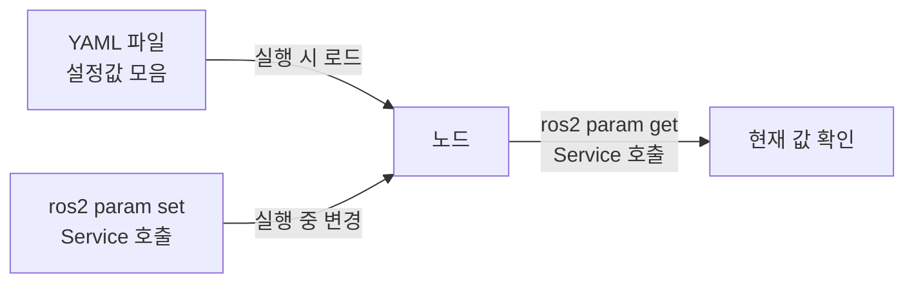

# ROS2 기초 - Parameter와 실행 설정

> 이 문서를 읽으면 코드를 수정하지 않고도 노드의 동작 방식을 바꿀 수 있는 Parameter 개념을 이해하고, 직접 파라미터를 선언·조회·변경하며 YAML 파일로 관리하는 방법까지 익히게 된다.

## 문서 정보

| 항목       | 내용                                                                                                 |
| -------- | -------------------------------------------------------------------------------------------------- |
| 학습 단계    | Level 2 ~ Level 3                                                                                  |
| 예상 선행 지식 | [[03_Topic과_Message|ROS2 통신 - Topic과 Message]], [[04_Service와_Action|ROS2 통신 - Service와 Action]]                                            |
| 학습 목표    | Parameter가 왜 필요한지 설명할 수 있다 / 노드에 Parameter를 선언하고 실행 시 값을 바꿀 수 있다 / YAML 파일로 여러 파라미터를 한 번에 관리할 수 있다 |
| 기준 환경    | Ubuntu 22.04, ROS2 Humble                                                                          |
| 관련 문서    | 이전: [[04_Service와_Action|ROS2 통신 - Service와 Action]] / 다음: [[06_Launch_파일_작성법|ROS2 기초 - Launch 파일 작성법]]                                    |

---

## 1. 먼저 알아야 할 핵심

1. 노드 코드 안에 값을 직접 써넣으면(하드코딩), 값을 바꿀 때마다 코드를 수정하고 다시 빌드해야 한다. 이를 피하기 위한 것이 **Parameter**다.
2. Parameter는 노드가 실행되는 시점에 외부에서 넣어주는 **설정값**이다.
3. 파라미터 조회/변경은 실제로는 앞선 문서에서 배운 **Service** 통신으로 이루어진다.
4. 파라미터가 많아지면 명령줄에 하나씩 입력하지 않고 **YAML 파일**로 한 번에 관리하는 것이 표준 방식이다.
5. LiDAR의 스캔 범위, 카메라 해상도, Nav2의 로봇 반경 등 이 프로젝트에서 다룰 대부분의 하드웨어/알고리즘 설정값은 파라미터로 관리된다.

---

## 2. 이 개념은 무엇인가

Parameter는 **노드가 실행될 때 함께 전달되는 설정값**이며, 노드 코드를 수정하지 않고도 동작 방식을 바꿀 수 있게 해준다.

**비유로 이해하기**

에어컨 리모컨을 떠올려보자.

- 에어컨 본체(노드의 핵심 로직)는 그대로 두고, 리모컨(파라미터)으로 희망 온도, 풍량, 모드를 바꾼다.
- 온도를 18도에서 24도로 바꾸고 싶을 때 에어컨을 분해해서 회로를 수정하지 않는다. 리모컨 설정만 바꾸면 된다.
- 마찬가지로 LiDAR 노드의 "최대 감지 거리"를 12m에서 8m로 바꾸고 싶을 때, 코드를 열어 숫자를 고치고 다시 빌드하는 대신 파라미터 값만 바꾸면 된다.

**비유가 실제와 다른 부분**

- 리모컨 설정은 대부분 에어컨을 끄고 켤 때까지 유지되지만, ROS2 파라미터는 노드를 실행하는 시점에 값을 지정하는 방식(가장 흔한 사용법)과, 노드가 실행된 상태에서도 실시간으로 값을 바꾸는 방식(동적 파라미터) 두 가지가 모두 가능하다.
- 리모컨은 미리 정해진 몇 개의 항목만 조절 가능하지만, ROS2 파라미터는 개발자가 노드 코드 안에서 원하는 만큼 자유롭게 항목을 선언할 수 있다.

---

## 3. 왜 필요한가

**ROS 시스템 관점**

- Parameter가 없다면 환경(시뮬레이션 vs 실제 로봇, 사무실 vs 넓은 공간)마다 다른 설정값이 필요할 때마다 코드를 고치고 재빌드해야 한다.
- 같은 노드 코드를 여러 로봇에 재사용할 때, 로봇마다 다른 값(예: 바퀴 지름, 카메라 해상도)만 파라미터로 다르게 넣어주면 코드 수정 없이 재사용할 수 있다.
- `ros2 param` 명령으로 실행 중인 노드의 설정값을 즉시 확인할 수 있어, "왜 이 노드가 이렇게 동작하는지" 진단할 때 코드를 열어보지 않고도 원인을 파악할 수 있다.

**실제 로봇 관점 (ROSMASTER X3 기준)**

- LiDAR C1 드라이버는 `frame_id`, `scan_frequency`, `range_min`/`range_max` 같은 파라미터를 가진다. 실제 주행 환경에 따라 최소/최대 감지 거리를 조정해야 할 때 코드를 건드리지 않고 파라미터만 바꾼다.
- Nav2는 로봇의 반경(`robot_radius`), 최대 속도(`max_vel_x`) 등을 파라미터로 관리한다. X3의 실제 크기와 모터 성능에 맞게 이 값들을 조정하는 것이 Nav2 설정 작업의 핵심이며, 이는 이후 [[02_Costmap|지상로봇 적용 - Nav2 내비게이션 - 02. Costmap]] 문서에서 자세히 다룬다.
- ORB-SLAM3는 카메라의 내부 파라미터(초점 거리, 왜곡 계수 등)를 설정 파일로 입력받는데, 이 값이 틀리면 SLAM 성능이 크게 떨어진다. 이 프로젝트의 센서 연동 문서들에서 이 개념이 반복적으로 등장한다.

---

## 4. ROS2 시스템에서의 위치



**그림 읽는 방법**

- 왼쪽 YAML 파일은 노드를 처음 실행할 때 여러 파라미터 값을 한 번에 넣어주는 방법이다.
- 아래쪽 CLI(`ros2 param set`)는 노드가 이미 실행 중인 상태에서 값을 바꾸는 방법이며, 이 과정은 화면에 보이지 않지만 내부적으로 앞선 문서에서 배운 **Service 호출**로 처리된다.
- 오른쪽 `ros2 param get`도 마찬가지로 Service 호출을 통해 현재 값을 조회하는 것이다. 즉 이 다이어그램은 "Parameter 통신 자체가 Service 위에서 동작한다"는 11장의 개념 연결을 시각적으로 보여준다.

---

## 5. 주요 구성 요소

| 구성 요소 | 역할 | 초보자가 기억할 점 |
|---|---|---|
| Parameter | 노드의 설정값 하나 | 이름(문자열)과 값(숫자, 문자열, 불리언 등)으로 구성 |
| declare_parameter | 코드 안에서 파라미터를 선언하는 함수 | 선언하지 않은 파라미터는 기본적으로 설정할 수 없음 |
| get_parameter | 현재 파라미터 값을 코드 내에서 가져오는 함수 | 노드 로직에서 설정값을 실제로 사용할 때 호출 |
| `--ros-args -p` | 실행 시 명령줄에서 파라미터를 지정하는 옵션 | `ros2 run <pkg> <exe> --ros-args -p 이름:=값` |
| YAML 파일 | 여러 파라미터를 파일로 정리한 설정 문서 | Launch 파일과 함께 자주 사용 (다음 문서에서 연결) |
| `ros2 param` | 실행 중인 노드의 파라미터를 조회/변경하는 CLI 도구 | 값 확인 및 실시간 변경에 사용 |

---

## 6. 기본 동작 과정

1. **선언**: 노드 코드 안에서 `declare_parameter()`로 파라미터 이름과 기본값을 정의한다. 선언되지 않은 이름은 존재하지 않는 파라미터로 취급된다.
2. **값 전달**: 노드를 실행할 때 명령줄 옵션이나 YAML 파일로 값을 전달한다. 아무 값도 전달하지 않으면 선언 시 지정한 기본값이 사용된다.
3. **값 사용**: 노드 코드 내부에서 `get_parameter()`로 현재 값을 읽어와 로직에 반영한다.
4. **실행 중 조회/변경**: 노드가 실행되는 동안, 외부에서 `ros2 param get/set` 명령으로 값을 확인하거나 바꿀 수 있다.
5. **콜백 반영(선택)**: 노드 코드에 파라미터 변경 콜백을 등록해두면, 값이 바뀌는 즉시 노드 동작에 반영할 수 있다. (12장 심화 참고)

---

## 7. 기본 실습

### 실습 목표

3편에서 만든 Publisher 노드의 발행 주기(1초 고정값)를 파라미터로 바꿔, 코드 수정 없이 실행 시점에 주기를 변경할 수 있도록 만든다.

### 준비 사항

* 3편에서 만든 `~/ros2_ws/src/my_first_pkg` 패키지와 `simple_publisher.py`
* ROS2 환경이 source된 터미널

### 실행 (코드 수정 후 빌드)

`simple_publisher.py`를 8장의 수정된 코드로 변경한 뒤 빌드한다.

```bash
cd ~/ros2_ws
colcon build --packages-select my_first_pkg
source install/setup.bash
```

* 이 명령어들은 3편에서 이미 익힌 과정과 동일하다. 코드 수정 후에는 항상 재빌드가 필요하다는 점을 다시 한번 확인한다.

```bash
# 기본값(1.0초)으로 실행
ros2 run my_first_pkg simple_publisher
```

```bash
# 파라미터로 0.5초 주기로 실행 (새 터미널)
source /opt/ros/humble/setup.bash
source ~/ros2_ws/install/setup.bash
ros2 run my_first_pkg simple_publisher --ros-args -p publish_period:=0.5
```

* `--ros-args -p publish_period:=0.5`: 이 명령어가 하는 일 → `publish_period`라는 이름의 파라미터를 `0.5`로 지정해서 노드를 실행한다. 코드를 전혀 수정하지 않고 발행 주기를 바꾼 것이다.

### 확인

```bash
# 다른 터미널에서
ros2 param list
ros2 param get /simple_publisher publish_period
ros2 param set /simple_publisher publish_period 2.0
```

* `ros2 param list`: 언제 사용하는가 → 실행 중인 노드가 어떤 파라미터를 갖고 있는지 확인할 때 사용한다.
* `ros2 param get /simple_publisher publish_period`: 언제 사용하는가 → 특정 파라미터의 현재 값을 확인할 때 사용한다.
* `ros2 param set /simple_publisher publish_period 2.0`: 언제 사용하는가 → 노드를 재시작하지 않고 실행 중에 값을 바꿀 때 사용한다. (단, 이 실습 코드는 값만 바뀔 뿐 타이머 주기 자체는 재시작 전까지 그대로일 수 있음 — 12장의 콜백 등록과의 차이 참고)

### 예상 결과

`--ros-args -p publish_period:=0.5`로 실행한 노드는 로그가 0.5초 간격으로 출력되고, 기본값으로 실행한 노드는 1초 간격으로 출력되어야 한다. 같은 코드, 같은 빌드 결과물인데도 실행 시 넣은 파라미터 값에 따라 동작이 달라지는 것이 이번 실습의 핵심 확인 포인트다.

---

## 8. 코드 및 설정 해설

### 파라미터를 반영한 Publisher 코드

```python
import rclpy
from rclpy.node import Node
from std_msgs.msg import String

class SimplePublisher(Node):
  def __init__(self):
    super().__init__('simple_publisher')
    # Declare parameter 'publish_period' with default value 1.0 second
    self.declare_parameter('publish_period', 1.0)
    period = self.get_parameter('publish_period').get_parameter_value().double_value

    self.publisher_ = self.create_publisher(String, 'chatter', 10)
    self.count = 0
    self.timer = self.create_timer(period, self.timer_callback)
    self.get_logger().info(f'Publisher started with period={period}s')

  def timer_callback(self):
    msg = String()
    msg.data = f'Hello ROS2: {self.count}'
    self.publisher_.publish(msg)
    self.get_logger().info(f'Publishing: "{msg.data}"')
    self.count += 1

def main(args=None):
  rclpy.init(args=args)
  node = SimplePublisher()
  rclpy.spin(node)
  node.destroy_node()
  rclpy.shutdown()

if __name__ == '__main__':
  main()
```

* `self.declare_parameter('publish_period', 1.0)`: `publish_period`라는 이름의 파라미터를 선언하고, 기본값을 `1.0`으로 지정한다. **이 줄이 없으면** 실행 시 `--ros-args -p publish_period:=0.5`를 넣어도 노드가 이 값을 받아들이지 않고 오류가 발생한다.
* `self.get_parameter('publish_period').get_parameter_value().double_value`: 현재 적용된 파라미터 값을 실수(double) 타입으로 가져온다. 파라미터 타입(정수, 실수, 문자열, 불리언 등)에 따라 `.double_value`, `.string_value`, `.bool_value` 등 다른 접근자를 사용해야 한다.
* `self.create_timer(period, self.timer_callback)`: 하드코딩된 `1.0` 대신 파라미터에서 읽어온 `period` 값을 사용한다. 이 한 줄의 변화가 "코드 수정 없이 동작 변경"을 가능하게 만드는 핵심이다.

### YAML 파일로 파라미터 관리하기

파라미터가 여러 개로 늘어나면 명령줄 대신 YAML 파일을 사용한다.

```yaml
# config/publisher_params.yaml
simple_publisher:
  ros__parameters:
    publish_period: 0.5
```

* `simple_publisher:`: 이 설정을 적용할 노드의 이름이다. 코드의 `super().__init__('simple_publisher')`에서 지정한 이름과 정확히 일치해야 한다.
* `ros__parameters:`: ROS2가 이 아래 항목들을 파라미터로 인식하게 만드는 고정된 키워드다. 오타 없이 정확히 이 이름을 써야 한다.
* `publish_period: 0.5`: 실제 파라미터 이름과 값. 파일 하나에 여러 줄을 추가해 파라미터를 한 번에 관리할 수 있다.

```bash
ros2 run my_first_pkg simple_publisher --ros-args --params-file ~/ros2_ws/src/my_first_pkg/config/publisher_params.yaml
```

* `--params-file <경로>`: YAML 파일에 정의된 모든 파라미터를 한 번에 적용해 노드를 실행한다. 파라미터가 5개, 10개로 늘어나는 실제 센서 드라이버(LiDAR, 카메라)에서는 이 방식이 사실상 표준이다.

---

## 9. 자주 사용하는 명령어

| 목적 | 명령어 | 설명 |
|---|---|---|
| 파라미터 목록 확인 | `ros2 param list` | 특정 노드가 어떤 파라미터를 갖고 있는지 확인 |
| 파라미터 값 조회 | `ros2 param get <노드명> <파라미터명>` | 현재 설정된 값을 확인할 때 사용 |
| 파라미터 값 변경 | `ros2 param set <노드명> <파라미터명> <값>` | 노드 실행 중 값을 즉시 바꿀 때 사용 |
| 전체 파라미터 덤프 | `ros2 param dump <노드명>` | 현재 노드의 모든 파라미터를 YAML 형식으로 출력, 설정 파일 만들 때 유용 |
| 실행 시 개별 지정 | `--ros-args -p <이름>:=<값>` | 파라미터 1~2개만 간단히 바꿔 테스트할 때 사용 |
| 실행 시 파일로 지정 | `--ros-args --params-file <경로>` | 파라미터가 많을 때 YAML 파일로 한 번에 적용 |

---

## 10. 자주 발생하는 문제

### 문제: `ros2 param set`을 실행했는데 "Parameter not declared" 오류

**증상**

```
Parameter 'publish_period' is not declared
```

**가능한 원인**

1. 노드 코드에서 `declare_parameter()`를 호출하지 않음
2. 파라미터 이름에 오타가 있음(대소문자, 언더스코어 등)

**확인 방법**

```bash
ros2 param list /simple_publisher
```

노드가 실제로 어떤 이름의 파라미터를 갖고 있는지 확인한다.

**해결 방법**

1. 코드에서 해당 이름으로 `declare_parameter()`가 호출되었는지 확인하고, 없다면 추가 후 재빌드한다.
2. `ros2 param list` 결과와 내가 입력한 이름을 한 글자씩 비교한다.

**초보자가 자주 하는 실수**

`declare_parameter` 없이 그냥 명령줄에서 `-p` 옵션만 주면 자동으로 파라미터가 생길 것이라고 오해하는 경우가 많다. ROS2는 **선언되지 않은 파라미터는 기본적으로 거부**한다.

### 문제: YAML 파일로 파라미터를 지정했는데 적용이 안 됨

**증상**

`--params-file`로 실행했는데 노드가 여전히 기본값으로 동작한다.

**가능한 원인**

1. YAML 파일의 노드 이름이 실제 노드 이름과 다름
2. `ros__parameters:` 들여쓰기가 잘못됨 (YAML은 들여쓰기에 매우 민감함)
3. 파일 경로를 잘못 지정함

**확인 방법**

```bash
ros2 param get /simple_publisher publish_period
```

실행 후 실제로 적용된 값을 직접 조회해서 YAML 값과 일치하는지 확인한다.

**해결 방법**

YAML 파일 최상위 키(`simple_publisher:`)가 노드 이름과 정확히 일치하는지, 들여쓰기가 스페이스 2칸 단위로 일관되게 맞는지 확인한다. 탭(tab) 문자는 YAML에서 오류를 일으키므로 사용하지 않는다.

**초보자가 자주 하는 실수**

YAML 파일의 노드 이름을 패키지 이름이나 실행 파일 이름과 혼동해서 잘못 적는 경우가 매우 흔하다. 반드시 코드의 `super().__init__('이름')`에 쓰인 노드 이름을 기준으로 작성해야 한다.

---

## 11. 개념 간 연결

* Parameter의 조회(`get`)와 변경(`set`)은 화면에는 단순한 명령어로 보이지만, 내부적으로는 이전 문서에서 배운 **Service** 통신(`/simple_publisher/get_parameters`, `/simple_publisher/set_parameters` 같은 이름의 Service)으로 처리된다. Service 개념을 먼저 배운 이유가 여기서 이어진다.
* 파라미터가 여러 개로 늘어나 YAML 파일로 관리하기 시작하면, 이 YAML 파일을 노드 실행과 함께 자동으로 불러오는 방법이 필요해진다. 이것이 다음 문서인 **Launch 파일**에서 다룰 핵심 내용이다.
* 앞으로 다룰 LiDAR C1, RealSense D435i 드라이버의 설정(해상도, 프레임 레이트, 프레임 ID 등)은 모두 이 문서에서 배운 파라미터 + YAML 구조를 그대로 사용한다.

---

## 12. 한 단계 더 깊게 보기

> **심화 학습**
>
> 이 부분은 기본 실습을 완료한 후 읽는 것을 권장한다.

**동적 파라미터 콜백 (실행 중 값 변경을 실시간으로 반영하기)**

이번 실습에서 `ros2 param set`으로 값을 바꿔도, 이미 생성된 `self.timer`의 주기 자체는 자동으로 바뀌지 않는다. 값이 바뀌는 순간 노드 동작에 실시간으로 반영하려면 파라미터 변경 콜백을 등록해야 한다.

```python
from rcl_interfaces.msg import SetParametersResult

# Register callback to react whenever a parameter changes
self.add_on_set_parameters_callback(self.parameter_callback)

def parameter_callback(self, params):
  for param in params:
    if param.name == 'publish_period':
      # Recreate timer with the new period
      self.timer.cancel()
      self.timer = self.create_timer(param.value, self.timer_callback)
  return SetParametersResult(successful=True)
```

이 방식은 LiDAR의 감지 범위나 카메라 노출값처럼, 로봇을 재시작하지 않고 운영 중에 실시간으로 튜닝해야 하는 실제 상황에서 자주 사용된다.

> **공식 문서 기준**: ROS2 공식 문서는 파라미터를 "노드의 설정값으로, 노드가 시작될 때 또는 실행 중에 설정할 수 있다"고 정의하며, 실행 중 변경 시 콜백을 통해 노드가 이를 감지하고 반응하도록 설계할 것을 권장한다.

---

## 13. 핵심 요약

1. Parameter는 노드 코드를 수정하지 않고 동작을 바꿀 수 있게 해주는 실행 시점 설정값이다.
2. 파라미터는 반드시 코드에서 `declare_parameter()`로 먼저 선언되어야 하며, 선언되지 않은 파라미터는 설정할 수 없다.
3. 파라미터가 많아지면 YAML 파일(`ros__parameters:` 구조)로 한 번에 관리하는 것이 표준 방식이다.
4. 파라미터 조회/변경은 내부적으로 Service 통신으로 이루어진다.
5. 실행 중 값이 실시간으로 반영되게 하려면 별도의 파라미터 콜백 등록이 필요하다.

---

## 14. 이해도 점검

1. 파라미터를 코드에 값을 직접 쓰는 방식(하드코딩) 대신 사용하는 이유는 무엇인가?
2. `declare_parameter()`를 호출하지 않으면 어떤 문제가 발생하는가?
3. 파라미터가 5개 이상으로 늘어나면 명령줄 대신 어떤 방법을 쓰는 것이 좋은가?
4. `ros2 param set`으로 값을 바꿔도 노드 동작에 즉시 반영되지 않을 수 있는 이유는 무엇인가?
5. 실제 LiDAR C1이나 RealSense D435i 드라이버에서 파라미터가 어떻게 활용될 것으로 예상되는가?

> [!info]- 정답 및 해설 보기
> 1. 값이 바뀔 때마다 코드를 수정하고 재빌드할 필요 없이, 실행 시점에 값만 바꿔서 다양한 환경/로봇에 재사용할 수 있기 때문이다.
> 2. 실행 시 해당 이름으로 값을 전달해도 "Parameter not declared" 오류가 발생하며 값이 적용되지 않는다.
> 3. YAML 설정 파일을 만들어 `--params-file` 옵션으로 한 번에 불러오는 것이 좋다.
> 4. 파라미터 값 자체는 바뀌지만, 그 값을 사용하는 로직(예: 타이머 재생성)이 별도의 콜백으로 구현되어 있지 않으면 기존 로직에 자동으로 반영되지 않기 때문이다.
> 5. 최대/최소 감지 거리, 해상도, 프레임 레이트, 프레임 ID(좌표계 이름) 등의 설정을 코드 수정 없이 YAML 파일로 조정하는 데 사용될 것으로 예상된다.

---

## 15. 다음 학습 주제

1. **바로 다음**: [[06_Launch_파일_작성법|ROS2 기초 - Launch 파일 작성법]] — 지금까지 배운 노드 실행, Topic 연결, 파라미터 YAML 로딩을 명령어 하나로 한 번에 처리하는 방법을 배운다.
2. **함께 보면 좋은 주제**: [[04_Service와_Action|ROS2 통신 - Service와 Action]] (작성 완료) — 파라미터 조회/변경이 실제로 Service 위에서 동작한다는 점을 복습하며 연결해서 읽으면 좋다.
3. **나중에 학습할 심화 주제**: [[02_Costmap|지상로봇 적용 - Nav2 내비게이션 - 02. Costmap]] — 이 문서에서 배운 파라미터 개념이 Nav2의 수십 개 설정값을 다루는 실전 사례로 확장된다.

---

## 16. 참고자료

| 구분 | 자료 | 핵심 내용 |
|---|---|---|
| 공식 문서 | [ROS2 Documentation (Humble) – Understanding parameters](https://docs.ros.org/en/humble/Tutorials/Beginner-CLI-Tools/Understanding-ROS2-Parameters/Understanding-ROS2-Parameters.html) | Parameter의 정의, `declare_parameter`/`get_parameter` 사용법 확인 |
| 공식 문서 | [ROS2 Documentation (Humble) – Using parameters in a class (C++/Python)](https://docs.ros.org/en/humble/Tutorials/Beginner-Client-Libraries/Using-Parameters-In-A-Class-Python.html) | 파라미터 선언과 노드 클래스 내 활용 패턴 확인 |
| 공식 문서 | [ROS2 Documentation (Humble) – Monitoring for parameter changes](https://docs.ros.org/en/humble/Tutorials/Intermediate/Monitoring-For-Parameter-Changes-CPP.html) | `add_on_set_parameters_callback`을 통한 동적 파라미터 반영 방법 확인 |
