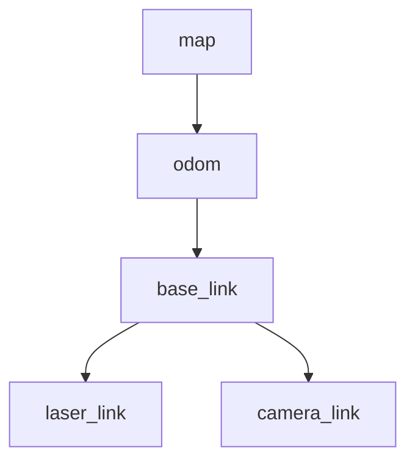

# ROS2 좌표계 - TF2 기초

> 이 문서를 읽으면 로봇의 여러 부품(센서, 바퀴, 몸체)이 서로 다른 위치와 방향을 가질 때 이를 일관되게 표현하는 TF2의 개념을 이해하고, 직접 좌표계를 발행·조회하며 RViz2에서 시각적으로 확인할 수 있게 된다.

## 문서 정보

| 항목 | 내용 |
|---|---|
| 학습 단계 | Level 3 — 시스템 구성 |
| 예상 선행 지식 | [[03_Topic과_Message\|ROS2 통신 - Topic과 Message]], [[06_Launch_파일_작성법\|ROS2 기초 - Launch 파일 작성법]] |
| 학습 목표 | 좌표계(Frame)와 변환(Transform)의 개념을 설명할 수 있다 / Static/Dynamic TF의 차이를 안다 / `tf2_echo`, RViz2로 TF 트리를 확인할 수 있다 |
| 기준 환경 | Ubuntu 22.04, ROS2 Humble |
| 관련 문서 | 이전: [[06_Launch_파일_작성법\|ROS2 기초 - Launch 파일 작성법]] / 다음: [[02_센서_연동_RealSense_D435i\|센서 연동 - RealSense D435i]] (예정) |

---

## 1. 먼저 알아야 할 핵심

1. 로봇에는 몸체, 바퀴, LiDAR, 카메라처럼 서로 다른 위치에 붙어있는 여러 부품이 있고, 각 부품은 자신만의 **기준점(좌표계, Frame)**을 가진다.
2. 예를 들어 LiDAR가 "장애물이 2m 앞에 있다"고 말할 때, 이 "앞"은 LiDAR 자신을 기준으로 한 것이지 로봇 전체를 기준으로 한 것이 아니다.
3. **TF2**는 이런 서로 다른 좌표계들 사이의 관계(위치·방향 차이)를 관리하고, 필요할 때 자동으로 변환해주는 ROS2의 표준 시스템이다.
4. 좌표계 사이의 관계가 시간이 지나도 안 변하면 **Static Transform**, 로봇이 움직이면서 계속 바뀌면 **Dynamic Transform**이라고 부른다.
5. TF2를 모르면 LiDAR·카메라 데이터를 로봇 전체 기준으로 통합할 수 없고, Nav2와 ORB-SLAM3도 정상적으로 동작하지 않는다. 이 문서는 센서 연동 문서로 넘어가기 전 반드시 필요한 마지막 기초 개념이다.

---

## 2. 이 개념은 무엇인가

TF2(Transform Library 2)는 **로봇을 구성하는 여러 좌표계들의 위치·방향 관계를 시간에 따라 관리하고, "A 좌표계 기준의 값을 B 좌표계 기준으로 바꿔줘"라는 요청을 자동으로 처리해주는 시스템**이다.

**비유로 이해하기**

여러 도시의 시차를 관리하는 세계 시계판을 떠올려보자.

- 서울 시각(로봇 몸체 기준, `base_link`), 뉴욕 시각(LiDAR 기준, `laser_link`), 런던 시각(카메라 기준, `camera_link`)은 각자 다른 기준으로 흘러가지만, 서로 간의 **시차(변환 관계)**만 알면 언제든 서로 다른 시각을 정확히 환산할 수 있다.
- "지금 서울이 오후 3시면 뉴욕은 몇 시야?"라는 질문에 매번 계산기를 두드리지 않아도, 시차표(TF 트리)만 있으면 자동으로 답이 나온다.
- TF2는 이 "시차표"를 실시간으로 관리하면서, "LiDAR가 본 장애물 위치를 로봇 몸체 기준으로 바꿔줘"라는 요청에 즉시 답해주는 역할을 한다.

**비유가 실제와 다른 부분**

- 시차는 숫자 하나(시간)만 다루지만, TF2는 위치(x, y, z)와 방향(회전)까지 함께 다루는 3차원 변환이라 계산이 더 복잡하다.
- 세계 시차는 거의 고정되어 있지만, 로봇의 좌표계 관계는 로봇이 움직이거나 카메라가 회전하는 등 실시간으로 계속 바뀔 수 있다(Dynamic Transform). 이 변화를 시간 흐름에 맞춰 계속 갱신하는 것이 TF2의 핵심 역할 중 하나다.

---

## 3. 왜 필요한가

**ROS 시스템 관점**

- TF2가 없다면, LiDAR가 "정면 2m"라고 보고한 장애물이 로봇 몸체 기준으로는 정확히 어디인지 각 노드가 직접 계산해야 한다. 센서가 여러 개면 이 계산을 센서마다 따로 구현해야 해서 매우 비효율적이고 오류가 나기 쉽다.
- TF2는 좌표계 관계를 트리(계층) 구조로 관리하기 때문에, 두 좌표계가 직접 연결되어 있지 않아도(예: LiDAR 좌표계 → 카메라 좌표계) 중간 경로(LiDAR → 몸체 → 카메라)를 자동으로 찾아 변환해준다.
- Nav2, ORB-SLAM3, RViz2 같은 대부분의 ROS2 도구와 알고리즘은 TF2가 정상적으로 구성되어 있다는 것을 전제로 동작한다. TF가 깨지면 이런 상위 시스템 전체가 작동하지 않는다.

**실제 로봇 관점 (ROSMASTER X3 기준)**

X3에는 최소한 다음과 같은 좌표계들이 존재한다.

- `base_link`: 로봇 몸체 중심을 기준으로 하는 좌표계 (모든 것의 기준점 역할)
- `laser_link`: LiDAR C1이 장착된 위치를 기준으로 하는 좌표계
- `camera_link`: RealSense D435i가 장착된 위치를 기준으로 하는 좌표계
- `odom`: 로봇이 출발한 지점을 기준으로, 바퀴 회전 등으로 추정한 로봇의 이동 경로를 나타내는 좌표계
- `map`: SLAM으로 만든 지도 전체를 기준으로 하는 좌표계 (ORB-SLAM3, Nav2에서 사용)

LiDAR가 "장애물이 내 앞 2m"라고 보고해도, TF2가 `laser_link → base_link` 관계(LiDAR가 로봇 앞쪽 10cm, 위쪽 15cm 지점에 달려있다는 정보 등)를 알고 있어야, Nav2가 "로봇 몸체 기준으로 앞 2.1m에 장애물이 있다"고 정확히 판단해서 충돌 없이 회피 경로를 계산할 수 있다.

---

## 4. ROS2 시스템에서의 위치



**그림 읽는 방법**

- 이 트리는 실제 TF 구조를 단순화한 것으로, 화살표는 "부모 좌표계 → 자식 좌표계" 관계를 의미한다. 예를 들어 `base_link → laser_link`은 "로봇 몸체를 기준으로 LiDAR가 어디에 붙어있는지"를 나타낸다.
- `map`이 가장 위(전역 기준), `laser_link`/`camera_link`가 가장 아래(개별 센서 기준)에 위치한 계층 구조다. TF2는 이 트리를 따라가며 두 좌표계 사이의 관계를 계산한다. 예를 들어 `laser_link`의 데이터를 `map` 기준으로 바꾸려면 `laser_link → base_link → odom → map` 경로를 자동으로 거친다.
- 이 트리에서 `base_link → laser_link`, `base_link → camera_link`는 로봇에 센서가 고정되어 있으므로 보통 **Static Transform**이고, `odom → base_link`는 로봇이 움직이므로 **Dynamic Transform**이며, `map → odom`은 SLAM이 위치를 보정할 때마다 바뀌는 Dynamic Transform이다.

---

## 5. 주요 구성 요소

| 구성 요소 | 역할 | 초보자가 기억할 점 |
|---|---|---|
| Frame (좌표계) | 위치와 방향의 기준이 되는 하나의 좌표축 | 로봇 부품 하나당 보통 좌표계 하나 |
| Transform (변환) | 두 좌표계 사이의 위치·방향 차이 | "A에서 B로 가려면 얼마나 이동/회전해야 하는지" |
| TF Tree | 모든 좌표계를 부모-자식 관계로 연결한 구조 | 하나의 좌표계는 부모가 단 하나만 있어야 함 |
| Static Transform | 시간이 지나도 변하지 않는 변환 | 센서가 로봇에 고정된 경우 |
| Dynamic (Broadcast) Transform | 계속 갱신되는 변환 | 로봇이 이동하는 경우 |
| Broadcaster | Transform 정보를 TF2 시스템에 발행하는 주체 | 노드가 TF 데이터를 만들어 내보내는 역할 |
| Listener | TF2로부터 두 좌표계 간의 관계를 조회하는 주체 | 노드가 "지금 A와 B 관계 알려줘"라고 요청하는 역할 |
| `base_link` | 로봇 몸체의 기준 좌표계 (관례적 이름) | 대부분의 로봇 TF 트리의 중심점 |

---

## 6. 기본 동작 과정

1. **Broadcast**: 각 노드(또는 launch 파일)가 좌표계 간의 관계(예: `base_link`에서 `laser_link`까지 x=0.1m, z=0.15m)를 TF2 시스템에 계속 발행한다.
2. **저장**: TF2는 이 관계들을 시간 정보와 함께 내부 버퍼(TF 트리)에 저장한다. Dynamic Transform은 계속 갱신되며 최근 값들이 유지된다.
3. **조회 요청**: 다른 노드가 "laser_link 기준의 이 점을 base_link 기준으로 바꿔줘"처럼 두 좌표계 간의 변환을 요청한다.
4. **경로 탐색 및 계산**: TF2는 TF 트리에서 두 좌표계를 잇는 경로를 자동으로 찾아 계산 결과(최종 변환값)를 돌려준다.
5. **적용**: 요청한 노드는 이 변환값을 이용해 실제 데이터(점, 좌표 등)를 원하는 기준 좌표계로 변환해서 사용한다.

---

## 7. 기본 실습

### 실습 목표

두 개의 좌표계(`base_link`, `laser_link`)를 직접 정의하고, TF2가 이 둘의 관계를 실제로 관리하는지 CLI와 RViz2로 확인한다.

### 준비 사항

* 06에서 만든 Launch 파일 구조 (`my_first_pkg`)
* `tf2_ros`, `rviz2` 패키지 (Humble 데스크톱 설치 시 기본 포함)
* 실행 전 확인: `ros2 pkg list | grep tf2_ros`로 설치 여부 확인

### 설치

```bash
sudo apt update
sudo apt install ros-humble-tf2-tools ros-humble-rviz2
```

* 이 명령어가 하는 일: TF 트리를 확인하는 도구(`tf2_tools`)와 시각화 도구(`rviz2`)를 설치한다.
* 정상 실행 시 예상 결과: 설치 완료 메시지가 출력된다. 이미 설치되어 있다면 `already the newest version`이 출력된다.

### 실행

```bash
# 터미널 1: base_link → laser_link로 향하는 Static Transform 발행
# x=0.1, y=0.0, z=0.15 (로봇 앞쪽 10cm, 위쪽 15cm에 LiDAR가 있다고 가정)
source /opt/ros/humble/setup.bash
ros2 run tf2_ros static_transform_publisher --x 0.1 --y 0.0 --z 0.15 --roll 0 --pitch 0 --yaw 0 --frame-id base_link --child-frame-id laser_link
```

* 이 명령어가 하는 일: 코드를 작성하지 않고도 CLI만으로 `base_link`(부모)에서 `laser_link`(자식)로 향하는 고정된 위치 관계를 TF2에 발행한다. `--frame-id`가 부모, `--child-frame-id`가 자식이라는 순서를 반드시 기억해야 한다.

### 확인

```bash
# 터미널 2
source /opt/ros/humble/setup.bash
ros2 run tf2_ros tf2_echo base_link laser_link
```

* `tf2_echo <부모> <자식>`: 언제 사용하는가 → 두 좌표계 사이의 현재 변환 값(위치, 회전)을 직접 눈으로 확인할 때 사용한다. 코드를 짜지 않고도 TF 설정이 의도대로 되었는지 검증하는 가장 빠른 방법이다.

```bash
# 터미널 3
source /opt/ros/humble/setup.bash
ros2 run rviz2 rviz2
```

RViz2 실행 후 왼쪽 하단 `Add` 버튼으로 `TF` 표시 항목을 추가하고, 좌측 `Global Options`의 `Fixed Frame`을 `base_link`로 설정한다.

```bash
# 터미널 4 (선택, TF 트리 전체를 그림 파일로 저장)
ros2 run tf2_tools view_frames
```

* `view_frames`: 언제 사용하는가 → 현재 TF 트리 전체 구조를 한눈에 보고 싶을 때 사용한다. 실행 폴더에 `frames_YYYY-MM-DD.pdf` 파일이 생성된다. 센서가 여러 개 붙는 실제 로봇에서 "TF 트리가 끊긴 부분이 없는지" 확인할 때 자주 쓰인다.

### 예상 결과

* `tf2_echo` 실행 시 `Translation: [0.100, 0.000, 0.150]`, `Rotation: ...` 형태로 지정한 값이 그대로 출력되면 정상이다.
* RViz2 화면에는 `base_link`를 원점으로, 그로부터 x축 방향으로 살짝 떨어진 위치에 `laser_link` 좌표축이 표시되어야 한다. 두 좌표축이 화면에 정확히 겹쳐 있거나 아예 안 보인다면 TF 발행이 안 되고 있는 것이다.
* `view_frames`로 생성된 PDF에는 `base_link`에서 `laser_link`로 향하는 화살표 하나가 있는 단순한 트리가 그려져 있어야 한다.

---

## 8. 코드 및 설정 해설

### 코드로 Static Transform 발행하기 (Launch 파일 방식)

CLI 명령 대신, 실제 로봇 시스템에서는 보통 Launch 파일 안에 Static Transform을 포함시킨다.

```python
from launch import LaunchDescription
from launch_ros.actions import Node

def generate_launch_description():
  # Static transform from base_link to laser_link
  # Arguments: x y z roll pitch yaw parent_frame child_frame
  laser_tf = Node(
    package='tf2_ros',
    executable='static_transform_publisher',
    name='base_to_laser_tf',
    arguments=['0.1', '0.0', '0.15', '0', '0', '0', 'base_link', 'laser_link']
  )

  return LaunchDescription([laser_tf])
```

* `package='tf2_ros', executable='static_transform_publisher'`: 실습에서 CLI로 직접 실행했던 명령을 06에서 배운 Launch 파일의 `Node` 액션으로 옮긴 것이다. 지금까지 배운 두 개념(Launch, TF)이 이 지점에서 결합된다.
* `arguments=[...]`: `x y z roll pitch yaw parent_frame child_frame` 순서로 값을 나열한다. 순서를 헷갈리면(예: 부모/자식 순서를 반대로) TF 트리 방향이 뒤바뀌는 오류가 생기므로 주의해야 한다.

### Dynamic Transform을 코드로 발행하기 (개념 이해용)

```python
import rclpy
from rclpy.node import Node
from tf2_ros import TransformBroadcaster
from geometry_msgs.msg import TransformStamped
import math

class OdomTfBroadcaster(Node):
  def __init__(self):
    super().__init__('odom_tf_broadcaster')
    self.broadcaster = TransformBroadcaster(self)
    self.timer = self.create_timer(0.1, self.broadcast_tf)  # 10Hz update
    self.x = 0.0

  def broadcast_tf(self):
    t = TransformStamped()
    t.header.stamp = self.get_clock().now().to_msg()  # current time is required
    t.header.frame_id = 'odom'        # parent frame
    t.child_frame_id = 'base_link'    # child frame
    t.transform.translation.x = self.x
    t.transform.translation.y = 0.0
    t.transform.translation.z = 0.0
    t.transform.rotation.w = 1.0      # no rotation
    self.broadcaster.sendTransform(t)
    self.x += 0.01  # simulate the robot moving forward
```

* `t.header.stamp = self.get_clock().now().to_msg()`: Dynamic Transform은 **반드시 현재 시각 정보**를 포함해야 한다. TF2는 시간 정보를 기준으로 "이 시점의 좌표 관계가 무엇이었는지"를 관리하기 때문에, 이 값이 없거나 틀리면 변환 조회가 실패하거나 오래된 값을 반환할 수 있다.
* `t.transform.rotation.w = 1.0`: 회전이 없는 상태를 나타내는 쿼터니언(Quaternion) 기본값이다. 회전이 전혀 없을 때는 `w=1.0`, 나머지(`x, y, z`)는 `0.0`으로 둔다는 것을 기본값으로 기억해두면 된다.
* `self.x += 0.01`: 실제로는 바퀴 인코더나 IMU 데이터를 바탕으로 이 값이 계산되지만, 여기서는 개념 이해를 위해 로봇이 조금씩 앞으로 이동하는 상황을 단순하게 흉내 낸 것이다.

---

## 9. 자주 사용하는 명령어

| 목적 | 명령어 | 설명 |
|---|---|---|
| Static TF 즉시 발행 | `ros2 run tf2_ros static_transform_publisher --x .. --frame-id .. --child-frame-id ..` | 코드 없이 고정된 좌표 관계를 빠르게 테스트할 때 사용 |
| 두 좌표계 관계 확인 | `ros2 run tf2_ros tf2_echo <부모> <자식>` | 특정 두 좌표계 사이의 현재 변환 값을 직접 확인할 때 사용 |
| 전체 TF 트리 확인 | `ros2 run tf2_tools view_frames` | TF 트리 구조를 PDF로 저장해 한눈에 파악할 때 사용 |
| TF 관련 오류 진단 | `ros2 run tf2_ros tf2_monitor` | 특정 좌표계 변환이 얼마나 자주 갱신되는지, 지연이 있는지 확인할 때 사용 |
| RViz2 실행 | `ros2 run rviz2 rviz2` | TF 트리와 센서 데이터를 시각적으로 확인할 때 사용 |

---

## 10. 자주 발생하는 문제

### 문제: `tf2_echo` 실행 시 "Could not find a connection" 오류

**증상**

```
[ERROR]: Could not find a connection between 'base_link' and 'laser_link'
```

**가능한 원인**

1. Static/Dynamic Transform을 발행하는 노드가 실행되어 있지 않음
2. 좌표계 이름에 오타가 있음(대소문자 구분됨)
3. 두 좌표계가 TF 트리 상에서 서로 연결되어 있지 않음(공통 경로가 없음)

**확인 방법**

```bash
ros2 run tf2_tools view_frames
```

생성된 PDF에서 두 좌표계가 실제로 트리에 존재하고 연결되어 있는지 확인한다.

**해결 방법**

1. Transform Broadcaster 노드(또는 `static_transform_publisher`)가 정상 실행 중인지 먼저 확인한다.
2. 좌표계 이름의 철자, 대소문자를 코드/명령어와 다시 비교한다.
3. `view_frames`로 트리가 끊어진 지점을 찾아, 그 구간을 이어주는 Transform이 빠졌는지 확인한다.

**초보자가 자주 하는 실수**

`base_link`와 `base_footprint`처럼 이름이 비슷한 좌표계를 혼동하거나, `frame_id`(부모)와 `child_frame_id`(자식)를 반대로 입력해서 트리 방향이 뒤바뀌는 실수가 흔하다.

### 문제: RViz2에서 "TF Error" 또는 "No transform" 경고가 계속 뜸

**증상**

RViz2 좌측 TF 항목이나 센서 데이터 항목 옆에 빨간색 경고 아이콘이 뜬다.

**가능한 원인**

1. RViz2의 `Fixed Frame` 설정이 실제 존재하지 않는 좌표계 이름으로 되어 있음
2. Dynamic Transform을 발행하는 노드가 죽었거나 발행 주기가 너무 낮음
3. 센서 데이터의 메시지 헤더에 있는 `frame_id`가 TF 트리에 없는 이름임

**확인 방법**

```bash
ros2 topic echo /scan --field header
```

센서 데이터가 어떤 `frame_id`를 사용하고 있는지 직접 확인하고, 이 이름이 TF 트리에 실제로 존재하는지 비교한다.

**해결 방법**

1. RViz2의 `Global Options → Fixed Frame`을 TF 트리에 실제 존재하는 이름(예: `base_link`)으로 맞춘다.
2. Dynamic Transform 노드가 실행 중인지, `tf2_echo`로 값이 계속 갱신되는지 확인한다.
3. 센서 드라이버의 `frame_id` 파라미터(05에서 배운 개념)가 TF 트리의 이름과 정확히 일치하도록 맞춘다.

**초보자가 자주 하는 실수**

센서 드라이버가 발행하는 데이터의 `frame_id`(예: `laser`)와, TF에서 실제로 정의한 좌표계 이름(예: `laser_link`)이 미묘하게 다른 경우를 놓치는 실수가 매우 흔하다. 이는 앞으로 다룰 LiDAR C1, RealSense D435i 연동에서 가장 자주 발생하는 문제 유형이므로 지금 정확히 익혀두는 것이 중요하다.

---

## 11. 개념 간 연결

* TF2에서 좌표계 관계를 발행/조회하는 노드들은 이전 문서에서 배운 **Topic**과 유사한 방식(`/tf`, `/tf_static`이라는 이름의 Topic)으로 내부적으로 동작한다. 다만 일반 Topic과 달리 TF2 전용 API(Broadcaster/Listener)를 통해 다루는 것이 표준이다.
* 이 문서의 Static Transform 실습은 06에서 배운 **Launch 파일**의 `Node` 액션으로 그대로 옮길 수 있으며, 실제 로봇에서는 거의 항상 Launch 파일 안에 포함되어 실행된다.
* 05에서 배운 **Parameter**의 `frame_id`는 이 문서의 TF 좌표계 이름과 반드시 일치해야 하며, 이 연결이 어긋나는 것이 10장에서 다룬 가장 흔한 오류 원인이다.
* 앞으로 다룰 [[02_센서_연동_RealSense_D435i|센서 연동 - RealSense D435i]], [[03_센서_연동_LiDAR_C1|센서 연동 - LiDAR C1]] 문서에서는 이 문서의 `base_link`, `laser_link`, `camera_link` 개념이 실제 하드웨어 장착 위치를 반영한 값으로 그대로 이어진다. 이후 `Nav2`, `ORB-SLAM3` 문서에서도 `map → odom → base_link`로 이어지는 TF 트리가 핵심 전제 조건으로 계속 등장한다.

---

## 12. 한 단계 더 깊게 보기

> **심화 학습**
>
> 이 부분은 기본 실습을 완료한 후 읽는 것을 권장한다.

**`base_link`와 `base_footprint`의 차이**

실제 로봇 패키지에서는 `base_link` 외에 `base_footprint`라는 좌표계가 추가로 등장하는 경우가 많다. `base_link`는 로봇 몸체의 실제 중심(높이 포함)을 나타내고, `base_footprint`는 로봇이 바닥에 닿는 지점을 z=0으로 투영한 좌표계다. Nav2 같은 2D 내비게이션 시스템은 로봇의 높이 정보 없이 평면상의 위치만 다루는 것이 편리하므로 `base_footprint`를 기준으로 계산하는 경우가 많다. 이 구분은 `Nav2` 문서에서 다시 자세히 다룬다.

**`tf` vs `tf_static` Topic**

TF2는 내부적으로 두 개의 Topic을 사용한다. `/tf`는 계속 갱신되는 Dynamic Transform을, `/tf_static`은 한 번만 발행되면 되는 Static Transform을 위한 것이다. `/tf_static`은 `Durability` QoS(03 심화 내용 참고)가 `TRANSIENT_LOCAL`로 설정되어 있어서, 나중에 실행된 노드도 이전에 발행된 값을 놓치지 않고 받을 수 있다.

> **공식 문서 기준**: ROS2 공식 문서(`tf2` 패키지)는 TF2를 "시스템 전반에 걸쳐 여러 좌표계 간의 관계를 추적하는 라이브러리"로 정의하며, 좌표계는 트리 구조여야 하고 하나의 자식 좌표계는 하나의 부모만 가질 수 있다고 명시하고 있다.

---

## 13. 핵심 요약

1. TF2는 로봇의 여러 좌표계(부품별 기준점) 사이의 위치·방향 관계를 관리하고 자동으로 변환해주는 시스템이다.
2. 좌표계 관계가 고정이면 Static Transform, 계속 바뀌면 Dynamic Transform으로 구분한다.
3. TF 트리는 부모-자식 계층 구조이며, 하나의 좌표계는 부모를 하나만 가질 수 있다.
4. `tf2_echo`, `view_frames`, RViz2는 TF 상태를 진단하는 핵심 도구이며, 센서의 `frame_id` 파라미터와 TF 트리의 이름이 일치하는지가 가장 흔한 점검 포인트다.
5. 이 문서까지의 노드·Topic·Parameter·Launch·TF 개념이 결합되어야 비로소 실제 센서 연동, SLAM, Nav2로 넘어갈 수 있는 기초가 완성된다.

---

## 14. 이해도 점검

1. TF2가 관리하는 것은 정확히 무엇인가?
2. Static Transform과 Dynamic Transform은 각각 어떤 경우에 사용하는가?
3. `tf2_echo base_link laser_link`를 실행했을 때 아무 값도 안 나온다면 가장 먼저 무엇을 확인해야 하는가?
4. Dynamic Transform을 코드로 발행할 때 반드시 포함해야 하는 정보는 무엇이며, 왜 필요한가?
5. RealSense D435i를 실제로 연동할 때, 이 문서에서 배운 어떤 개념이 가장 먼저 확인해야 할 요소가 될 것으로 예상되는가?

> [!info]- 정답 및 해설 보기
> 1. 로봇을 구성하는 여러 좌표계(센서, 몸체 등) 사이의 위치와 방향 관계를 시간에 따라 관리하고, 필요할 때 자동으로 변환해준다.
> 2. 센서가 로봇에 고정되어 위치가 변하지 않는 경우는 Static Transform, 로봇이 움직이거나 위치가 실시간으로 갱신되어야 하는 경우는 Dynamic Transform을 사용한다.
> 3. 해당 Transform을 발행하는 노드(Static/Dynamic Broadcaster)가 실행 중인지, 좌표계 이름에 오타가 없는지부터 확인해야 한다.
> 4. 현재 시각 정보(`header.stamp`)를 포함해야 한다. TF2는 시간 기준으로 좌표 관계를 관리하므로, 이 정보가 없거나 부정확하면 변환 조회가 실패하거나 오래된 값을 반환할 수 있다.
> 5. 카메라 드라이버가 발행하는 데이터의 `frame_id`(예: `camera_link`)가 실제 TF 트리에 정의된 좌표계 이름과 정확히 일치하는지가 가장 먼저 확인해야 할 요소다.

---

## 15. 다음 학습 주제

1. **바로 다음**: [[01_DDS와_QoS_이해하기|응용 01 - DDS와 QoS 이해하기]] — 이 문서에서 배운 `camera_link` 개념을 실제 하드웨어와 연결하기 전에, 센서가 안 보이는 문제의 1순위 원인인 QoS부터 짚고 간다. 하드웨어 연동 자체는 응용 02에서 시작한다.
2. **함께 보면 좋은 주제**: [[03_센서_연동_LiDAR_C1|센서 연동 - LiDAR C1]] — `laser_link` 개념을 실제 LiDAR C1 드라이버와 연결하며, 이 문서의 TF 실습을 실제 센서 데이터로 확장한다.
3. **나중에 학습할 심화 주제**: [[01-1_ORB-SLAM3_시스템_개요|SLAM 백엔드 심화 - 01-1. ORB-SLAM3 시스템 개요]], [[02_Costmap|지상로봇 적용 - Nav2 내비게이션 - 02. Costmap]] — `map → odom → base_link`로 이어지는 전체 TF 트리가 실제로 어떻게 완성되고 활용되는지 다룬다.

---

## 16. 참고자료

| 구분 | 자료 | 핵심 내용 |
|---|---|---|
| 공식 문서 | [ROS2 Documentation (Humble) – Introduction to tf2](https://docs.ros.org/en/humble/Tutorials/Intermediate/Tf2/Introduction-To-Tf2.html) | TF2의 기본 개념, 좌표계 트리 구조, Static/Dynamic 개념 확인 |
| 공식 문서 | [ROS2 Documentation (Humble) – Writing a static broadcaster (Python)](https://docs.ros.org/en/humble/Tutorials/Intermediate/Tf2/Writing-A-Tf2-Static-Broadcaster-Py.html) | `static_transform_publisher` CLI 사용법과 인자 순서 확인 |
| 공식 문서 | [ROS2 Documentation (Humble) – Writing a broadcaster (Python)](https://docs.ros.org/en/humble/Tutorials/Intermediate/Tf2/Writing-A-Tf2-Broadcaster-Py.html) | `TransformBroadcaster`, `TransformStamped` 코드 작성법 확인 |
| 공식 문서 | [ROS2 Documentation (Humble) – Debugging tf2](https://docs.ros.org/en/humble/Tutorials/Intermediate/Tf2/Debugging-Tf2-Problems.html) | `tf2_echo`, `view_frames`, `tf2_monitor`를 이용한 TF 문제 진단 방법 확인 |
