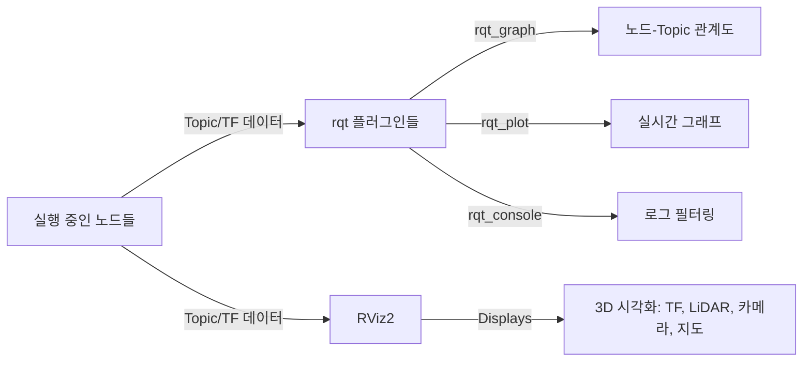

# ROS2 도구 - rqt / rviz2 활용

> 이 문서를 읽으면 지금까지 CLI 명령어로만 확인하던 노드, Topic, TF 정보를 그래픽 도구(rqt, RViz2)로 훨씬 빠르게 확인하고 디버깅할 수 있게 된다.

## 문서 정보

| 항목 | 내용 |
|---|---|
| 학습 단계 | Level 2 — 도구 활용 |
| 예상 선행 지식 | [[03_Topic과_Message|ROS2 통신 - Topic과 Message]], [[07_TF2_기초|ROS2 좌표계 - TF2 기초]] |
| 학습 목표 | rqt의 주요 플러그인을 활용할 수 있다 / RViz2에서 센서 데이터와 TF를 시각화할 수 있다 / 상황에 맞게 CLI와 GUI 도구를 선택할 수 있다 |
| 기준 환경 | Ubuntu 22.04, ROS2 Humble |
| 관련 문서 | 이전: [[07_TF2_기초|ROS2 좌표계 - TF2 기초]] / 다음: [[02_센서_연동_RealSense_D435i|센서 연동 - RealSense D435i]] (예정) |

---

## 1. 먼저 알아야 할 핵심

1. 지금까지는 `ros2 topic echo`, `ros2 node list`, `tf2_echo`처럼 **텍스트 기반 CLI 도구**로 시스템 상태를 확인해왔다.
2. **rqt**는 이런 정보를 그래프, 표, 그래픽 UI로 보여주는 ROS2의 통합 GUI 툴박스다.
3. **RViz2**는 3차원 공간에서 센서 데이터, TF, 로봇 모델을 실제로 "보이는" 형태로 시각화하는 전용 도구다.
4. rqt와 RViz2는 서로 다른 목적을 가진다 — rqt는 "노드/Topic 관계와 수치 데이터"를, RViz2는 "3차원 공간 정보"를 보는 데 특화되어 있다.
5. 실제 로봇 개발에서는 CLI로 빠르게 확인하고, 복잡한 문제는 GUI 도구로 시각적으로 진단하는 방식을 함께 사용한다.

---

## 2. 이 개념은 무엇인가

rqt는 **여러 개의 작은 진단/디버깅 플러그인을 하나의 창에 모아 쓸 수 있는 GUI 프레임워크**이고, RViz2는 **로봇의 센서 데이터와 좌표계를 3차원 화면에 그려주는 시각화 도구**다.

**비유로 이해하기**

자동차 계기판을 떠올려보자.

- rqt는 계기판과 같다. 속도계, 연료 게이지, 엔진 경고등처럼 서로 다른 정보를 한 화면에 모아 숫자와 그래프로 보여준다. `ros2 topic echo`로 숫자를 하나하나 읽는 대신, rqt의 그래프 플러그인은 값의 변화를 실시간 곡선으로 보여준다.
- RViz2는 후방 카메라나 내비게이션 화면과 같다. "지금 내 차 주변에 무엇이 있는지"를 숫자가 아니라 실제 공간 이미지로 보여준다. LiDAR가 감지한 점들, 로봇의 위치, 카메라 영상을 3차원 공간에 그대로 겹쳐서 보여준다.

**비유가 실제와 다른 부분**

- 자동차 계기판은 미리 정해진 항목만 보여주지만, rqt는 `rqt_graph`, `rqt_plot`, `rqt_console` 등 필요한 플러그인을 그때그때 추가하거나 뺄 수 있는 조립식 구조다.
- 내비게이션 화면은 보통 완성된 결과만 보여주지만, RViz2는 TF 트리가 끊어진 부분, 데이터가 안 들어오는 Topic처럼 "문제가 있는 부분"까지 시각적으로 드러내는 디버깅 도구로도 쓰인다.

---

## 3. 왜 필요한가

**ROS 시스템 관점**

- 노드가 10개, Topic이 30개를 넘어가면 `ros2 node list`, `ros2 topic list`를 하나하나 눈으로 대조하며 관계를 파악하기 어렵다. `rqt_graph`는 이 관계를 한 장의 그림으로 즉시 보여준다.
- 숫자 데이터(예: LiDAR와의 거리, 배터리 전압)가 시간에 따라 어떻게 변하는지는 텍스트 로그보다 그래프로 보는 것이 이상 징후(급격한 변화, 노이즈)를 훨씬 빨리 알아챌 수 있다.
- LiDAR 점들이 실제로 맞는 위치에 찍히는지, TF가 정확히 맞는지는 숫자로는 판단하기 어렵고 3차원으로 직접 봐야 확실히 알 수 있다. 이것이 RViz2가 필요한 이유다.

**실제 로봇 관점 (ROSMASTER X3 기준)**

- LiDAR C1과 RealSense D435i를 동시에 연결했을 때, RViz2 화면에 LiDAR 점군과 카메라 포인트클라우드가 서로 겹치지 않고 어긋나 있다면 TF 설정(07에서 배운 `laser_link`, `camera_link` 위치값)이 잘못되었다는 것을 즉시 알 수 있다.
- Nav2로 자율주행을 시킬 때, 로봇이 왜 이상한 경로로 도는지 로그만 봐서는 알기 어렵지만 RViz2에서 costmap(장애물 지도)을 시각적으로 보면 원인을 바로 파악할 수 있는 경우가 많다.
- `rqt_console`은 여러 노드에서 동시에 쏟아지는 로그를 심각도별(정보/경고/오류)로 필터링해서 보여주므로, 터미널 여러 개를 띄워놓고 로그를 눈으로 쫓는 것보다 훨씬 효율적이다.

---

## 4. ROS2 시스템에서의 위치



**그림 읽는 방법**

- rqt와 RViz2 모두 왼쪽의 "실행 중인 노드들"이 발행하는 데이터(Topic, TF)를 구독해서 보여주는 도구다. 즉 이 문서는 새로운 통신 개념이 아니라, 지금까지 배운 Topic/TF 데이터를 **다르게 보여주는 방법**을 다룬다.
- rqt 안에는 목적이 다른 여러 플러그인(그래프, 그림, 로그)이 있고, RViz2는 하나의 3차원 뷰 안에 여러 Display 항목(TF, LaserScan, Image 등)을 겹쳐서 보여준다.

---

## 5. 주요 구성 요소

| 구성 요소 | 역할 | 초보자가 기억할 점 |
|---|---|---|
| `rqt_graph` | 노드와 Topic의 연결 관계를 그래프로 표시 | "지금 시스템이 어떻게 연결되어 있는지" 한눈에 확인 |
| `rqt_plot` | 특정 숫자 데이터를 실시간 그래프로 표시 | 값의 변화 추이나 이상치를 볼 때 유용 |
| `rqt_console` | 여러 노드의 로그를 모아 필터링해서 표시 | 오류(ERROR)만 걸러서 보는 데 유용 |
| `rqt_reconfigure` | 파라미터를 슬라이더/입력창으로 실시간 조정 | 05에서 배운 `ros2 param set`의 GUI 버전 |
| RViz2 | 3차원 공간에 센서/TF/지도 데이터를 시각화 | Display 목록에 필요한 항목을 추가해서 사용 |
| Fixed Frame | RViz2가 화면을 그릴 때 기준으로 삼는 좌표계 | 보통 `map` 또는 `base_link`를 지정 |
| Display | RViz2에서 특정 데이터 종류를 화면에 그리는 항목 | TF, LaserScan, Image, PointCloud2 등 |

---

## 6. 기본 동작 과정

1. **실행**: `rqt` 또는 `ros2 run rviz2 rviz2` 명령으로 도구를 실행한다.
2. **플러그인/Display 추가**: rqt는 `Plugins` 메뉴에서, RViz2는 좌하단 `Add` 버튼에서 보고 싶은 항목을 추가한다.
3. **데이터 소스 지정**: 추가한 항목에 어떤 Topic이나 TF 좌표계를 볼지 지정한다.
4. **실시간 갱신**: 노드가 계속 데이터를 발행하는 동안, 도구는 이를 실시간으로 화면에 반영한다.
5. **문제 진단**: 화면에 표시되지 않거나 오류 아이콘이 뜨는 부분을 단서로 삼아 원인(TF 오류, Topic 미발행 등)을 역추적한다.

---

## 7. 기본 실습

### 실습 목표

02~07에서 사용한 turtlesim, 발행 노드, TF 실습을 rqt와 RViz2로 다시 확인하며 CLI로 봤던 정보가 GUI에서 어떻게 보이는지 비교한다.

### 준비 사항

* `rqt`, `rqt-graph`, `rqt-plot`, `rqt-console`, `rviz2` 패키지
* 02의 `turtlesim`, 07의 TF 실습 환경

### 설치

```bash
sudo apt update
sudo apt install ros-humble-rqt ros-humble-rqt-common-plugins
```

* 이 명령어가 하는 일: rqt 본체와 `rqt_graph`, `rqt_plot`, `rqt_console`, `rqt_reconfigure` 등 자주 쓰이는 플러그인을 한 번에 설치한다.
* 정상 실행 시 예상 결과: 설치 완료 메시지가 출력된다. Humble 데스크톱 버전은 대부분 기본 포함되어 있다.

### 실행 - rqt_graph로 노드 관계 보기

```bash
# 터미널 1
source /opt/ros/humble/setup.bash
ros2 run turtlesim turtlesim_node
```

```bash
# 터미널 2
source /opt/ros/humble/setup.bash
ros2 run turtlesim turtle_teleop_key
```

```bash
# 터미널 3
source /opt/ros/humble/setup.bash
rqt_graph
```

* `rqt_graph`: 언제 사용하는가 → 지금 실행 중인 노드들이 어떤 Topic으로 연결되어 있는지 한 장의 그래프로 보고 싶을 때 사용한다. `ros2 node list` + `ros2 topic list`를 눈으로 대조하는 대신 이 화면 하나로 전체 구조를 파악할 수 있다.

### 확인 - rqt_plot으로 실시간 값 보기

```bash
# 터미널 4
source /opt/ros/humble/setup.bash
rqt_plot
```

상단 입력창에 `/turtle1/pose/x`를 입력하고 `+` 버튼을 누른 뒤, 터미널 2에서 방향키로 거북이를 움직인다.

* `rqt_plot`: 언제 사용하는가 → 거북이의 x좌표가 시간에 따라 어떻게 변하는지 실시간 곡선으로 보고 싶을 때 사용한다. 실제 로봇에서는 속도, 배터리 전압, LiDAR 특정 각도의 거리값 등을 이런 방식으로 관찰한다.

### 확인 - RViz2로 TF와 turtlesim 확인

```bash
# 터미널 5
source /opt/ros/humble/setup.bash
ros2 run rviz2 rviz2
```

좌하단 `Add` → `By display type` → `TF` 선택 후 추가한다. 좌측 `Global Options`의 `Fixed Frame`을 `world`로 설정한다.

### 예상 결과

* `rqt_graph` 화면에는 `turtlesim_node`와 `teleop_key` 노드가 `/turtle1/cmd_vel` Topic으로 연결된 화살표가 보여야 한다. 03에서 배운 Publisher-Subscriber 관계가 그림으로 확인되는 것이다.
* `rqt_plot`에는 거북이를 움직일 때마다 `/turtle1/pose/x` 값이 곡선으로 변하는 그래프가 그려져야 한다.
* RViz2에는 `turtle1`의 좌표계가 TF 축(빨강/초록/파랑 화살표)으로 표시되고, 거북이를 움직이면 그 축도 함께 움직여야 한다. 이는 07에서 CLI로 확인했던 TF 관계를 시각적으로 재확인하는 것이다.

---

## 8. 코드 및 설정 해설

### RViz2 설정을 파일로 저장하고 재사용하기

매번 `Add`로 Display를 하나씩 추가하는 것은 번거로우므로, 설정을 파일로 저장해두고 다음에 불러올 수 있다.

```bash
# RViz2 실행 후 상단 메뉴: File → Save Config As
# 예: ~/ros2_ws/src/my_first_pkg/rviz/default.rviz
```

```bash
# 저장된 설정으로 바로 실행하기
ros2 run rviz2 rviz2 -d ~/ros2_ws/src/my_first_pkg/rviz/default.rviz
```

* `-d <경로>`: 이 옵션이 하는 일 → RViz2를 실행하면서 저장해둔 `.rviz` 설정 파일을 즉시 불러온다. 실제 로봇 프로젝트에서는 이 `.rviz` 파일을 Launch 파일(06)에 포함시켜, `ros2 launch` 한 번으로 필요한 Display가 모두 갖춰진 RViz2 화면이 뜨도록 구성하는 것이 표준적인 방식이다.

### Launch 파일에서 RViz2를 함께 실행하기

```python
from launch_ros.actions import Node
import os
from ament_index_python.packages import get_package_share_directory

rviz_config = os.path.join(
  get_package_share_directory('my_first_pkg'), 'rviz', 'default.rviz'
)

rviz_node = Node(
  package='rviz2',
  executable='rviz2',
  name='rviz2',
  arguments=['-d', rviz_config],
  output='screen'
)
```

* `arguments=['-d', rviz_config]`: 06에서 배운 `Node` 액션 구조를 그대로 사용해, RViz2도 다른 센서/제어 노드와 함께 한 번에 실행되도록 만든 것이다. 앞으로 다룰 센서 연동 문서의 Launch 파일에는 대부분 이런 형태로 RViz2 실행이 포함된다.

---

## 9. 자주 사용하는 명령어

| 목적 | 명령어 | 설명 |
|---|---|---|
| rqt 통합 실행 | `rqt` | 원하는 플러그인을 메뉴에서 골라 추가하는 빈 rqt 창 실행 |
| 노드-Topic 그래프 | `rqt_graph` | 시스템 전체 연결 구조를 그림으로 확인 |
| 실시간 값 그래프 | `rqt_plot` | 특정 숫자 필드의 시간별 변화를 그래프로 확인 |
| 로그 필터링 창 | `rqt_console` | 여러 노드의 로그를 모아 심각도별로 필터링 |
| 파라미터 GUI 조정 | `rqt_reconfigure` | 05의 `ros2 param set`을 슬라이더/입력창으로 조정 |
| RViz2 실행 | `ros2 run rviz2 rviz2` | 3차원 시각화 창 실행 |
| 설정 불러와 실행 | `ros2 run rviz2 rviz2 -d <파일.rviz>` | 저장해둔 Display 구성으로 바로 실행 |

---

## 10. 자주 발생하는 문제

### 문제: RViz2에 아무것도 안 보이고 "Global Status: Error"만 표시됨

**증상**

RViz2 좌측 패널 최상단의 `Global Status`가 빨간색 `Error`로 표시되고 화면이 비어 있다.

**가능한 원인**

1. `Fixed Frame`에 지정한 좌표계가 실제로 존재하지 않음 (TF 트리에 없는 이름)
2. TF를 발행하는 노드가 아직 실행되지 않았거나 이미 종료됨

**확인 방법**

```bash
ros2 run tf2_tools view_frames
```

`Fixed Frame`에 입력한 이름이 실제 TF 트리에 존재하는지 07에서 배운 방법으로 먼저 확인한다.

**해결 방법**

`Global Options → Fixed Frame`을 TF 트리에 실제 존재하는 좌표계 이름으로 바꾼다. 여러 좌표계 중 어떤 것을 골라야 할지 모르겠다면 우선 가장 상위 좌표계인 `map` 또는 로봇 기준인 `base_link`부터 시도한다.

**초보자가 자주 하는 실수**

Fixed Frame 입력창에 오타를 내거나, 아직 해당 좌표계를 발행하는 노드를 실행하지 않은 상태에서 먼저 RViz2를 켜고 "왜 안 되지"라고 생각하는 경우가 흔하다. TF를 발행하는 노드부터 실행한 뒤 RViz2를 켜는 순서를 지키는 것이 좋다.

### 문제: 특정 Display(예: LaserScan)를 추가했는데 데이터가 안 보임

**증상**

Display 목록에 항목은 추가되었지만 화면에 아무것도 그려지지 않고, 항목 옆에 노란색 경고 아이콘이 뜬다.

**가능한 원인**

1. 해당 Display의 `Topic` 항목에 실제 존재하는 Topic 이름이 지정되지 않음
2. 데이터의 `frame_id`가 TF 트리에 없는 이름 (07 10장에서 다룬 문제와 동일한 유형)
3. QoS 설정 불일치 (03 12장 심화 내용 참고)

**확인 방법**

Display 항목을 펼쳐서 `Topic` 필드가 비어있거나 잘못된 이름인지 확인하고, `ros2 topic list`로 실제 Topic 이름과 대조한다.

**해결 방법**

1. Display 항목의 `Topic` 필드를 클릭해 실제 존재하는 Topic을 목록에서 직접 선택한다.
2. 그래도 안 보이면 `ros2 topic echo <topic명>`으로 데이터가 실제로 발행되고 있는지 먼저 확인한다.
3. 데이터는 있는데 안 보인다면 해당 데이터의 `frame_id`가 TF 트리에 존재하는지 확인한다.

**초보자가 자주 하는 실수**

Display를 추가만 하고 `Topic` 필드를 비워두거나 잘못 입력해서 "기능이 고장 났다"고 오해하는 경우가 많다. RViz2의 각 Display는 반드시 어떤 Topic을 볼지 명시적으로 지정해줘야 동작한다.

---

## 11. 개념 간 연결

* rqt와 RViz2가 보여주는 모든 정보는 근본적으로 이전 문서들에서 배운 **Topic**(03), **TF**(07) 데이터다. 이 문서는 새로운 통신 개념이 아니라, 지금까지 CLI로 확인해온 것을 시각적으로 보는 방법을 다룬다.
* `rqt_reconfigure`는 05에서 배운 **Parameter**의 `ros2 param set`을 GUI로 감싼 도구이며, 내부 동작 방식(Service 호출)은 동일하다.
* RViz2 설정을 Launch 파일에 포함시키는 방식은 06에서 배운 **Launch 파일**의 `Node` 액션 구조를 그대로 재사용한다.
* 앞으로 다룰 [[02_센서_연동_RealSense_D435i|센서 연동 - RealSense D435i]], [[03_센서_연동_LiDAR_C1|센서 연동 - LiDAR C1]] 문서의 "확인" 단계는 대부분 이 문서에서 배운 RViz2 Display(Image, PointCloud2, LaserScan)를 활용한다.

---

## 12. 한 단계 더 깊게 보기

> **심화 학습**
>
> 이 부분은 기본 실습을 완료한 후 읽는 것을 권장한다.

**RViz2에서 자주 쓰는 Display 종류**

| Display 이름 | 용도 |
|---|---|
| `LaserScan` | LiDAR의 2D 스캔 데이터(`sensor_msgs/LaserScan`)를 점으로 표시 |
| `PointCloud2` | 카메라의 3D 포인트클라우드나 3D LiDAR 데이터를 표시 |
| `Image` | 카메라의 2D 영상을 별도 창으로 표시 |
| `Map` | Nav2/SLAM이 만든 점유 격자 지도를 표시 |
| `RobotModel` | URDF로 정의된 로봇의 3D 모델을 표시 |
| `Odometry` | 로봇의 이동 경로(화살표 궤적)를 표시 |

이 목록은 이후 센서 연동, SLAM, Nav2 문서에서 실제로 하나씩 사용하게 될 항목들이다.

> **공식 문서 기준**: ROS2 공식 문서는 RViz2를 "ROS의 3D 시각화 도구로, 센서 데이터와 상태 정보를 표시한다"고 설명하며, rqt는 "다양한 GUI 도구를 플러그인 형태로 통합해 실행할 수 있는 프레임워크"로 소개하고 있다.

---

## 13. 핵심 요약

1. rqt는 노드/Topic 관계, 실시간 수치, 로그를 그래픽으로 보여주는 통합 GUI 도구 모음이다.
2. RViz2는 센서 데이터와 TF를 3차원 공간에 시각화하는 전용 도구다.
3. 둘 다 새로운 통신 개념이 아니라 기존 Topic/TF/Parameter 데이터를 다르게 "보여주는" 도구다.
4. RViz2가 비어 보이거나 오류가 뜰 때는 `Fixed Frame` 설정과 각 Display의 `Topic` 지정을 가장 먼저 확인한다.
5. RViz2 설정은 `.rviz` 파일로 저장해 Launch 파일에 포함시키면, 센서 연동 시스템을 실행할 때마다 필요한 화면이 자동으로 갖춰진다.

---

## 14. 이해도 점검

1. rqt와 RViz2는 각각 어떤 상황에 사용하는 것이 적합한가?
2. `rqt_graph`는 무엇을 확인할 때 사용하는가?
3. RViz2에서 `Global Status`가 `Error`로 뜬다면 가장 먼저 무엇을 확인해야 하는가?
4. `rqt_reconfigure`는 어떤 이전 개념의 GUI 버전인가?
5. 실제 로봇에서 LiDAR와 카메라 데이터가 RViz2 화면에서 서로 어긋나 보인다면 어떤 문서에서 배운 개념을 점검해야 하는가?

> [!info]- 정답 및 해설 보기
> 1. rqt는 노드/Topic 관계나 수치 데이터를 확인할 때, RViz2는 3차원 공간 정보(센서 데이터, TF, 지도)를 확인할 때 적합하다.
> 2. 현재 실행 중인 노드들이 어떤 Topic으로 서로 연결되어 있는지 전체 구조를 그림으로 확인할 때 사용한다.
> 3. `Fixed Frame`에 지정한 좌표계 이름이 실제 TF 트리에 존재하는지부터 확인해야 한다.
> 4. 05에서 배운 Parameter의 `ros2 param set` 기능을 GUI로 감싼 도구다.
> 5. 07에서 배운 TF2 설정(각 센서의 `frame_id`와 TF 트리 상의 위치값)을 점검해야 한다.

---

## 15. 다음 학습 주제

1. **바로 다음**: [[01_DDS와_QoS_이해하기|응용 01 - DDS와 QoS 이해하기]] — 이 문서에서 배운 Display에 실제 카메라 데이터를 채우기 전에, "Topic은 보이는데 화면에 안 나오는" 문제의 원인인 QoS를 먼저 다룬다.
2. **함께 보면 좋은 주제**: [[03_센서_연동_LiDAR_C1|센서 연동 - LiDAR C1]] — `LaserScan` Display를 활용해 실제 LiDAR 데이터를 시각적으로 검증하게 된다.
3. **나중에 학습할 심화 주제**: [[09_문제_해결_자주_발생하는_오류_모음|문제 해결 - ROS2 자주 발생하는 오류 모음]] — 이 문서에서 다룬 GUI 진단 도구들이 실전 트러블슈팅에서 어떻게 조합되어 쓰이는지 다룬다.

---

## 16. 참고자료

| 구분 | 자료 | 핵심 내용 |
|---|---|---|
| 공식 문서 | [ROS2 Documentation (Humble) – Introducing turtlesim and rqt](https://docs.ros.org/en/humble/Tutorials/Beginner-CLI-Tools/Introducing-Turtlesim/Introducing-Turtlesim.html) | rqt의 개념과 `rqt_graph` 기본 사용법 확인 |
| 공식 문서 | [ROS2 Documentation (Humble) – RViz2 user guide](https://docs.ros.org/en/humble/Tutorials/Intermediate/RViz/RViz-Main.html) | RViz2의 Display 종류와 Fixed Frame 설정 방법 확인 |
| 공식 문서 | [ROS2 Documentation (Humble) – rqt_console and roslaunch](https://docs.ros.org/en/humble/Tutorials/Beginner-CLI-Tools/Using-Rqt-Console/Using-Rqt-Console.html) | `rqt_console`을 이용한 로그 필터링 방법 확인 |
