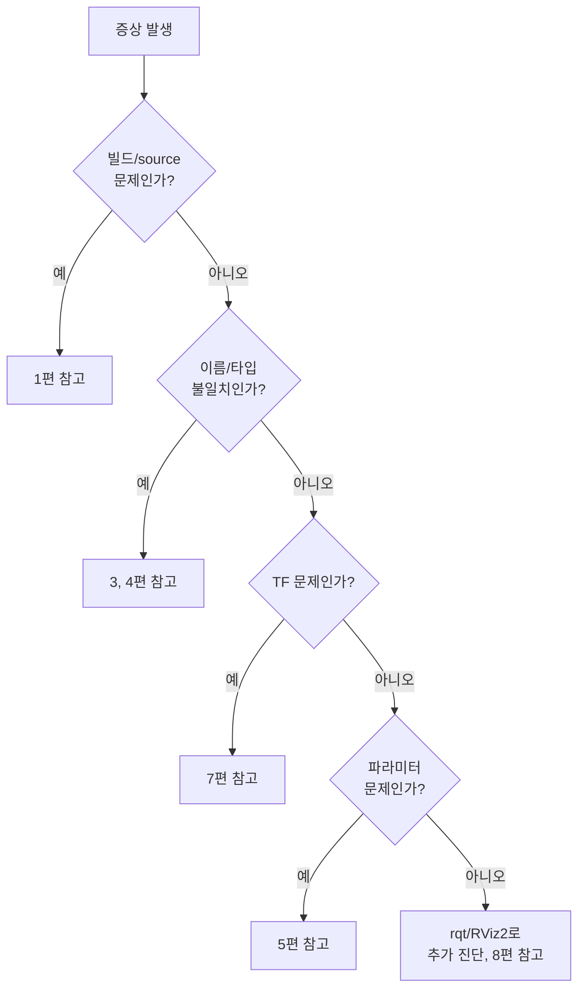

# 문제 해결 - ROS2 자주 발생하는 오류 모음

> 이 문서를 읽으면 0~8편 전체 학습 과정에서 등장했던 오류들을 증상별로 빠르게 찾아 원인을 진단하고 해결할 수 있게 된다. 새로운 개념을 배우는 문서가 아니라, 지금까지 배운 것을 "문제가 생겼을 때 어떻게 찾아가는지" 관점에서 재구성한 참고용 문서다.

## 문서 정보

| 항목 | 내용 |
|---|---|
| 학습 단계 | Level 4 — 실전 진단 |
| 예상 선행 지식 | 0~8편 전체 (개념보다는 각 문서의 10장 "자주 발생하는 문제"를 통합 정리) |
| 학습 목표 | 증상만 보고 어떤 개념(노드/Topic/Parameter/Launch/TF)의 문제인지 빠르게 좁혀낼 수 있다 / 표준 진단 순서를 스스로 적용할 수 있다 |
| 기준 환경 | Ubuntu 22.04, ROS2 Humble |
| 관련 문서 | 이전: `ROS2 도구 - rqt / rviz2 활용` / 다음: [[02_센서_연동_RealSense_D435i|센서 연동 - RealSense D435i]] (예정) |

---

## 1. 먼저 알아야 할 핵심

1. ROS2에서 발생하는 오류의 대부분은 몇 가지 근본 원인(빌드/source 누락, 이름 불일치, TF 누락, 파라미터 미선언)으로 귀결된다.
2. 이 문서는 새 개념을 배우기보다, **증상 → 의심 원인 → 확인 명령어**의 흐름으로 지금까지의 오류들을 한곳에 모아 빠르게 찾아볼 수 있도록 구성했다.
3. 오류가 발생했을 때는 감으로 여기저기 고치기보다, 아래 8장의 "표준 진단 순서"를 순서대로 따라가는 습관이 문제 해결 속도를 크게 높인다.
4. 이 문서에 없는 새로운 오류를 만나면, 결국 "어떤 개념(노드/Topic/Parameter/TF/Launch)의 문제인지" 분류하는 것이 첫 단계이며 그 개념을 다룬 원래 문서의 10장으로 돌아가 더 자세히 살펴보는 것이 효율적이다.
5. 앞으로 다룰 센서 연동, Nav2, ORB-SLAM3에서 만날 오류들도 대부분 이 문서에서 정리한 유형(빌드, 이름 불일치, TF, QoS, 파라미터) 중 하나로 분류된다.

---

## 2. 이 개념은 무엇인가

이 문서는 새로운 ROS2 개념이 아니라, **0~8편에서 다룬 오류들을 증상 기준으로 재분류한 색인(index)**이다.

**비유로 이해하기**

병원의 증상별 진료과 안내판을 떠올려보자.

- "배가 아프다"는 증상 하나로도 원인은 소화불량, 장염, 맹장염 등 다양할 수 있다. 안내판은 증상별로 "일단 이 진료과부터 가보라"고 알려준다.
- 이 문서도 마찬가지로 "Subscriber에 데이터가 안 들어온다"는 증상 하나에 대해, 원인이 될 수 있는 여러 가능성(Topic 이름 불일치, 재빌드 누락, QoS 불일치)을 순서대로 확인하도록 안내한다.

**비유가 실제와 다른 부분**

- 병원 진료과는 의사가 최종 진단을 내려주지만, 이 문서는 확인 명령어까지만 안내할 뿐 최종 원인 판단은 로그와 출력 결과를 직접 보고 사용자가 좁혀나가야 한다.

---

## 3. 왜 필요한가

**ROS 시스템 관점**

- ROS2 시스템은 노드, Topic, TF, 파라미터, Launch가 서로 맞물려 동작하기 때문에, 오류 메시지 하나만으로는 정확히 어느 계층의 문제인지 바로 알기 어려운 경우가 많다.
- 매번 처음부터 원인을 추측하기보다, 자주 반복되는 패턴을 미리 정리해두면 실제 문제 해결 시간을 크게 줄일 수 있다.

**실제 로봇 관점 (ROSMASTER X3 기준)**

앞으로 RealSense D435i, LiDAR C1, Nav2, ORB-SLAM3를 연동하다 보면, "빌드는 되는데 안 뜬다", "RViz2에 아무것도 안 보인다", "파라미터가 적용이 안 된다" 같은 문제를 반복적으로 겪게 된다. 이 문제들의 근본 원인은 대부분 이 문서에 정리된 몇 가지 패턴(9장 참고)으로 좁혀지므로, 매번 새로 당황하기보다 이 문서를 체크리스트처럼 활용하는 것이 실전에서 훨씬 효율적이다.

---

## 4. ROS2 시스템에서의 위치



**그림 읽는 방법**

- 이 흐름도는 "증상이 발생했을 때 어떤 순서로 원인을 좁혀가는지"를 보여주는 이 문서 전체의 뼈대다.
- 각 분기(Q1~Q4)는 지금까지 배운 문서(1, 3, 4, 5, 7편)의 핵심 문제 유형과 정확히 대응된다. 즉 이 문서는 새로운 진단 방법을 제시하는 것이 아니라, 이미 배운 각 문서의 10장 내용을 하나의 흐름으로 재구성한 것이다.
- 마지막 단계(F5)에서도 원인이 안 잡히면, 8편에서 배운 GUI 도구(`rqt_graph`, RViz2)로 시스템 전체를 시각적으로 훑어보는 것이 다음 단계다.

---

## 5. 주요 구성 요소

| 오류 범주 | 대표 증상 | 관련 문서 |
|---|---|---|
| 빌드/환경 오류 | `Package not found`, `colcon build` 실패 | 1편 |
| 노드 실행 오류 | 노드가 `ros2 node list`에 안 뜸, 이름 충돌 | 2편 |
| Topic 통신 오류 | Subscriber에 데이터 안 들어옴 | 3편 |
| Service/Action 오류 | 응답 없이 멈춤, Feedback만 계속됨 | 4편 |
| 파라미터 오류 | `Parameter not declared`, YAML 미적용 | 5편 |
| Launch 오류 | 파일/패키지 못 찾음, 일부 노드만 죽음 | 6편 |
| TF 오류 | `Could not find a connection`, RViz2 TF Error | 7편 |
| 시각화 오류 | RViz2 빈 화면, Display 경고 아이콘 | 8편 |

---

## 6. 기본 동작 과정

이 문서는 실행 절차보다 **진단 절차**를 다룬다. 오류 발생 시 다음 순서로 접근한다.

1. **증상 분류**: 오류 메시지나 현상이 8장 표의 어느 범주에 해당하는지 먼저 확인한다.
2. **빌드/환경부터 배제**: 새로운 오류든 익숙한 오류든, 가장 먼저 `source`를 다시 했는지, 최신 빌드인지부터 배제한다. (전체 오류의 상당수가 여기서 해결된다.)
3. **이름/타입 대조**: Topic, Service, TF 좌표계, 파라미터 등 "이름"이 관련된 문제라면 양쪽(Publisher/Subscriber, Parent/Child 등)의 이름과 타입을 글자 단위로 대조한다.
4. **CLI로 직접 확인**: `ros2 topic echo`, `ros2 param get`, `tf2_echo` 등으로 실제 데이터가 있는지 눈으로 직접 확인한다.
5. **GUI로 구조 파악**: 텍스트로도 원인이 안 잡히면 `rqt_graph`나 RViz2로 시스템 전체 구조를 시각적으로 훑는다.

---

## 7. 기본 실습

### 실습 목표

지금까지 학습하며 실제로 겪었을 가능성이 높은 오류 3가지를 의도적으로 재현해보고, 표준 진단 순서를 직접 적용해본다.

### 준비 사항

* 1편, 3편, 7편의 실습 환경 (`my_first_pkg`, `simple_publisher`/`simple_subscriber`, TF 실습)

### 실행 - 오류 1: source 누락 재현

```bash
# 새 터미널 (source 하지 않음)
ros2 run my_first_pkg simple_publisher
```

* 예상 오류: `Package 'my_first_pkg' not found`
* 진단: `echo $AMENT_PREFIX_PATH`로 워크스페이스 경로가 없는 것을 확인한 뒤, `source ~/ros2_ws/install/setup.bash`로 해결한다.

### 실행 - 오류 2: Topic 이름 불일치 재현

```bash
# 터미널 1
ros2 run my_first_pkg simple_publisher
```

```bash
# 터미널 2: 일부러 다른 이름으로 echo
ros2 topic echo /chatter_typo
```

* 예상 결과: 아무 데이터도 출력되지 않고 대기만 함
* 진단: `ros2 topic list`로 실제 Topic 이름(`/chatter`)을 확인하고, 오타를 수정한다.

### 확인 - 오류 3: TF 미발행 상태에서 RViz2 확인

```bash
# TF를 발행하는 노드를 실행하지 않은 채 RViz2만 실행
ros2 run rviz2 rviz2
```

Display에 `TF`를 추가하고 `Fixed Frame`을 `laser_link`로 지정한다.

* 예상 결과: `Global Status`에 `Error`가 표시됨
* 진단: `ros2 run tf2_tools view_frames`로 해당 좌표계가 아예 존재하지 않는 것을 확인한 뒤, Static Transform Broadcaster를 실행해서 해결한다. (7편 실습 참고)

### 예상 결과

세 가지 오류 모두 "그냥 안 된다"는 결과만 보고 당황하기보다, 각 문서에서 배운 CLI 진단 명령(`echo $AMENT_PREFIX_PATH`, `ros2 topic list`, `view_frames`)으로 원인을 구조적으로 좁혀나갈 수 있다는 것을 이번 실습을 통해 직접 확인한다.

---

## 8. 코드 및 설정 해설

### 진단에 유용한 셸 스크립트 (선택 사항)

자주 확인하는 명령어들을 스크립트로 묶어두면 새 환경에서 빠르게 상태를 점검할 수 있다.

```bash
#!/bin/bash
# check_ros2_env.sh
# Quick diagnostic script for common ROS2 environment issues

echo "== ROS_DISTRO =="
echo $ROS_DISTRO

echo "== AMENT_PREFIX_PATH =="
echo $AMENT_PREFIX_PATH

echo "== Active nodes =="
ros2 node list

echo "== Active topics =="
ros2 topic list

echo "== TF frames (requires tf2_tools) =="
ros2 run tf2_tools view_frames
```

* `echo $ROS_DISTRO`: 현재 터미널에 ROS2 배포판(Humble 등)이 정상적으로 로드되었는지 확인한다. 값이 비어 있으면 `source /opt/ros/humble/setup.bash`부터 다시 해야 한다.
* `echo $AMENT_PREFIX_PATH`: 1편에서 다룬 워크스페이스 등록 여부를 확인하는 핵심 환경 변수다. 이 안에 내 워크스페이스의 `install` 경로가 없다면 `source install/setup.bash`가 누락된 것이다.
* 이 스크립트는 문제가 생겼을 때 "일단 이것부터 실행해서 기본 환경이 정상인지" 확인하는 용도로, 매번 개별 명령어를 하나씩 입력하는 수고를 줄여준다.

---

## 9. 자주 사용하는 명령어

증상별로 가장 먼저 실행해볼 진단 명령어를 정리한다.

| 증상 | 가장 먼저 실행할 명령어 | 확인 포인트 |
|---|---|---|
| 패키지/실행파일을 못 찾음 | `echo $AMENT_PREFIX_PATH` | 워크스페이스 경로 포함 여부 |
| 노드가 실행됐는지 불확실 | `ros2 node list` | 이름이 목록에 있는지 |
| Topic 통신이 안 됨 | `ros2 topic list`, `ros2 topic info <topic>` | 이름 존재 여부, Pub/Sub 개수 |
| Service/Action 응답 없음 | `ros2 service list` / `ros2 action list` | 서버가 실제로 떠 있는지 |
| 파라미터 설정 안 먹힘 | `ros2 param list <노드명>` | 파라미터가 선언되어 있는지 |
| Launch 파일 실행 안 됨 | `ros2 pkg prefix <pkg>` 후 `share` 폴더 확인 | launch 파일이 install에 복사됐는지 |
| TF 관련 오류 | `ros2 run tf2_tools view_frames` | 좌표계 존재 및 연결 여부 |
| 데이터는 있는데 안 보임(RViz2) | 해당 Display의 `Topic`/`Fixed Frame` 필드 | 정확한 이름 지정 여부 |

---

## 10. 자주 발생하는 문제

이 장은 0~8편에서 다룬 문제들을 증상 키워드 기준으로 재정리한 색인이다. 각 항목의 상세한 원인/해결은 해당 문서의 10장을 참고한다.

### "Package not found" / "Package or launch file not found"

- **관련 문서**: 1편, 6편
- **핵심 원인**: `source` 누락, 재빌드 누락, `setup.py`의 `data_files`/`entry_points` 등록 누락
- **첫 확인 명령어**: `echo $AMENT_PREFIX_PATH`

### Subscriber/Display에 데이터가 안 들어옴

- **관련 문서**: 3편, 8편
- **핵심 원인**: Topic 이름/타입 불일치, QoS 불일치, 재빌드 누락
- **첫 확인 명령어**: `ros2 topic list`, `ros2 topic info <topic>`

### Service/Action 응답이 없거나 멈춤

- **관련 문서**: 4편
- **핵심 원인**: 서버 노드 미실행, 이름 오타, 도달 불가능한 목표값
- **첫 확인 명령어**: `ros2 service list` / `ros2 action list`

### "Parameter not declared" / YAML 파라미터 미적용

- **관련 문서**: 5편
- **핵심 원인**: `declare_parameter()` 누락, YAML의 노드 이름/들여쓰기 오류
- **첫 확인 명령어**: `ros2 param list <노드명>`

### "Could not find a connection" (TF)

- **관련 문서**: 7편
- **핵심 원인**: Broadcaster 미실행, 좌표계 이름 불일치, 트리 단절
- **첫 확인 명령어**: `ros2 run tf2_tools view_frames`

### RViz2 "Global Status: Error" / 빈 화면

- **관련 문서**: 7편, 8편
- **핵심 원인**: `Fixed Frame` 오류, Display의 `Topic` 미지정, `frame_id` 불일치
- **첫 확인 명령어**: RViz2 좌측 패널의 오류 아이콘 옆 메시지 직접 확인

---

## 11. 개념 간 연결

* 이 문서의 모든 항목은 새로운 원인이 아니라, 0~8편 각 문서의 10장에서 이미 다룬 문제들을 증상 기준으로 재배열한 것이다. 즉 이 문서만 따로 외우기보다, 각 항목이 가리키는 원래 문서를 함께 참고하는 것이 정확한 이해에 도움이 된다.
* "빌드/source 누락"이 거의 모든 범주(1, 2, 3, 6편)에서 공통적으로 첫 번째 의심 원인으로 등장하는 이유는, 1편에서 배운 워크스페이스 구조가 ROS2 전체 시스템의 가장 기초적인 전제 조건이기 때문이다.
* "이름/타입 불일치"가 Topic(3편), Service/Action(4편), 파라미터(5편), TF(7편)에서 반복적으로 등장하는 이유는, ROS2 통신이 근본적으로 "이름 + 타입 기반 자동 연결"이라는 동일한 원칙(2편에서 처음 언급) 위에서 동작하기 때문이다.

---

## 12. 한 단계 더 깊게 보기

> **심화 학습**
>
> 이 부분은 기본 실습을 완료한 후 읽는 것을 권장한다.

**로그 레벨을 활용한 진단**

노드 실행 시 로그 레벨을 높이면 평소 보이지 않던 상세 정보(DEBUG 레벨)까지 확인할 수 있다.

```bash
ros2 run my_first_pkg simple_publisher --ros-args --log-level debug
```

특정 노드의 통신 계층(DDS) 문제까지 의심된다면 로그 레벨을 `debug`로 높여 실행하면, QoS 불일치나 Discovery 실패 같은 저수준 문제의 단서를 로그에서 발견할 수 있는 경우가 있다.

**멀티 로봇/시뮬레이션 환경에서의 DDS 격리**

같은 네트워크에 여러 사람이 ROS2를 동시에 실행하면, 서로 다른 시스템의 노드가 우연히 서로를 발견해 예상치 못한 Topic 데이터가 섞이는 경우가 있다. 이런 경우 `ROS_DOMAIN_ID` 환경 변수를 서로 다르게 설정해 통신 영역을 분리한다.

```bash
export ROS_DOMAIN_ID=42
```

실습 환경을 여러 명이 공유하는 경우(예: 스터디, 강의실)에 이유 없이 낯선 노드나 Topic이 보인다면 이 문제를 의심해볼 수 있다.

> **공식 문서 기준**: ROS2 공식 문서는 `ROS_DOMAIN_ID`를 "같은 네트워크에서 서로 다른 ROS2 시스템을 격리하기 위한 설정"으로 설명하며, 기본값(0)을 그대로 사용하면 같은 네트워크의 다른 ROS2 시스템과 뜻하지 않게 통신할 수 있다고 안내하고 있다.

---

## 13. 핵심 요약

1. ROS2 오류의 상당수는 빌드/source 누락, 이름/타입 불일치, TF 미설정, 파라미터 미선언이라는 몇 가지 근본 패턴으로 귀결된다.
2. 오류가 발생하면 감으로 접근하기보다 "환경 확인 → 이름/타입 대조 → CLI 데이터 확인 → GUI로 구조 파악"이라는 표준 순서를 따르는 것이 효율적이다.
3. `echo $AMENT_PREFIX_PATH`, `ros2 topic list`, `ros2 param list`, `view_frames`는 각 계층에서 가장 먼저 실행해볼 진단 명령어다.
4. 이 문서에 없는 새로운 오류를 만나도, 결국 어떤 개념(노드/Topic/Parameter/TF/Launch)의 문제인지 분류하는 접근 방식은 동일하게 적용된다.
5. 앞으로 다룰 센서 연동, Nav2, SLAM에서 만날 오류들도 대부분 이 문서에서 정리한 유형 중 하나로 분류되므로, 이 문서를 체크리스트처럼 계속 참고하면 된다.

---

## 14. 이해도 점검

1. ROS2에서 발생하는 오류의 대부분이 몇 가지 패턴으로 귀결되는 이유는 무엇인가?
2. 오류를 만났을 때 가장 먼저 확인해야 할 환경 변수는 무엇이며, 왜 중요한가?
3. "이름/타입 불일치"라는 원인이 Topic, Service, TF에서 공통적으로 등장하는 이유는 무엇인가?
4. CLI로도 원인이 잡히지 않을 때 다음 단계로 무엇을 시도하는 것이 좋은가?
5. 같은 네트워크에서 여러 사람이 ROS2를 동시에 실행할 때 통신이 섞이는 문제를 피하려면 어떤 설정을 활용할 수 있는가?

> [!info]- 정답 및 해설 보기
> 1. ROS2 시스템이 워크스페이스 빌드, 이름 기반 통신, TF 트리, 파라미터 선언이라는 몇 가지 공통된 기초 구조 위에서 동작하기 때문에, 대부분의 오류가 이 기초 구조 중 하나의 누락이나 불일치에서 비롯된다.
> 2. `AMENT_PREFIX_PATH`를 확인해야 한다. 이 값에 워크스페이스의 install 경로가 없으면 이후의 모든 `ros2 run`/`ros2 launch` 명령이 실패할 수 있기 때문이다.
> 3. ROS2의 통신 구조 자체가 "이름 + 타입이 일치해야 자동으로 연결된다"는 동일한 원칙 위에서 설계되어 있기 때문이다.
> 4. `rqt_graph`나 RViz2 같은 GUI 도구로 시스템 전체의 노드/Topic/TF 구조를 시각적으로 훑어보는 것이 다음 단계로 좋다.
> 5. `ROS_DOMAIN_ID` 환경 변수를 서로 다르게 설정해 통신 영역을 격리할 수 있다.

---

## 15. 다음 학습 주제

1. **바로 다음**: [[01_DDS와_QoS_이해하기|ROS2 응용 1편 - DDS와 QoS 이해하기]] — 이 문서에서 원인으로만 언급했던 **QoS 불일치의 실제 진단법**을 다룬다. 이후 응용 2·3편에서 실제 센서를 연동한다.
2. **함께 보면 좋은 주제**: [[03_센서_연동_LiDAR_C1|센서 연동 - LiDAR C1]] — RealSense 문서와 유사한 흐름으로, 이 문서에서 정리한 진단 패턴이 다시 한번 실전에서 활용된다.
3. **나중에 학습할 심화 주제**: [[01-1_ORB-SLAM3_시스템_개요|SLAM 백엔드 심화 - 01-1. ORB-SLAM3 시스템 개요]], [[02_Costmap|지상로봇 적용 - Nav2 내비게이션 - 02. Costmap]] — 여러 센서와 알고리즘이 함께 동작하는 만큼, 이 문서의 진단 흐름이 더 복잡한 형태로 반복해서 필요해진다.

---

## 16. 참고자료

| 구분 | 자료 | 핵심 내용 |
|---|---|---|
| 공식 문서 | [ROS2 Documentation (Humble) – Troubleshooting guide](https://docs.ros.org/en/humble/How-To-Guides/Installation-Troubleshooting.html) | ROS2 공식 문제 해결 가이드, 빌드/실행/통신 관련 일반적인 오류 대응 확인 |
| 공식 문서 | [ROS2 Documentation (Humble) – Configuring ROS 2 environment](https://docs.ros.org/en/humble/Tutorials/Beginner-CLI-Tools/Configuring-ROS2-Environment.html) | `AMENT_PREFIX_PATH`를 포함한 환경 변수의 역할 확인 |
| 공식 문서 | [ROS2 Documentation (Humble) – The ROS_DOMAIN_ID variable](https://docs.ros.org/en/humble/Concepts/Intermediate/About-Domain-ID.html) | 여러 ROS2 시스템 간 통신 격리를 위한 `ROS_DOMAIN_ID` 설정법 확인 |
