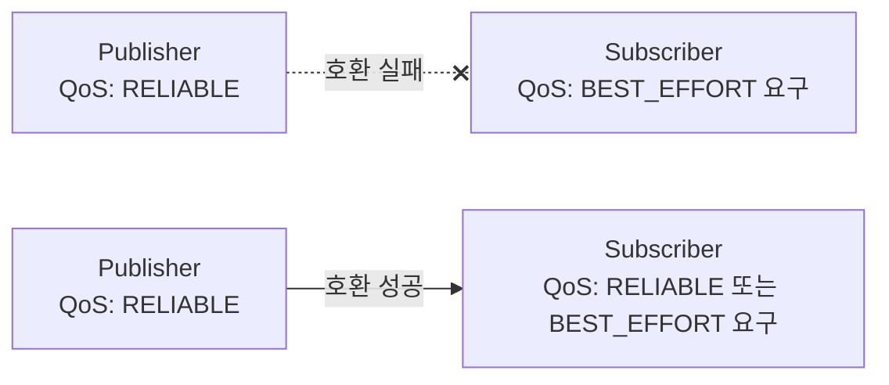

# ROS2 통신 심화 - DDS와 QoS 이해하기

> ROS2 응용 & 센서 연동 시리즈 · 1편
> 선행 학습: ROS2 기초 3편(Topic과 Message), 9편(문제 해결)

## 1. 개요

ROS2 기초 3편에서 "Topic 이름과 타입이 같으면 자동으로 연결된다"고 배웠지만, 실제로는 **QoS(Quality of Service)가 호환되지 않으면 이름·타입이 같아도 연결되지 않는다.** 이 문서는 이 QoS 불일치 문제와, 그 밑바탕인 DDS 통신 원리를 다룬다.

## 2. 핵심 개념

DDS(Data Distribution Service)는 ROS2 노드 간 통신을 실제로 처리하는 표준 미들웨어이며, `ROS_DOMAIN_ID`로 통신 영역을 격리한다. 두 endpoint(Publisher/Subscriber)가 연결되려면 이름·타입이 같아야 할 뿐 아니라 **QoS 프로파일이 호환되어야 한다.** QoS는 "이 통신이 얼마나 신뢰성 있게, 얼마나 최근 데이터를 유지하며 이루어질지"를 정의하는 설정 묶음이다.

| QoS 항목 | 옵션 | 의미 |
|---|---|---|
| **Reliability** | `RELIABLE` / `BEST_EFFORT` | 모든 메시지를 반드시 전달할지, 손실 가능성을 감수하고 빠르게 보낼지 |
| **History** | `KEEP_LAST(N)` / `KEEP_ALL` | 최근 N개만 유지할지, 모두 유지할지 |
| **Durability** | `VOLATILE` / `TRANSIENT_LOCAL` | 새로 연결된 구독자에게 과거 메시지를 줄지 여부 |
| **Deadline** | 시간 값 | 이 시간 안에 메시지가 와야 정상으로 간주 |
| **Liveliness** | `AUTOMATIC` / `MANUAL_BY_TOPIC` | 발행자가 살아있음을 어떻게 증명할지 |



Reliability는 "Publisher가 제공하는 수준이 Subscriber가 요구하는 수준 이상이어야" 연결된다. Publisher가 `BEST_EFFORT`인데 Subscriber가 `RELIABLE`을 요구하면 연결이 실패한다.

## 3. 이 프로젝트에서의 적용

LiDAR·카메라처럼 빠르게 계속 들어오는 센서 데이터는 손실을 좀 감수하더라도(`BEST_EFFORT`) 최신 데이터가 빨리 오는 게 중요하다. 반대로 로봇 제어 명령이나 지도(map) 데이터처럼 "반드시 전달돼야 하는" 데이터는 `RELIABLE`을 쓴다. RViz2에 `/map`이 늦게 구독해도 마지막 지도를 받을 수 있는 것은 `Durability: TRANSIENT_LOCAL` 덕분이다 — 지상로봇 적용의 02(Costmap)에서 다룬 `map_subscribe_transient_local: True` 설정이 바로 이 QoS 항목이다.

## 4. 진단 예시

```bash
# Publisher/Subscriber의 실제 QoS 확인
ros2 topic info /scan --verbose
```

출력에서 Publisher와 Subscriber 각각의 `Reliability`, `Durability` 값을 비교해 불일치가 있는지 확인한다.

## 5. 진단 관점

**Topic은 보이는데 `echo`가 멈추는 경우(QoS 불일치)**: `ros2 topic list`에는 있고 `ros2 topic info`에도 Publisher/Subscriber count가 1 이상인데 `ros2 topic echo`가 데이터를 안 받는다면, `ros2 topic echo`(구독 측)의 기본 QoS와 Publisher의 QoS가 호환되지 않는 것이다. `ros2 topic echo --qos-reliability best_effort <topic>`처럼 echo 자체의 QoS를 Publisher에 맞춰준다.

**같은 네트워크의 다른 로봇/시뮬레이션과 데이터가 섞이는 경우**: `ROS_DOMAIN_ID`가 기본값(0)으로 겹친 것이다. `export ROS_DOMAIN_ID=<고유번호>`로 프로젝트별 영역을 분리한다.

## 6. 다음 문서와의 연결

- 다음: **[[02_센서_연동_RealSense_D435i|센서 연동 - RealSense D435i]]** — 여기서 배운 QoS 진단법이 곧바로 필요해진다. 센서 데이터가 RViz2에 안 보이는 문제의 1순위 원인이 QoS 불일치다.

## 7. 참고자료

- [ROS2 — About Quality of Service settings](https://docs.ros.org/en/humble/Concepts/Intermediate/About-Quality-of-Service-Settings.html) — QoS 프로파일과 호환성 규칙
- [ROS2 — About the Domain ID](https://docs.ros.org/en/humble/Concepts/Intermediate/About-Domain-ID.html) — `ROS_DOMAIN_ID`로 네트워크를 분리하는 방식
