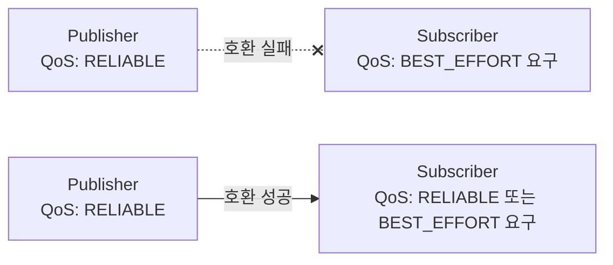

# 01. DDS와 QoS 이해하기

> ROS2 응용 & 센서 연동 시리즈

## 문서 정보

| 항목 | 내용 |
|---|---|
| 학습 단계 | Level 2 — 응용 (하드웨어 연동 직전) |
| 예상 선행 지식 | [[03_Topic과_Message\|ROS2 기초 03. Topic과 Message]], [[09_문제_해결_자주_발생하는_오류_모음\|09. 문제 해결]] |
| 학습 목표 | QoS가 무엇이고 왜 이름·타입이 같아도 연결이 안 될 수 있는지 설명할 수 있다 / Reliability 호환 규칙을 말할 수 있다 / "Topic은 보이는데 echo가 멈추는" 증상을 스스로 진단하고 해결할 수 있다 |
| 기준 환경 | ROS2 Humble (하드웨어 불필요 — 이 문서의 실습은 내장 예제 노드만으로 가능) |
| 관련 문서 | 이전: [[09_문제_해결_자주_발생하는_오류_모음\|ROS2 기초 09]] / 다음: [[02_센서_연동_RealSense_D435i\|응용 02. RealSense D435i]] |

> **이 문서를 왜 센서 연동보다 먼저 읽는가**: 센서를 붙였는데 RViz2에 아무것도 안 나오는 문제의 **1순위 원인이 QoS 불일치**다. 센서 연동 중에 이 문제를 처음 만나면 "센서가 고장났나, 드라이버가 문제인가"로 헤매게 되므로, 하드웨어를 붙이기 전에 이 증상을 **의도적으로 한 번 재현해보는 것**(6장 실습)이 이 문서의 목적이다.

## 1. 개요

ROS2 기초 03에서 "Topic 이름과 타입이 같으면 자동으로 연결된다"고 배웠지만, 실제로는 **QoS(Quality of Service)가 호환되지 않으면 이름·타입이 같아도 연결되지 않는다.** 이 문서는 이 QoS 불일치 문제와, 그 밑바탕인 DDS 통신 원리를 다룬다.

## 2. 핵심 개념

DDS(Data Distribution Service)는 ROS2 노드 간 통신을 실제로 처리하는 표준 미들웨어이며, `ROS_DOMAIN_ID`로 통신 영역을 격리한다. 두 endpoint(Publisher/Subscriber)가 연결되려면 이름·타입이 같아야 할 뿐 아니라 **QoS 프로파일이 호환되어야 한다.** QoS는 "이 통신이 얼마나 신뢰성 있게, 얼마나 최근 데이터를 유지하며 이루어질지"를 정의하는 설정 묶음이다.

| QoS 항목 | 옵션 | 의미 |
|---|---|---|
| **Reliability** | `RELIABLE` / `BEST_EFFORT` | 모든 메시지를 반드시 전달할지, 손실 가능성을 감수하고 빠르게 보낼지 |
| **History** | `KEEP_LAST(N)` / `KEEP_ALL` | 최근 N개만 유지할지, 모두 유지할지 |
| **Durability** | `VOLATILE` / `TRANSIENT_LOCAL` | 새로 연결된 구독자에게 과거 메시지를 줄지 여부 |
| **Deadline** | 시간 값 | 이 시간 안에 메시지가 와야 정상으로 간주 |
| **Liveliness** | `AUTOMATIC` / `MANUAL_BY_TOPIC` | 발행자가 살아있음을 어떻게 증명할지 |



Reliability는 "Publisher가 제공하는 수준이 Subscriber가 요구하는 수준 이상이어야" 연결된다. Publisher가 `BEST_EFFORT`인데 Subscriber가 `RELIABLE`을 요구하면 연결이 실패한다.

## 3. 이 프로젝트에서의 적용

LiDAR·카메라처럼 빠르게 계속 들어오는 센서 데이터는 손실을 좀 감수하더라도(`BEST_EFFORT`) 최신 데이터가 빨리 오는 게 중요하다. 반대로 로봇 제어 명령이나 지도(map) 데이터처럼 "반드시 전달돼야 하는" 데이터는 `RELIABLE`을 쓴다. RViz2에 `/map`이 늦게 구독해도 마지막 지도를 받을 수 있는 것은 `Durability: TRANSIENT_LOCAL` 덕분이다 — 지상로봇 적용의 02(Costmap)에서 다룬 `map_subscribe_transient_local: True` 설정이 바로 이 QoS 항목이다.

## 4. 진단 예시

```bash
# Publisher/Subscriber의 실제 QoS 확인
ros2 topic info /scan --verbose
```

출력에서 Publisher와 Subscriber 각각의 `Reliability`, `Durability` 값을 비교해 불일치가 있는지 확인한다.

## 5. 진단 관점

**Topic은 보이는데 `echo`가 멈추는 경우(QoS 불일치)**: `ros2 topic list`에는 있고 `ros2 topic info`에도 Publisher/Subscriber count가 1 이상인데 `ros2 topic echo`가 데이터를 안 받는다면, `ros2 topic echo`(구독 측)의 기본 QoS와 Publisher의 QoS가 호환되지 않는 것이다. `ros2 topic echo --qos-reliability best_effort <topic>`처럼 echo 자체의 QoS를 Publisher에 맞춰준다.

**같은 네트워크의 다른 로봇/시뮬레이션과 데이터가 섞이는 경우**: `ROS_DOMAIN_ID`가 기본값(0)으로 겹친 것이다. `export ROS_DOMAIN_ID=<고유번호>`로 프로젝트별 영역을 분리한다.

## 6. 실습 — QoS 불일치를 의도적으로 재현하기

센서를 붙이기 전에, **"Topic은 보이는데 데이터가 안 오는" 증상을 직접 만들어본다.** 이 증상을 미리 겪어두면 나중에 센서 연동에서 같은 일이 생겼을 때 원인을 즉시 짚을 수 있다.

### 실습 목표

QoS 불일치가 "오류 메시지 없이 조용히" 연결을 끊는다는 것을 눈으로 확인하고, `--qos-reliability` 옵션으로 해결한다.

### 준비 사항

- ROS2 Humble이 설치된 환경 (**하드웨어 불필요** — 내장 예제 노드만 사용)
- 터미널 3개

### 절차

**터미널 1** — `BEST_EFFORT`로 발행하는 상황을 만든다. ROS2 내장 데모 talker는 기본이 `RELIABLE`이므로, 반대 상황을 만들기 위해 `ros2 topic pub`의 QoS 옵션을 쓴다.

```bash
ros2 topic pub /qos_test std_msgs/msg/String "{data: 'hello'}" --qos-reliability best_effort -r 2
```

**터미널 2** — 기본 QoS(`RELIABLE`)로 구독해본다.

```bash
ros2 topic echo /qos_test
```

**터미널 3** — 토픽이 실제로 존재하는지, 양쪽 QoS가 어떻게 다른지 확인한다.

```bash
ros2 topic list | grep qos_test
ros2 topic info /qos_test --verbose
```

### 예상 결과

- 터미널 3에서 `/qos_test`는 **분명히 목록에 있고**, Publisher count도 1이다.
- 그런데 터미널 2의 `echo`는 **아무것도 출력하지 않는다.** 오류 메시지도 없다 — 이것이 이 증상이 까다로운 이유다.
- 터미널 3의 `--verbose` 출력에서 Publisher는 `Reliability: BEST_EFFORT`, Subscriber(echo)는 `Reliability: RELIABLE`로 서로 다른 것을 확인한다.

### 해결 확인

터미널 2를 멈추고, 구독 측 QoS를 Publisher에 맞춰 다시 실행한다.

```bash
ros2 topic echo /qos_test --qos-reliability best_effort
```

이번에는 `data: hello`가 정상적으로 출력된다. **연결을 막고 있던 것은 이름도 타입도 아닌 QoS 하나였다는 것**이 이 실습의 핵심이다.

> **왜 이 방향으로만 실패하는가**: 2장에서 다룬 대로 "Publisher가 제공하는 수준 ≥ Subscriber가 요구하는 수준"이어야 한다. `BEST_EFFORT` Publisher는 `RELIABLE`을 요구하는 Subscriber를 만족시킬 수 없다. 반대로 `RELIABLE` Publisher는 `BEST_EFFORT` Subscriber도 만족시키므로 연결된다 — 직접 바꿔가며 확인해보면 규칙이 몸에 익는다.

## 7. 다음 문서와의 연결

- 다음: **[[02_센서_연동_RealSense_D435i|응용 02. 센서 연동 - RealSense D435i]]** — 여기서 배운 QoS 진단법이 곧바로 필요해진다. 센서 데이터가 RViz2에 안 보이는 문제의 1순위 원인이 QoS 불일치다.
- 나중에: [[02_비행_컨트롤러_연동|드론 적용 - 02. 비행 컨트롤러 연동]] — PX4의 uXRCE-DDS 토픽은 대부분 `BEST_EFFORT`라, 이 문서의 증상이 드론에서 그대로 재현된다.

## 8. 이해도 점검

1. Topic 이름과 메시지 타입이 완전히 같은데도 Publisher와 Subscriber가 연결되지 않을 수 있는 이유는 무엇인가?
2. Publisher가 `RELIABLE`, Subscriber가 `BEST_EFFORT`를 요구하면 연결되는가? 반대의 경우는?
3. LiDAR 스캔 데이터에 보통 `BEST_EFFORT`를 쓰는 이유는 무엇인가?
4. RViz2를 나중에 켰는데도 이미 발행이 끝난 지도(`/map`)가 화면에 뜨는 것은 어떤 QoS 항목 덕분인가?
5. `ros2 topic list`에는 토픽이 보이는데 `ros2 topic echo`가 아무것도 출력하지 않는다. 가장 먼저 확인할 것은?

> [!info]- 정답 및 해설 보기
> 1. **QoS 프로파일이 호환되지 않기 때문이다.** ROS2에서 연결 성립 조건은 "이름 + 타입 + QoS 호환" 세 가지이며, 앞의 둘만 맞아서는 부족하다.
> 2. **Publisher `RELIABLE` / Subscriber `BEST_EFFORT` → 연결된다.** Publisher가 제공하는 보장 수준이 Subscriber의 요구보다 높기 때문이다. **반대(Publisher `BEST_EFFORT` / Subscriber `RELIABLE`)는 연결되지 않는다** — 요구 수준을 충족시킬 수 없다.
> 3. 센서 데이터는 초당 수십 번 갱신되므로, **한두 프레임 유실보다 최신 데이터가 지연 없이 도착하는 것이 더 중요**하기 때문이다. 재전송을 보장하는 `RELIABLE`은 오히려 지연을 유발할 수 있다.
> 4. **`Durability: TRANSIENT_LOCAL`** 덕분이다. 이 설정이면 Publisher가 마지막 메시지를 보관하고 있다가, 나중에 접속한 Subscriber에게도 전달해준다.
> 5. **QoS 불일치를 가장 먼저 의심한다.** `ros2 topic info <topic> --verbose`로 양쪽의 `Reliability`/`Durability`를 대조하고, `ros2 topic echo <topic> --qos-reliability best_effort`로 구독 측을 맞춰본다. (토픽이 목록에 보인다는 것은 이름·타입 문제는 이미 아니라는 뜻이다.)

## 9. 참고자료

- [ROS2 — About Quality of Service settings](https://docs.ros.org/en/humble/Concepts/Intermediate/About-Quality-of-Service-Settings.html) — QoS 프로파일과 호환성 규칙
- [ROS2 — About the Domain ID](https://docs.ros.org/en/humble/Concepts/Intermediate/About-Domain-ID.html) — `ROS_DOMAIN_ID`로 네트워크를 분리하는 방식
