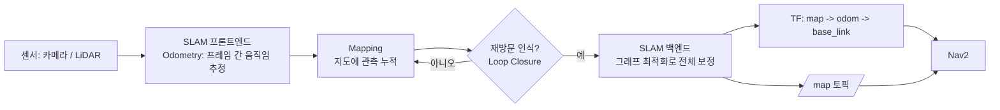

# 00. SLAM이란 무엇이고 왜 쓰는가

> 이 문서를 읽으면 SLAM이 정확히 어떤 문제를 푸는 기술인지, Odometry·Mapping·Loop Closure·Localization이 서로 어떻게 다른지, 그리고 이 시리즈에서 다룰 RTAB-Map/ORB-SLAM3/OpenVINS/VINS-Fusion이 "같은 문제를 푸는 서로 다른 해법들"이라는 것을 이해하게 된다.

## 문서 정보

| 항목 | 내용 |
|---|---|
| 학습 단계 | Level 1 — 입문 |
| 예상 선행 지식 | [[07_TF2_기초\|ROS2 기초 - 07. TF2 기초]](좌표계 개념), [[03_Topic과_Message\|ROS2 통신 - Topic과 Message]] |
| 학습 목표 | SLAM이 무엇인지, 왜 "동시에" 풀어야 하는 문제인지 설명할 수 있다 / Odometry, Mapping, Loop Closure, Localization의 차이를 설명할 수 있다 / SLAM의 프론트엔드-백엔드 구분을 이해한다 / 이후 다룰 여러 SLAM 시스템이 이 문서의 개념 틀 안에서 어떻게 다른 위치에 있는지 감을 잡는다 |
| 기준 환경 | 개념 위주 (특정 라이브러리 설치 전 단계) |
| 관련 문서 | 이전: 없음 (SLAM 공통 기초 시작점) / 다음: [[01_SLAM_백엔드_종류_한눈에_보기\|01. SLAM 백엔드 종류 한눈에 보기]] |

---

## 1. 먼저 알아야 할 핵심

1. **SLAM**은 Simultaneous Localization and Mapping의 약자로, "지도를 만들면서 동시에 그 지도 안에서 내 위치를 찾는" 문제의 이름이다.
2. SLAM은 하나의 알고리즘이 아니라 **문제 자체의 이름**이다. 이 시리즈에서 다룰 RTAB-Map, ORB-SLAM3, OpenVINS, VINS-Fusion은 전부 이 같은 문제를 푸는 **서로 다른 구현체**다 — 목적지는 같지만 가는 길이 다르다.
3. SLAM에는 "닭과 달걀" 같은 근본적인 어려움이 있다. 정확한 지도가 있어야 내 위치를 정확히 알 수 있고, 반대로 내 위치를 정확히 알아야 지도를 정확히 그릴 수 있는데, 로봇은 시작할 때 **둘 다 모른다.**
4. SLAM 시스템은 보통 **프론트엔드**(센서 데이터에서 짧은 구간의 움직임을 뽑아내는 부분)와 **백엔드**(그 움직임들을 모아 전체 지도의 일관성을 맞추는 부분)로 나뉜다. 뒤에 나올 01~04 시리즈가 "SLAM 백엔드 심화"라는 이름을 쓰는 이유가 바로 이 구분에서 나온다.
5. GPS 신호를 받을 수 없는 실내를 돌아다니는 로봇은 "지금 내가 지도의 어디에 있는가"를 스스로 계산해야 한다 — SLAM은 이 문제를 푸는 핵심 기술이며, 이후 배울 Nav2(경로 계획)는 SLAM이 만든 지도와 위치 추정 결과를 전제로만 동작한다.

---

## 2. 이 개념은 무엇인가

SLAM은 **로봇이 미지의 환경을 돌아다니면서, 그 환경의 지도를 만드는 동시에 지도 안에서 자기 자신의 위치를 계속 추정하는 문제**다. "지도 제작"과 "위치 추정"이라는 두 작업이 서로를 필요로 하기 때문에 따로 풀 수 없고, 반드시 함께("Simultaneous") 풀어야 한다는 점이 이름에 그대로 담겨 있다.

**비유로 이해하기**

눈을 가리고 처음 들어온 낯선 건물 안을 손으로 벽을 짚어가며 걷는 상황을 떠올려보자.

- 손끝으로 벽의 질감과 모서리를 느끼고, 발걸음 수를 세면서 "여기서 열 걸음 걸었으니 대략 이 방향으로 이만큼 왔겠다"고 **마음속에 지도를 그려나간다**(Mapping). 이 지도는 처음엔 텅 비어 있다.
- 동시에 "지금 나는 이 마음속 지도에서 대략 어디쯤 서 있다"고 **스스로 위치를 계속 갱신한다**(Localization).
- 한참을 걷다가 아까 만졌던 것과 똑같은 모서리 장식을 다시 만지면, "아, 여기 아까 지나갔던 곳이구나!"라고 깨닫는다(**Loop Closure**, 루프 클로징). 이 순간 그동안 발걸음 수를 세면서 조금씩 쌓였던 오차(예: 실제로는 열 걸음이 아니라 열한 걸음이었다거나)를 한꺼번에 바로잡아, 지금까지 그려온 마음속 지도 전체를 다시 정렬한다.
- 발걸음 수만으로 위치를 추정하는 것 자체는 **Odometry**(오도메트리)에 해당한다 — 바로 직전 걸음에 비해 얼마나 움직였는지만 아는 것이라, 오래 걸을수록 오차가 쌓인다.

**비유가 실제와 다른 부분**

- 사람은 "여기 와봤다"는 것을 순식간에 직관적으로 알아채지만, SLAM 시스템은 카메라·LiDAR 데이터를 수학적으로 비교해 재방문 여부를 판단하는 알고리즘 절차(뒤에 나올 00의 appearance-based loop closure, 01-4의 DBoW2 등)를 거쳐야 한다.
- 사람의 마음속 지도는 대략적이어도 되지만, 로봇의 지도는 이후 Nav2가 장애물 회피 경로를 계산하는 데 그대로 쓰이므로 훨씬 정밀해야 한다.
- 이 비유에서는 한 사람이 걷기·지도 그리기·재인식을 전부 혼자 처리하지만, 실제 SLAM 시스템은 이 역할들이 앞서 말한 프론트엔드/백엔드로 나뉘어 별도 스레드나 모듈로 동시에 돌아가는 경우가 많다(01-1에서 다룰 ORB-SLAM3의 세 스레드 구조가 대표적인 예다).

---

## 3. 왜 필요한가

**SLAM 시스템 관점 (SLAM이 없다면)**

- Odometry(바퀴 회전수나 IMU만으로 추정한 움직임)만 믿고 계속 나아가면, 작은 오차가 시간이 지날수록 누적되어(**드리프트**) 실제 위치와 점점 크게 어긋난다. 몇 분만 지나도 로봇은 자신이 지도의 엉뚱한 곳에 있다고 착각하게 된다.
- 사전에 만들어둔 정확한 지도가 없다면, 로봇은 매번 사람이 원격으로 조종하지 않는 한 "어디로 가야 목적지에 도착하는지" 스스로 계산할 수 없다.
- 재방문을 인식하는 기능(Loop Closure)이 없다면, 드리프트를 바로잡을 방법이 없어 지도가 갈수록 뒤틀린다 — 같은 복도를 두 번 그렸는데 지도상에서는 서로 다른 두 복도로 어긋나 보이는 식이다.

**실제 로봇 관점 (Yahboom X3 기준)**

X3는 실내에서 움직이므로 GPS 신호를 받을 수 없다. RealSense D435i(카메라)와 RPLiDAR C1(라이다)이 주는 원시 데이터만으로는 "지금 내가 지도의 어디에 있는지" 알 수 없다 — SLAM이 이 원시 센서 데이터를 지도와 위치 추정치로 바꿔주는 계층이다. 이후 배울 Nav2의 모든 기능(경로 계획, 장애물 회피, 목적지까지 이동)은 SLAM이 만들어낸 `map` 좌표계와 그 안에서의 로봇 위치가 정확하다는 전제 위에서만 동작한다 — 즉 SLAM은 이 프로젝트 전체의 지반에 해당한다.

---

## 4. ROS2 시스템에서의 위치

**그림 읽는 방법**

- 왼쪽의 센서 데이터가 SLAM 시스템(프론트엔드+백엔드)을 거쳐, 오른쪽의 Nav2가 그대로 가져다 쓸 수 있는 형태(TF, `/map` 토픽)로 바뀌는 흐름이다.
- 프론트엔드(Odometry, Mapping)는 매 프레임 계속 도는 반면, 백엔드(그래프 최적화)는 Loop Closure가 발견될 때만 무겁게 개입해 전체를 재조정한다 — 이 "평소엔 가볍게, 필요할 때만 무겁게" 구조가 실시간 SLAM이 가능한 이유다.
- 이 그림은 RTAB-Map, ORB-SLAM3 등 특정 라이브러리에 국한되지 않은 **일반적인 SLAM 파이프라인**이다. 이후 00(RTAB-Map)과 01(ORB-SLAM3) 등에서 이 그림의 각 상자가 실제로 어떻게 구현되어 있는지 구체화된다.

---

## 5. 주요 구성 요소

| 구성 요소 | 역할 | 초보자가 기억할 점 |
|---|---|---|
| Odometry(오도메트리) | 바로 직전 프레임 대비 상대적인 움직임을 추정 | 짧은 구간은 정확하지만 시간이 지날수록 오차가 누적(드리프트)된다 |
| Mapping(지도 작성) | 지금까지의 관측을 하나의 지도로 축적 | Odometry 위에 계속 데이터를 쌓아가는 과정 |
| Localization(위치 추정) | 이미 있는 지도 안에서 현재 위치를 찾는 것 | Mapping과 짝을 이루지만, 지도를 "새로 만들지는" 않는다는 점이 다름 |
| Loop Closure(루프 클로징) | 예전에 지나간 곳을 다시 인식해 드리프트를 바로잡음 | SLAM이 "단순 Odometry 누적"보다 훨씬 정확할 수 있는 핵심 이유 |
| 프론트엔드(Front-end) | 센서 데이터 처리, 프레임 간 매칭 — Odometry/Mapping 담당 | 매 프레임 실시간으로 계속 실행됨 |
| 백엔드(Back-end) | 쌓인 제약(Odometry+Loop Closure)을 놓고 전체 지도를 최적화 | Loop Closure가 성공했을 때만 무겁게 개입 |
| Pose Graph(포즈 그래프) | 로봇이 지나온 위치들(노드)과 그 사이의 상대 변환(엣지)으로 지도를 표현하는 구조 | 많은 SLAM 백엔드가 내부적으로 이 형태를 최적화 대상으로 삼음 |

---

## 6. 기본 동작 과정

1. **센서 입력**: 카메라 또는 LiDAR가 매 프레임 원시 데이터를 SLAM 시스템에 전달한다.
2. **Odometry 추정(프론트엔드)**: 직전 프레임과 비교해 로봇이 얼마나 움직였는지 추정한다.
3. **지도 누적(Mapping)**: 추정된 움직임을 바탕으로 새 관측을 지도에 추가한다.
4. **재방문 탐색**: 새로 들어온 관측이 예전에 이미 지도에 기록된 곳과 일치하는지 주기적으로 확인한다(Loop Closure 후보 탐색).
5. **전역 보정(백엔드)**: 재방문이 확인되면, 그 지점까지 누적된 모든 위치·지도 정보를 한꺼번에 재조정해 드리프트를 편다.
6. **결과 제공**: 최신 지도와 로봇 위치를 TF(`map`)와 지도 토픽 형태로 상위 시스템(Nav2 등)에 제공한다.

---

## 7. 기본 실습

이 문서는 개념 이해가 목적이므로, 설치 없이 **SLAM이 실제로 만들어내는 결과물의 형태**를 눈으로 확인하는 실습으로 진행한다. 직접 로봇을 움직여 지도를 만드는 실습은 지상로봇 적용의 00부터 다룬다.

### 실습 목표

SLAM의 결과물이 "점들의 모임(지도)"과 "그 안의 한 점(현재 위치)"이라는 두 가지로 이루어진다는 것을 실제 화면으로 확인한다.

### 준비 사항

* 인터넷이 연결된 브라우저

### 확인

1. [RTAB-Map 공식 사이트](https://introlab.github.io/rtabmap/)에 접속해 데모 지도(3D 포인트클라우드) 스크린샷이나 영상을 확인한다.
2. 화면에 표시되는 색색의 점들이 이 문서에서 배운 "Mapping"의 결과물이고, 그 위에 표시되는 로봇/카메라의 궤적선이 "Odometry + Loop Closure로 보정된 위치 추정 결과"라는 것을 서로 연결해서 살펴본다.

### 예상 결과

지도가 매끈하게 이어져 있고 같은 복도나 방이 두 번 겹쳐 그려지지 않았다면, Loop Closure가 정상적으로 드리프트를 보정했다는 뜻이다. 반대로 같은 공간이 두 개로 어긋나 보인다면 이 시리즈 뒷부분(02. 매핑 품질 진단)에서 다룰 "Loop Closure 실패" 상황의 시각적 예시가 된다.

---

## 8. 코드 및 설정 해설

이 문서는 아직 실행 코드나 설정 파일을 다루지 않는다. 특정 SLAM 라이브러리의 실제 설정과 코드 수준의 내용은 지상로봇 적용의 00(RTAB-Map 매핑 원리)과 이후 SLAM 백엔드 심화 시리즈(01. ORB-SLAM3 등)에서 본격적으로 다룬다.

---

## 9. 자주 사용하는 명령어

| 목적 | 명령어 | 설명 |
|---|---|---|
| SLAM이 발행하는 지도 확인 | `ros2 topic echo /map` | SLAM 시스템이 실제로 지도 데이터를 내고 있는지 확인할 때 사용(다음 문서부터 실습) |
| map→odom 변환 확인 | `ros2 run tf2_ros tf2_echo map odom` | SLAM 백엔드가 만들어내는 보정값(Loop Closure로 인한 map→odom TF)을 직접 확인할 때 사용 |
| 지도 시각화 | `ros2 run rviz2 rviz2` | Map, TF 표시 항목을 추가해 지도와 위치 추정 결과를 눈으로 확인할 때 사용 |

---

## 10. 자주 발생하는 문제

### 문제(오해): "SLAM이 있으면 GPS처럼 정확한 절대 좌표를 알 수 있다"

**증상**

SLAM을 쓰면 위치가 항상 정답처럼 정확할 것이라고 기대한다.

**가능한 원인**

1. SLAM이 만드는 지도와 위치는 로봇이 **직접 만든 상대적인 기준**(자신이 시작한 지점을 원점으로 하는 지도)일 뿐, GPS 위경도 같은 절대 좌표와는 무관하다는 것을 모름
2. Loop Closure가 일어나기 전까지는 Odometry 오차가 계속 누적된다는 것을 모름

**해결 방법**

SLAM이 만드는 `map` 좌표계는 "이 로봇이 처음 켜진 곳"을 기준으로 하는 상대적인 지도이며, 정확도는 Odometry 품질과 Loop Closure 성공 여부에 좌우된다는 점을 이해한다. 이는 지상로봇 적용의 00에서 실제 파라미터와 함께 구체화된다.

### 문제(오해): "Odometry와 SLAM은 같은 것이다"

**증상**

Odometry만 쓰고 있으면서 "SLAM을 쓰고 있다"고 착각한다.

**가능한 원인**

Odometry가 SLAM의 일부(프론트엔드)라는 것은 맞지만, Loop Closure와 전역 최적화(백엔드)가 빠지면 드리프트를 바로잡을 방법이 없어 SLAM이라고 부르기 어렵다.

**해결 방법**

"지금 쓰는 시스템이 재방문을 인식해 드리프트를 보정하는 기능이 있는가"를 기준으로 Odometry 단독 시스템과 SLAM을 구분한다.

---

## 11. 개념 간 연결

* 이 문서에서 배운 `map`(SLAM이 만드는 전역 좌표계)과 `odom`(Odometry가 추정하는 국소 좌표계)의 구분은, `ROS2 기초 - 07. TF2 기초`에서 배운 좌표계 트리 개념을 그대로 확장한 것이다 — TF2 문서에서 다룬 `map → odom → base_link` 트리가 바로 이 문서의 결과물이다.
* 지상로봇 적용의 00은 이 문서에서 다룬 일반 SLAM 개념이 **RTAB-Map**이라는 구체적인 구현체에서 어떻게 현실화되는지(WM/STM/LTM 메모리 관리 등) 다룬다.
* 이후 SLAM 백엔드 시리즈(01. ORB-SLAM3, 02. OpenVINS, 03. VINS-Fusion)는 이 문서의 프론트엔드/백엔드 구분, Loop Closure 개념을 전제로, 각 시스템이 이 문제를 서로 다른 알고리즘(그래프 기반 vs 필터 기반 vs 최적화 기반)으로 어떻게 다르게 푸는지 비교한다.

---

## 12. 한 단계 더 깊게 보기

> **심화 학습**
>
> 이 부분은 기본 개념을 이해한 후 읽는 것을 권장한다.

**SLAM을 푸는 두 가지 큰 계열**

이 시리즈 전체에서 다룰 여러 SLAM 백엔드는 크게 두 계열로 나뉜다.

| 계열 | 방식 | 이 시리즈에서 다룰 예시 |
|---|---|---|
| 필터 기반(Filter-based) | 매 순간 상태(위치, 속도 등)의 확률분포를 갱신 — 과거 데이터를 다시 들여다보지 않음 | OpenVINS(MSCKF, 02 시리즈) |
| 최적화 기반(Optimization-based) | 지금까지 쌓인 관측 전체를 놓고 오차가 최소가 되는 지도를 한꺼번에(또는 구간별로) 계산 | RTAB-Map·ORB-SLAM3(그래프/Bundle Adjustment, 00·01 시리즈), VINS-Fusion(슬라이딩 윈도우 최적화, 03 시리즈) |

일반적으로 필터 기반은 계산이 가볍고 빠른 대신 과거 정보를 다시 활용하기 어렵고, 최적화 기반은 더 정확할 잠재력이 있는 대신 계산 비용이 크다는 트레이드오프가 있다 — 이 트레이드오프가 뒤에 나올 04(세 시스템 종합 비교)의 CPU/정확도 비교표의 근본 배경이다.

---

## 13. 핵심 요약

1. SLAM은 지도 작성(Mapping)과 위치 추정(Localization)을 동시에 푸는 문제이며, 하나의 특정 알고리즘이 아니라 문제 자체의 이름이다.
2. Odometry는 프레임 간 상대적 움직임 추정으로, 시간이 지날수록 오차가 누적(드리프트)된다.
3. Loop Closure(재방문 인식)가 이 드리프트를 바로잡는 핵심 메커니즘이며, SLAM 백엔드(그래프 최적화)가 이를 전체 지도에 반영한다.
4. SLAM 시스템은 보통 프론트엔드(Odometry/Mapping)와 백엔드(전역 최적화)로 나뉘며, 이 구분이 뒤에 나올 SLAM 백엔드 심화 시리즈의 이름의 근거다.
5. RTAB-Map, ORB-SLAM3, OpenVINS, VINS-Fusion은 전부 SLAM이라는 같은 문제를 푸는 서로 다른 구현체이며, 필터 기반 vs 최적화 기반이라는 큰 계열 차이를 갖는다.

---

## 14. 이해도 점검

1. SLAM이라는 이름에서 "Simultaneous(동시에)"가 강조되는 이유는 무엇인가?
2. Odometry만으로는 왜 시간이 지날수록 위치 추정이 부정확해지는가?
3. Loop Closure는 정확히 무엇을 하는 메커니즘인가?
4. SLAM의 프론트엔드와 백엔드는 각각 무엇을 담당하며, 왜 실행 빈도가 다른가?
5. RTAB-Map, ORB-SLAM3, OpenVINS, VINS-Fusion을 한 문장으로 비교하면 어떻게 설명할 수 있는가?

> [!info]- 정답 및 해설 보기
> 1. 정확한 지도가 있어야 위치를 알 수 있고, 정확한 위치를 알아야 지도를 그릴 수 있는 상호 의존 관계라서, 둘 중 하나만 먼저 풀 수 없고 함께 풀어야 하기 때문이다.
> 2. Odometry는 바로 직전 프레임 대비 상대적인 움직임만 추정하므로, 매 순간의 작은 오차가 시간이 지날수록 계속 누적(드리프트)되기 때문이다.
> 3. 로봇이 예전에 이미 지나간 곳을 다시 인식해, 그 사이 누적된 Odometry 오차를 한꺼번에 바로잡아 지도 전체를 재정렬하는 메커니즘이다.
> 4. 프론트엔드는 센서 데이터 처리와 프레임 간 매칭(Odometry, Mapping)을 담당해 매 프레임 실시간으로 실행되고, 백엔드는 Loop Closure가 성공했을 때만 전체 지도를 재조정하는 무거운 최적화를 수행하므로 그때만 개입한다.
> 5. 넷 다 "지도를 만들면서 동시에 위치를 추정한다"는 같은 SLAM 문제를 풀지만, RTAB-Map·ORB-SLAM3는 그래프/Bundle Adjustment 기반 최적화 계열, OpenVINS는 필터(MSCKF) 기반, VINS-Fusion은 슬라이딩 윈도우 최적화 기반으로 서로 다른 알고리즘 계열에 속한다.

---

## 15. 다음 학습 주제

1. **바로 다음**: [[01_SLAM_백엔드_종류_한눈에_보기|01. SLAM 백엔드 종류 한눈에 보기]] — 지상로봇/드론 적용으로 갈라지기 전에, SLAM 백엔드를 구분하는 축을 가볍게 정리한다.
2. **함께 보면 좋은 주제**: [[07_TF2_기초|ROS2 기초 - 07. TF2 기초]] — `map`/`odom`/`base_link` 좌표계 트리를 복습하면 이 문서의 4장 그림이 더 명확해진다.
3. **나중에 학습할 심화 주제**: [[01-1_ORB-SLAM3_시스템_개요|SLAM 백엔드 심화 - 01-1. ORB-SLAM3 시스템 개요]] — 이 문서에서 예고한 "필터 기반 vs 최적화 기반" 구분이 실제 시스템 비교로 이어진다.

---

## 16. 참고자료

| 구분 | 자료 | 핵심 내용 |
|---|---|---|
| 서베이 논문 | Cadena et al., "Past, Present, and Future of Simultaneous Localization and Mapping: Toward the Robust-Perception Age," IEEE T-RO, 2016 ([arXiv:1606.05830](https://arxiv.org/abs/1606.05830)) | SLAM 문제의 정의, 프론트엔드/백엔드 구분, 필터 기반·최적화 기반 계열 정리 |
| 표준 문서 | [REP105](https://www.ros.org/reps/rep-0105.html) | `map`/`odom`/`base_link` 좌표계 규약 — 이 문서 4장의 TF 구조가 따르는 표준 |
| 공식 사이트 | [RTAB-Map 공식 사이트](https://introlab.github.io/rtabmap/) | 실습에서 살펴본 SLAM 결과물(포인트클라우드 지도) 예시 확인 |
