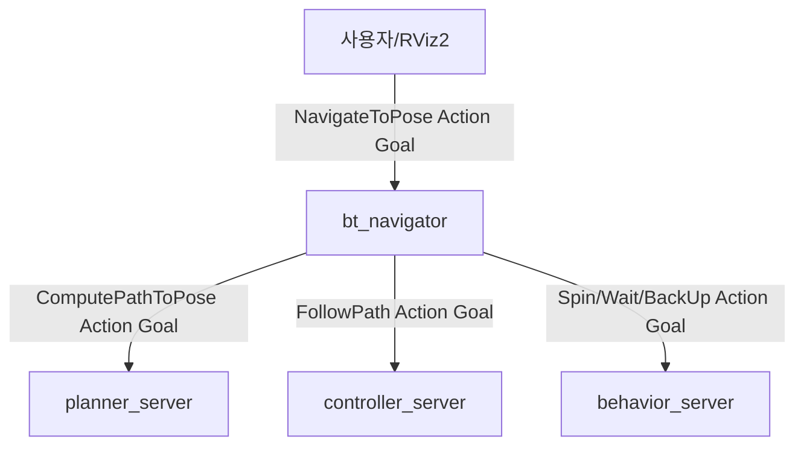

# 00-1. Nav2 Action 기반 경로 이동 구조

> 지상로봇 적용 — Nav2 내비게이션 시리즈 · 보충
> 이전 문서: [[05_Behavior_Tree와_표준_Recovery|05. Behavior Tree와 표준 Recovery]]
> 선행 학습: ROS2 기초 04(Service와 Action)

## 1. 개요

ROS2 기초 04에서 Action을 "목표 전달 → Feedback 반복 → Result 1회"의 통신 방식으로 배웠다. 이 문서는 그 개념이 Nav2 내부에서 `ComputePathToPose`, `FollowPath`, `NavigateToPose` 같은 **실제 Action 서버/클라이언트 쌍**으로 어떻게 구현되어 있는지 정리한다.

## 2. 핵심 개념: Nav2의 Action 계층 구조

Nav2는 하나의 목표(goal pose)를 처리하기 위해 **Action이 여러 겹으로 중첩된 구조**를 쓴다.

- 최상위: 사용자가 RViz2의 "2D Goal Pose"나 코드에서 보내는 것은 `NavigateToPose` Action이다. 이 Action의 서버가 `bt_navigator`다.
- `bt_navigator`는 목표를 받으면, **자기 자신이 다시 Action Client가 되어** Behavior Tree 안에서 `ComputePathToPose`(planner_server가 서버), `FollowPath`(controller_server가 서버)를 순서대로 호출한다.
- 05에서 다룬 Spin/Wait/BackUp도 마찬가지로 각각 독립된 Action이며, `behavior_server`가 이들의 서버 역할을 한다.

즉 ROS2 기초 04에서 배운 "하나의 Action Client-Server 쌍"이 Nav2에서는 **여러 겹으로 중첩되어, 하나의 노드가 상위 계층에 대해서는 Server이면서 동시에 하위 계층에 대해서는 Client인 중간자**로 동작한다. 예를 들어 `bt_navigator`는 사용자의 목표 요청에 대해서는 Server이지만, `planner_server`·`controller_server`에 대해서는 Client다.

## 3. 이 프로젝트에서의 적용 (Yahboom X3)

- RViz2의 "2D Goal Pose" 버튼을 누르는 것은 실제로는 `/navigate_to_pose` Action에 Goal을 보내는 것과 같다. `ros2 action list`로 확인하면 `/navigate_to_pose`, `/compute_path_to_pose`, `/follow_path`, `/spin`, `/backup`, `/wait` 등이 모두 별도의 Action으로 목록에 나타난다.
- 00에서 다룬 "Nav2가 여러 서버로 나뉜 구조"는 이 문서 관점에서 보면 **각 서버가 하나 이상의 Action 서버를 제공하는 구조**라고 다시 설명할 수 있다.
- Feedback의 실전 예: `NavigateToPose`의 Feedback에는 "남은 거리", "예상 도착 시간" 같은 정보가 담겨 있어, RViz2의 Nav2 패널이 이 Feedback을 구독해 진행 상황을 표시한다.

## 4. 관련 파라미터/명령어

| 명령어 | 역할 |
|---|---|
| `ros2 action list` | Nav2가 제공하는 모든 Action 확인(`/navigate_to_pose` 등) |
| `ros2 action send_goal /navigate_to_pose nav2_msgs/action/NavigateToPose "{pose: {...}}" --feedback` | 코드 없이 CLI로 목표를 보내고 Feedback을 직접 관찰(ROS2 기초 04 실습과 동일한 방식) |
| `ros2 action info /navigate_to_pose` | 현재 이 Action에 연결된 Client/Server 개수 확인 |

## 5. 진단 관점

- 목표를 보냈는데 반응이 없다면, ROS2 기초 04에서 배운 것처럼 `ros2 action list`로 `/navigate_to_pose` 서버(`bt_navigator`)가 실제로 떠 있는지부터 확인한다 — 00에서 다룬 "핵심 서버 노드 존재 확인"과 같은 진단이지만, 이번엔 노드가 아니라 Action 관점에서 접근하는 것이다.
- 경로 계획만 실패하는지, 경로 추종만 실패하는지 구분하려면 `/compute_path_to_pose`와 `/follow_path`를 각각 개별 Action으로 테스트해볼 수 있다 — 이는 03(Global Planner)와 04(Controller)의 문제를 구분하는 실전 진단 수단이다.

## 6. 다음 문서와의 연결

- 이 문서는 05 바로 다음 보충 자료이며, 이후 흐름(06, 07, Relocalization 심화)은 기존과 동일하게 이어진다.

## 7. 참고자료

- [[04_Service와_Action|ROS2 기초 04. Service와 Action]] — Goal/Feedback/Result 기본 구조
- [`nav2_msgs/action` 정의(GitHub)](https://github.com/ros-navigation/navigation2/tree/main/nav2_msgs/action) — Action 정의(`NavigateToPose`, `ComputePathToPose`, `FollowPath`, `Spin`, `BackUp`, `Wait`)
