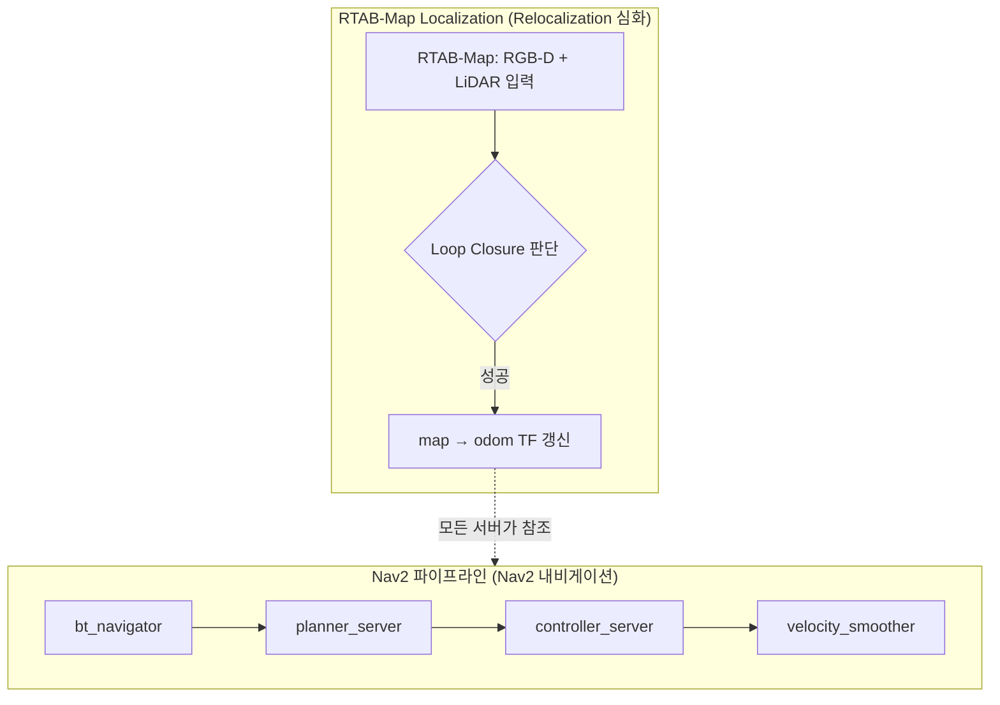

# 07. Relocalization은 Nav2 파이프라인의 어디에 위치하는가

> 지상로봇 적용 — Nav2 내비게이션 시리즈 (마지막 문서)
> 이전 문서: [[06_Waypoint_Follower_Velocity_Smoother|06. Waypoint Follower & Velocity Smoother]]

## 1. 개요

Nav2 내비게이션에서 다룬 bt_navigator, planner, controller, costmap, recovery는 전부 **`map→odom→base_footprint` TF가 항상 정확하다는 전제 위에서** 동작한다. 이 문서는 Nav2 내비게이션 전체를 마무리하며, "그 전제를 실제로 채워주는 것이 무엇인가"를 짚고 Relocalization 심화로 넘어가는 다리 역할을 한다.

## 2. 핵심 개념: Nav2 파이프라인과 분리된 별도 계층

Nav2 서버들은 이 그림에서 `TF` 박스가 어떻게 만들어지는지 전혀 모른다. `bt_navigator`도, `planner_server`도, `controller_server`도 그냥 "지금 map 기준으로 로봇이 어디 있는지"만 TF에서 읽어갈 뿐이다. **relocalization은 Nav2 파이프라인 "안"이 아니라 "옆"에서 독립적으로 일어나는 일**이다.

05에서 다룬 표준 Recovery(Spin/Wait/BackUp/Costmap Clear)는 이 왼쪽 Nav2 박스 안의 실패에 대한 대응이지, 오른쪽 Loc 박스의 문제(위치가 실제로 틀렸다는 것)를 고치는 동작이 아니다. 다만 이 프로젝트는 Spin 같은 Nav2 표준 동작을 **의도적으로 재활용해서** RTAB-Map이 재매칭할 시간을 벌어주는 전략을 쓴다 — 이것이 Relocalization 심화에서 다루는 "긴급 relocalization"의 실체다.

## 3. 이 프로젝트에서의 적용 (Yahboom X3)

지금까지 지도제작, B에서 다룬 내용을 relocalization 관점으로 다시 연결하면:

- 지도제작 00~02(지도제작): RTAB-Map DB가 정확할수록, 이후 로컬라이제이션 모드에서 재매칭할 "기준"이 튼튼해진다. 지도 품질이 relocalization 안정성의 전제 조건이다.
- 01(좌표계): `Mem/IncrementalMemory=false`로 로컬라이제이션 모드에 들어가야 RTAB-Map이 "새 지도를 만드는 것"이 아니라 "기존 지도에서 내 위치를 찾는 것"으로 동작한다.
- 02(Costmap): relocalization 중 `map→odom`이 순간적으로 크게 바뀌면 costmap 장애물 위치가 왜곡되어 급제동이 걸릴 수 있다(Relocalization 심화에서 자세히).
- 05(Recovery): Spin recovery가 Nav2 표준 기능이면서 동시에 이 프로젝트의 relocalization 전략의 실행 수단이 된다는 이중적 위치를 이해해야 한다.

## 4. 관련 파라미터 (Relocalization 심화 예고)

| 파라미터 | 소속 | Relocalization 심화에서 다룰 역할 |
|---|---|---|
| `Mem/IncrementalMemory` | RTAB-Map | 매핑/로컬라이제이션 모드 스위치 |
| `RGBD/SavedLocalizationIgnored` | RTAB-Map | 강제 relocalization 트리거 |
| `RGBD/OptimizeMaxError` | RTAB-Map | 잘못된(false positive) loop closure 거부 임계값 |
| `RGBD/OptimizeFromGraphEnd` | RTAB-Map | Pose Jump를 로봇이 아닌 지도 쪽으로 흡수시키는 대안 |
| `progress_checker.movement_time_allowance` | Nav2 | localization 흔들림으로 인한 recovery 남발을 줄이는 여유 |

## 5. 진단 관점

로봇 동작이 이상할 때, 이것이 **Nav2 내비게이션(Nav2 파이프라인) 문제인지 Relocalization 심화(RTAB-Map localization) 문제인지**부터 나누는 것이 가장 중요한 첫 진단 단계다.

- 로봇이 경로를 못 찾거나, 장애물 앞에서 계속 멈춘다 → Nav2 내비게이션 관련(costmap, planner, controller)
- 지도 위에서 로봇 아이콘이 갑자기 다른 곳으로 튄다, 방향이 순간적으로 90도씩 바뀐다 → Relocalization 심화 관련(localization jump)
- 두 증상이 같이 나타난다 → 대개 후자(Relocalization 심화)가 원인이고 전자는 그 결과다. `map→odom` TF의 연속성부터 확인한다.

## 6. 다음 문서와의 연결

- Nav2 내비게이션이 여기서 끝나고, **Relocalization 심화**가 시작된다.
- 다음 문서: **[[00_개요와_학술적_정의|지상로봇 적용 - Relocalization 심화 - 00. 개요와 학술적 정의]]** — relocalization을 "Kidnapped Robot Problem"이라는 학술적 틀로 다시 정의하고, 이 프로젝트의 5단계 트리거 분류가 그 틀의 어디에 해당하는지 정리한다.

## 7. 참고자료

- [Nav2 — Navigation Servers](https://docs.nav2.org/jazzy/getting_started/navigation_concepts/navigation_servers/) — 각 서버가 TF만 참조하고 독립 동작하는 구조
- [REP105](https://www.ros.org/reps/rep-0105.html) — `map`/`odom` 좌표계 규약과 relocalization 시 발생하는 discontinuity(불연속) 정의

> **문서 버전 주의**: `docs.nav2.org`는 Humble 버전 문서를 더 이상 호스팅하지 않아 위 링크는 Jazzy 기준이다. 개념과 대부분의 파라미터는 동일하지만, 플러그인 목록과 일부 기본값은 Humble과 다를 수 있으므로 실제 설정 시 `ros2 param list`로 대조한다.
