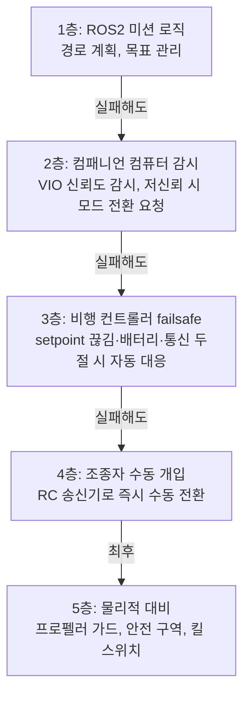

# E5. 안전과 실전 고려사항

> 드론 적용 시리즈 · E5 (마지막 문서)
> 이전 문서: [[E4-1_VIO_vs_LiDAR-Inertial_SLAM_비교|E4-1. VIO vs LiDAR-Inertial SLAM 비교]]

## 1. 개요

지상로봇과 드론의 가장 큰 차이는 기술이 아니라 **실패의 대가**다. X3는 잘못 움직이면 벽에 부딪히고 멈추지만, 드론은 떨어진다. 이 문서는 E1~E4에서 다룬 기술 요소들이 **안전 설계와 어떻게 연결되는지**, 그리고 실기체 비행 전에 무엇을 갖춰야 하는지 정리한다.

## 2. 핵심 개념: 안전은 계층으로 설계한다

드론의 안전은 하나의 장치가 아니라 **여러 겹의 독립적인 방어선**으로 구성된다. 위쪽이 실패해도 아래쪽이 받쳐주는 구조다.

**핵심 원칙**: 위쪽 계층일수록 똑똑하지만 신뢰도가 낮고, 아래쪽일수록 단순하지만 확실하다. **ROS2에서 만드는 모든 것은 1~2층에 속하며, 3층 이하가 반드시 독립적으로 살아 있어야 한다.**

E2에서 다룬 "컴패니언 컴퓨터가 죽어도 FC가 드론을 지킨다"는 구조가 바로 이 계층 분리의 실현이다.

## 3. 핵심 개념: 상태 추정 실패를 안전 동작으로 잇기

E4에서 반복해 지적한 문제 — **"VIO가 조용히 실패하면 위험하다"** — 를 실제 설계로 옮기면 다음과 같다.

### 3.1 신뢰도 감시 → 모드 전환

| VIO 상태 | 적절한 대응 |
|---|---|
| 정상 | 위치 제어 모드(Position/Offboard) 유지 |
| 신뢰도 저하(inlier 급감, 공분산 증가) | **속도를 낮추고** 경로 재계획, 경고 발생 |
| 위치 추정 실패 | **위치 제어 포기 → 자세 제어(Altitude/Stabilized) 모드로 전환.** 고도만 유지하며 제자리에 머무름 |
| 완전 상실 + 조종자 없음 | 착륙(Land) 또는 귀환(RTL) |

**중요**: 위치를 모르는 상태에서 위치 제어 모드를 유지하면 **드론이 엉뚱한 방향으로 가속한다.** "모르면 멈춘다"가 아니라 "모르면 **위치 제어를 포기한다**"가 올바른 대응이다.

### 3.2 C7 감시 노드의 드론 버전

Part C에서 만든 relocalization 감시 노드(C7)와 발상이 같지만, **출력이 다르다.**

| | X3(C7) | 드론 |
|---|---|---|
| 감시 대상 | `/rtabmap/info`의 inlier 수 | VIO 신뢰도 지표(inlier, 공분산, 이동량) |
| 판단 결과 | Spin recovery 액션 호출 | **비행 모드 전환 요청** |
| 실패 시 결과 | 로봇이 헤맴 | **추락 위험** |

즉 C7에서 배운 "감시 로직을 직접 만들어야 한다"는 교훈이 드론에서는 **선택이 아니라 안전 요구사항**이 된다.

## 4. 핵심 개념: 시뮬레이션 우선 원칙

지상로봇에서는 "일단 돌려보고 고치는" 반복이 가능했지만, 드론에서는 그 비용이 기체 파손·부상·법적 책임으로 돌아온다.

**권장 검증 순서**

1. **SITL(Software In The Loop)** — PX4를 PC에서 소프트웨어로만 실행하고 Gazebo로 시뮬레이션. E2의 uXRCE-DDS 연결, E3의 경로 계획, 3.1절의 모드 전환 로직을 전부 여기서 먼저 검증한다.
2. **HITL(Hardware In The Loop)** — 실제 FC 하드웨어를 쓰되 모터는 돌리지 않고 시뮬레이터와 연결. 실제 하드웨어의 타이밍·성능 특성을 확인한다.
3. **테더링/프로펠러 제거 벤치 테스트** — 기체를 고정하거나 프로펠러를 뺀 상태로 센서·VIO·통신을 실기체에서 확인한다.
4. **실내 저고도 유선 비행** — 안전줄을 걸고 낮은 고도에서 짧게.
5. **정상 비행**

**대부분의 소프트웨어 버그는 1단계에서 잡을 수 있다.** X3에서 겪은 "launch 파일 주석 처리로 노드가 안 떴다"(응용 5편) 같은 문제가 드론에서 발생하면 이륙 후에 알게 되는데, SITL에서는 무해하게 발견된다.

## 5. 실전 체크리스트

### 5.1 비행 전 (매번)

- [ ] 배터리 전압 확인, failsafe 임계값 설정 확인
- [ ] 프로펠러 장착 방향·조임 상태
- [ ] RC 송신기 연결 및 **수동 전환(킬 스위치) 동작 확인** — 이것이 4층 방어선
- [ ] `ros2 topic hz`로 VIO 출력 주기 확인(E1 3.3절, 30Hz 이상)
- [ ] TF 트리 확인 — `map → odom → base_link` 연결 및 z 부호(E1 2.2절)
- [ ] Offboard setpoint 스트림이 안정적으로 나가는지(E2 4절)
- [ ] 안전 구역/지오펜스 설정, 주변에 사람 없음

### 5.2 시스템 구성 시 (1회)

- [ ] FC failsafe 동작 설정: setpoint 두절, RC 두절, 배터리 저전압, 지오펜스 이탈 각각에 대해
- [ ] 컴패니언 컴퓨터 CPU 예산 확인 — VIO + 3D 지도 + 3D 계획 합계(E3 6장, D4 5장)
- [ ] IMU 캘리브레이션(`rs-imu-calibration` 등, E4 6장 2순위)
- [ ] 카메라-IMU 외부 파라미터(extrinsic) 캘리브레이션 — VIO 정확도에 직결
- [ ] 시간 동기화 — FC와 컴패니언 컴퓨터의 타임스탬프 정합(E1 3.3절 `EKF2_EV_DELAY`)

### 5.3 법·제도

드론은 지상로봇과 달리 **비행 자체가 규제 대상**이다. 기체 무게에 따른 신고·자격 요건, 비행 금지 구역, 야간·가시권 밖 비행 제한 등은 국가·지역마다 다르므로, **실외 비행 전에 해당 지역의 현행 규정을 반드시 직접 확인해야 한다.** 실내 비행은 상대적으로 자유롭지만 안전 책임은 동일하다.

## 6. 진단 관점

- **"시뮬레이션에서는 됐는데 실기체에서 안 된다"** → 대부분 타이밍 문제다. SITL은 CPU가 여유롭지만 Jetson은 그렇지 않다 — setpoint 발행이 밀려 failsafe가 걸리는 경우가 가장 흔하다(E2 7장).
- **"이륙 직후 드론이 한쪽으로 흐른다"** → VIO 초기화가 덜 된 상태에서 위치 제어에 들어갔을 가능성. 초기화 완료 신호를 확인한 뒤 Offboard로 전환하는 순서를 강제해야 한다.
- **"로그를 봐도 왜 failsafe가 걸렸는지 모르겠다"** → FC 자체 로그(PX4의 ulog)를 확인한다. ROS2 쪽 로그만으로는 FC 내부 판단을 알 수 없다 — 두 로그를 시간축으로 맞춰 보는 습관이 필요하다.

## 7. 다음 학습 주제

- E 시리즈(E0~E5)는 여기서 마무리된다. 이것으로 지상로봇 적용 → 드론 적용까지의 흐름이 끝난다.
- **바로 다음(정규 순서)**: [[D0-1_D_시리즈를_위한_최소_수학|SLAM 백엔드 심화 (Part D)]] — 지금까지 지상로봇·드론 양쪽에서 실전 관점으로 다룬 SLAM 백엔드들을 이제 논문·수식 수준까지 깊게 파고든다.
- **실제 도입 시 다음 단계**: E4 6장의 우선순위 표대로 ① stereo-inertial 구성 확정 → ② IMU 캘리브레이션 → ③ SITL에서 전 파이프라인 검증 → ④ 단계적 실기체 검증 순으로 진행하는 것을 권한다.
- 향후 실기체 실측 데이터가 쌓이면, D1-5·D2-7이 X3에 대해 했던 것처럼 **드론용 실측 비교 문서**를 추가하는 것이 자연스러운 확장이다.

## 8. 참고자료

- [PX4 — Safety Configuration (Failsafes)](https://docs.px4.io/main/en/config/safety.html) — failsafe 종류와 설정
- [PX4 — Simulation (SITL)](https://docs.px4.io/main/en/simulation/) — 시뮬레이션 우선 검증 환경
- [PX4 — Flight Modes](https://docs.px4.io/main/en/flight_modes/) — Position/Altitude/Stabilized 모드 구분(3.1절)
- [[C7_Relocalization_감시_로직_구현|C7. Relocalization 감시 로직 구현]] — 3.2절 감시 노드의 원형
