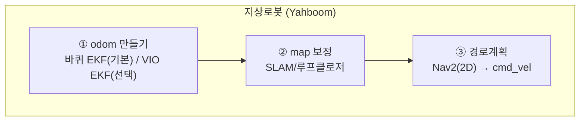
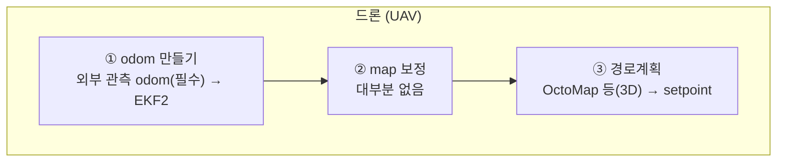
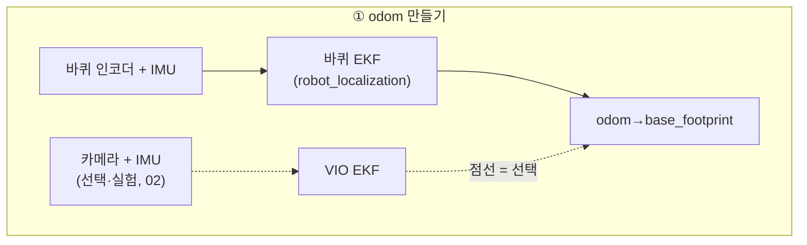
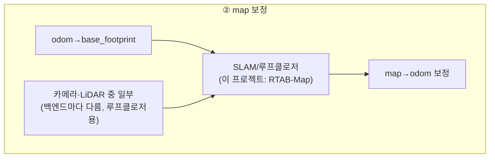
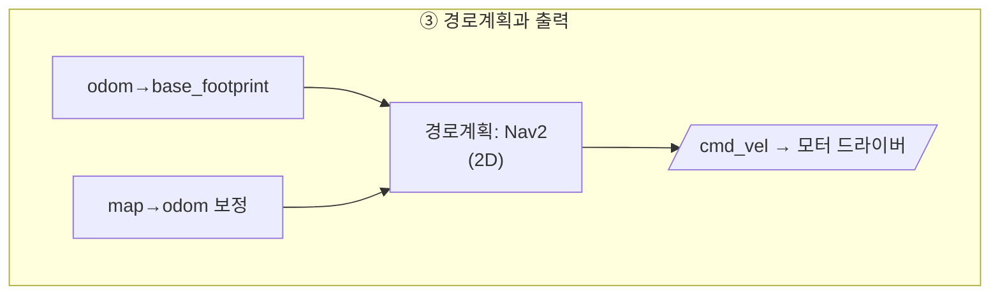
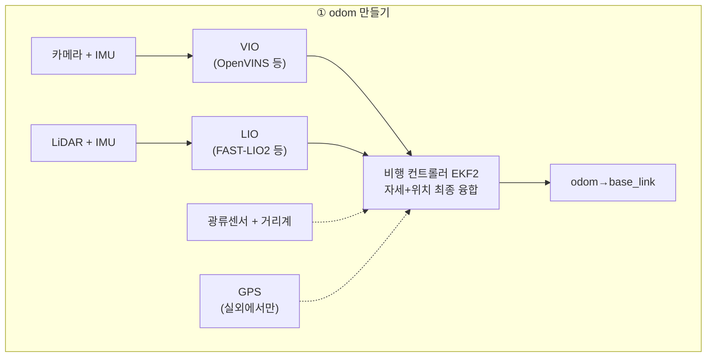
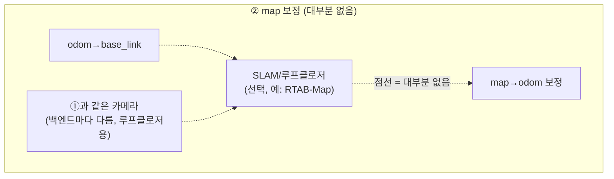
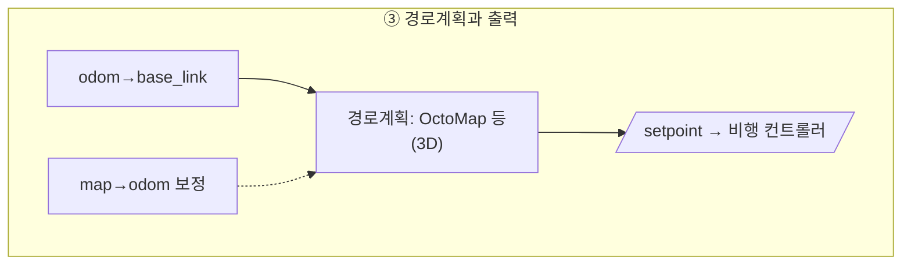

# 00. 지상로봇과 드론은 무엇이 다른가

> 이 문서를 읽으면 지금까지 배운 내용(ROS2 기초 → RTAB-Map/Nav2 → SLAM 백엔드)이 드론(UAV)에 적용될 때 **무엇이 그대로 쓰이고 무엇이 근본적으로 달라지는지** 구분할 수 있게 된다.

## 문서 정보

| 항목 | 내용 |
|---|---|
| 학습 단계 | Level 3 — 응용 확장 (드론 시리즈 시작점) |
| 예상 선행 지식 | [[07_TF2_기초\|ROS2 기초 - 07. TF2 기초]], [[00_SLAM이란_무엇이고_왜_쓰는가\|SLAM 공통 기초 - 00. SLAM이란 무엇이고 왜 쓰는가]], [[00_Nav2_아키텍처_개요\|00. Nav2 아키텍처 개요]] |
| 학습 목표 | 지상로봇과 드론의 자유도(DOF) 차이가 무엇을 바꾸는지 설명할 수 있다 / 드론에서 왜 외부 관측 기반 오도메트리가 필수가 되는지, 그 선택지에 무엇이 있는지 설명할 수 있다 / 지금까지 배운 스택 중 어디까지 재사용 가능한지 판단할 수 있다 |
| 기준 환경 | 개념 위주 (기존: Yahboom ROSMASTER X3 / 향후: 멀티로터 UAV) |
| 관련 문서 | 이전: [[06_Relocalization_감시_로직_구현\|06. Relocalization 감시 로직 구현]] (지상로봇 적용의 마지막 문서) / 다음: [[01_좌표계와_상태_추정의_차이\|01. 좌표계와 상태 추정의 차이]] |

---

## 1. 먼저 알아야 할 핵심

1. 지금까지 배운 **ROS2 기초(노드·Topic·TF2·Launch)는 드론에서도 100% 그대로 쓰인다.** 달라지는 것은 그 위에 얹는 로봇 특화 계층이다.
2. 가장 근본적인 차이는 **자유도(DOF)**다. 지상로봇은 평면 위 3자유도(x, y, yaw)로 근사할 수 있지만, 드론은 6자유도(x, y, z, roll, pitch, yaw) 전부가 살아 있다.
3. 지상로봇에는 있고 드론에는 **없는 것이 바퀴 오도메트리**다. Yahboom은 바퀴 회전수로 "얼마나 움직였는지"의 기준선을 항상 확보할 수 있지만, 드론은 그런 것이 없다 — 그래서 **"주변을 봐서 내 위치를 알아내는" 외부 관측(exteroceptive) 기반 오도메트리가 필수**가 된다.
   **그 자리를 채우는 수단은 여럿이다.** 카메라 기반 VIO, **LiDAR 기반 LIO**(FAST-LIO2 등), 광류센서+거리계, 실외라면 GPS/RTK, 실험실이라면 모션캡처가 모두 해당한다. 무엇을 고르는가는 임무와 환경이 정하며, 선택 기준은 [[01-1_드론의_오도메트리_소스_선택|01-1]]에서 다룬다.
   **이런 알고리즘 자체는 지상로봇도 쓸 수 있다** — 실제로 Yahboom에서도 OpenVINS를 실험한 이력이 있다([[02-2_OpenVINS의_핵심_설계|SLAM 백엔드 심화 - 02-2. OpenVINS의 핵심 설계 — FEJ, 온라인 캘리브레이션, Feature 표현]]). 차이는 "쓸 수 있는가"가 아니라 "**실패했을 때 되돌아갈 곳이 있는가**"다.
4. **Nav2는 지상로봇 전제로 설계된 스택이다.** 2D costmap, `base_footprint`(바닥 투영), "제자리 회전 후 재시도" 같은 개념이 전부 평면 주행을 가정한다 — 드론에 그대로 쓸 수 없다.
5. 드론에는 지상로봇에 없는 계층이 하나 더 있다: **비행 컨트롤러(Flight Controller, PX4/ArduPilot)**. 자세 안정화와 모터 제어는 이 하드웨어가 담당하고, ROS2 쪽 컴패니언 컴퓨터는 그 위에서 "어디로 갈지"만 지시한다.

---

## 2. 이 개념은 무엇인가

지상로봇과 드론은 둘 다 "ROS2를 쓰는 자율주행 로봇"이지만, **중력에 대해 어떤 관계에 있는가**가 스택 전체의 설계를 가른다. 지상로봇은 바닥이 받쳐주므로 가만히 두면 그 자리에 멈춰 있고, 드론은 매 순간 능동적으로 자세를 제어하지 않으면 추락한다.

**비유로 이해하기**

자동차 운전과 수영을 비교해보자.

- **자동차(지상로봇)**: 손을 놓아도 차는 도로 위에 그대로 있다. 운전자는 "어디로 갈지"(경로)만 신경 쓰면 되고, "가라앉지 않는 것"은 도로가 알아서 해준다. 바퀴가 몇 바퀴 돌았는지 세면 대략 얼마나 갔는지도 알 수 있다(**바퀴 오도메트리**).
- **수영(드론)**: 잠시라도 팔다리를 멈추면 가라앉는다. "앞으로 가기" 이전에 **"떠 있기" 자체가 계속 수행해야 하는 작업**이다. 그리고 물속에서는 "몇 걸음 걸었는지" 셀 방법이 없어서, 오로지 주변을 보고 자기 위치를 가늠해야 한다(**외부 관측 의존**). 이때 "본다"는 것이 눈(카메라)일 수도, 손으로 벽을 더듬는 것(LiDAR)일 수도 있다.
- 수영에서 "떠 있기"를 무의식적으로 담당하는 몸의 반사 신경이 드론의 **비행 컨트롤러(PX4)**에 해당하고, "어디로 갈지" 생각하는 머리가 **ROS2 컴패니언 컴퓨터**에 해당한다. 이 둘이 분리되어 있다는 점이 지상로봇 스택에는 없던 구조다.

**비유가 실제와 다른 부분**

- 수영은 사람이 물의 저항을 직접 느끼며 조절하지만, 드론의 비행 컨트롤러는 IMU 측정값을 기반으로 초당 수백~수천 번 자세를 계산해 각 모터의 회전수를 개별 조정한다 — 사람의 반사보다 훨씬 빠르고 기계적이다.
- 이 비유는 "떠 있는 것이 어렵다"는 점을 강조하지만, 실제로 드론 개발에서 더 까다로운 것은 **떠 있는 것 자체보다 "지금 어디에 떠 있는지 아는 것"(상태 추정)**인 경우가 많다 — 01에서 다룬다.

---

## 3. 왜 필요한가

**시스템 관점 (이 구분을 모르면)**

- Nav2 문서를 그대로 따라 드론에 적용하려다, 2D costmap이 "머리 위 3m 장애물"을 표현하지 못한다는 사실을 뒤늦게 발견하게 된다.
- 지상로봇에서 "있으면 좋은 보조 수단"이던 **외부 관측 오도메트리**가 드론에서는 **없으면 실내 비행이 성립하지 않는 필수 계층**이라는 것을 모르면, 백엔드 선택의 우선순위를 잘못 잡는다. 다만 그 계층을 **VIO와 동일시하는 것은 부정확하다** — LiDAR 기반 구성도 널리 쓰인다.
- 비행 컨트롤러라는 별도 하드웨어 계층의 존재를 모르면, "ROS2 노드가 직접 모터를 돌린다"는 잘못된 그림을 갖게 된다.

**실제 적용 관점**

현재 보유한 Yahboom ROSMASTER X3로 쌓은 경험 중 상당 부분(ROS2 통신, TF 관리, RTAB-Map 매핑, 센서 연동)은 드론으로 그대로 이전된다. 하지만 **Nav2 계층(B 시리즈)과 바퀴 오도메트리 전제(Nav2 내비게이션 01)는 재설계가 필요**하고, 반대로 지금까지 "실패한 실험"으로 분류했던 VIO 관련 진단(SLAM 백엔드 심화 01-5, 02-8)은 드론에서 **카메라 경로를 택할 경우 회피할 수 없는 핵심 과제**로 위상이 바뀐다. 이 시리즈는 그 재분류를 정리한다.

---

## 4. ROS2 시스템에서의 위치

전체 흐름을 한 그림에 넣으면 가로로 너무 넓어져(열이 6개 이상) 글자가 작아지므로, **odom 만들기 → map 보정 → 경로계획**의 3단계로 쪼갠다. 먼저 큰 그림으로 세 단계의 흐름만 보고, 이어서 각 단계를 펼친 상세 그림을 본다. 지상로봇과 드론에서 **같은 역할을 하는 블록은 같은 이름**을 썼으니, 나란히 비교해서 보면 된다.

### 4-0. 큰 그림





한눈에 보이는 대비는 이렇다 — **①은 둘 다 있지만(필수/선택 차이), ②는 지상로봇만 기본으로 있고, ③의 산출물(2D vs 3D, cmd_vel vs setpoint)이 다르다.** 아래는 이 세 박스 각각을 펼친 상세 그림이다.

### 4-a. 지상로봇 (Yahboom) 상세







### 4-b. 드론 (UAV) 상세







**그림 읽는 방법**

- **①(odom 만들기)**: "센서 → SLAM"이 곧바로 TF를 채우는 게 아니다. **odom을 채우는 것은 오직 EKF뿐**이다. 지상로봇은 바퀴 EKF가 기본이고 카메라+IMU 기반 VIO EKF(OpenVINS)는 점선의 선택지다 — 실제로 Yahboom에서 OpenVINS를 실험한 적이 있다([[02-2_OpenVINS의_핵심_설계|SLAM 백엔드 심화 - 02-2. OpenVINS의 핵심 설계 — FEJ, 온라인 캘리브레이션, Feature 표현]]). 드론은 그 자리에 **대체 불가능한 VIO EKF**가 들어가고, 최종 융합은 ROS2가 아니라 **비행 컨트롤러 내부의 EKF2**가 맡으며, 실외면 GPS가 추가 입력으로 들어간다(01).
- **②(map 보정)**: **SLAM/루프클로저는 odom을 대체하는 게 아니라, odom을 입력으로 받아 `map→odom` 보정치를 얹는 것**이다. 여기서 "루프클로저용 센서"를 굳이 "카메라·LiDAR 중 일부"라고 뭉뚱그려 쓴 이유는 **백엔드마다 실제로 쓰는 센서가 다르기 때문**이다 — 이 프로젝트의 기본 구성인 RTAB-Map은 LiDAR(ICP)와 RGB-D 외형 매칭을 함께 쓰지만, ①에서 VIO로 스테레오 기반 OpenVINS를 골랐다면 루프클로저도 **①에서 쓴 그 스테레오 카메라의 특징점**으로 수행하고 LiDAR도 RGB-D도 따로 필요 없다(백엔드별 특징점·매칭 방식 비교는 [[00-2_특징점_검출_기술자_매칭_비교|SLAM 백엔드 심화 - 00-2. 특징점 검출·기술자·매칭 비교]] 참고). 즉 ①에서 오도메트리 방식을 정하면 ②에서 쓸 수 있는 센서 조합도 같이 정해진다. 지상로봇은 이 단계가 기본 구성이지만, **드론은 이 단계 자체가 대부분 없다**(그림 전체가 점선인 이유) — SLAM/루프클로저를 얹는 것이 불가능하진 않지만([[01_좌표계와_상태_추정의_차이|드론 적용 - 01. 좌표계와 상태 추정의 차이]]), 장시간 실내 미션이 아니면 매핑 전용으로만 쓰고 `map→odom` 보정에는 관여시키지 않는 구성이 더 흔하다. 이 판단은 D 시리즈 SLAM 백엔드 재평가(04)로 이어진다.
- **③(경로계획과 출력)**: Nav2는 `odom→base_footprint`와 `map→odom` **둘 다** 있어야 동작한다([[01_좌표계와_로컬라이제이션_기반|지상로봇 적용 - Nav2 내비게이션 - 01. 좌표계와 로컬라이제이션 기반]]). 드론은 ②가 대부분 없으므로 `odom`만으로 3D 경로계획까지 바로 가는 경우가 많다(점선 입력). `Nav2(2D)` 자리가 드론에서는 `OctoMap 등(3D)`으로 통째로 바뀐다는 점이 B 시리즈 전체의 재검토가 필요한 이유다(03).
- 드론의 `setpoint → 비행 컨트롤러`는 그림에 그리지 않았지만 실제로는 **비행 컨트롤러 EKF2로 되돌아가는 루프**를 이룬다 — ROS2가 만든 목표점을 비행 컨트롤러가 받아 모터를 제어하고, 그 결과 추정된 자세가 다시 ROS2로 올라온다. 지상로봇의 단방향 `cmd_vel` 흐름과 다른 구조다(02).

### 4-1. "EKF"라는 이름이 가리키는 세 가지 서로 다른 것

이 문서와 SLAM 백엔드 심화 시리즈에 "EKF"라는 단어가 여러 번 등장하는데, 매번 가리키는 알고리즘이 다르다. 이름이 같다고 같은 것으로 착각하면 "지상로봇도 EKF 쓰고 드론도 EKF 쓰니 비슷하다"는 오해가 생긴다.

| | 바퀴 EKF (`robot_localization`) | 외부 관측 오도메트리 (VIO/LIO) | 비행 컨트롤러 EKF2 (PX4) |
|---|---|---|---|
| 입력 | 바퀴 인코더 속도 + IMU | 카메라 특징점 + IMU(VIO) 또는 LiDAR 점군 + IMU(LIO) | 외부 pose(또는 GPS) + IMU |
| 상태 벡터 | pose + velocity 정도(저차원, 고정 크기) | pose + IMU bias + 알고리즘별 추가 항(VIO는 슬라이딩 윈도우 카메라 pose, LIO는 외부보정·중력) | pose + velocity + bias |
| 하는 일 | 서로 다른 두 센서 값을 **가중 평균**하는 순수 융합 | 외부 센서로 **직접 위치를 추정**하는 오도메트리 알고리즘 그 자체 | 그 결과를 자세 제어용으로 다시 융합 |
| 지상로봇(Yahboom)에서 | 기본, 항상 켜짐 | 선택, SLAM 백엔드 심화에서 실험적으로 평가 중 | 해당 없음 |
| 드론에서 | 해당 없음(바퀴가 없음) | **필수** — 단 VIO/LIO 중 무엇으로 채울지는 선택이다([[01-1_드론의_오도메트리_소스_선택\|01-1]]) | 필수, 그 출력을 받아 최종 융합 |

한 문장으로 요약하면: **바퀴 EKF는 "이미 알고 있는 두 값을 섞는" 알고리즘이고, VIO/LIO는 "값 자체를 처음부터 계산해내는" 알고리즘이다.** 지상로봇은 후자가 없어도 전자만으로 버틸 수 있지만, 드론은 후자가 유일한 오도메트리 출처이므로 없으면 아무것도 안 된다.

---

## 5. 주요 구성 요소

| 구성 요소 | 지상로봇(Yahboom) | 드론(UAV) | 관련 문서 |
|---|---|---|---|
| 자유도 | 3자유도(x, y, yaw)로 근사 | 6자유도 전부 | 01 |
| 기준 프레임 | `base_footprint`(바닥 투영, z=0) | `base_link`(공중, z가 실제 의미를 가짐) | 01 |
| 오도메트리 출처 | 바퀴 인코더 + IMU(EKF 융합), 외부 관측은 선택 | VIO 또는 **LIO**, 광류+거리계, 실외면 GPS — 바퀴 없음 | 01, 01-1 |
| 저수준 제어 | 모터 드라이버(`cmd_vel` 수신) | 비행 컨트롤러(PX4/ArduPilot) | 02 |
| 경로 계획 | Nav2 (2D costmap) | 3D 계획(OctoMap/voxel, Nav2 직접 적용 불가) | 03 |
| 실패 시 결과 | 대체로 정지 | **추락 가능** — 안전 설계가 필수 | 05 |
| 재사용 가능 | ROS2 기초 전부, TF2, 센서 연동, RTAB-Map 매핑 원리 | 동일하게 재사용 | — |

---

## 6. 기본 동작 과정 (드론에서 한 번의 목표 이동이 처리되는 흐름)

1. **센서 입력**: 외부 관측 센서(스테레오 카메라 또는 3D LiDAR)와 IMU가 데이터를 발행한다. 지상로봇과 달리 바퀴 인코더가 없다.
2. **오도메트리 추정**: 컴패니언 컴퓨터의 VIO 또는 LIO가 그 센서와 IMU로 6자유도 pose를 추정한다 — 이 계층이 없으면 실내에서는 위치를 알 방법이 사실상 없다.
3. **비행 컨트롤러 융합**: 그 결과를 비행 컨트롤러(PX4의 EKF2)에 보내면, 컨트롤러가 자체 IMU 정보와 융합해 최종 상태 추정을 만든다. **PX4의 수신 인터페이스는 그 pose가 카메라에서 왔는지 LiDAR에서 왔는지 구분하지 않는다.**
4. **3D 경로 계획**: ROS2 쪽에서 3D 지도(OctoMap 등)를 기반으로 목표까지의 경로를 계산한다.
5. **Setpoint 전송**: 계산된 경로를 위치/속도 목표점(setpoint) 형태로 비행 컨트롤러에 스트리밍한다(offboard 모드).
6. **저수준 제어**: 비행 컨트롤러가 그 목표를 만족하도록 각 모터의 회전수를 실시간 제어한다 — 이 단계는 ROS2가 관여하지 않는다.

### 6-1. 마이그레이션 체크리스트 — 지상로봇 스택에서 무엇이 바뀌는가

지금까지 다룬 내용을 "지금 Yahboom에서 쓰는 것 → 드론에서는 어떻게 되는가"로 층별로 정리하면 다음과 같다. **결론부터 말하면 "RTAB-Map 구조를 그대로 가져가는 것도, 완전히 새 구조로 바꾸는 것도 아니다"** — 오도메트리를 담당하던 부품 하나만 드론용으로 교체하고, 그 위·아래 계층이 함께 따라 바뀌는 구조다.

| 계층 | 지상로봇(Yahboom) | 드론 | 재사용 가능한가 |
|---|---|---|---|
| **오도메트리(odom)** | 바퀴 EKF(`robot_localization`) 기본, 외부 관측은 선택 | 외부 관측 오도메트리(VIO 또는 LIO) **필수**, 최종 융합은 FC의 EKF2가 담당 | 바퀴 EKF는 **폐기**. VIO 알고리즘 자체(02·03에서 평가한 OpenVINS/VINS-Fusion)는 재사용, 다만 출력 포맷을 FC가 받는 형태로 변환 필요([[02_비행_컨트롤러_연동\|드론 적용 - 02. 비행 컨트롤러 연동]] 5장) |
| **지도(map) 보정** | RTAB-Map이 loop closure로 `map→odom` 발행, 기본 구성 | **일반적으로 아예 없음.** 재방문·정밀 매핑 임무일 때만 선택 | RTAB-Map은 **역할 축소**(오도메트리 전담 → 필요시 매핑 전용). 짧은 실내 임무면 통째로 **불필요**([[04_드론에서의_SLAM_백엔드_재평가\|드론 적용 - 04. 드론에서의 SLAM 백엔드 재평가]] 3장) |
| **경로계획** | Nav2(2D costmap, SmacPlanner2D, MPPI) | OctoMap 등 3D voxel 지도 + 3D 경로계획기 | Nav2는 **거의 전부 교체**. Behavior Tree의 사고방식(Sequence/Fallback, recovery)만 개념적으로 재사용([[03_3D_경로_계획\|드론 적용 - 03. 3D 경로 계획 — Nav2를 대체하기]]) |
| **출력** | `cmd_vel`(즉시 속도 명령, 로컬 프레임) | `TrajectorySetpoint`(로컬 원점 기준 절대 목표, 20Hz+ 스트리밍) | **완전 교체.** 신호의 성격 자체가 다름(02 5장) |
| **안전 계층** | 없음(실패 시 정지) | FC의 failsafe, geofence, RTL | 지상로봇에는 **없던 계층을 새로 추가**([[05_안전과_실전_고려사항\|드론 적용 - 05. 안전과 실전 고려사항]]) |
| ROS2 통신, TF 관리, 센서 드라이버, SLAM/오도메트리 알고리즘 자체 | — | — | **그대로 재사용.** 드론 적용에서 가장 손 안 대도 되는 부분 |

---

## 7. 실습 (개념 확인)

이 문서는 개념 정리가 목적이므로, 실제 드론 없이 **지금까지 만든 Yahboom 스택에서 "드론이면 깨지는 부분"을 직접 확인**하는 실습으로 진행한다.

### 실습 목표

현재 Yahboom 시스템의 TF 트리와 Nav2 설정에서, 드론에 그대로 적용할 수 없는 전제가 어디에 박혀 있는지 찾아본다.

### 준비 사항

* 기존 Yahboom 시스템이 실행 중인 환경 (또는 저장된 rosbag/설정 파일)

### 확인

```bash
# 1) 현재 TF 트리에서 base_footprint의 존재 확인
ros2 run tf2_ros tf2_echo base_footprint base_link

# 2) Nav2 costmap이 몇 차원인지 확인
ros2 topic echo /global_costmap/costmap --once
```

* 첫 번째 명령: `base_footprint → base_link` 변환이 존재한다면, 이는 "로봇이 바닥에 붙어 있다"는 전제로 만들어진 좌표계다. 드론에서는 이 개념 자체가 성립하지 않는다.
* 두 번째 명령: 출력되는 `nav_msgs/OccupancyGrid` 메시지에 `data` 배열이 **2차원 격자 하나**뿐이고 높이 축이 없다는 것을 확인한다 — 이것이 Nav2를 드론에 쓸 수 없는 가장 직접적인 이유다.

### 예상 결과

`base_footprint`가 TF 트리에 존재하고, costmap 메시지에 z축 정보가 전혀 없다는 것이 확인된다. 이 두 가지가 이 시리즈에서 재설계 대상으로 다룰 핵심 지점이다.

---

## 8. 코드 및 설정 해설

이 문서는 개념 정리 단계이므로 실행 코드를 다루지 않는다. 비행 컨트롤러 연동 코드(uXRCE-DDS 설정, offboard setpoint 발행)는 02에서, 3D 경로 계획 설정은 03에서 다룬다.

---

## 9. 자주 사용하는 명령어

| 목적 | 명령어 | 설명 |
|---|---|---|
| TF 트리 전체 확인 | `ros2 run tf2_tools view_frames` | 지상로봇/드론 각각의 좌표계 구조 차이를 그림으로 확인 |
| costmap 차원 확인 | `ros2 topic info /global_costmap/costmap` | 메시지 타입이 `OccupancyGrid`(2D)임을 확인 |
| IMU 데이터 주기 확인 | `ros2 topic hz /imu/data` | 드론에서는 IMU 주기가 지상로봇보다 훨씬 중요(01) |

---

## 10. 자주 발생하는 문제

### 문제(오해): "Nav2에 z축만 추가하면 드론에도 쓸 수 있다"

**증상**

Nav2 설정을 조정해 고도를 다루려고 시도하지만 방법을 찾지 못한다.

**가능한 원인**

Nav2의 costmap은 `nav_msgs/OccupancyGrid` 기반으로, 자료 구조 자체가 2차원 격자다. 파라미터 조정으로 3차원이 되지 않는다.

**해결 방법**

Nav2의 **일부 개념(Behavior Tree 구조, Action 인터페이스, recovery 사고방식)은 재사용 가치가 있지만, costmap과 planner는 3D 대안으로 교체해야 한다** — 03에서 구체적인 선택지를 다룬다.

### 문제(오해): "드론도 결국 SLAM으로 위치를 잡으니 Yahboom과 같다"

**증상**

Yahboom에서 쓰던 RTAB-Map 설정을 그대로 드론에 올렸는데 위치 추정이 불안정하다.

**가능한 원인**

1. Yahboom은 바퀴 오도메트리라는 안정적인 기준선이 있어 SLAM이 실패해도 "덜 나쁜" 상태로 버틸 수 있지만, 드론은 그 안전망이 없다.
2. 드론은 6자유도로 움직이므로, 평면 이동을 전제로 튜닝된 파라미터가 맞지 않는다.

**해결 방법**

드론에서는 SLAM 백엔드 선택 기준 자체가 달라진다 — 심화 시리즈의 결론을 드론 관점에서 재평가하는 것이 04의 주제다.

---

## 11. 개념 간 연결

* [[07_TF2_기초|ROS2 기초 - TF2]]에서 배운 `map → odom → base_link` 구조는 드론에서도 동일하게 쓰인다. 다만 `base_footprint`가 사라지고 z축이 실질적 의미를 갖는다는 차이가 01의 주제다.
* [[00_SLAM이란_무엇이고_왜_쓰는가|SLAM 공통 기초]]에서 배운 "Odometry는 드리프트가 쌓인다"는 문제가, 드론에서는 바퀴 오도메트리라는 보조 수단이 없어 훨씬 치명적으로 작용한다.
* [[00_Nav2_아키텍처_개요|지상로봇 적용 - Nav2 내비게이션 전체(00~07)]]가 지상로봇 전제이므로, 드론에서는 이 부분만 별도 재설계가 필요하다(03).
* [[04_ORB-SLAM3_vs_OpenVINS_vs_VINS-Fusion_종합_비교|SLAM 백엔드 심화 - 04. ORB-SLAM3 vs OpenVINS vs VINS-Fusion 종합 비교]]의 SLAM 백엔드 비교 결론은 "RTAB-Map이 loop closure를 담당하는 지상로봇 구성"을 전제로 한 것이라, 드론에서는 우선순위가 달라진다(04).
* [[02-2_OpenVINS의_핵심_설계|SLAM 백엔드 심화 - 02-2. OpenVINS의 핵심 설계 — FEJ, 온라인 캘리브레이션, Feature 표현]]에서 다룬 MSCKF 기반 VIO EKF가 4-1절 표의 "VIO EKF" 행의 실체다 — 지상로봇에서는 RTAB-Map/바퀴 EKF와 경쟁하는 선택지였지만, 드론에서는 유일한 오도메트리 출처가 된다.

---

## 12. 한 단계 더 깊게 보기

> **심화 학습**
>
> 이 부분은 기본 개념을 이해한 후 읽는 것을 권장한다.

**"실내 드론"이 유독 어려운 이유**

실외 드론은 GPS가 절대 위치를 계속 제공해주므로, 상태 추정 문제의 상당 부분이 해결된 상태에서 시작한다. 반면 **실내 드론은 GPS가 없는 상태에서 6자유도 위치를 순수하게 온보드 센서만으로 추정해야 한다** — 이는 이 프로젝트가 지금까지 Yahboom에서 씨름해온 VIO 문제(SLAM 백엔드 심화 01-5, 02-8)와 정확히 같은 문제이지만, 실패했을 때의 결과가 "지도가 어긋남"이 아니라 "추락"이라는 점에서 요구되는 신뢰성 수준이 훨씬 높다.

이 관점에서 보면, Yahboom에서 진행한 VIO 진단 경험은 드론으로 넘어갈 때 **버려지는 것이 아니라 오히려 가장 값진 자산**이 된다 — 특히 01-5에서 확인한 "RGB-D-Inertial은 ORB-SLAM3 공식 지원 조합이 아니다"와 "stereo-inertial이 더 안정적이었다"는 결론은, 드론용 센서 구성을 정할 때 그대로 반영해야 할 근거다(04).

---

## 13. 핵심 요약

1. ROS2 기초 계층(노드·Topic·TF2·Launch·센서 연동)은 드론에서도 그대로 재사용된다.
2. 가장 근본적인 차이는 자유도(3 vs 6)와, 바퀴 오도메트리의 부재다.
3. 바퀴가 없기 때문에 드론에서 **외부 관측 기반 오도메트리**는 선택이 아니라 필수다 — 다만 그것을 VIO로 채울지 LIO로 채울지는 선택이다.
4. Nav2는 2D costmap 기반이라 드론에 직접 적용할 수 없고, 3D 계획 스택으로 교체가 필요하다.
5. 드론에는 비행 컨트롤러(PX4/ArduPilot)라는 별도 계층이 있어, ROS2는 "어디로 갈지"만 지시하고 실제 모터 제어는 관여하지 않는다.

---

## 14. 이해도 점검

1. 드론에서 외부 관측 기반 오도메트리가 "있으면 좋은 것"이 아니라 "없으면 안 되는 것"인 이유는 무엇인가? 그리고 그 자리를 채울 수 있는 수단을 셋 이상 들어보라.
2. `base_footprint`라는 좌표계가 드론에서 의미를 잃는 이유는 무엇인가?
3. Nav2를 드론에 그대로 쓸 수 없는 가장 직접적인 기술적 이유는 무엇인가?
4. 드론에서 ROS2 컴패니언 컴퓨터와 비행 컨트롤러는 각각 무엇을 담당하는가?
5. 지금까지 Yahboom에서 배운 것 중 드론으로 그대로 이전되는 것과, 재설계가 필요한 것을 각각 하나씩 들어보라.

> [!info]- 정답 및 해설 보기
> 1. 드론에는 바퀴 인코더가 없어 "얼마나 움직였는지"를 알려주는 **자기수용(proprioceptive) 기준선**이 아예 없기 때문이다. 그래서 주변을 관측해 위치를 알아내는 계층이 반드시 있어야 한다. **다만 그 수단이 VIO뿐이라는 것은 흔한 오해다** — 카메라 기반 VIO, LiDAR 기반 **LIO**(FAST-LIO2 등), 광류센서+거리계, 실외의 GPS/RTK, 실험실의 모션캡처가 모두 같은 자리를 채운다. 선택 기준은 [[01-1_드론의_오도메트리_소스_선택\|01-1]]에 있다.
> 2. `base_footprint`는 로봇 몸체를 바닥(z=0)에 투영한 좌표계로, "로봇이 바닥에 붙어 있다"는 전제 위에서만 의미가 있다. 공중에 뜬 드론에서는 z가 실제 고도라는 의미를 가지므로 바닥 투영이라는 개념 자체가 성립하지 않는다.
> 3. Nav2의 costmap이 `nav_msgs/OccupancyGrid`, 즉 2차원 격자 자료구조 기반이라 파라미터 조정만으로는 3차원이 될 수 없기 때문이다.
> 4. ROS2 컴패니언 컴퓨터는 오도메트리/SLAM, 3D 지도 작성, 경로 계획을 담당해 "어디로 갈지"(setpoint)를 결정하고, 비행 컨트롤러는 그 목표를 받아 자세 안정화와 개별 모터 제어를 실시간으로 수행한다.
> 5. 그대로 이전: ROS2 통신 구조, TF2 좌표계 관리, 센서 연동 절차, SLAM 일반 원리 등. 재설계 필요: Nav2 기반 2D 경로 계획(지상로봇 Nav2 내비게이션 시리즈), 바퀴 오도메트리를 전제한 EKF 구성(Nav2 내비게이션 01) 등.

---

## 15. 다음 학습 주제

1. **바로 다음**: [[01_좌표계와_상태_추정의_차이|드론 적용 - 01. 좌표계와 상태 추정의 차이]] — 6자유도, `base_link` vs `base_footprint`, 외부 관측 의존성을 구체적으로 다룬다.
2. **함께 보면 좋은 주제**: [[00_SLAM이란_무엇이고_왜_쓰는가|SLAM 공통 기초 - 00. SLAM이란 무엇이고 왜 쓰는가]] — 드론에서 SLAM이 왜 더 절실한지 이해하려면 SLAM 일반 개념을 먼저 복습하는 것이 좋다.
3. **나중에 학습할 심화 주제**: [[04_드론에서의_SLAM_백엔드_재평가|드론 적용 - 04. 드론에서의 SLAM 백엔드 재평가]] — D 시리즈의 결론이 드론에서 어떻게 달라지는지 다룬다.

---

## 16. 참고자료

| 구분 | 자료 | 핵심 내용 |
|---|---|---|
| 공식 문서 | [PX4 Guide — ROS 2 User Guide](https://docs.px4.io/main/en/ros2/user_guide) | PX4와 ROS2의 역할 분담, 컴패니언 컴퓨터 구조 |
| 공식 문서 | [PX4 Guide — Visual Inertial Odometry (VIO)](https://docs.px4.io/main/en/computer_vision/visual_inertial_odometry) | 드론에서 VIO가 담당하는 역할과 요구 조건 |
| 공식 문서 | [Nav2 — Costmap 2D](https://docs.nav2.org/) | Nav2 costmap이 2D 격자 기반이라는 구조적 사실 확인 |
