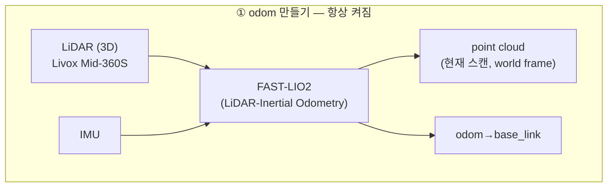
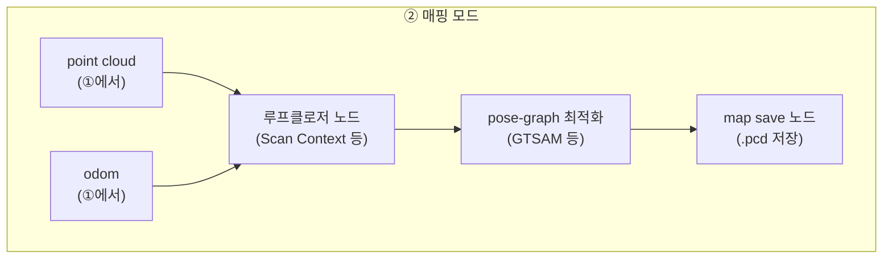
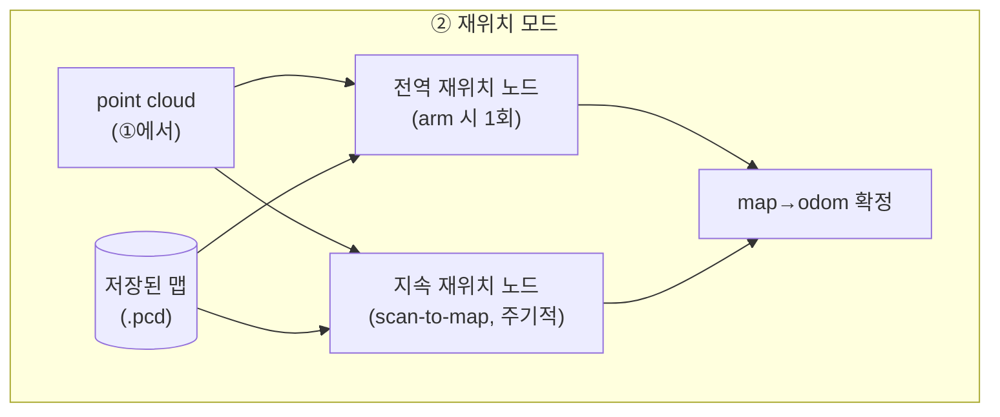
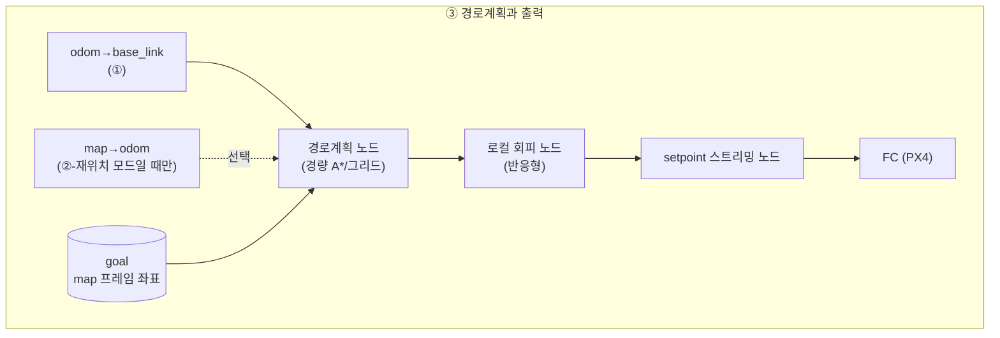

# 01. 통합 노드 아키텍처

> 드론 적용 — 둠둠 프로젝트(P1) 시리즈
> 이전 문서: [[00_프로젝트_개요와_시나리오_정의|00. 프로젝트 개요와 시나리오 정의]]

## 문서 정보

| 항목 | 내용 |
|---|---|
| 학습 단계 | Level 4 — 프로젝트 (설계) |
| 예상 선행 지식 | [[00_프로젝트_개요와_시나리오_정의\|둠둠 00]] |
| 학습 목표 | 공통 계층과 모드별 계층을 구분해 노드를 배치할 수 있다 / 전역 재위치와 지속 재위치가 다른 문제임을 안다 / goal을 map 프레임으로 관리해야 하는 이유를 설명할 수 있다 |
| 기준 환경 | Livox Mid-360S, FAST-LIO2, PX4 |

## 1. 개요

00번 문서 2.3절에서 정리했듯, 이 미션은 "1차 비행용 시스템"과 "2차 비행용 시스템"이 따로 있는 게 아니라 **하나의 공통 파이프라인이 모드만 바꿔 도는 구조**다. 이 문서는 그 구조를 실제 ROS2 노드 단위로 그린다.

전체를 한 그림에 넣으면 열이 너무 많아지므로([[00_지상로봇과_드론은_무엇이_다른가|드론 적용 00]] 4-0절과 같은 이유), **① odom 만들기(공통) → ② 매핑 모드 또는 재위치 모드(양자택일) → ③ 경로계획과 출력(공통)** 3단계로 쪼갠다.

## 2. 핵심 개념: ① odom 만들기 — 항상 켜지는 공통 계층



- `FAST-LIO2` 하나가 point cloud(정합된 현재 스캔)와 pose(odom) 둘 다를 낸다. 이 계층은 매핑 모드든 재위치 모드든 **항상 동일하게 동작**한다.
- point cloud는 아래 ②단계에서 "루프클로저 대상" 또는 "저장맵과 맞춰볼 대상"으로 재사용된다 — **같은 데이터를 모드에 따라 다르게 소비**하는 것이지, 별도로 다시 뽑는 게 아니다.

## 3. 핵심 개념: ② 매핑 모드 vs 재위치 모드 — 양자택일

### 3.1 매핑 모드 (초기 지도 생성 시)



- 이 모드에서 만들어진 결과물은 **저장된 지도 파일 하나**다. 비행 중 실시간으로 로봇을 제어하는 데는 관여하지 않고, ①의 odom이 그대로 항법에 쓰인다.
- 왜 루프클로저가 필요한지, 다각도 커버리지가 왜 중요한지는 [[03_FAST-LIO2_생태계와_맵_관리|03]] 3장에서 다룬다.

### 3.2 재위치 모드 (저장된 맵으로 목표 비행 시)



- `arm 시 1회` 전역 재위치와, `비행 중 지속` scan-to-map 보정은 **서로 다른 두 노드**다 — 하나는 "지금 어디서 시작하는지 모르는 상태에서 큰 폭으로 찾는" 문제, 다른 하나는 "이미 아는 위치에서 조금씩 새는 드리프트를 계속 잡는" 문제라 요구되는 알고리즘 성격이 다르다. 자세한 이유와 실패 시 대응은 [[04_재위치_레이어와_map_odom_보정|04]]에서 다룬다.
- 이 모드의 결과물은 `map→odom` TF 하나다. 이게 ①의 `odom→base_link`와 합쳐져야 `map→base_link`(비행체의 절대 위치)가 완성된다.

## 4. 핵심 개념: ③ 경로계획과 출력 — 공통



- **매핑 모드로만 비행할 때**(초기 탐색)는 `map→odom`이 없으므로 `goal`도 없다 — ③단계 전체가 사실상 비활성이거나, 있다 해도 [[06_자동_탐색_매핑과_확장_고려사항|06]]에서 다루는 frontier 목표만 받는다.
- **재위치 모드**에서는 `goal`을 `map` 프레임 좌표로 관리하고, `map→odom`으로 매 주기 변환해 로컬(odom 기준) 목표로 바꾼 뒤 경로계획에 넘긴다.
- 경로계획이 사무실 규모 + 고정고도 전제에서 왜 경량 그리드 A*로 충분한지는 [[00_프로젝트_개요와_시나리오_정의|00]] 2.2절의 단순화 논리와 같다.
- `로컬 회피`와 `setpoint 스트리밍`의 정지 시맨틱(무엇을 어떻게 보내야 "정지"가 되는가)은 [[05_정지_회피와_setpoint_처리|05]]에서 상세히 다룬다.

## 5. 실측: PX4에 직접 쓰는 노드는 둘뿐이다

00~04장이 **설계**였다면, 이 장은 그 설계가 구현에서 실제로 어떤 모양이 됐는지다.

### 5.1 토폴로지

저장소 전체에서 `/fmu/in/*`에 **쓰는** 노드를 세어 보면 딱 둘이다.

| 노드 | 쓰는 토픽 | 성격 |
|---|---|---|
| `drone_controller_node` | `/fmu/in/offboard_control_mode` | 하트비트 20 Hz |
| | `/fmu/in/trajectory_setpoint` | 조종 명령 |
| | `/fmu/in/vehicle_command` | 시동·모드·착륙 |
| `lio_px4_bridge` | `/fmu/in/vehicle_visual_odometry` | **위치 추정 — 조종이 아니다** |

조종 계통은 `drone_controller_node` 하나가 독점한다. **조종자 셋 중 아무도 PX4 토픽을 직접 쓰지 않는다.**

```text
explorer_node (자동 탐사) ─┐
teleop_keyboard (키보드)  ─┼── /drone/cmd_vel      (Twist)    수평 속도 + 요
lab bridge (웹 조이스틱)  ─┤── /drone/set_altitude (Float32)  목표 고도
                           └── /drone/command      (String)   arm · takeoff · velocity ·
                                    │                         hover · land · disarm
                                    ▼
                        drone_controller_node   ← 번역 + 안전 레이어
                                    ▼
                                  PX4
```

조종자들은 **문자열 명령**으로만 말한다. [[02-2_PX4의_비행_모드와_시동_명령|드론 적용 02-2]] 4장의 명령 번호(`DO_SET_MODE=176`, `param2=6`, `ARM_DISARM=400`)를 조종자 쪽에서 알 필요가 없도록 감싼 것이다.

### 5.2 `lio_px4_bridge`는 규칙을 어긴 것이 아니다

그림에 없는 갈래가 하나 있다. `lio_px4_bridge`는 어댑터를 거치지 않고 PX4에 **직접 쓴다.**

**조종 명령이 아니라 위치 추정이라 축이 다르다**([[02-1_수동_조종과_제어_인터페이스_설계|드론 적용 02-1]] 2.3절). 속도 제한이나 회피를 걸 대상이 아니므로 어댑터를 지날 이유가 없다. **조종 경로의 단일 창구는 깨지지 않았다.**

> 그래서 이 설계가 지켜지고 있는지 확인하는 가장 빠른 방법은 **`/fmu/in/*`에 쓰는 노드를 세어 보는 것**이다. 조종 계통 하나 + 위치 계통 하나 = 둘이면 정상이고, **셋째가 보이면 누군가 창구를 우회한 것이다.**

### 5.3 이 선택이 값을 한 자리 — 우회가 아니라 차단이 기본값이었다

[[02-1_수동_조종과_제어_인터페이스_설계|02-1]] 2.1절은 어댑터를 안 두는 (A) 방식의 위험을 **"새 조종 경로 하나가 기존 안전장치를 통째로 우회할 수 있다"**고 적었다. 웹 조이스틱을 붙일 때 실제로 일어난 일이 **그 반대편**이다.

(A)로 갔다면 조이스틱이 안전 레이어·좌표 변환·데드맨을 **각자 다시 구현**했어야 했고, 그중 하나만 빠뜨려도 **조용히 우회**됐을 것이다. 날기는 하는데 속도 제한이 안 걸리는 식으로.

(B)라서 나온 증상은 정반대였다 — **모드 명령을 안 보내니 아무 일도 일어나지 않았다.** 조이스틱 값은 토픽에 멀쩡히 실려 나갔지만 컨트롤러가 `VELOCITY` 모드가 아니라 통째로 무시했고, 그래서 "안 움직인다"로 드러났다([[11_수동_조종_가상_조이스틱_실측|11]] 4장).

**우회가 아니라 차단이 기본값이었던 셈이다.** 빠뜨린 결과가 "위험한 동작"이 아니라 "동작 없음"으로 나오는 쪽이, 날려 보기 전에 발견된다.

### 5.4 대신 치른 비용

공짜는 아니었다. 감싼 만큼 **조종자가 알아야 할 절차가 생겼다.**

| | (A) 직접 쓰기 | (B) 어댑터 경유 (이 프로젝트) |
|---|---|---|
| 안전 로직 | 조종자마다 다시 구현 | 한 곳 |
| 빠뜨렸을 때 | **조용히 우회** — 날긴 난다 | **차단** — 아무 일도 안 일어난다 |
| 조종자가 알아야 할 것 | PX4 명령 번호·좌표계·하트비트 | `arm → takeoff → velocity` **3단계 순서** |
| 이번에 실제로 난 문제 | — | 그 3단계를 몰라서 **모드 명령 없는 조이스틱이 두 커밋을 통과** |

**"값만 보내면 되는 줄 알았다"가 비용의 정체다.** 토픽 이름과 메시지 타입은 지상로봇과 똑같이 생겼는데, 드론에서는 그것만으로 부족하다는 사실이 인터페이스에 드러나 있지 않았다.

> 어댑터가 자기 모드를 **상태 토픽으로 내보내지 않았던 것**도 여기에 겹쳤다. 내보냈다면 "지금 HOVER인데 왜 cmd_vel을 보내나"가 한눈에 보였을 것이다([[02-1_수동_조종과_제어_인터페이스_설계|02-1]] 3.1절의 진단 요령).

## 6. 진단 관점

| 증상 | 확인 순서 |
|---|---|
| 매핑 모드에서 점군이 스캔마다 어긋남 | ①의 FAST-LIO2 자체가 흔들리는 것 — IMU 캘리브레이션, LiDAR 마운트 진동 먼저 의심 |
| 재위치 모드 arm 직후 `map→odom`이 안 잡힘 | ②의 전역 재위치 노드가 실패 — 저장맵과 현재 스캔의 각도 차이가 너무 크지 않은지, 초기 위치 추정치가 필요한 구조는 아닌지 확인([[03_FAST-LIO2_생태계와_맵_관리\|03]] 참고) |
| 비행 중 서서히 목표에서 벗어남 | ②의 지속 재위치 노드가 죽어 있거나 주기가 너무 낮은 것 — 지속 보정이 없으면 ①의 odom 드리프트가 그대로 누적된다 |
| goal로 가긴 가는데 경로가 이상함 | ③의 `map→odom` 변환 타이밍 문제 — goal을 map 프레임으로 관리하고 있는지, 매 주기 최신 TF로 변환하는지 확인 |
| 조종 명령을 보내는데 기체가 무반응 | `/drone/command`로 **모드 명령**을 보내고 있는가(5.3절) → 컨트롤러 모드가 `VELOCITY`인가 → `nav_state`가 14인가([[02-2_PX4의_비행_모드와_시동_명령\|드론 적용 02-2]] 6장) |
| 시동이 거부됨 | 조종 축이 아니라 **위치 축**을 본다(5.2절) — `lio_px4_bridge`가 살아 있는가, EKF2가 그 값을 쓰고 있는가([[01-2_외부_오도메트리를_PX4에_보내기\|드론 적용 01-2]] 8장) |
| 안전 레이어가 안 걸리는 것 같음 | `ros2 topic info -v`로 `/fmu/in/trajectory_setpoint`의 **발행자 수**를 센다 — 둘 이상이면 누가 창구를 우회한 것이다(5.2절) |

## 7. 다음 문서와의 연결

- 다음: [[02_빠른_적용_로드맵과_체크리스트|02. 빠른 적용 로드맵과 체크리스트]] — 이 아키텍처를 처음부터 전부 구현하지 않고, 어떤 순서로 최소 단위부터 검증할지 다룬다.
- 관련: [[03_FAST-LIO2_생태계와_맵_관리|03]](②-매핑), [[04_재위치_레이어와_map_odom_보정|04]](②-재위치), [[05_정지_회피와_setpoint_처리|05]](③)

## 8. 참고자료

- [[11_수동_조종_가상_조이스틱_실측|11. 수동 조종(가상 조이스틱) 실측 기록]] — 이 아키텍처에 **세 번째 조종자**(웹 조이스틱)가 붙었을 때의 실제 구성과, 같은 토픽을 공유하기 때문에 필요해진 배타 잠금

- [[02_RTAB-Map_핵심_파라미터_대응표|지상로봇 적용 - Relocalization 심화 - 02]] — 매핑/로컬라이제이션 모드 전환이라는 같은 패턴의 지상로봇 사례
