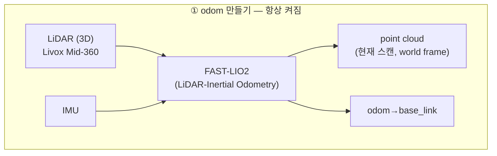
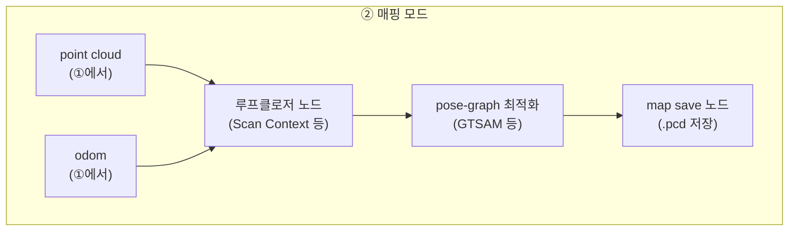
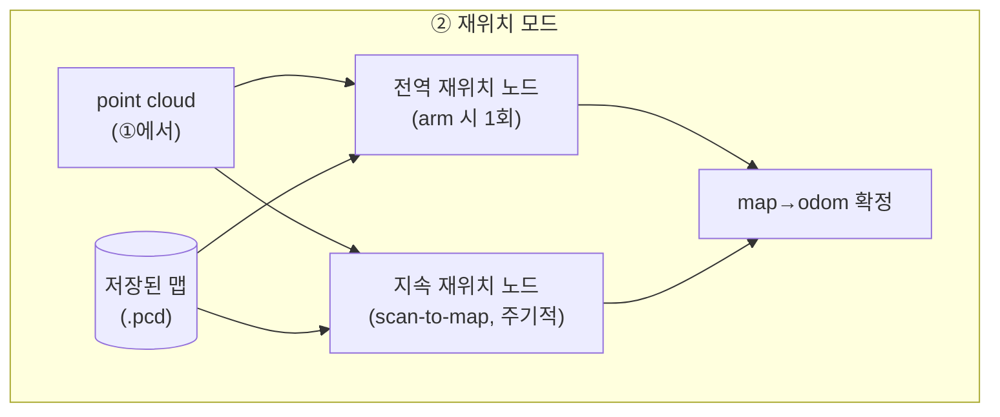
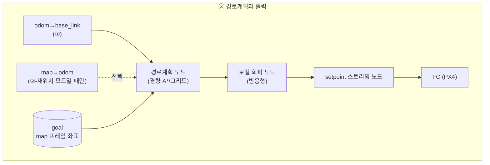

# 01. 통합 노드 아키텍처

> 드론 적용 — 둠둠 프로젝트(P1) 시리즈
> 이전 문서: [[00_프로젝트_개요와_시나리오_정의|00. 프로젝트 개요와 시나리오 정의]]

## 문서 정보

| 항목 | 내용 |
|---|---|
| 학습 단계 | Level 4 — 프로젝트 (설계) |
| 예상 선행 지식 | [[00_프로젝트_개요와_시나리오_정의\|둠둠 00]] |
| 학습 목표 | 공통 계층과 모드별 계층을 구분해 노드를 배치할 수 있다 / 전역 재위치와 지속 재위치가 다른 문제임을 안다 / goal을 map 프레임으로 관리해야 하는 이유를 설명할 수 있다 |
| 기준 환경 | Livox Mid-360, FAST-LIO2, PX4 |

## 1. 개요

00번 문서 2.3절에서 정리했듯, 이 미션은 "1차 비행용 시스템"과 "2차 비행용 시스템"이 따로 있는 게 아니라 **하나의 공통 파이프라인이 모드만 바꿔 도는 구조**다. 이 문서는 그 구조를 실제 ROS2 노드 단위로 그린다.

전체를 한 그림에 넣으면 열이 너무 많아지므로([[00_지상로봇과_드론은_무엇이_다른가|드론 적용 00]] 4-0절과 같은 이유), **① odom 만들기(공통) → ② 매핑 모드 또는 재위치 모드(양자택일) → ③ 경로계획과 출력(공통)** 3단계로 쪼갠다.

## 2. 핵심 개념: ① odom 만들기 — 항상 켜지는 공통 계층

- `FAST-LIO2` 하나가 point cloud(정합된 현재 스캔)와 pose(odom) 둘 다를 낸다. 이 계층은 매핑 모드든 재위치 모드든 **항상 동일하게 동작**한다.
- point cloud는 아래 ②단계에서 "루프클로저 대상" 또는 "저장맵과 맞춰볼 대상"으로 재사용된다 — **같은 데이터를 모드에 따라 다르게 소비**하는 것이지, 별도로 다시 뽑는 게 아니다.

## 3. 핵심 개념: ② 매핑 모드 vs 재위치 모드 — 양자택일

### 3.1 매핑 모드 (초기 지도 생성 시)

- 이 모드에서 만들어진 결과물은 **저장된 지도 파일 하나**다. 비행 중 실시간으로 로봇을 제어하는 데는 관여하지 않고, ①의 odom이 그대로 항법에 쓰인다.
- 왜 루프클로저가 필요한지, 다각도 커버리지가 왜 중요한지는 [[03_FAST-LIO2_생태계와_맵_관리|03]] 3장에서 다룬다.

### 3.2 재위치 모드 (저장된 맵으로 목표 비행 시)

- `arm 시 1회` 전역 재위치와, `비행 중 지속` scan-to-map 보정은 **서로 다른 두 노드**다 — 하나는 "지금 어디서 시작하는지 모르는 상태에서 큰 폭으로 찾는" 문제, 다른 하나는 "이미 아는 위치에서 조금씩 새는 드리프트를 계속 잡는" 문제라 요구되는 알고리즘 성격이 다르다. 자세한 이유와 실패 시 대응은 [[04_재위치_레이어와_map_odom_보정|04]]에서 다룬다.
- 이 모드의 결과물은 `map→odom` TF 하나다. 이게 ①의 `odom→base_link`와 합쳐져야 `map→base_link`(비행체의 절대 위치)가 완성된다.

## 4. 핵심 개념: ③ 경로계획과 출력 — 공통

- **매핑 모드로만 비행할 때**(초기 탐색)는 `map→odom`이 없으므로 `goal`도 없다 — ③단계 전체가 사실상 비활성이거나, 있다 해도 [[06_자동_탐색_매핑과_확장_고려사항|06]]에서 다루는 frontier 목표만 받는다.
- **재위치 모드**에서는 `goal`을 `map` 프레임 좌표로 관리하고, `map→odom`으로 매 주기 변환해 로컬(odom 기준) 목표로 바꾼 뒤 경로계획에 넘긴다.
- 경로계획이 사무실 규모 + 고정고도 전제에서 왜 경량 그리드 A*로 충분한지는 [[00_프로젝트_개요와_시나리오_정의|00]] 2.2절의 단순화 논리와 같다.
- `로컬 회피`와 `setpoint 스트리밍`의 정지 시맨틱(무엇을 어떻게 보내야 "정지"가 되는가)은 [[05_정지_회피와_setpoint_처리|05]]에서 상세히 다룬다.

## 5. 진단 관점

| 증상 | 확인 순서 |
|---|---|
| 매핑 모드에서 점군이 스캔마다 어긋남 | ①의 FAST-LIO2 자체가 흔들리는 것 — IMU 캘리브레이션, LiDAR 마운트 진동 먼저 의심 |
| 재위치 모드 arm 직후 `map→odom`이 안 잡힘 | ②의 전역 재위치 노드가 실패 — 저장맵과 현재 스캔의 각도 차이가 너무 크지 않은지, 초기 위치 추정치가 필요한 구조는 아닌지 확인([[03_FAST-LIO2_생태계와_맵_관리\|03]] 참고) |
| 비행 중 서서히 목표에서 벗어남 | ②의 지속 재위치 노드가 죽어 있거나 주기가 너무 낮은 것 — 지속 보정이 없으면 ①의 odom 드리프트가 그대로 누적된다 |
| goal로 가긴 가는데 경로가 이상함 | ③의 `map→odom` 변환 타이밍 문제 — goal을 map 프레임으로 관리하고 있는지, 매 주기 최신 TF로 변환하는지 확인 |

## 6. 다음 문서와의 연결

- 다음: [[02_빠른_적용_로드맵과_체크리스트|02. 빠른 적용 로드맵과 체크리스트]] — 이 아키텍처를 처음부터 전부 구현하지 않고, 어떤 순서로 최소 단위부터 검증할지 다룬다.
- 관련: [[03_FAST-LIO2_생태계와_맵_관리|03]](②-매핑), [[04_재위치_레이어와_map_odom_보정|04]](②-재위치), [[05_정지_회피와_setpoint_처리|05]](③)

## 7. 참고자료

- [[02_RTAB-Map_핵심_파라미터_대응표|지상로봇 적용 - Relocalization 심화 - 02]] — 매핑/로컬라이제이션 모드 전환이라는 같은 패턴의 지상로봇 사례
