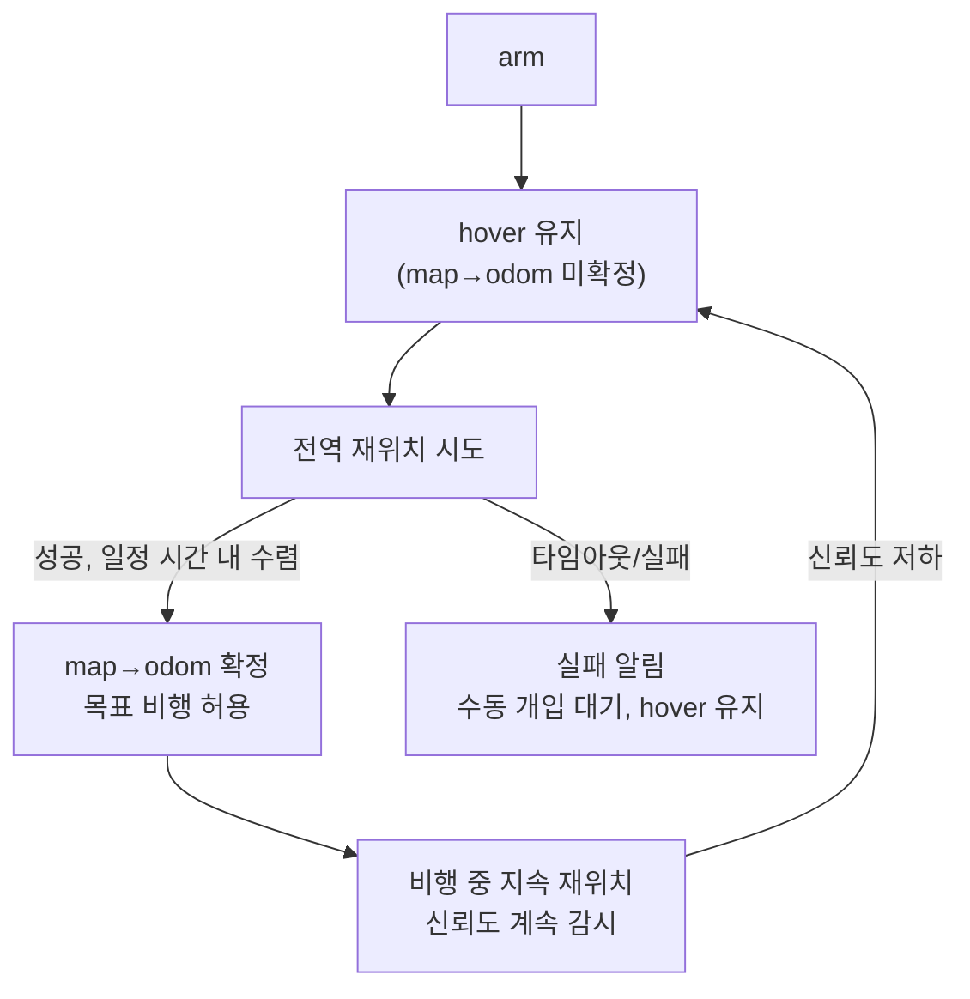

# 04. 재위치 레이어와 map→odom 보정

> 드론 적용 — 둠둠 프로젝트(P1) 시리즈
> 이전 문서: [[03_FAST-LIO2_생태계와_맵_관리|03. FAST-LIO2 생태계와 맵 관리]]
> 선행 학습: [[02_비행_컨트롤러_연동|드론 적용 - 02. 비행 컨트롤러 연동]] 5-6장(FC 로컬 프레임, EKF2 리셋)

## 문서 정보

| 항목 | 내용 |
|---|---|
| 학습 단계 | Level 4 — 프로젝트 (FC 연동 핵심) |
| 예상 선행 지식 | [[03_FAST-LIO2_생태계와_맵_관리\|둠둠 03]], [[02_비행_컨트롤러_연동\|드론 적용 02]] |
| 학습 목표 | 전역 재위치와 지속 재위치의 파라미터를 분리해 설정할 수 있다 / PX4에 LIO 결과를 넣을 때의 프레임·메시지 규약을 안다 / `reset_counter`를 안 올리면 왜 보정이 무시되는지 설명할 수 있다 / 재위치 미확정 시 안전 상태를 설계할 수 있다 |
| 기준 환경 | PX4 EKF2, px4_msgs, uXRCE-DDS |

## 1. 개요

[[01_통합_노드_아키텍처|01]] 3.2절에서 그린 재위치 모드(arm 시 전역 재위치 + 비행 중 지속 보정)를 실제로 구현할 때 반드시 챙겨야 할 것들 — 특히 **PX4 EKF2에 재위치 결과를 연동할 때의 구체적인 함정**을 정리한다. 이 부분은 원 논의(공유 대화)에는 없던 내용으로, 이번에 조사해 보충했다.

## 2. 핵심 개념: 두 개의 재위치 노드는 다른 문제를 푼다

| | 전역 재위치(arm 시 1회) | 지속 재위치(비행 중 주기적) |
|---|---|---|
| 푸는 문제 | "지금 어디서 시작하는지 전혀 모른다" — 넓은 탐색 | "이미 아는 위치에서 조금씩 새는 드리프트를 잡는다" — 좁은 범위 정합 |
| 계산 비용 | 높음(전체 맵 대상 탐색), 대신 저빈도(1회) | 낮음(근방만), 고빈도(수 Hz~수십 Hz) |
| `liangheming/FASTLIO2_ROS2` 대응 | `/localizer/relocalize` 서비스(coarse-to-fine ICP) | 같은 재위치 노드가 내부적으로 주기 정합을 반복 |

이 둘을 하나의 알고리즘으로 퉁치려 하면 안 된다 — 전역 탐색에 맞춘 파라미터(넓은 탐색 범위, 느슨한 초기 오차 허용)를 지속 보정에 쓰면 느려지고, 반대로 지속 보정용 파라미터(좁은 탐색)를 전역 재위치에 쓰면 애초에 못 찾는다.

## 3. 핵심 개념: 재위치 결과를 PX4 EKF2에 넣을 때의 함정

[[02_비행_컨트롤러_연동|드론 적용 02]]는 VIO를 전제로 FC 연동을 설명했는데, **LiDAR-Inertial 재위치는 몇 가지 지점에서 다르게 동작한다.** 이번에 조사하며 확인한 내용이다.

### 3.1 메시지 이름이 바뀌었다

과거 자료에 자주 나오는 `px4_msgs/msg/VehicleVisualOdometry`는 **더 이상 존재하지 않는다.** 현재 PX4는 **`VehicleOdometry.msg`** 하나를 쓰고, 용도에 따라 토픽만 다르게 발행한다.

```text
LIO/VIO 결과 → /fmu/in/vehicle_visual_odometry   (타입: px4_msgs/msg/VehicleOdometry)
모션캡처 결과 → /fmu/in/vehicle_mocap_odometry    (타입: px4_msgs/msg/VehicleOdometry)
```

### 3.2 `pose_frame`은 NED가 아니라 FRD를 쓴다

`VehicleOdometry.msg`는 `pose_frame` 필드에 `POSE_FRAME_NED`(1)와 `POSE_FRAME_FRD`(2) 중 하나를 선택하게 되어 있다.

- **NED**: 진북(True North)에 정렬된 프레임 — GPS나 마그네토미터처럼 절대 방위를 아는 소스용.
- **FRD**: 진북과 무관한, **임의의 고정 오프셋**을 갖는 프레임 — LiDAR-Inertial 시스템처럼 "어느 방향이 북쪽인지 모르고, 그냥 자기가 시작한 방향을 0으로 삼는" 시스템용.

**FAST-LIO2/재위치 노드는 절대 방위를 모르므로 `POSE_FRAME_FRD`를 써야 한다.** 이걸 NED로 잘못 설정하면 EKF2가 "이 값이 진북 기준"이라고 잘못 믿고 자세 추정이 틀어진다.

### 3.3 `velocity_frame` 불일치가 흔한 실패 원인이다

`velocity_frame`도 별도로 선언해야 한다(`VELOCITY_FRAME_NED`/`FRD`/`BODY_FRD`). **FAST-LIO2가 내는 속도가 world 프레임인지 body 프레임인지 먼저 확인**하고, 선언한 `velocity_frame`과 실제 데이터가 일치하는지 맞춰야 한다 — 불일치는 LIO 연동에서 특히 자주 보고되는 실패 패턴이다.

### 3.4 ROS FLU/ENU → PX4 FRD/NED 변환은 자동이 아니다

[[02_비행_컨트롤러_연동|드론 적용 02]] 2.2절에서 다룬 좌표 변환은, **uXRCE-DDS 경로에서는 자동으로 처리되지 않는다** — MAVROS와 달리 uXRCE-DDS는 변환을 대신 해주지 않으므로, FAST-LIO2(ROS, FLU/ENU 계열)의 출력을 PX4가 기대하는 FRD로 **직접 변환하는 코드를 재위치 결과 발행 노드 안에 넣어야 한다.**

### 3.5 `reset_counter` — 루프클로저가 있는 이 프로젝트에서 특히 중요

`VehicleOdometry.msg`에는 `reset_counter`라는 필드가 있다: "자세·속도·위치에 대한 리셋 이벤트를 센다." **재위치 노드가 루프클로저나 전역 재위치로 인해 위치를 순간적으로 크게 보정할 때마다 이 카운터를 증가시켜서 함께 보내야 한다.**

이걸 빠뜨리면 EKF2는 그 큰 보정값을 "이상치(outlier) 측정"으로 취급해 **무시**해버린다 — 즉 재위치가 성공했는데도 FC 쪽 상태 추정에는 반영되지 않는, 조용한 실패가 발생한다. 이것이 **VIO 연동과 LIO(특히 루프클로저 포함) 연동의 가장 큰 차이점**이다 — 일반 VIO는 이런 큰 점프가 드물지만, 이 프로젝트처럼 루프클로저/전역 재위치가 있는 구성에서는 반드시 챙겨야 한다.

> [[04_드론에서의_SLAM_백엔드_재평가|드론 적용 04]]에서 다룬 "저신뢰 상태를 외부로 알리는 인터페이스"와 같은 맥락이다 — `reset_counter`는 그 인터페이스의 PX4 쪽 구체적인 구현 지점이다.

### 3.6 요약 체크리스트

- [ ] `/fmu/in/vehicle_visual_odometry`에 `px4_msgs/msg/VehicleOdometry` 타입으로 발행
- [ ] `pose_frame = POSE_FRAME_FRD`
- [ ] `velocity_frame`을 FAST-LIO2 실제 출력과 일치시킴
- [ ] FLU/ENU → FRD/NED 변환을 발행 노드 안에서 직접 구현
- [ ] 루프클로저/전역 재위치로 위치가 점프할 때마다 `reset_counter` 증가
- [ ] `EKF2_EV_DELAY`(타임스탬프 지연 보정), `EKF2_EV_CTRL`(어떤 EV 데이터를 쓸지), `EKF2_HGT_REF=Vision`(고도 기준) 파라미터 설정

## 4. 핵심 개념: 안전 상태머신 — 재위치 미확정 시

[[01_통합_노드_아키텍처|01]] 3.2절에서 언급한 "arm 시 재위치 확정 전에는 이동하지 않는다"를 구체화한다.



- **재위치가 확정되기 전에는 절대 목표 비행을 시작하지 않는다.** [[05_정지_회피와_setpoint_처리|05]]의 position setpoint(현재 위치 고정) 방식으로 hover를 유지한다.
- **비행 중에도 지속 재위치의 신뢰도가 떨어지면 같은 대기 상태로 되돌아간다** — "한 번 확정됐으니 끝"이 아니라 계속 감시해야 한다.

## 5. 진단 관점

| 증상 | 확인 순서 |
|---|---|
| 재위치는 성공 로그가 뜨는데 드론 자세 추정이 안 바뀜 | `reset_counter`를 증가시키지 않았을 가능성 — EKF2가 보정을 이상치로 버렸을 수 있다(3.5절) |
| 고도/방향이 이상하게 튐 | `pose_frame`을 NED로 잘못 설정했는지 확인(3.2절) — LIO는 절대 방위를 모르므로 FRD여야 한다 |
| EKF2가 재위치 데이터를 아예 안 받아들임 | `velocity_frame` 불일치, 또는 [[02_비행_컨트롤러_연동\|드론 적용 02]]에서 다룬 주기(30~50Hz) 미달 확인 |
| 재위치 확정까지 시간이 너무 오래 걸림 | 전역 재위치와 지속 재위치 파라미터가 섞여 있지 않은지(2장) — 전역 재위치용 넓은 탐색 파라미터를 그대로 쓰고 있을 가능성 |

## 6. 다음 문서와의 연결

- 다음: [[05_정지_회피와_setpoint_처리|05. 정지·회피와 setpoint 처리]] — 4장의 안전 상태머신이 실제로 "hover"를 어떤 setpoint로 구현하는지 다룬다.

## 7. 참고자료

- [`px4_msgs/msg/VehicleOdometry.msg`](https://github.com/PX4/px4_msgs/blob/main/msg/VehicleOdometry.msg) — `pose_frame`/`velocity_frame`/`reset_counter` 필드 정의(3장 근거)
- [PX4 — Using Vision or Motion Capture Systems for Position Estimation](https://docs.px4.io/main/en/ros/external_position_estimation) — `EKF2_EV_DELAY` 등 파라미터
- [PX4 `dds_topics.yaml`](https://github.com/PX4/PX4-Autopilot/blob/main/src/modules/uxrce_dds_client/dds_topics.yaml) — `/fmu/in/vehicle_visual_odometry` 토픽 매핑 확인
- [[03_FAST-LIO2_생태계와_맵_관리|03]] — 이 문서가 다루는 재위치 노드의 출처
