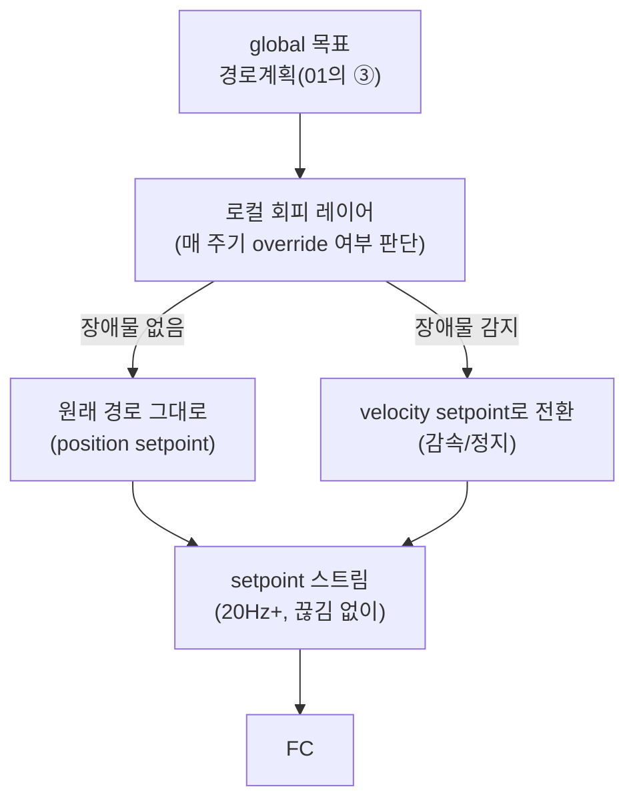

# 05. 정지·회피와 setpoint 처리

> 드론 적용 — 둠둠 프로젝트(P1) 시리즈
> 이전 문서: [[04_재위치_레이어와_map_odom_보정|04. 재위치 레이어와 map→odom 보정]]
> 선행 학습: [[02_비행_컨트롤러_연동|드론 적용 - 02. 비행 컨트롤러 연동]] 5장(setpoint의 좌표계와 종류)

## 문서 정보

| 항목 | 내용 |
|---|---|
| 학습 단계 | Level 4 — 프로젝트 (제어) |
| 예상 선행 지식 | [[02_비행_컨트롤러_연동\|드론 적용 02]] 5장, [[04_재위치_레이어와_map_odom_보정\|둠둠 04]] |
| 학습 목표 | 드론에서 '정지'를 구현하는 두 방법과 각각의 적절한 용처를 안다 / 정지가 1회성 이벤트가 아니라 지속 상태임을 이해한다 / Offboard heartbeat와 failsafe를 올바로 설정할 수 있다 |
| 기준 환경 | PX4 (COM_OF_LOSS_T, COM_OBL_RC_ACT), ROS2 Humble |

## 1. 개요

[[01_통합_노드_아키텍처|01]]의 ③단계("경로계획과 출력")에서 로컬 회피 노드가 장애물을 감지했을 때 **"정지"를 어떻게 구현하는가**는 지상로봇의 `cmd_vel=0` 발행과 근본적으로 다르다. 이 문서는 그 차이와, 이 프로젝트가 실제로 어떤 방식을 쓸지 정리한다.

## 2. 핵심 개념: cmd_vel과 setpoint의 근본적 차이 (복습)

[[02_비행_컨트롤러_연동|드론 적용 02]] 5.1절에서 다룬 내용을 이 프로젝트 맥락에서 다시 짚는다.

| | `cmd_vel`(지상로봇) | setpoint(드론, `TrajectorySetpoint`) |
|---|---|---|
| 정지 시키려면 | `cmd_vel=0`을 **한 번** 보내면 끝 | 정지 **목표**를 계속 스트리밍해야 함 |
| 스트림이 끊기면 | 대개 마지막 속도 유지(위험하지 않음) | FC가 Offboard failsafe로 전환(설계된 정지 수단 아님) |

## 3. 핵심 개념: 정지를 구현하는 두 가지 방법

로컬 회피 노드가 장애물을 감지했을 때, "정지"는 다음 둘 중 하나로 구현한다.

### 3.1 Position setpoint 방식 (Position Hold)

장애물 감지 시점의 **현재 위치를 그대로 다음 목표로 계속 재발행**한다. FC는 "그 자리에 계속 있어라"로 해석해 제자리 호버링한다.

```text
장애물 감지 → position = 현재 pose(map→odom→base_link로 구한 값) → 매 주기 동일 값 재전송
```

### 3.2 Velocity setpoint 방식

`TrajectorySetpoint`의 `velocity` 필드만 채우고 `position`은 `NaN`으로 비운다. `velocity = 0`을 계속 스트리밍하면 지상로봇의 `cmd_vel=0`과 개념적으로 가장 가깝게 동작한다.

### 3.3 이 프로젝트의 선택 — 로컬 회피는 velocity 방식

| 상황 | 방식 | 이유 |
|---|---|---|
| **로컬 회피(반응형 정지)** | **velocity setpoint** | 장애물 감지 → 즉시 감속이 자연스럽다. position 목표를 매 프레임 다시 계산하는 것보다 "지금부터 속도를 줄여라"가 반응형 정지에 더 맞는 표현이다 |
| **재위치 대기(hover)** | **position setpoint** | [[04_재위치_레이어와_map_odom_보정\|04]] 4장에서 다룬 "재위치 확정 전 hover"는 짧은 순간이 아니라 수 초 이상 지속될 수 있으므로, 그 자리를 명시적으로 "목표 위치"로 고정하는 쪽이 안전하다 |

**급정지 지양**: 고속 비행 중 velocity를 갑자기 0으로 주면 오버슈트/진동이 생길 수 있다. 초기 구현에서는 비행 속도 자체를 낮게 잡아(예: 0.3~0.5 m/s) 이 문제의 영향을 줄이고, 감속 프로파일(점진적으로 velocity를 줄이는 방식)은 이후 개선 항목으로 남긴다 — [[02_빠른_적용_로드맵과_체크리스트|02]]의 MVP 범위에서는 "즉시 0"으로 시작해도 된다.

## 4. 핵심 개념: 아키텍처 — 전역 목표와 로컬 회피의 관계



**정지는 로컬 회피 레이어가 매 주기 지속적으로 결정하는 상태**이지, 1회성 이벤트가 아니다. 장애물이 사라지면 다시 position setpoint(원래 경로)로 자연스럽게 복귀한다.

## 5. 핵심 개념: Offboard 스트림 끊김은 "정지 수단"이 아니다

[[02_비행_컨트롤러_연동|드론 적용 02]] 5.4절, 7장에서 다룬 내용을 이 프로젝트의 실제 설정으로 구체화한다.

- **PX4는 자체적으로 "마지막 setpoint 수신 시각"을 감시**하다가, `COM_OF_LOSS_T` 초과 시 `COM_OBL_RC_ACT`에 설정된 failsafe(Hold/RTL/Land)로 전환한다.
- **ROS2/uXRCE-DDS 경로에서는 `TrajectorySetpoint`가 아니라 `OffboardControlMode`가 진짜 heartbeat다** — PX4 공식 문서 기준 "unlike with MAVLink, PX4 won't trigger a failsafe if setpoints aren't sent regularly"이며, `OffboardControlMode`가 끊기지 않는 것이 Offboard 모드 유지의 실질 조건이다. `OffboardControlMode`와 `TrajectorySetpoint`는 같은 주기로 함께 스트리밍하는 것이 실무 표준이다.
- 이 프로젝트의 설정 방향: **`COM_OBL_RC_ACT`는 초기에는 `Hold`(그 자리 호버링)로 둔다.** `Land`는 재위치가 불안정한 상태에서 착지 위치를 예측하기 어렵고, `RTL`은 사무실 규모에서는 이륙 지점 복귀가 오히려 새로운 장애물 경로를 지날 수 있어 1차 실내 소규모 임무에는 `Hold`가 가장 예측 가능하다.

> **정상 상황의 정지는 "안 보낸다"가 아니라 "계속 보내되 내용을 정지 목표로 바꾼다"이고, "안 보낸다"는 오직 소프트웨어 다운 같은 예기치 못한 실패에 대비하는 최후의 안전망이다.**

## 6. 진단 관점

| 증상 | 확인 순서 |
|---|---|
| Offboard 모드 전환이 거부됨 | 전환 **전에** `OffboardControlMode` + setpoint를 이미 스트리밍하고 있었는가([[02_비행_컨트롤러_연동\|드론 적용 02]] 4장 제약 1) |
| 비행 중 갑자기 hold/착륙 전환 | setpoint 발행 노드가 밀렸는가(컴패니언 컴퓨터 CPU 과부하) → `ros2 topic hz`로 실제 발행 주기 확인 |
| 장애물 회피 시 진동/오버슈트 | velocity setpoint가 급격히 바뀌지 않는지 확인 — 감속 프로파일 없이 즉시 0으로 꽂았을 가능성 |
| 정지했다가 다시 출발할 때 튐 | position/velocity 전환 순간의 값 불연속 — 회피 종료 시점에 현재 velocity를 읽어 자연스럽게 이어주는 로직 필요 |

## 7. 다음 문서와의 연결

- 다음: [[06_자동_탐색_매핑과_확장_고려사항|06. 자동 탐색 매핑과 확장 고려사항]] — frontier 근처에서는 이 문서의 로컬 회피가 "선택"이 아니라 "필수 전제조건"이 되는 이유를 다룬다.

## 8. 참고자료

- [[02_비행_컨트롤러_연동|드론 적용 - 02. 비행 컨트롤러 연동]] 5장·7장 — setpoint 좌표계, Offboard heartbeat 상세
- [[11_수동_조종_가상_조이스틱_실측|11. 수동 조종(가상 조이스틱) 실측 기록]] — 같은 `cmd_vel`을 **사람이** 만들 때의 정지 처리(데드맨). 이 문서는 자동 비행 쪽이다
- [PX4 — Offboard Mode](https://docs.px4.io/main/en/flight_modes/offboard.html) — `OffboardControlMode` 요구사항, MAVLink와의 차이
- [PX4 — TrajectorySetpoint](https://docs.px4.io/main/en/msg_docs/TrajectorySetpoint) — position/velocity/acceleration 필드
