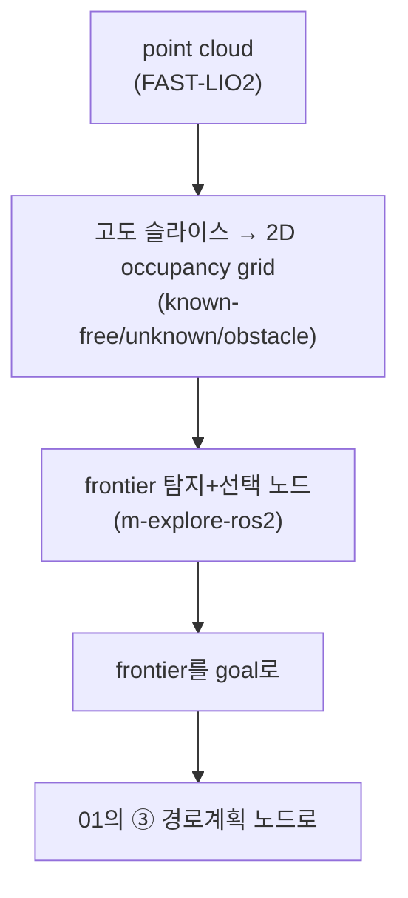

# 06. 자동 탐색 매핑과 확장 고려사항

> 드론 적용 — 둠둠 프로젝트(P1) 시리즈
> 이전 문서: [[05_정지_회피와_setpoint_처리|05. 정지·회피와 setpoint 처리]]

## 문서 정보

| 항목 | 내용 |
|---|---|
| 학습 단계 | Level 4 — 프로젝트 (선택 확장, 시리즈 마무리) |
| 예상 선행 지식 | 둠둠 00~05 전체 |
| 학습 목표 | frontier exploration의 원리를 안다 / 드론에서 frontier 근처가 왜 위험한지 설명할 수 있다 / 탐색 종료 조건을 설계할 수 있다 / 2차(선박) 확장 시 지금 열어둬야 할 설계 지점을 안다 |
| 기준 환경 | ROS2 Humble, m-explore-ros2 (선택) |

## 1. 개요

이 문서는 [[02_빠른_적용_로드맵과_체크리스트|02]]의 Phase 7(선택, 확장)에 해당하는 두 가지를 다룬다 — **① 매핑 비행을 사람이 조종하지 않고 자동으로 하는 방법(frontier exploration)**, **② 언젠가 2차(선박 내부, 다층 구조)로 확장할 때 지금 설계에서 미리 열어둘 것**. 둘 다 1차(사무실) 성공에 필수는 아니므로, [[02_빠른_적용_로드맵과_체크리스트|02]] Phase 0~6이 끝난 뒤에만 착수한다.

## 2. 핵심 개념: Frontier Exploration — "로봇청소기 초기 맵 생성"의 정식 이름

"이미 안 곳(known-free)"과 "아직 모르는 곳(unknown)"의 경계선(frontier)을 찾아 그 경계로 계속 이동하는 것을 반복하며 지도를 채우는 방식이다. 최신 LiDAR SLAM 로봇청소기가 실제로 쓰는 방식이 이것이고, 지상로봇/드론 구분 없이 SLAM+occupancy grid만 있으면 적용 가능한 알고리즘이다.

[[00_프로젝트_개요와_시나리오_정의|00]] 2.2절의 고정 고도 전제 덕분에, **3D frontier가 아니라 비행 고도의 2D occupancy grid에서 frontier를 찾는 문제로 단순화**할 수 있다 — 지상로봇용 frontier 탐색 알고리즘의 로직을 거의 그대로 재사용 가능하다는 뜻이다.

### 2.1 ROS2 패키지 선택

| 패키지 | 상태 | 판정 |
|---|---|---|
| `robo-friends/m-explore-ros2`(explore_lite 포팅) | **Humble에서 검증됨**, 가장 널리 쓰임, occupancy grid + Nav2류 goal 인터페이스만 있으면 동작 | **1순위** |
| `mertgulerx/frontier_exploration_ros2` | 가장 활발히 유지보수되고 문서화도 잘 되어 있으나, **Jazzy 기준 검증**(Humble 지원 여부 미확인) | 확인 후 후보 |
| `nav2_wavefront_frontier_exploration` | 튜토리얼 수준, 제품급 유지보수 아님 | 비권장 |

**둠둠 1차는 `m-explore-ros2`로 시작한다** — Humble 검증이 확실하고, 요구 인터페이스(occupancy grid, goal)가 [[01_통합_노드_아키텍처|01]] ③단계와 자연스럽게 맞물린다.

> **주의**: 세 패키지 모두 **지상로봇용으로 문서화되어 있고, 드론(UAV) 적용 사례는 확인되지 않는다.** 즉 "가져다 쓰면 끝"이 아니라 **직접 드론 환경에 맞춰 조정하는 작업이 필요**하다는 뜻이다 — 특히 3장의 안전 차이를 반드시 반영해야 한다.

### 2.2 노드 구성 (기존 아키텍처에 추가되는 부분)

[[01_통합_노드_아키텍처|01]]에서 이미 만든 "경로계획 노드"에 frontier 탐지·선택 노드만 얹으면 된다 — 통짜 프레임워크가 아니라 정말 작은 추가로 끝나는 구조라는 점이 이 프로젝트의 "작은 노드 조합" 방향과 맞는다.

## 3. 핵심 개념: 드론과 로봇청소기의 결정적 차이

| | 로봇청소기 | 드론 |
|---|---|---|
| unknown 영역 진입 시 리스크 | 낮음(느림, 접촉 감지 후 후진) | 높음(충돌 = 추락, 접촉 감지가 안전장치가 될 수 없음) |
| unknown 근접 시 속도 | 문제 안 됨 | frontier 근처(=장애물 유무를 모르는 곳)는 반드시 감속 필요 |
| 정지 여력 | 즉시 정지 가능 | 관성/제어 지연 있음 |

계획(frontier로 가라)과 반응(가는 도중 실제로 뭐가 보이면 즉시 멈춰라)이 항상 같이 붙어 있어야 한다 — [[05_정지_회피와_setpoint_처리|05]]의 로컬 회피 레이어가 이 탐색 미션에서는 **선택이 아니라 필수 전제조건**이다.

- frontier로 가는 경로 자체는 known-free를 지나가므로 안전하다. 위험한 건 **frontier에 도달한 그 순간, 그 너머로 한 걸음 더 나아가는 구간**뿐이다 — 이 구간을 별도로 더 보수적으로(느리게) 다루면 리스크를 크게 줄일 수 있다.
- 탐색 종료 조건: "더 이상 frontier가 없음" 또는 "특정 면적 이상 커버"를 기본으로 하고, 실무에서는 **최대 비행시간 제한**도 함께 둔다(배터리 안전).
- 자율 탐색 중에도 같은 공간을 재방문할 수 있으므로 루프클로저는 여전히 필요하다 — 오히려 여러 각도로 훑고 다니므로 [[03_FAST-LIO2_생태계와_맵_관리|03]] 3장에서 강조한 "다각도 커버리지"가 자연히 좋아지는 부수 효과가 있다.

## 4. 핵심 개념: 2차(선박) 확장 시 미리 고려할 것 — 짧게만

이 항목은 상세 설계 대상이 아니라, **1차 설계 때 나중에 덜 고생하도록 열어두는 포인트 목록**이다.

- **다층 구조**: 선박은 데크가 나뉘어 있어 "고정 고도 하나로 전체를 커버"라는 [[00_프로젝트_개요와_시나리오_정의|00]] 2.1절의 전제가 깨진다 — 데크별 맵 분리, 데크 전환(계단/해치) 시 재위치 로직이 추가로 필요해질 가능성이 높다. 지금 [[03_FAST-LIO2_생태계와_맵_관리|03]]의 노드 구조를 "맵 1개 고정"이 아니라 "여러 맵 중 선택 가능"한 형태로 열어두면 나중에 덜 고생한다.
- **좁고 특징 없는 복도(degenerate corridor)**: 선박 복도는 사무실보다 길고 반복적인 형상(같은 패턴의 문/파이프)이 많아 LIO의 scan matching이 실패하기 쉬운 전형적 케이스다 — [[04-1_VIO_vs_LiDAR-Inertial_SLAM_비교|드론 적용 04-1]] 4.1절에서 다룬 "기하학적 degeneracy"가 여기서 실제로 나타난다. **1차 사무실 단계에서부터 "특징 부족 구간에서 얼마나 버티는지"를 의도적으로 테스트**([[02_빠른_적용_로드맵과_체크리스트|02]] Phase 1의 실측 항목에 추가 권장)해두면 좋다.
- **맵 크기/연산량 스케일링**: 사무실은 지금 구조로 충분해도, 선박 전체를 한 맵으로 관리하면 point cloud 저장/매칭 비용이 커진다 — 구역 단위로 맵을 쪼개는 설계를 미리 염두에 둔다.
- **금속 선체 영향**: IMU 자체는 자력 영향을 받지 않지만, 나중에 마그네토미터 기반 절대 방위 보정을 추가한다면 선박 철제 구조에서 왜곡이 심하다. 이 프로젝트는 LIO 중심(3.2절에서 다뤘듯 `POSE_FRAME_FRD`, 절대 방위 불필요)이라 당장은 큰 문제가 아니지만, 확장 시 염두에 둔다.

## 5. 진단 관점

| 증상 | 확인 순서 |
|---|---|
| frontier 탐색이 unknown 경계에서 멈칫거림 | 정상 — 3장에서 다룬 "frontier 근처 필수 감속"이 의도대로 동작하는 것일 수 있다 |
| 탐색이 끝나지 않고 계속 돎 | 종료 조건(frontier 소진/면적/시간) 중 무엇도 걸리지 않는 상태 — 파라미터 확인 |
| frontier 근처에서 실제로 충돌 위험 상황 발생 | 로컬 회피([[05_정지_회피와_setpoint_처리\|05]])의 반응 속도가 frontier 접근 속도보다 느린 것 — 접근 속도를 낮추거나 회피 감지 주기를 높인다 |

## 6. 다음 문서와의 연결

- 이것으로 P1(둠둠 프로젝트 1차) 시리즈가 마무리된다.
- 실제 구현·비행 결과가 쌓이면, [[04_드론에서의_SLAM_백엔드_재평가|드론 적용 04]]가 D 시리즈에 대해 했던 것처럼 **둠둠 실측 결과를 반영하는 별도 문서**를 이 폴더에 추가하는 것이 자연스러운 확장이다.

## 7. 참고자료

- [robo-friends/m-explore-ros2](https://github.com/robo-friends/m-explore-ros2) — 채택한 frontier exploration 패키지
- [mertgulerx/frontier_exploration_ros2](https://github.com/mertgulerx/frontier_exploration_ros2) — 대안(Humble 지원 여부 확인 필요)
- [[04-1_VIO_vs_LiDAR-Inertial_SLAM_비교|드론 적용 - 04-1. VIO vs LiDAR-Inertial SLAM 비교]] — degenerate corridor 개념 근거
