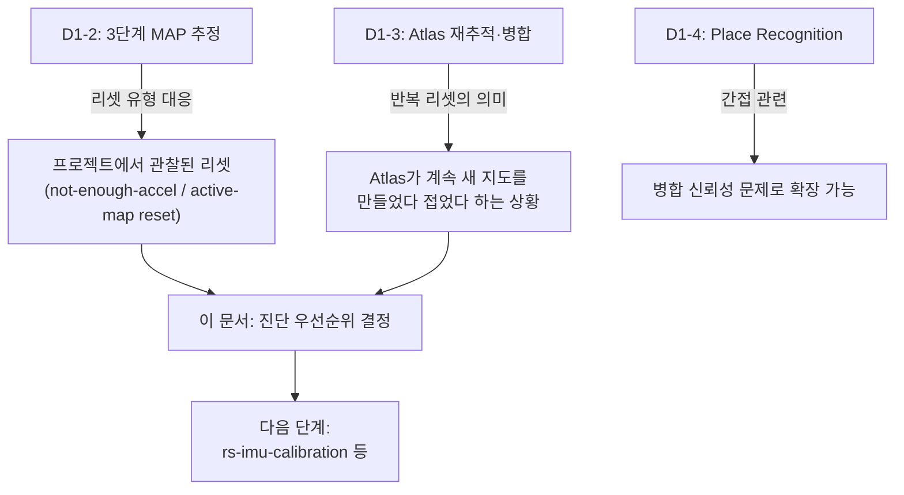

# SLAM 백엔드 - 이 프로젝트의 VIO 이슈 재해석

> 이 문서를 읽으면 D1-1~D1-4에서 배운 ORB-SLAM3의 이론적 구조(스레드, 초기화 알고리즘, Atlas, Place Recognition)를 근거로, 이 프로젝트에서 실제로 관찰된 VIO(Visual-Inertial Odometry) 리셋 현상을 어떻게 진단하고 우선순위를 매겼는지 이해하게 된다.

## 문서 정보

| 항목 | 내용 |
|---|---|
| 학습 단계 | Level 4 — SLAM 백엔드 심화 (D1 시리즈 마지막, 사례 연구) |
| 예상 선행 지식 | [[D1-1_ORB-SLAM3_시스템_개요|SLAM 백엔드 - D1-1]](시스템 구조), `D1-2`(초기화 알고리즘), `D1-3`(Atlas 재추적·병합), `D1-4`(Place Recognition) 전체 |
| 학습 목표 | 이 프로젝트의 VIO 리셋 진단 이력을 시간순으로 설명할 수 있다 / 각 진단 단계가 D1-1~D1-4의 어떤 개념과 대응되는지 연결할 수 있다 / 다음 진단 단계의 우선순위와 그 근거를 설명할 수 있다 |
| 기준 환경 | ORB-SLAM3 RGB-D-Inertial 모드, Jetson 기반 Yahboom X3, RealSense D435i |
| 관련 문서 | 이전: [[D1-4_Loop_Closing과_Place_Recognition|SLAM 백엔드 - D1-4. Loop Closing과 Place Recognition]] / 다음: [[C7_Relocalization_감시_로직_구현|C7. Relocalization 감시 로직 구현]] |

> 이 문서는 D1-1~D1-4에서 정리한 논문 근거를 바탕으로 `[[ros2-nav-yahboom]]`의 실제 진단 이력을 재해석한 것이다. **결론이 확정된 문서가 아니라 현재까지의 진단 상태 기록**이며, 새로운 진단이 나오면 갱신이 필요하다.

---

## 1. 먼저 알아야 할 핵심

1. 이 프로젝트는 Jetson에서 RGB-D-Inertial(VIO) 모드를 시도했으나 초기화가 반복 실패했고, IMU를 끈 RGB-D 전용 모드는 정상 동작했다 — 이 대비가 모든 진단의 출발점이다.
2. "IMU 자극(움직임)이 부족해서 실패한다"는 첫 가설은, 자극이 충분한 데이터에서도 여전히 실패가 발생해 **배제되었다.**
3. 게이팅(가속도·이동거리 조건)을 개별적으로 비활성화하면 해당 리셋 유형은 사라지지만, **"active-map IMU reset"만은 조건과 무관하게 계속 남는다** — 이는 D1-2에서 배운 "게이팅 통과 여부와 별개로 최적화 자체가 수렴하지 못할 수 있다"는 구조와 정확히 일치한다.
4. D1-1~D1-4의 개념 틀로 다시 읽으면, 이 리셋은 **버그라기보다는 ORB-SLAM3의 3단계 초기화(D1-2)가 반복적으로 성공 판정을 받지 못하는 상태**로 해석된다.
5. **[정정]** 이 프로젝트는 과거 실측에서 stereo-inertial 모드가 RGB-D-Inertial보다 초기화·리셋 문제가 뚜렷이 덜하다는 경향을 이미 확인한 바 있다. D1-2에서 새로 밝혀졌듯 이는 "RGB-D가 스케일을 몰라서"가 아니라 **RGB-D-Inertial 자체가 ORB-SLAM3 공식 지원 조합이 아닌 비공식 커뮤니티 확장이기 때문**일 가능성이 크다 — 그래서 현재 우선순위 1위는 `rs-imu-calibration`이 아니라 **stereo-inertial 재검토**로 조정됐다(12장 참고).

---

## 2. 이 개념은 무엇인가

이 문서는 새로운 이론 개념을 소개하는 문서가 아니라, **D1-1~D1-4에서 배운 개념들을 렌즈 삼아 실제 진단 로그를 다시 읽는 사례 연구(case study)**다. 즉 "이론을 배웠으니, 그 이론으로 실제 현상을 설명할 수 있는가"를 확인하는 문서로 이해하면 된다.

**비유로 이해하기**

의사가 환자의 증상을 진단하는 과정을 떠올려보자.

- 처음에는 증상만 보고 흔한 원인(운동 부족)을 의심했다("IMU 자극 부족" 가설) — 하지만 운동을 충분히 했다는 환자에게도 같은 증상이 계속 나타나 이 가설은 기각됐다.
- 다음으로 몇 가지 개별 검사(게이팅 개별 비활성화)를 해보니, 일부 증상은 사라졌지만 핵심 증상(active-map IMU reset) 하나는 검사 결과와 무관하게 계속 남았다.
- 이 시점에서 의사는 해부학·생리학 교과서(D1-1~D1-4에서 배운 논문 근거)를 다시 펼쳐, "이 핵심 증상이 몸의 어느 시스템에서 비롯되는지"를 체계적으로 대응시킨다 — 그 결과 "게이팅(입구 조건)의 문제가 아니라, 그 이후 단계(내부 대사 과정 — 2·3단계 최적화)의 문제일 가능성이 크다"는 결론에 이른다.
- 마지막으로, 아직 검사하지 않은 항목(IMU 공장 보정) 중 이론적으로 가장 관련성이 높아 보이는 것부터 다음 검사 순서를 정한다.

**비유가 실제와 다른 부분**

- 의사의 진단은 대체로 몸 안을 직접 들여다볼 수 없어 간접 증거에 의존하지만, 이 문서의 진단은 로그와 설정값을 통해 알고리즘 내부 단계(1/2/3단계 중 어디)를 상당히 구체적으로 좁혀볼 수 있다는 점에서 더 체계적이다.
- 이 문서의 결론은 의사의 최종 진단처럼 확정된 것이 아니라, 문서 서두에 명시했듯 **"현재까지의 진단 상태 기록"**이며 다음 검사(rs-imu-calibration 등) 결과에 따라 갱신될 수 있다.

---

## 3. 왜 필요한가

**SLAM 시스템 관점 (이런 사례 연구가 없다면)**

- D1-1~D1-4에서 배운 이론이 실제 프로젝트의 현상과 연결되지 않으면, "논문은 이해했지만 우리 로봇이 왜 이러는지는 여전히 모른다"는 상태에 머무르게 된다. 이 문서는 이론과 실전 사이의 다리 역할을 한다.
- 진단 이력을 시간순으로 기록해두지 않으면, 이미 배제한 가설(자극 부족)을 나중에 또 다른 사람이 처음부터 다시 검토하는 시간 낭비가 생길 수 있다.

**실제 로봇 관점 (Yahboom X3 기준)**

- 이 프로젝트는 결국 "ORB-SLAM3 RGB-D+IMU를 실제 배포 후보로 쓸 것인가"를 결정해야 한다. 이 문서는 현재 시점에서 그 답이 "아니오"이며, 그 근거와 다음에 확인해야 할 항목이 무엇인지를 명확히 정리해 향후 의사결정의 기준점을 제공한다.

---

## 4. ROS2 시스템에서의 위치



**그림 읽는 방법**

- 이 그림은 지금까지 배운 세 문서(D1-2, D1-3, D1-4)가 각각 이 프로젝트의 어떤 관찰과 연결되는지를 보여준다 — 즉 이 문서는 새로운 상자를 추가하는 게 아니라, **기존 상자들을 프로젝트 현실과 잇는 화살표**를 그리는 문서다.
- 최종적으로 이 모든 연결이 "다음에 무엇을 검사할지"라는 실행 가능한 결론(`rs-imu-calibration` 등)으로 수렴한다는 점이 이 문서의 목적이다.

---

## 5. 주요 구성 요소

| 구성 요소 | 역할 | 관련 문서 |
|---|---|---|
| "not enough acceleration" 리셋 | 2단계 진입 조건(게이팅)에서 걸러지는 리셋 유형 | D1-2 |
| "active-map IMU reset" | 게이팅과 무관하게 남는, Local Mapping 재초기화 | D1-1, D1-2 |
| `IMU.fastInit` | 게이팅을 완화하는 빠른 초기화 옵션(진단에 사용, 근본 해결은 아니었음) | D1-2 |
| `rs-imu-calibration` | D435i IMU 공장 보정 — 2순위 미시도 변수(기존 1순위에서 하향 조정) | D1-2(2단계 입력 품질) |
| RGB-D-Inertial 비공식 확장 여부 | ORB-SLAM3 공식 저장소가 RGB-D-Inertial을 지원 조합으로 명시하지 않는다는 사실 | D1-2 12장 |
| stereo-inertial 재검토 | 공식 지원·검증 대상인 조합으로 재전환하는 방안 — 현재 1순위 | D1-2 12장 |
| Loosely-coupled 대안 (Intel 참조 파이프라인) | ORB-SLAM3식 강결합 대신 필터 기반으로 IMU를 느슨하게 융합하는 방식 | D1-2와 대비되는 설계 선택 |

---

## 6. 기본 동작 과정 (지금까지의 진단 이력, 시간순)

1. Jetson에서 RGB-D-Inertial(VIO) 모드 초기화 실패 확인, RGB-D 전용(Inertial=false)은 정상임을 먼저 확인.
2. 초기 가설(IMU 가속도 자극 부족)을 세웠으나, 자극이 충분한(98%) bag에서도 다수 리셋이 발생해 가설 단독으로는 불충분하다고 판단.
3. `IMU.fastInit` 진단 구현: 최선의 경우도 7회 리셋(엄격 기준 기준으로도 실패), vocabulary warm-up을 추가하면 오히려 악화(25~67회). 동일 입력을 RGB-D 전용으로 돌리면 0회 리셋이라는 대비를 재확인.
4. 외부 자료를 통해 "D435i에서 VO는 되는데 VIO는 실패"하는 패턴이 이 환경만의 문제가 아니라 널리 보고된 알려진 이슈임을 확인. Intel 자체 참조 파이프라인도 ORB-SLAM3식 강결합 대신 loosely-coupled 방식을 쓰며, D435i IMU가 공장 미보정 상태(`rs-imu-calibration` 미시도)라는 점도 함께 확인.
5. `fastInit` 구현 버그(Settings API 경로)를 발견·수정한 뒤 재측정: 가속도 게이트·이동거리 게이트를 각각 개별 비활성화하면 해당 리셋 유형은 사라지지만, **"active-map IMU reset"은 조건과 무관하게 지속**됨을 확인. 실제 물리적 pitch/yaw 자극이 있는 bag에서도(두 게이트 모두 통과) 10회 발생, 재생 속도를 절반으로 낮춰도 동일하게 재현됨.
6. **[정정, 이후 추가 진단]** 과거 stereo-inertial 실측에서는 초기화·리셋 문제가 RGB-D-Inertial보다 뚜렷이 덜했다는 사실을 다시 검토. 처음에는 "RGB-D는 스케일을 몰라서 초기화 부담이 크다"는 가설로 설명했으나, 이는 RGB-D가 depth로 스케일을 이미 안다는 SLAM 일반 원리와 맞지 않는다는 지적을 받고 재조사. 그 결과 **ORB-SLAM3 공식 저장소가 지원을 명시하는 조합은 monocular / monocular-inertial / stereo / stereo-inertial / RGB-D뿐이며, RGB-D-Inertial은 원저자가 설계·검증하지 않은 커뮤니티 비공식 확장**이라는 사실을 확인함(근거는 D1-2 12장). D435i를 RGB-D+IMU로 쓴 제3자 보고에서도 동일한 성능 저하가 보고되어 이 프로젝트의 경험과 일치.

---

## 7. 진단 재현 실습

이 문서는 새 개념을 실습하는 대신, **위 6장의 진단 이력을 직접 재현하며 D1-2·D1-3에서 배운 로그 읽는 법을 실전에 적용해보는 실습**으로 진행한다.

### 실습 목표

동일한 bag을 RGB-D 전용 모드와 RGB-D-Inertial 모드로 각각 실행해, 리셋 횟수 차이를 직접 재현하고 D1-2의 3단계 중 어디서 실패가 몰려있는지 확인한다.

### 준비 사항

* pitch/yaw 자극이 포함된 것으로 확인된 rosbag
* D1-2 실습에서 사용한 것과 동일한 로그 저장 절차

### 실행

```bash
# 1) RGB-D 전용 모드 (대조군)
ros2 bag play stimulus_test.bag &
ros2 run orb_slam3_ros rgbd --ros-args -p use_imu:=false 2>&1 | tee rgbd_only.log

# 2) RGB-D-Inertial 모드 (실험군)
ros2 bag play stimulus_test.bag --rate 0.5 &
ros2 run orb_slam3_ros rgbd_inertial --ros-args -p use_imu:=true 2>&1 | tee rgbd_inertial.log
```

* 이 명령어가 하는 일: 같은 bag을 IMU 없이/있이 각각 실행해 리셋 횟수를 직접 비교한다. 두 번째 실행은 6장 5단계에서 언급한 "재생 속도를 절반으로 낮춰도 동일" 재현을 위해 `--rate 0.5`를 포함했다.

### 확인

```bash
echo "RGB-D only resets:"; grep -ci "reset" rgbd_only.log
echo "RGB-D-Inertial resets:"; grep -ci "reset" rgbd_inertial.log
grep -i "gate\|excitation" rgbd_inertial.log
```

* 이 명령어가 하는 일: 두 로그의 리셋 횟수를 각각 세어 비교하고, RGB-D-Inertial 로그에서 게이팅 통과 여부를 확인한다.

### 예상 결과

- RGB-D 전용 모드는 0회에 가까운 리셋, RGB-D-Inertial 모드는 여러 차례의 리셋이 나타나는 것이 6장 3, 5단계에서 이미 확인된 패턴과 일치한다.
- 게이팅 관련 로그(`gate`, `excitation`)가 "통과"로 나타나는데도 리셋이 발생한다면, 이는 6장 5단계의 핵심 관찰(게이팅과 무관한 리셋)이 재현된 것이며, D1-2에서 배운 대로 **문제가 2·3단계의 수렴/입력 품질에 있다는 근거**가 하나 더 쌓인 셈이다.

---

## 8. 코드 및 설정 해설: 논문 근거로 다시 읽기

### 8.1 "active-map IMU reset"은 정확히 무엇을 가리키는가 (D1-1, D1-2)

D1-1에서 확인했듯, VI 모드의 IMU 초기화는 **Local Mapping Thread**에서 실행된다. D1-2의 3단계 MAP 추정(Vision-only → Inertial-only → Visual-Inertial) 중 어느 단계든 시스템이 정의한 성공 기준을 통과하지 못하면, Local Mapping은 그 활성 지도(active map)에 대한 초기화를 처음부터 다시 시도한다. 즉 이 프로젝트에서 관찰된 "active-map IMU reset"이라는 현상은 **논문의 3단계 MAP 추정 파이프라인이 반복적으로 수렴·검증에 실패하고 있다는 신호**로 정확히 대응된다 — 별도의 버그라기보다는, 이 알고리즘이 설계상 갖고 있는 "실패 시 재시도" 메커니즘(D1-3에서 배운 "실패 시 새 지도 생성"과 같은 계열)이 비정상적으로 자주 발동하고 있는 상태다.

### 8.2 왜 게이팅(자극/이동거리)을 다 통과해도 리셋이 남는가

D1-2의 "리셋 유형 대응표"에서 짚었듯, 게이팅은 **2단계 진입 조건**에 해당한다. 게이팅을 통과했는데도 리셋이 남는다는 것은, 문제가 "충분히 움직였는가"가 아니라 **1단계(Vision-only)에서 만들어지는 입력 궤적의 품질**, 또는 **2~3단계 최적화 자체가 수렴 기준(성공 판정)을 만족하지 못하는 것**에 있을 가능성이 크다는 뜻이다. 이는 원래 가설(자극 부족)이 배제된 것과 정확히 일치하는 결론이다.

### 8.3 D435i 이슈와의 연결 (D1-1, D1-2 공통)

외부 자료가 확인한 "D435i는 VO는 되는데 VIO는 실패"라는 패턴은, D1-2의 알고리즘 관점에서 다음과 같이 재해석할 수 있다: **Vision-only MAP Estimation(1단계) 자체는 D435i RGB-D로 안정적으로 잘 되지만(RGB-D 전용 모드 0회 리셋이 이를 뒷받침), 그 위에 얹는 Inertial-only MAP Estimation(2단계)이 D435i의 (공장 미보정) IMU 노이즈 특성과 잘 맞지 않을 가능성**이 있다. Intel이 자사 파이프라인에서 ORB-SLAM3식 강결합 대신 loosely-coupled(imu_filter_madgwick + rtabmap_ros + robot_localization) 방식을 택한 것도, 이런 IMU 품질 문제를 강결합 MAP 추정 대신 훨씬 관대한 필터링으로 우회하려는 설계 선택으로 이해할 수 있다.

### 8.4 [정정] "RGB-D는 스케일을 몰라서 불리하다"는 처음 설명은 틀렸다

6장 6단계에서 다시 짚었듯, 이 문서는 원래 "stereo-inertial이 RGB-D-Inertial보다 안정적인 이유는 RGB-D가 스케일을 모르기 때문"이라는 설명으로 이어질 뻔했다. 이는 사실과 반대다 — **RGB-D는 depth로 스케일을 이미 알고 있다**(D1-2 1장). 실제 원인은 스케일 유무가 아니라 **구현 성숙도**다.

- ORB-SLAM3 공식 저장소가 지원을 명시하는 조합은 monocular, monocular-inertial, **stereo, stereo-inertial**, RGB-D뿐이다 — RGB-D-Inertial은 원저자가 설계·검증한 조합이 아니다.
- RGB-D-Inertial을 지원하는 저장소는 전부 커뮤니티가 얹은 비공식 포크이며, D1-2의 3단계 MAP 기반 IMU 초기화가 이 조합을 대상으로 검증됐다는 근거가 없다.
- 반면 **stereo-inertial은 원 논문이 직접 검증한 조합**이며, 8.1~8.2절에서 다룬 "성공 판정 기준"도 이 조합을 기준으로 튜닝됐을 가능성이 크다.

즉 이 프로젝트가 겪은 "active-map IMU reset"은, D1-2 12장에서 정리했듯 **RGB-D-Inertial이라는 미검증 조합에서 2·3단계 성공 판정 기준이 애초에 잘 맞지 않았을 가능성**으로 재해석해야 한다. 이는 6장 2~5단계에서 시도한 게이팅 조정, `fastInit` 등 **조합 자체는 그대로 두고 파라미터만 조정하는 접근이 왜 근본적인 해결에 이르지 못했는지**도 설명한다 — 문제가 파라미터가 아니라 조합 자체의 미검증 상태에 있었다면, 파라미터를 아무리 조정해도 한계가 있다.

---

## 9. 자주 사용하는 명령어

| 목적 | 명령어 | 설명 |
|---|---|---|
| 두 모드 리셋 횟수 비교 | `grep -ci "reset" *.log` | RGB-D 전용/Inertial 로그를 한 번에 비교 |
| 게이팅 통과 여부만 추출 | `grep -i "gate.*pass\|excitation.*ok"` (문구는 구현별 상이) | 게이팅 통과와 리셋 발생의 시간 순서 대조 |
| 재생 속도별 재현성 확인 | `ros2 bag play stimulus_test.bag --rate <값>` | 6장 5단계처럼 속도를 바꿔도 리셋이 재현되는지 확인 |
| IMU 공장 보정 실행 (다음 단계) | `rs-imu-calibration` (RealSense SDK 제공 도구) | 이 문서가 제시하는 최우선 미시도 변수 |

---

## 10. 자주 발생하는 문제

### 문제: 게이팅을 완화(`IMU.fastInit`)했더니 리셋이 오히려 늘어남

**증상**

`fastInit`을 켜고 vocabulary warm-up을 추가했더니 리셋이 7회에서 25~67회로 악화됨.

**가능한 원인**

게이팅 완화는 "충분히 움직이지 않았어도 2단계로 넘어가게" 만들 뿐, 2단계 자체의 수렴 문제를 해결하지 못한다. 오히려 준비되지 않은 입력으로 2단계를 더 자주 시도하게 되어 실패 횟수만 늘어난 것으로 해석된다.

**확인 방법**

`fastInit` 켠 로그와 끈 로그에서 2단계 진입 빈도와 실패 빈도를 각각 비교한다.

**해결 방법**

이 문서 6장의 결론대로, 게이팅 완화는 근본 해결책이 아니다. `rs-imu-calibration` 등 2단계 입력 품질 자체를 개선하는 방향으로 전환한다.

**초보자가 자주 하는 실수**

"리셋이 잦다 → 조건을 완화해서 더 쉽게 통과시키면 되겠다"는 접근은 이 사례에서 정반대 결과를 냈다. 게이팅은 입구 조건일 뿐, 문제의 원인이 입구가 아니라 그 이후 단계에 있다면 입구를 넓혀도 소용없다는 것을 기억해야 한다.

### 문제: "새 지도가 계속 생긴다"와 "IMU 초기화가 반복 실패한다"를 같은 문제로 착각함

**증상**

로그 분석 없이 "지도가 자꾸 새로 생기니 Atlas 자체에 문제가 있다"고 결론 내림.

**가능한 원인**

D1-3에서 배운 "Tracking 유실 → 새 지도 생성"과, 이 문서·D1-2에서 배운 "IMU 초기화 실패 → 재시도"는 겉보기 로그(새 map 관련 메시지)가 비슷해 혼동하기 쉽다.

**해결 방법**

D1-2, D1-3 진단 실습에서 익힌 대로, 로그에서 `track lost`(D1-3 원인)와 `imu init` 실패(D1-2, 이 문서 원인) 메시지를 구분해서 읽어야 한다. 이 프로젝트의 사례는 후자(IMU 초기화 실패)가 핵심 원인으로 좁혀졌다.

---

## 11. 개념 간 연결

* 이 문서는 D1-1(시스템 구조)·D1-2(초기화 알고리즘)·D1-3(Atlas)의 개념 틀로, 기존에 나열식으로만 정리했던 진단 이력을 다시 읽은 결과다 — 네 문서를 순서대로 읽지 않았다면 이 문서의 "8장. 논문 근거로 다시 읽기"가 왜 이런 결론에 도달하는지 따라가기 어렵다.
* D1-4(Place Recognition)는 이 문서에서 직접 다루는 리셋 원인은 아니지만, 만약 향후 Atlas 병합의 신뢰성 문제로 진단 범위가 넓어진다면 D1-4의 개념이 다시 필요해진다.
* 다음 문서([[C7_Relocalization_감시_로직_구현|C7]])는 SLAM 백엔드가 RTAB-Map이든 ORB-SLAM3든 공통으로 필요한 감시 로직을 다룬다 — 이 문서의 결론(ORB-SLAM3 VIO 미채택)에 따라, 그 구현은 현재 RTAB-Map 기준으로 유지된다.

---

## 12. 한 단계 더 깊게 보기

> **심화 학습**
>
> 이 부분은 D1-1~D1-4를 모두 읽은 후 보는 것을 권장한다.

**현재 결정 사항 (8.4절 정정 반영)**

- ORB-SLAM3 **RGB-D-Inertial**은 R4(loop closure 후보) 또는 Jetson 실환경 VIO 후보로 승격되지 않는다 — 8.4절에서 확인했듯 이 조합 자체가 원저자 미검증 비공식 확장이기 때문이다.
- ORB-SLAM3 **stereo-inertial**은 공식 지원·검증 조합이며, 이 프로젝트의 과거 실측에서도 리셋 문제가 뚜렷이 덜했으므로 재검토 우선순위가 가장 높다.
- 미시도 변수 `rs-imu-calibration`(D435i IMU 공장 보정)은 여전히 유효한 후보이지만, RGB-D-Inertial 조합 자체의 미검증 상태를 해결해주지는 못하므로 2순위로 조정한다.
- 다음 단계 후보(기존과 동일): 더 나은 관측 가능성(observability)을 가진 bag으로 재검증, 또는 IR 스테레오+IMU 기반 다른 R3 백엔드의 Jetson 적합성 확인.

**이 문서가 새로 제시하는 진단 우선순위 (D1-1~D1-4 근거 + 8.4절 정정 반영)**

1. **stereo-inertial 재검토** — 8.4절에서 확인했듯, ORB-SLAM3가 공식적으로 설계·검증한 조합으로 되돌아가는 것이 RGB-D-Inertial의 미검증 상태 자체를 우회하는 가장 직접적인 방법이다. 과거 실측에서 이미 이 방향이 유리하다는 신호가 있었다.
2. **`rs-imu-calibration` 실행** — 8.3절에서 짚은 2단계 입력 품질 개선 변수. RGB-D-Inertial을 계속 시도할 경우 여전히 유효한 다음 단계이지만, 조합 자체의 미검증 문제를 해결하지는 못한다는 한계를 인지하고 접근한다.
3. **1단계(Vision-only) 출력 품질 자체를 별도로 검증** — RGB-D 전용 모드가 잘 되는 것과, VI 모드의 1단계가 실제로 동일한 품질의 궤적을 만드는지는 다른 질문이다. 두 모드의 초기 키프레임 궤적을 직접 비교해볼 가치가 있다.
4. **성공 판정 기준 자체 조사** — "게이팅을 통과했는데도 재시도된다"는 것은, ORB-SLAM3 내부에 게이팅과 별개의 수렴 판정 로직(예: 스케일/중력 오차 임계값)이 있고, 이 로직이 stereo-inertial 기준으로 튜닝되어 RGB-D-Inertial 환경에서 유독 엄격하게 작동할 가능성을 시사한다 — 소스 레벨에서 이 판정 로직을 직접 확인하는 것이 다음 논리적 단계다.

---

## 13. 핵심 요약

1. 이 프로젝트의 VIO 리셋은 "IMU 자극 부족" 가설이 배제되고, 게이팅과 무관하게 남는 "active-map IMU reset"으로 원인이 좁혀졌다.
2. D1-1~D1-2의 개념으로 재해석하면, 이는 3단계 MAP 추정 파이프라인이 반복적으로 성공 판정을 받지 못하는 상태이며, 별도의 버그가 아니라 설계된 재시도 메커니즘이 과도하게 발동하는 것이다.
3. 게이팅 완화(`fastInit`)는 문제를 해결하지 못했고 오히려 악화시킨 사례도 있었다 — 입구 조건 완화가 그 이후 단계의 문제를 고치지는 못한다는 반증이다.
4. **[정정]** "RGB-D가 스케일을 몰라서 리셋이 잦다"는 초기 추정은 틀렸다 — RGB-D는 depth로 스케일을 이미 안다. 실제 원인은 **RGB-D-Inertial 자체가 ORB-SLAM3 공식 지원·검증 조합이 아닌 비공식 커뮤니티 확장**이라는 점일 가능성이 크며, stereo-inertial은 공식 검증 대상이라는 차이가 실측에서 관찰된 격차를 더 잘 설명한다.
5. 현재 결론은 ORB-SLAM3 RGB-D-Inertial을 배포 후보로 채택하지 않는 것이며, 다음 우선순위는 (1) stereo-inertial 재검토, (2) `rs-imu-calibration` 실행 순으로 조정됐다.

---

## 14. 이해도 점검

1. "IMU 자극 부족" 가설이 배제된 근거는 무엇인가?
2. "active-map IMU reset"이 게이팅 조건과 무관하게 남는다는 관찰은 D1-2의 어느 단계 문제를 시사하는가?
3. `IMU.fastInit`(게이팅 완화)을 적용했을 때 실제로 어떤 결과가 나왔으며, 이것이 시사하는 바는 무엇인가?
4. 이 프로젝트에서 현재 우선순위가 가장 높은 미시도 변수는 무엇이고, 그 근거는 무엇인가?
5. 이 문서의 결론(ORB-SLAM3 RGB-D-Inertial 미채택)은 왜 "확정된 결론"이 아니라 "현재까지의 진단 상태 기록"이라고 표현되는가?
6. "RGB-D는 스케일을 몰라서 stereo-inertial보다 리셋이 잦다"는 초기 설명이 왜 틀렸는가?

> [!info]- 정답 및 해설 보기
> 1. IMU 가속도 자극이 충분한(98%) bag에서도 여전히 다수의 리셋이 발생해, 자극 부족만으로는 현상을 설명할 수 없었기 때문이다.
> 2. 게이팅은 2단계 진입 조건일 뿐이므로, 이를 통과해도 리셋이 남는다는 것은 문제가 1단계 입력 품질 또는 2~3단계의 수렴 기준 자체에 있을 가능성을 시사한다.
> 3. 게이팅을 완화했음에도 리셋 횟수가 줄지 않았고, vocabulary warm-up을 추가하자 오히려 25~67회로 악화됐다 — 이는 문제의 원인이 게이팅(입구 조건)이 아니라 그 이후 단계에 있음을 뒷받침한다.
> 4. **stereo-inertial 재검토**다. 근거는 ORB-SLAM3가 공식적으로 설계·검증한 조합이며, 이 프로젝트의 과거 실측에서도 이미 RGB-D-Inertial보다 안정적이었다는 신호가 있었기 때문이다. `rs-imu-calibration`(D435i IMU 공장 보정)은 2순위로, RGB-D-Inertial을 계속 시도할 경우에만 의미가 있는 차선책이다.
> 5. 이 문서는 지금까지의 로그와 실험으로 원인을 좁힌 상태를 기록한 것일 뿐, stereo-inertial 재검토나 `rs-imu-calibration` 등 아직 시도하지 않은 검증이 남아 있어 그 결과에 따라 결론이 달라질 수 있기 때문이다.
> 6. RGB-D는 depth 정보로 스케일을 이미 알고 있어, "스케일을 모른다"는 전제 자체가 사실이 아니기 때문이다. 실제 격차의 원인은 스케일 유무가 아니라, stereo-inertial은 ORB-SLAM3 공식 지원·검증 조합인 반면 RGB-D-Inertial은 원저자가 검증하지 않은 비공식 커뮤니티 확장이라는 구현 성숙도 차이로 보는 것이 더 설득력 있다.

---

## 15. 다음 학습 주제

1. **바로 다음**: `SLAM 백엔드 - D2-1. OpenVINS 개요와 MSCKF 알고리즘 원리` — 같은 문제(카메라+IMU로 위치 추정)를 필터라는 완전히 다른 방식으로 푸는 계열로 넘어간다.
2. **함께 보면 좋은 주제**: [[C7_Relocalization_감시_로직_구현|C7. Relocalization 감시 로직 구현]] — 이 문서의 결론(ORB-SLAM3 VIO 미채택)에 따라, 현재 RTAB-Map 기준으로 유지되는 감시 로직 구현을 다룬다.
2. **함께 보면 좋은 주제**: [[D1-2_Visual-Inertial_초기화_알고리즘|SLAM 백엔드 - D1-2. Visual-Inertial 초기화 알고리즘]] — 이 문서의 8장에서 반복 인용한 3단계 알고리즘을 다시 복습하면 진단 근거가 더 명확해진다.
3. **나중에 학습할 심화 주제**: `rs-imu-calibration` 실행 결과가 나오면, 이 문서를 갱신하거나 후속 문서(D1-6 등)로 이어서 정리하는 것을 검토한다.

---

## 16. 참고자료

| 구분 | 자료 | 핵심 내용 |
|---|---|---|
| 시리즈 내부 문서 | D1-1~D1-4 및 그 안의 1차 논문 출처 | 이 문서 8장의 재해석 전체의 이론적 근거 |
| 시리즈 내부 문서 | [[D1-2_Visual-Inertial_초기화_알고리즘|SLAM 백엔드 - D1-2]] 12장 | RGB-D-Inertial 비공식 확장 정정의 원본 근거(README 인용, 커뮤니티 포크 목록) |
| 프로젝트 진단 노트 | `[[ros2-nav-yahboom]]` | 전체 진단 이력 원본, `IMU.fastInit` 구현 및 게이팅 격리 테스트 상세 로그, stereo-inertial 대비 실측 비교 |
| 외부 자료 | RealSense D435i VIO 관련 커뮤니티 이슈 아카이브 | "VO는 되는데 VIO는 실패"하는 패턴이 이 환경만의 문제가 아님을 뒷받침하는 근거 |
| 공식 저장소 | [GitHub UZ-SLAMLab/ORB_SLAM3](https://github.com/UZ-SLAMLab/ORB_SLAM3) README | 공식 지원 조합에 RGB-D-Inertial이 없다는 사실 확인 |
