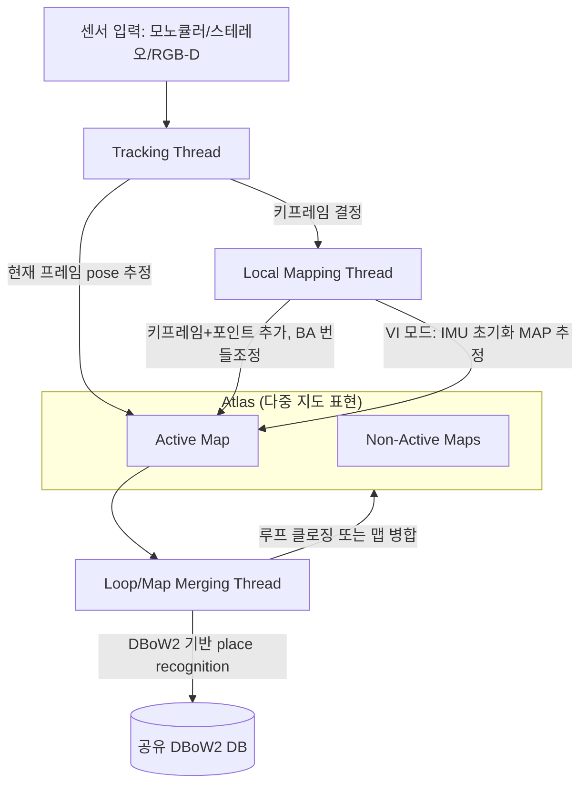
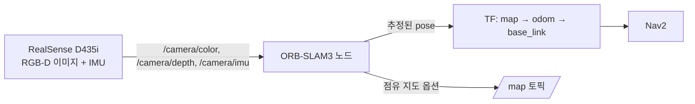

# SLAM 백엔드 - ORB-SLAM3 시스템 개요

> 이 문서를 읽으면 ORB-SLAM3가 내부적으로 어떤 세 개의 스레드로 나뉘어 동작하는지, Atlas라는 다중 지도 구조가 왜 필요한지, 그리고 RTAB-Map과 근본적으로 무엇이 다른 설계인지 이해하게 된다.

## 문서 정보

| 항목 | 내용 |
|---|---|
| 학습 단계 | Level 4 — SLAM 백엔드 심화 |
| 예상 선행 지식 | [[D0-1_D_시리즈를_위한_최소_수학|D0-1. D 시리즈를 위한 최소 수학]], [[D0-2_특징점_검출_기술자_매칭_비교|D0-2. 특징점 검출·기술자·매칭 비교]], [[00_SLAM이란_무엇이고_왜_쓰는가|SLAM 공통 기초 - 00. SLAM이란 무엇이고 왜 쓰는가]](SLAM 일반 개념, 프론트엔드/백엔드 구분), [[A1_RTAB-Map_매핑_원리|A1. RTAB-Map 매핑 원리]](그래프 기반 SLAM, Loop Closure 개념), [[07_TF2_기초|ROS2 기초 - 07. TF2 기초]](좌표계 개념) |
| 학습 목표 | ORB-SLAM3의 세 가지 병렬 스레드(Tracking/Local Mapping/Loop&Map Merging)의 역할을 설명할 수 있다 / Atlas가 무엇이고 왜 필요한지 설명할 수 있다 / RTAB-Map과 ORB-SLAM3의 구조적 차이를 비교할 수 있다 |
| 기준 환경 | ORB-SLAM3 (RGB-D / RGB-D-Inertial 모드), Yahboom X3 (RealSense D435i) |
| 관련 문서 | 이전: [[A1_RTAB-Map_매핑_원리|A1. RTAB-Map 매핑 원리]] / 다음: [[D1-2_Visual-Inertial_초기화_알고리즘|SLAM 백엔드 - D1-2. Visual-Inertial 초기화 알고리즘]] |

> 이 문서부터 D1-5까지는 ORB-SLAM3 공식 GitHub 저장소(UZ-SLAMLab/ORB_SLAM3)가 1차 인용 문헌으로 명시하는 논문을 근거로 구조를 정리한 시리즈다.
> 참고 논문: Campos et al., "ORB-SLAM3: An Accurate Open-Source Library for Visual, Visual-Inertial and Multi-Map SLAM," IEEE T-RO, 2021 ([arXiv:2007.11898](https://arxiv.org/abs/2007.11898))

---

## 1. 먼저 알아야 할 핵심

1. ORB-SLAM3는 하나의 프로그램이 순서대로 실행되는 것이 아니라, **세 개의 스레드(Tracking, Local Mapping, Loop and Map Merging)가 동시에 병렬로 돌아가는** 시스템이다.
2. ORB-SLAM3는 지도를 하나만 유지하지 않는다. **Atlas**라는 "여러 개의 분리된 지도들의 집합"을 관리하며, 그중 하나만 지금 위치를 추정하는 데 쓰이는 **Active Map**이다.
3. 위치를 잃어버리면(tracking loss) RTAB-Map처럼 계속 같은 지도 안에서 헤매지 않고, **일정 시간 실패가 지속되면 아예 새로운 지도를 처음부터 만든다.** 이후 예전에 지나간 곳을 다시 만나면 두 지도를 합친다.
4. 세 스레드는 하나의 통합된 place recognition 데이터베이스(**DBoW2** — 이미지의 시각적 특징을 "단어" 형태로 저장해두고, 비슷한 장면을 빠르게 검색해주는 라이브러리. D1-4에서 자세히 다룸)를 공유하며, 이 데이터베이스가 relocalization·루프 클로징·지도 병합에 공통으로 쓰인다.
5. 이 프로젝트(Yahboom X3)는 RGB-D 또는 RGB-D-Inertial 모드를 쓰므로, 세 스레드 중 **Tracking**과 **Local Mapping**이 가장 밀접하게 관련되고, Loop/Map Merging은 같은 장소를 여러 번 방문하거나 위치를 잃었다가 되찾는 상황에서만 본격적으로 작동한다.

---

## 2. 이 개념은 무엇인가

ORB-SLAM3는 카메라(와 선택적으로 IMU)의 입력만으로 **지도를 만들면서 동시에 로봇의 현재 위치를 추정**하는 SLAM 라이브러리다. A1에서 다룬 RTAB-Map과 목적은 같지만, 내부 구조를 세 개의 독립적인 스레드로 명확히 분리하고, 지도 자체를 하나가 아니라 **여러 개를 동시에 들고 다닐 수 있게(Atlas)** 설계했다는 점이 가장 큰 차이다.



> **용어 1 — 키프레임(keyframe)**: 카메라는 초당 수십 장의 프레임을 쏟아내지만, **그걸 다 지도에 저장하면 낭비이고 계산도 감당이 안 된다.** 그래서 "충분히 새로운 장면을 담고 있다"고 판단되는 프레임만 골라 지도에 영구 저장하는데, 이렇게 선별된 프레임이 키프레임이다. A1(RTAB-Map)에서 그래프의 "노드"라 부르던 것과 대응되는 개념으로 보면 된다. 이후 D 시리즈 전체가 이 단위로 이야기한다.
>
> **용어 2 — BA(Bundle Adjustment, 번들 조정)**: 여러 프레임에서 관측한 카메라 pose와 3D 포인트들을 한꺼번에 놓고 오차가 가장 작아지도록 미세 조정하는 최적화 기법이다. 6장에서 실행 순서와 함께 다시 다룬다.
>
> **용어 3 — MAP 추정**: 각 측정값이 얼마나 믿을 만한지(불확실성)까지 계산에 넣어 "가장 그럴듯한 값"을 찾는 방식이다. 자세한 것은 D1-2가 주제로 다루며, 배경은 [[D0-1_D_시리즈를_위한_최소_수학|D0-1]] 2장에 정리되어 있다.

**비유로 이해하기**

탐험대가 미지의 동굴 지도를 그리는 상황을 떠올려보자.

- **정찰대원(Tracking)**은 지금 손전등이 비추는 곳을 보며 "나는 지금 지도의 어디쯤 서 있는가"를 매 순간 판단한다. 새로 중요한 지점(키프레임)을 만나면 그 위치를 기록해두라고 소리쳐 알린다.
- **제도사(Local Mapping)**는 정찰대원이 알려준 새 지점들을 실제 지도(Active Map)에 정교하게 그려 넣고, 이미 그려진 부분과 어긋나지 않도록 주변을 다시 손본다.
- **감수관(Loop/Map Merging)**은 가끔 지도 전체를 훑어보며 "이 위치, 예전에 이미 그렸던 곳 아닌가?"를 확인한다. 같은 지도 안에서 발견하면 어긋난 부분을 펴주고(루프 클로징), 만약 정찰대가 길을 잃어서 **새 지도(다른 노트)**에 그리고 있었다면 두 지도를 겹쳐서 하나로 합친다(맵 병합).
- **Atlas**는 탐험대가 지금까지 그린 모든 지도 노트를 모아둔 서류철이다. 지금 손에 들고 그리는 중인 노트가 Active Map이고, 예전에 쓰다가 잠시 덮어둔 노트들이 Non-Active Maps다.

**비유가 실제와 다른 부분**

- 실제 탐험대는 사람이 판단해서 "이건 예전에 본 곳"이라고 직관적으로 알아채지만, ORB-SLAM3의 감수관(Loop/Map Merging 스레드)은 DBoW2라는 기계적인 이미지 유사도 데이터베이스를 검색해서 후보를 찾고, 이를 기하학적으로 검증하는 알고리즘 절차를 거친다(D1-4에서 자세히 다룸).
- 실제 탐험대는 노트를 "합친다"고 하면 손으로 옮겨 그려야 하지만, ORB-SLAM3의 맵 병합은 두 지도의 좌표계 사이의 상대 변환(Sim(3)/SE(3))을 수학적으로 계산해 순간적으로 정합시킨다.
- 세 역할(정찰대원·제도사·감수관)은 비유상 서로 다른 사람이지만, 실제로는 하나의 프로세스 안에서 동시에 실행되는 세 개의 **스레드**이며, Atlas라는 공유 데이터 구조를 통해 서로 정보를 주고받는다.

---

## 3. 왜 필요한가

**SLAM 시스템 관점 (이런 구조가 없다면)**

- 스레드를 나누지 않고 하나의 루프에서 "위치 추정 → 지도 갱신 → 루프 탐지"를 순서대로 처리한다면, 정밀한 지도 최적화(무거운 연산)가 끝날 때까지 실시간 위치 추정(가벼운 연산)이 멈춰버린다. Tracking을 별도 스레드로 분리해야 카메라 프레임 속도에 맞춰 실시간으로 위치를 계속 낼 수 있다.
- 지도를 하나만 유지한다면(단일 맵 방식), 카메라가 순간적으로 가려지거나 빠르게 움직여 tracking을 완전히 잃었을 때 시스템이 복구할 방법이 마땅치 않다 — 잘못된 위치를 억지로 이어 붙이면 지도 전체가 어긋난다.
- 통합된 place recognition 데이터베이스가 없다면, relocalization·루프 클로징·지도 병합을 각각 다른 방식으로 구현해야 해서 코드와 검증 대상이 불필요하게 늘어난다.

**실제 로봇 관점 (Yahboom X3 기준)**

- X3가 실내를 돌아다니다 사람이나 가구에 카메라 시야가 순간적으로 가려지면, tracking이 유실될 수 있다. 이때 Atlas 구조 덕분에 시스템은 멈추지 않고 **새 지도를 만들어 매핑을 계속**하고, 나중에 원래 지나갔던 곳을 다시 지나가면 두 지도를 자동으로 합친다.
- 이 프로젝트는 RGB-D-Inertial(카메라+IMU) 모드를 실험 중인데, IMU 초기화(D1-2에서 다룸)는 Local Mapping 스레드에서 처리된다 — 즉 이 문서에서 배우는 "세 스레드 중 어디가 무슨 일을 하는가"를 알아야, 이후 문서에서 다룰 "왜 초기화가 실패하면 지도가 새로 생기는가" 같은 현상을 정확히 진단할 수 있다.

---

## 4. ROS2 시스템에서의 위치



**그림 읽는 방법**

- ORB-SLAM3 자체는 이 문서에서 설명하는 세 스레드가 내부적으로 돌아가는 **하나의 ROS2 노드**로 실행된다. 앞선 [[00_ROS2란_무엇이고_왜_쓰는가|ROS2 기초]] 시리즈에서 배운 "노드"라는 개념 그대로다.
- 입력은 RealSense D435i가 발행하는 이미지·깊이·IMU Topic이고, 출력은 추정된 로봇 pose(TF)와 선택적으로 지도 데이터다.
- 이 문서에서 다룰 Tracking/Local Mapping/Loop&Map Merging은 모두 이 하나의 노드 **내부**에서 일어나는 일이며, 외부 ROS2 노드(Nav2 등)에서 보이는 것은 최종 출력(TF, 지도)뿐이다. 즉 이 시리즈는 "노드 안에서 무슨 일이 벌어지는가"를 파고드는 문서다.

---

## 5. 주요 구성 요소

| 구성 요소 | 역할 | 초보자가 기억할 점 |
|---|---|---|
| Tracking Thread | 매 프레임마다 Active Map 기준으로 카메라 pose를 실시간 추정, 키프레임 여부 결정 | 유실되면 즉시 Atlas 전체에서 relocalization 시도 |
| Local Mapping Thread | Active Map에 키프레임/포인트 추가, 지역 BA(Bundle Adjustment)로 지도 정제, VI 모드에서 IMU 초기화 수행 | D1-2에서 다룰 IMU 초기화가 바로 여기서 일어남 |
| Loop and Map Merging Thread | 새 키프레임마다 Atlas 전체에서 place recognition 실행, 루프 클로징 또는 맵 병합 수행 | D1-3, D1-4에서 자세히 다룸 |
| Atlas | Active Map + Non-Active Maps로 구성된 다중 지도 집합 | "지도가 하나가 아니다"가 ORB-SLAM3 이해의 핵심 |
| 공유 DBoW2 DB | Atlas 전체 키프레임에 대한 통합 place recognition 데이터베이스 | relocalization·loop closing·map merging이 모두 이 DB를 공유 |

---

## 6. 기본 동작 과정

1. **초기화**: 첫 프레임(들)로부터 초기 지도를 만들고 첫 Active Map을 생성한다 (RGB-D는 첫 프레임만으로도 초기 스케일이 정해진 지도를 즉시 만들 수 있어 모노큘러보다 초기화가 단순하다).
2. **정상 추적**: Tracking Thread가 매 프레임 Active Map 기준으로 pose를 추정하고, 필요하면 새 키프레임을 Local Mapping Thread에 넘긴다.
3. **지도 정제**: Local Mapping Thread가 키프레임을 받아 포인트를 추가하고, 국소 영역에서 Bundle Adjustment(BA)로 지도를 다듬는다.
4. **매칭 탐색**: 새 키프레임이 생길 때마다 Loop/Map Merging Thread가 DBoW2 DB에서 Atlas 전체를 대상으로 유사한 과거 키프레임을 검색한다.
5. **분기 처리**: 매칭이 Active Map 안에서 나오면 루프 클로징을, 다른 Non-Active Map에서 나오면 맵 병합을 수행한다(둘 다 안 나오면 그냥 계속 매핑).
6. **유실 시 복구**: Tracking이 실패하면 Atlas 전체에서 relocalization을 시도하고, 계속 실패하면 기존 Active Map을 Non-Active로 저장한 뒤 새 Active Map을 처음부터 만든다.

---

## 7. 진단 실습

이 문서는 실행 코드를 새로 작성하는 실습 대신, **실제 로그에서 이 문서의 개념을 눈으로 확인하는 진단 실습**으로 진행한다. ORB-SLAM3는 콘솔에 스레드별 상태를 출력하므로, 로그만 보고도 지금까지 배운 세 스레드와 Atlas 구조가 실제로 동작하는 흐름을 확인할 수 있다.

### 실습 목표

ORB-SLAM3 실행 로그에서 Tracking / Local Mapping / Loop-Map Merging 각 스레드의 메시지를 구분해서 읽고, "지금 몇 번째 map을 쓰고 있는가"를 추적한다.

### 준비 사항

* ORB-SLAM3(RGB-D 또는 RGB-D-Inertial 모드)가 실행 가능한 환경
* RealSense D435i 카메라 또는 사전 녹화된 rosbag

### 실행

```bash
ros2 run orb_slam3_ros rgbd \
  --ros-args -p camera:=D435i -p use_imu:=false 2>&1 | tee orb_slam3_run.log
```

* 이 명령어가 하는 일: ORB-SLAM3 RGB-D 노드를 실행하면서, 콘솔 출력을 화면에 그대로 보여주는 동시에 `orb_slam3_run.log` 파일로도 저장한다(`tee`).

### 확인

```bash
grep -i "creating new map\|new active map\|track lost\|loop\|merge" orb_slam3_run.log
```

* 이 명령어가 하는 일: 저장된 로그에서 이 문서가 다룬 핵심 이벤트(새 지도 생성, tracking 유실, 루프/병합)만 골라서 보여준다.

### 예상 결과

- 정상 추적 중에는 별다른 이벤트 로그가 없다가, 카메라를 손으로 가리거나 빠르게 흔들면 `Track lost` 또는 이와 유사한 메시지가 나타난다.
- 잠시 후에도 복구되지 않으면 `Creating new map` 계열의 메시지가 나타난다 — 이 문서 6장의 "유실 시 복구" 단계가 실제 로그로 확인되는 순간이다.
- 이후 카메라를 원래 지나갔던 위치로 되돌리면, 조건에 따라 루프 클로징 또는 맵 병합 관련 로그가 나타날 수 있다(재현이 안 될 수도 있으며, 이는 D1-4에서 다룰 place recognition의 검증 임계값과 관련된다).

---

## 8. 코드 및 설정 해설

이 문서는 ORB-SLAM3 라이브러리 내부 C++ 코드를 직접 수정하는 실습은 다루지 않는다. 대신 이 프로젝트에서 실제로 확인할 수 있는 **설정 파일(YAML)** 중, 이 문서에서 설명한 구조와 직접 연결되는 항목을 해설한다.

```yaml
# orb_slam3 설정 예시 (일부)
Camera.type: "RGBD"

System.LoadAtlasFromFile: ""      # 이전에 저장된 Atlas를 불러올 경로 (비어있으면 새로 시작)
System.SaveAtlasToFile: "atlas_x3" # 종료 시 Atlas 전체(모든 map 포함)를 저장할 파일명

ORBextractor.nFeatures: 1000       # 프레임당 추출할 ORB 특징점 개수
```

* `System.LoadAtlasFromFile` / `System.SaveAtlasToFile`: 이 두 항목이 바로 이 문서의 핵심인 **Atlas가 실제로 파일로 저장·복원 가능한 구조**임을 보여준다. 저장된 파일에는 Active Map뿐 아니라 Non-Active Map까지 전부 포함된다 — "지도가 여러 개 존재할 수 있다"는 개념이 설정 파일 레벨에서도 그대로 드러나는 지점이다.
* `Camera.type: "RGBD"`: 이 프로젝트가 쓰는 모드를 지정한다. 모노큘러였다면 6장의 "초기화" 단계가 훨씬 복잡했겠지만(스케일을 모르므로), RGB-D는 깊이 정보가 있어 초기 스케일이 바로 정해진다.
* `ORBextractor.nFeatures`: Tracking Thread가 매 프레임에서 뽑아낼 특징점 수다. 이 값이 너무 낮으면 저텍스처 환경(흰 벽 등)에서 Tracking이 쉽게 유실되어, 이 문서에서 다룬 "새 지도 생성"이 잦아질 수 있다.

---

## 9. 자주 사용하는 명령어

| 목적 | 명령어 | 설명 |
|---|---|---|
| 실행 로그 실시간 확인 | `ros2 run orb_slam3_ros rgbd ... 2>&1 \| tee run.log` | 콘솔 출력을 보면서 동시에 파일로 저장, 이후 grep으로 분석 가능 |
| 새 지도 생성 이벤트 검색 | `grep -i "new map" run.log` | Atlas에 새 Active Map이 생성된 시점을 로그에서 찾을 때 사용 |
| tracking 상태 Topic 확인 | `ros2 topic echo /orb_slam3/tracking_state` (패키지별 상이) | tracking 성공/유실 상태를 실시간으로 볼 때 사용 |
| pose 출력 확인 | `ros2 topic echo /orb_slam3/camera_pose` (패키지별 상이) | Tracking Thread가 실제로 pose를 내고 있는지 확인 |

---

## 10. 자주 발생하는 문제

### 문제: 카메라를 잠깐 가렸을 뿐인데 새 지도가 계속 생성됨

**증상**

손으로 카메라를 1~2초만 가려도 로그에 `Creating new map`이 반복해서 나타난다.

**가능한 원인**

1. Tracking이 유실된 뒤 relocalization이 성공하기 전에 "새 지도 생성" 판정 시간이 짧게 설정되어 있음
2. `ORBextractor.nFeatures`가 낮아 재추적에 필요한 특징점이 충분히 안 뽑힘
3. 애초에 Active Map의 특징점 밀도가 낮은 구간(저텍스처)이라 relocalization 후보 자체가 부족함

**확인 방법**

```bash
grep -i "track lost\|relocaliz\|new map" run.log
```

`Track lost`와 `new map` 사이의 시간 간격, 그리고 그 사이에 `relocaliz` 시도 로그가 있었는지를 확인한다.

**해결 방법**

1. `relocaliz` 시도가 아예 없다면, 유실 직후 판정 로직 설정값을 확인한다.
2. `relocaliz` 시도는 있는데 실패가 반복된다면, 해당 구간의 특징점 밀도가 부족한 것이므로 `ORBextractor.nFeatures`를 늘리거나 조명을 개선하는 것을 검토한다.

**초보자가 자주 하는 실수**

"새 지도가 생성됐다"는 로그를 곧바로 시스템 오류로 오해하는 경우가 많다. 2장 비유에서 설명했듯 이는 **설계된 복구 메커니즘**이 정상 동작한 것일 수도 있다 — 문제는 발생 자체가 아니라 "너무 자주 발생하는가"다.

### 문제: RGB-D 모드는 잘 되는데 RGB-D-Inertial(IMU 포함) 모드에서만 유독 잦은 재초기화가 발생함

**증상**

동일한 환경, 동일한 경로인데 IMU를 켜면 새 지도 생성이 훨씬 잦아진다.

**가능한 원인**

Local Mapping Thread의 IMU 초기화(D1-2에서 다룸)가 반복 실패하고 있을 가능성이 높다.

**확인 방법**

D1-2의 진단 실습을 참고해 IMU 초기화 관련 로그를 별도로 확인한다.

**해결 방법**

이 문서 범위를 벗어난다 — 원인 분석은 D1-2, 실제 프로젝트 사례는 D1-5에서 이어서 다룬다.

---

## 11. 개념 간 연결

* 이 문서에서 배운 "그래프 최적화로 드리프트를 편다"는 개념은 [[A1_RTAB-Map_매핑_원리|A1]]에서 배운 그래프 SLAM의 Loop Closure 개념과 원리상 같은 계열이다 — 다만 ORB-SLAM3는 이를 세 스레드로 명확히 분리하고 Atlas라는 다중 지도 구조를 얹었다는 점이 다르다.
* 이 문서의 "Tracking이 유실되면 relocalization을 시도한다"는 개념은 [[B8_Relocalization이_일어나는_위치|B8. Relocalization은 Nav2 파이프라인의 어디에 위치하는가]], [[C1_개요와_학술적_정의|C1~C7 Relocalization 심화]] 시리즈에서 다룬 개념과 대응된다. 다만 RTAB-Map은 단일 지도 안에서의 relocalization을 다루는 반면, ORB-SLAM3는 "다른 지도"라는 경우의 수까지 포함한다는 점이 확장된 지점이다.
* Local Mapping Thread의 IMU 초기화는 다음 문서(D1-2)의 전체 주제이며, Loop/Map Merging Thread의 동작 원리는 D1-3(Atlas 재추적·병합)과 D1-4(Place Recognition)에서 각각 이어서 다룬다.

---

## 12. 한 단계 더 깊게 보기

> **심화 학습**
>
> 이 부분은 기본 개념을 이해한 후 읽는 것을 권장한다.

**Yahboom X3에서 세 스레드 중 실제로 자주 관찰되는 것**

이 프로젝트는 단일 세션(한 번의 매핑 실행) 위주로 쓰이기 때문에, Loop/Map Merging Thread의 "여러 세션을 병합"하는 기능은 아직 본격적으로 검증되지 않았다. 반면 `[[ros2-nav-yahboom]]`에서 관찰된 "active-map IMU reset"이라는 현상은 이 문서의 Atlas 구조와 정확히 대응된다 — Local Mapping Thread가 Active Map에 대한 IMU 초기화를 반복 시도하다 실패를 감지해 리셋하는 것으로, "실패 시 새 지도를 만든다"는 논문의 설계 철학과 같은 메커니즘 계열에 있다. 즉 이 현상은 버그라기보다는 **이 알고리즘이 원래 갖고 있는 복구 메커니즘이 유독 자주 발동하고 있는 상태**로 먼저 해석하는 것이 옳다. "왜 이렇게 자주 발동하는가"는 D1-2, D1-5에서 이어서 다룬다.

**RTAB-Map과의 구조적 차이 (요약 비교)**

| 항목 | RTAB-Map | ORB-SLAM3 |
|---|---|---|
| 지도 표현 | 그래프(노드+엣지) + WM/STM/LTM 메모리 관리(A1 참고) | Atlas(여러 개의 분리된 지도 집합) |
| 유실 시 동작 | Loop closure 재탐색에 의존, 명시적 "새 지도 생성" 개념은 약함 | 일정 시간 실패 지속 시 자동으로 새 active map 생성 |
| Place Recognition DB | 자체 bag-of-words(appearance-based) | DBoW2 기반, Atlas 전체 키프레임 대상 |
| IMU 처리 | 외부 파라미터로 옵션 융합 | MAP 추정을 시스템 설계 자체에 내재화(D1-2) |

> **논문 근거**: 논문 3장(System Overview)은 이 세 가지 novelty(스레드 분리, Atlas, 개선된 place recognition)가 결합되어 ORB-SLAM3가 "장시간의 열악한 시각 정보에도 생존할 수 있다"는 강건성을 만든다고 설명한다.

---

## 13. 핵심 요약

1. ORB-SLAM3는 Tracking, Local Mapping, Loop and Map Merging 세 스레드가 동시에 병렬로 동작하는 시스템이다.
2. 지도를 하나만 유지하지 않고, Active Map과 여러 Non-Active Map으로 구성된 **Atlas**를 관리한다.
3. Tracking을 유실하면 Atlas 전체에서 relocalization을 시도하고, 계속 실패하면 새 Active Map을 처음부터 만든다 — 이는 버그가 아니라 설계된 복구 메커니즘이다.
4. 새 키프레임마다 공유 DBoW2 DB에서 매칭을 탐색해, 같은 지도 안이면 루프 클로징을, 다른 지도면 맵 병합을 수행한다.
5. RTAB-Map과 목적(지도 작성+위치 추정)은 같지만, Atlas라는 다중 지도 구조와 스레드 분리가 ORB-SLAM3의 구조적 차별점이다.

---

## 14. 이해도 점검

1. ORB-SLAM3의 세 스레드는 각각 무엇이고, 어떤 역할을 하는가?
2. Atlas에서 "Active Map"과 "Non-Active Map"의 차이는 무엇인가?
3. Tracking이 유실됐을 때 시스템이 거치는 두 단계(즉시 시도하는 것과, 그것이 계속 실패했을 때 하는 것)는 무엇인가?
4. 새 키프레임에서 발견된 매칭 후보가 "같은 지도 안"에 있을 때와 "다른 지도 안"에 있을 때, 시스템은 각각 무엇을 수행하는가?
5. RTAB-Map과 비교했을 때 ORB-SLAM3가 갖는 가장 큰 구조적 차이는 무엇인가?

> [!info]- 정답 및 해설 보기
> 1. Tracking Thread(매 프레임 pose 추정, 키프레임 결정), Local Mapping Thread(키프레임/포인트 추가, 지역 BA, IMU 초기화), Loop and Map Merging Thread(place recognition, 루프 클로징/맵 병합)다.
> 2. Active Map은 지금 Tracking이 위치를 추정하는 대상이자 Local Mapping이 계속 확장하는 지도이고, Non-Active Map은 현재는 쓰이지 않지만 나중에 다시 활성화되거나 병합될 수 있는 예전 지도다.
> 3. 먼저 Atlas의 모든 지도에서 relocalization을 즉시 시도한다. 이것이 일정 시간 계속 실패하면 기존 Active Map을 Non-Active로 저장하고 새 Active Map을 처음부터 초기화한다.
> 4. 같은 지도(Active Map) 안이면 루프 클로징을 수행하고, 다른 지도(Non-Active Map)에 있으면 두 지도를 하나로 합치는 맵 병합을 수행한다.
> 5. RTAB-Map은 단일 그래프/메모리 구조를 유지하며 유실 시 명시적인 "새 지도 생성" 개념이 약한 반면, ORB-SLAM3는 Atlas라는 다중 지도 구조를 통해 유실 시 새 지도를 만들고 나중에 자동으로 병합하는 것을 시스템 설계 자체에 내재화했다는 점이 가장 큰 차이다.

---

## 15. 다음 학습 주제

1. **바로 다음**: [[D1-2_Visual-Inertial_초기화_알고리즘|SLAM 백엔드 - D1-2. Visual-Inertial 초기화 알고리즘]] — 이 문서에서 짚은 "Local Mapping 스레드의 IMU 초기화"가 정확히 어떤 3단계 알고리즘으로 이루어지는지 다룬다.
2. **함께 보면 좋은 주제**: [[A1_RTAB-Map_매핑_원리|A1. RTAB-Map 매핑 원리]] — 같은 그래프 SLAM 계열이지만 메모리 관리와 지도 구조가 다른 대안 백엔드를 복습하며 비교하면 좋다.
3. **나중에 학습할 심화 주제**: [[D1-4_Loop_Closing과_Place_Recognition|SLAM 백엔드 - D1-4. Loop Closing과 Place Recognition]] — 이 문서에서 "DBoW2 기반으로 매칭을 찾는다"고 간단히 언급한 부분을 알고리즘 수준까지 파고든다.

---

## 16. 참고자료

| 구분 | 자료 | 핵심 내용 |
|---|---|---|
| 논문 | Campos et al., "ORB-SLAM3: An Accurate Open-Source Library for Visual, Visual-Inertial and Multi-Map SLAM," IEEE T-RO 37(6), 2021 ([arXiv:2007.11898](https://arxiv.org/abs/2007.11898)) | 3장(System Overview) — 세 스레드 구조와 Atlas의 정의, 설계 목표 |
| 공식 저장소 | [GitHub UZ-SLAMLab/ORB_SLAM3](https://github.com/UZ-SLAMLab/ORB_SLAM3) | 인용 문헌 목록, 설정 파일(YAML) 항목(`System.LoadAtlasFromFile` 등) 구조 확인 |
| 프로젝트 진단 노트 | `[[ros2-nav-yahboom]]` | 이 프로젝트에서 관찰된 "active-map IMU reset" 현상의 원본 로그 |
