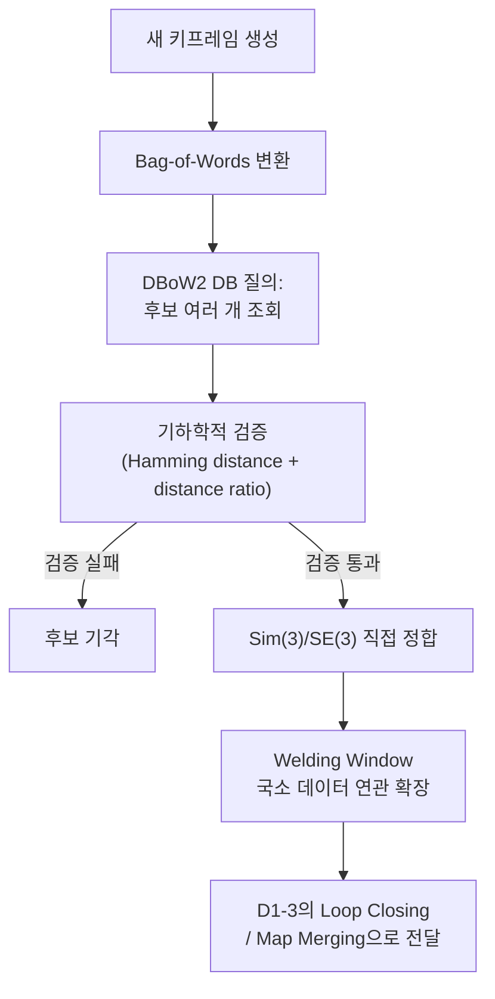

# SLAM 백엔드 - Loop Closing과 Place Recognition

> 이 문서를 읽으면 ORB-SLAM3가 "이 장면을 예전에 본 적이 있는가"를 정확히 어떤 알고리즘(DBoW2 + 기하학적 검증)으로 판단하는지, 그리고 기존 방식 대비 왜 더 빠르고 정확하게 이를 해내는지 이해하게 된다.

## 문서 정보

| 항목 | 내용 |
|---|---|
| 학습 단계 | Level 4 — SLAM 백엔드 심화 |
| 예상 선행 지식 | [[D1-3_Multi-Map_System_Atlas와_재추적_병합|SLAM 백엔드 - D1-3. Multi-Map System(Atlas)과 재추적·병합]](place recognition이 Loop Closing/Map Merging을 가르는 기준) |
| 학습 목표 | DBoW2 기반 place recognition의 동작 원리와 기존 방식의 한계를 설명할 수 있다 / ORB-SLAM3가 recall과 지연 문제를 각각 어떻게 개선했는지 설명할 수 있다 / RTAB-Map의 loop closure 방식과 비교할 수 있다 |
| 기준 환경 | ORB-SLAM3 (RGB-D / RGB-D-Inertial 모드), Yahboom X3 |
| 관련 문서 | 이전: [[D1-3_Multi-Map_System_Atlas와_재추적_병합|SLAM 백엔드 - D1-3. Multi-Map System(Atlas)과 재추적·병합]] / 다음: [[D1-5_이_프로젝트의_VIO_이슈_재해석|SLAM 백엔드 - D1-5. 이 프로젝트의 VIO 이슈 재해석]] |

> 참고 논문: ORB-SLAM3 논문(Campos et al., 2021) 6장 A절(Place Recognition), Gálvez-López & Tardós, "Bags of Binary Words for Fast Place Recognition in Image Sequences" (DBoW2 원 논문)

---

## 1. 먼저 알아야 할 핵심

1. D1-3에서 "새 키프레임마다 Atlas 전체에서 매칭을 탐색한다"고 배웠다. 이 문서는 그 탐색이 정확히 어떤 알고리즘으로 이루어지는지를 다룬다.
2. 이 알고리즘의 뿌리는 **DBoW2(Bag-of-Words 기반 이미지 검색 라이브러리)**이며, ORB-SLAM3는 이를 그대로 쓰지 않고 두 가지 지점을 개선했다.
3. 기존 DBoW2 방식은 **정밀도(precision)를 높이려 하면 재현율(recall)이 떨어지고, 재현율을 높이려 하면 정밀도가 떨어지는** 트레이드오프에 갇혀 있었다.
4. ORB-SLAM3는 "후보를 1개가 아니라 여러 개 보는 방식"으로 recall을, "연속 키프레임 합의 요구를 없앤 즉시 기하학적 정합"으로 지연 문제를 각각 해결했다.
5. 이 방식은 [[A1_RTAB-Map_매핑_원리|A1]]에서 배운 RTAB-Map의 appearance-based loop closure와 원리(이미지 유사도로 재방문 판단)는 유사하지만, 구체적인 구현(자체 bag-of-words vs DBoW2, 검증 방식)이 다르다.

---

## 2. 이 개념은 무엇인가

Place Recognition은 "지금 카메라가 보고 있는 장면이, 예전에 이미 지나간 어떤 장소와 같은가?"를 판단하는 절차다. 사람이라면 눈으로 보고 즉시 "여기 와봤다"고 느끼지만, 컴퓨터는 이미지를 "단어들의 조합"으로 바꾼 뒤, 그 조합이 과거의 어떤 이미지와 유사한지를 데이터베이스에서 검색하는 방식으로 이를 흉내 낸다.

**비유로 이해하기**

도서관에서 "이 책이 우리 서가에 이미 있는 책과 같은 책인가?"를 확인하는 사서를 떠올려보자.

- 사서(place recognition)는 새 책이 들어올 때마다, 책의 특징적인 단어들(목차, 핵심 키워드 — ORB 특징점)을 뽑아 **색인 카드**(bag-of-words)를 만든다.
- 기존의 단순한 사서(기존 DBoW2 방식)는 "가장 비슷해 보이는 책 딱 1권"만 후보로 꺼내서 비교한다. 겉모습만 보고 판단하면 오판(false positive)이 많으니, 표지 디자인이 며칠 연속 비슷하게 나온 책들만 진짜로 인정하는(temporal consistency) 엄격한 규칙을 추가로 둔다 — 하지만 이러면 실제로 맞는 책도 자주 놓치고(recall 저하), 확인하는 데 며칠씩 걸린다(지연).
- ORB-SLAM3식 사서는 다르게 일한다. **후보를 1권이 아니라 여러 권 동시에** 꺼내 놓고, 각 후보를 책 내용의 세부 문장까지(Hamming distance 기반 descriptor 매칭) 꼼꼼히 대조한다. 후보가 여럿이라 헷갈릴 수 있으니, "가장 비슷한 후보와 그다음으로 비슷한 후보의 차이가 충분히 큰가"(distance ratio)도 함께 확인해 헷갈림을 줄인다. 그리고 며칠씩 기다리지 않고 **그 자리에서 바로** 실제로 같은 책인지 정밀 대조(**Sim(3)/SE(3)** 정합 — 두 시점의 3D 좌표를 겹쳐보는 수학적 변환. `Sim(3)`은 크기(스케일)까지 함께 맞추고, `SE(3)`은 크기가 이미 같다고 보고 위치·회전만 맞춘다)를 시도한다.

**비유가 실제와 다른 부분**

- 사서의 "색인 카드"는 비유적 표현이지만, 실제 bag-of-words는 이미지에서 뽑은 ORB 특징점들을 미리 학습된 "시각 단어 사전(vocabulary)"에 대응시켜 만든 벡터다.
- 사서가 "표지가 며칠 연속 비슷했다"고 확인하는 것은 실제로는 **연속된 키프레임 사이의 시간적 일관성**을 뜻하며, ORB-SLAM3는 이 요구 자체를 제거했다는 것이 핵심 차이다.
- "정밀 대조"는 단순 비교가 아니라 카메라 모드에 따라 Sim(3)(모노큘러, 스케일까지 함께 추정) 또는 SE(3)(스테레오/RGB-D, 스케일이 이미 알려짐) 변환을 실제로 계산해 두 시점의 3D 구조가 기하학적으로 맞아떨어지는지 검증하는 수학적 절차다.

---

## 3. 왜 필요한가

**SLAM 시스템 관점 (정확한 place recognition이 없다면)**

- D1-3에서 배운 Loop Closing/Map Merging은 모두 place recognition이 올바른 매칭을 찾아내야 시작될 수 있다 — 이 알고리즘이 부정확하면 앞선 문서들에서 배운 복구 메커니즘 전체가 제대로 작동하지 않는다.
- 오탐(false positive, 실제로는 다른 장소인데 같다고 판단)이 통과되면, 서로 다른 두 위치가 하나로 잘못 정합되어 지도 전체가 크게 어긋난다 — 그래서 recall(놓치지 않는 것)만큼이나 precision(틀리지 않는 것)이 중요하다.

**실제 로봇 관점 (Yahboom X3 기준)**

- RGB-D 모드에서는 SE(3) 직접 정합이 쓰이며, 모노큘러의 스케일 모호성 문제가 없다는 점이 D1-2에서 다룬 초기화의 스케일 추정 부담을 이 지점에서도 덜어준다.
- 만약 이 프로젝트에서 ORB-SLAM3의 loop closing 성능을 RTAB-Map과 비교 평가하려 한다면, 두 시스템의 "후보 수"와 "검증 임계값" 철학이 서로 다르므로 같은 파라미터명으로 단순 비교할 수 없다는 점을 유의해야 한다.

---

## 4. ROS2 시스템에서의 위치



**그림 읽는 방법**

- 이 흐름 전체가 D1-3의 그림에서 "Place Recognition: Atlas 전체에서 매칭 탐색" 상자 하나를 펼쳐서 보여준 것이다 — 즉 이 문서는 D1-3 그림의 한 상자를 확대해서 설명하는 문서다.
- `기하학적 검증`에서 여러 후보가 동시에 걸러지는데, 이 단계가 기존 DBoW2의 "연속 키프레임 요구"를 대체한다는 점이 이 문서의 핵심이다 — 즉 그림에서 "지연"이 발생하던 지점이 사라진 것이다.
- 마지막 `Welding Window`는 D1-3에서 이미 다룬 구성 요소이며, 이 문서에서 설명한 정합 결과를 받아 국소적으로 확장하는 역할을 한다.

---

## 5. 주요 구성 요소

| 구성 요소 | 역할 | 초보자가 기억할 점 |
|---|---|---|
| DBoW2 | 키프레임들의 bag-of-words 벡터로 구축된 이미지 검색 데이터베이스 | ORB-SLAM3는 이를 그대로 쓰되 질의·검증 방식을 개선 |
| Bag-of-Words(BoW) | 이미지의 ORB 특징점들을 시각 단어 사전에 대응시켜 만든 벡터 | 이미지를 "단어 조합"으로 바꿔 빠른 유사도 검색을 가능하게 함 |
| Hamming distance | ORB descriptor(이진 벡터) 간의 유사도를 재는 거리 척도 | 값이 작을수록 두 특징점이 유사하다는 뜻 |
| Distance ratio | 1순위 후보와 2순위 후보 사이의 거리 비율 | 모호한 매칭(두 후보가 비슷비슷할 때)을 걸러내는 데 사용 |
| Sim(3) / SE(3) 정합 | 두 시점의 3D 구조를 정렬하는 변환 추정 | 모노큘러는 Sim(3)(스케일 포함), 스테레오/RGB-D는 SE(3) |

---

## 6. 기본 동작 과정

1. **BoW 변환**: 새 키프레임이 생성되면 그 안의 ORB 특징점들을 시각 단어 사전에 대응시켜 bag-of-words 벡터를 만든다.
2. **다중 후보 조회**: 이 벡터로 DBoW2 데이터베이스에서 Atlas 전체 키프레임 중 유사한 후보를 **여러 개** 조회한다(기존 방식처럼 1개만 보지 않는다).
3. **기하학적 검증**: 각 후보에 대해, 검색 윈도우 안에서 ORB keypoint의 descriptor가 map point의 descriptor와 일치하는지 Hamming distance 임계값으로 확인하고, 후보가 여럿이면 distance ratio로 모호한 매칭을 추가로 걸러낸다.
4. **직접 정합 시도**: 검증을 통과한 후보에 대해, 연속 키프레임 간 합의를 기다리지 않고 곧바로 Sim(3)(모노큘러) 또는 SE(3)(스테레오/RGB-D) 정합을 시도한다.
5. **정합 성공 시 확장**: 정합에 성공하면 매칭된 키프레임 주변의 covisibility graph 이웃들로 Welding Window를 구성해, 그 안에서 중기 데이터 연관을 집중적으로 탐색한다.
6. **결과 전달**: 최종 결과는 D1-3에서 다룬 분기 로직(같은 지도 안이면 Loop Closing, 다른 지도면 Map Merging)으로 전달된다.

---

## 7. 진단 실습

이 문서는 알고리즘을 직접 구현하는 실습 대신, **후보 조회부터 검증까지의 로그를 단계별로 추적하는 진단 실습**으로 진행한다.

### 실습 목표

같은 장소를 재방문했을 때, place recognition이 후보를 몇 개 조회했고 그중 몇 개가 검증을 통과했는지 로그로 확인한다.

### 준비 사항

* D1-3 실습에서 사용한 것과 같은 재방문 경로 rosbag(`revisit_test.bag`)
* 자세한 디버그 로그가 출력되도록 설정된 ORB-SLAM3 실행 환경(verbose/debug 로그 레벨)

### 실행

```bash
ros2 bag play revisit_test.bag &
ros2 run orb_slam3_ros rgbd \
  --ros-args -p camera:=D435i -p log_level:=debug 2>&1 | tee pr_debug.log
```

* 이 명령어가 하는 일: 디버그 로그 레벨로 ORB-SLAM3를 실행해, 평소에는 보이지 않는 place recognition 내부 단계(후보 조회, 검증 결과)까지 로그로 남긴다.

### 확인

```bash
grep -in "bow\|candidate\|hamming\|ratio\|sim3\|se3" pr_debug.log
```

* 이 명령어가 하는 일: 6장에서 설명한 각 단계(BoW 변환, 후보 조회, Hamming 거리, distance ratio, Sim(3)/SE(3) 정합)에 해당하는 로그를 골라 보여준다.

### 예상 결과

- 재방문 시점 근처에서 `candidate` 로그가 여러 개(1개가 아니라) 나타나는 것이 정상이다 — 이것이 이 문서 3.1절에서 설명한 "다중 후보 조회"가 실제로 동작하는 증거다.
- 후보 중 일부만 `sim3`/`se3` 정합 성공 로그로 이어진다면, 나머지는 Hamming distance 또는 distance ratio 검증에서 기각된 것이다 — D1-3 진단 실습에서 병합이 재현되지 않았다면, 이 로그로 "후보 자체가 없었는지" 또는 "후보는 있었지만 검증에서 걸러졌는지"를 구분할 수 있다.

---

## 8. 코드 및 설정 해설

```yaml
# orb_slam3 설정 예시 (place recognition 관련)
ORBextractor.nFeatures: 1000

LoopClosing.MinScore: 0.05          # BoW 유사도 최소 점수 (이 이하면 후보에서 제외)
LoopClosing.HammingThreshold: 50    # descriptor 매칭 허용 Hamming distance
LoopClosing.RatioThreshold: 0.75    # 1순위/2순위 후보 거리 비율 임계값
```

* `LoopClosing.MinScore`: BoW 벡터 유사도 자체의 최소 기준선이다. 이 값이 너무 높으면 6장 2단계의 "다중 후보 조회" 단계에서부터 후보가 아예 나오지 않는다 — D1-3 진단에서 "새 지도만 계속 생기고 병합이 안 됨" 문제의 원인이 여기 있을 수 있다.
* `LoopClosing.HammingThreshold`: 6장 3단계 기하학적 검증에서 개별 특징점 매칭을 인정하는 기준이다. 값이 낮을수록 엄격해져 precision은 오르지만, 저텍스처 환경에서는 애초에 매칭될 특징점이 적어 recall이 떨어질 수 있다.
* `LoopClosing.RatioThreshold`: 1순위와 2순위 후보의 거리 비율 기준이다. 값이 1에 가까울수록(느슨할수록) 애매한 매칭도 통과시키지만 오탐 위험이 커지고, 값이 작을수록(엄격할수록) 확실한 경우만 통과시키지만 놓치는 경우가 늘어난다 — 이것이 5장에서 언급한 precision-recall 트레이드오프가 실제 숫자로 드러나는 지점이다.

---

## 9. 자주 사용하는 명령어

| 목적 | 명령어 | 설명 |
|---|---|---|
| 후보 조회 로그만 확인 | `grep -i "candidate" pr_debug.log` | 특정 키프레임에서 몇 개의 후보가 조회됐는지 확인 |
| 검증 실패 원인 구분 | `grep -i "reject\|fail" pr_debug.log` | Hamming/ratio 중 어느 기준에서 기각됐는지 확인 |
| 정합 성공 시점 확인 | `grep -i "sim3\|se3" pr_debug.log` | 실제로 정합까지 성공한 순간을 찾아 D1-3의 병합 결과와 연결 |
| 검증 임계값 실험적 조정 후 재실행 | 설정 파일 수정 후 재실행 | `HammingThreshold`/`RatioThreshold`를 완화해 recall 변화를 관찰 |

---

## 10. 자주 발생하는 문제

### 문제: 같은 장소를 지나갔는데 후보 자체가 조회되지 않음

**증상**

`pr_debug.log`에 재방문 구간에서 `candidate` 로그가 전혀 없다.

**가능한 원인**

1. `LoopClosing.MinScore`가 너무 높게 설정됨
2. 재방문 시점의 조명·시점 각도가 처음 방문 때와 크게 달라 BoW 벡터 자체의 유사도가 낮음
3. 애초에 텍스처가 부족한 구간(흰 벽 등)이라 ORB 특징점이 적어 BoW 벡터의 변별력이 낮음

**확인 방법**

```bash
grep -i "nfeatures\|extracted" pr_debug.log
```

해당 구간에서 추출된 특징점 수 자체가 적은지 먼저 확인한다.

**해결 방법**

1. 특징점 수가 적다면 `ORBextractor.nFeatures`를 늘리거나 조명을 개선한다.
2. 특징점 수는 충분한데 후보가 안 나온다면 `LoopClosing.MinScore`를 낮춰 재시도한다.

### 문제: 후보는 여러 개 나오는데 전부 검증에서 기각됨

**증상**

`candidate` 로그는 여러 개 있지만 `sim3`/`se3` 정합 성공 로그가 없다.

**가능한 원인**

1. `LoopClosing.HammingThreshold`가 이 환경(저텍스처, 반복 패턴)에 비해 너무 엄격함
2. `LoopClosing.RatioThreshold`가 너무 낮아 애매한 후보를 전부 걸러냄

**해결 방법**

두 임계값을 각각 개별적으로 완화해가며 재현 테스트를 반복해, 어느 값이 실제 병목인지 좁혀나간다. 다만 임계값을 지나치게 완화하면 오탐(잘못된 병합)이 늘어날 수 있으므로, 완화 후에는 D1-3 실습처럼 실제로 올바른 장소끼리만 병합되는지 반드시 재검증한다.

**초보자가 자주 하는 실수**

임계값을 무작정 낮춰서 recall만 높이려는 경우가 많다. 5장에서 짚었듯 precision과 recall은 트레이드오프 관계이므로, 임계값을 조정한 뒤에는 항상 오탐 여부(엉뚱한 장소끼리 잘못 합쳐지지 않았는지)를 함께 확인해야 한다.

---

## 11. 개념 간 연결

* 이 문서는 D1-3에서 "매칭을 탐색한다"고만 언급했던 부분을 알고리즘 수준으로 확장한 것이다 — D1-3을 먼저 읽지 않으면 이 문서의 결과가 어디로 이어지는지(Loop Closing vs Map Merging) 알기 어렵다.
* [[A1_RTAB-Map_매핑_원리|A1]]에서 다룬 RTAB-Map의 appearance-based loop closure(`Rtabmap/LoopThr`, `Vis/MinInliers`)와 이 문서의 DBoW2 기반 방식은 "이미지 유사도로 재방문을 판단한다"는 목표는 같지만, 검색 방식(자체 bag-of-words vs DBoW2)과 검증 방식(단일 임계값 vs Hamming distance + ratio)이 다르다 — 파라미터명이 비슷해 보여도 직접 대응시키면 안 된다.
* [[C3_RTAB-Map_핵심_파라미터_대응표|C3. RTAB-Map 핵심 파라미터 대응표]]에서 다룬 `RGBD/OptimizeMaxError`(오탐 거부)도 이 문서와 같은 precision-recall 긴장 관계를 RTAB-Map식으로 다루는 해법이다.

---

## 12. 한 단계 더 깊게 보기

> **심화 학습**
>
> 이 부분은 기본 개념을 이해한 후 읽는 것을 권장한다.

**기존 DBoW2 방식의 한계 (논문이 지적하는 구체적 수치)**

- **가장 유사한 후보 1개만** 사용하는 raw DBoW2 쿼리는 precision·recall이 **50~80%** 수준에 그친다.
- 잘못된 매칭(false positive)이 지도를 오염시키는 것을 막기 위해 DBoW2는 **시간적(temporal) + 기하학적(geometric) 일관성 검사**를 추가로 거치는데, 이렇게 하면 precision은 100%까지 올라가지만 **recall은 30~40%로 떨어진다.**
- 결정적으로, 이 시간적 일관성 검사는 **최소 3개 키프레임에 걸쳐 지연**된다 — 매칭이 실제로 맞더라도 인정받기까지 시간이 걸린다는 뜻이다.
- 논문 저자들은 이 지연과 낮은 recall이 **Atlas(다중 지도) 시스템에서 같은/다른 지도 안에 중복된 영역**을 너무 자주 만든다는 것을 발견했다 — D1-3에서 다룬 "지도가 계속 늘어나는" 문제와 직결되는 배경이다.

**RTAB-Map(A1)과의 대비 (요약 비교)**

| 항목 | RTAB-Map (A1) | ORB-SLAM3 |
|---|---|---|
| 검색 기반 | 자체 appearance-based bag-of-words, `Rtabmap/LoopThr` 유사도 임계값 | DBoW2, 다중 후보 조회 |
| 검증 방식 | `Vis/MinInliers` 기하학적 검증 | Hamming distance + distance ratio 기반 다단계 검증 |
| 지연 여부 | WM/STM 관리 안에서 즉시 판단 | 기존 DBoW2의 3키프레임 지연을 제거 — 즉시 Sim(3)/SE(3) 시도 |
| 매칭 후 확장 | 그래프 최적화로 전체 반영 | welding window로 국소 확장 후 pose-graph 최적화 |

두 시스템 모두 "정밀도(precision)를 유지하면서 recall을 얼마나 높이는가"가 설계의 핵심 긴장 관계라는 점은 동일하다.

---

## 13. 핵심 요약

1. Place Recognition은 DBoW2 데이터베이스에서 유사 후보를 찾고, 이를 기하학적으로 검증하는 절차다.
2. 기존 DBoW2 방식은 1개 후보만 보고 시간적 일관성까지 요구해, precision은 높지만 recall이 낮고(30~40%) 3키프레임의 지연이 있었다.
3. ORB-SLAM3는 여러 후보를 동시에 조회하고(recall 개선), 연속 키프레임 요구 없이 즉시 Sim(3)/SE(3) 정합을 시도해(지연 제거) 두 문제를 함께 해결했다.
4. 검증은 Hamming distance(개별 특징점 매칭)와 distance ratio(1·2순위 후보 구분)의 다단계로 이루어져 100% precision을 유지한다.
5. Precision과 recall은 트레이드오프 관계이며, 이 문서와 RTAB-Map(A1) 모두 같은 긴장 관계를 서로 다른 방식으로 다룬다.

---

## 14. 이해도 점검

1. 기존 raw DBoW2 방식에서 precision을 100%까지 올리면 recall은 어떻게 되는가?
2. ORB-SLAM3가 "3키프레임 지연" 문제를 없앤 구체적인 방법은 무엇인가?
3. Hamming distance와 distance ratio는 각각 무엇을 검증하기 위한 것인가?
4. 모노큘러와 스테레오/RGB-D는 각각 어떤 정합 방식(Sim(3)/SE(3))을 쓰며, 그 차이는 무엇에서 비롯되는가?
5. RTAB-Map과 ORB-SLAM3의 place recognition 방식을 비교할 때, 파라미터명이 비슷해도 직접 대응시키면 안 되는 이유는 무엇인가?

> [!info]- 정답 및 해설 보기
> 1. Recall이 30~40% 수준으로 떨어진다 — precision과 recall이 트레이드오프 관계이기 때문이다.
> 2. 기하학적 검증에 연속된 키프레임 간 합의를 요구하지 않고, 매칭 후보가 나오면 곧바로 Sim(3) 또는 SE(3) 직접 정합을 시도하는 방식으로 지연을 제거했다.
> 3. Hamming distance는 개별 ORB descriptor(특징점) 간의 유사도를 검증하고, distance ratio는 1순위 후보와 2순위 후보의 거리 차이를 비교해 모호한 매칭을 걸러낸다.
> 4. 모노큘러는 스케일을 알 수 없으므로 스케일까지 함께 추정하는 Sim(3)을 쓰고, 스테레오/RGB-D는 깊이 정보로 스케일이 이미 알려져 있으므로 SE(3)만으로 충분하다.
> 5. 두 시스템은 검색 기반(자체 bag-of-words vs DBoW2)과 검증 방식(단일 임계값 vs Hamming distance+ratio 다단계)이 근본적으로 다른 구현이라, 같은 이름의 파라미터라도 내부 동작 기준이 다르기 때문이다.

---

## 15. 다음 학습 주제

1. **바로 다음**: [[D1-5_이_프로젝트의_VIO_이슈_재해석|SLAM 백엔드 - D1-5. 이 프로젝트의 VIO 이슈 재해석]] — D1-1~D1-4에서 정리한 논문 근거를 이 프로젝트의 실제 진단 이력과 종합해, 현재 상태를 다시 정리한다.
2. **함께 보면 좋은 주제**: [[A1_RTAB-Map_매핑_원리|A1. RTAB-Map 매핑 원리]] — 같은 목표(재방문 탐지)를 다르게 구현한 대안 백엔드를 다시 한번 비교해보면 이해가 깊어진다.
3. **나중에 학습할 심화 주제**: [[C3_RTAB-Map_핵심_파라미터_대응표|C3. RTAB-Map 핵심 파라미터 대응표]] — RTAB-Map 쪽에서 이 문서와 같은 precision-recall 긴장 관계를 어떤 파라미터로 다루는지 확인한다.

---

## 16. 참고자료

| 구분 | 자료 | 핵심 내용 |
|---|---|---|
| 논문 | ORB-SLAM3 논문(Campos et al., 2021) 6장 A절 "Place Recognition" | 기존 DBoW2 한계 수치, 다중 후보 조회, Hamming/ratio 검증, Sim(3)/SE(3) 정합 |
| 논문 | Gálvez-López, Tardós, "Bags of Binary Words for Fast Place Recognition in Image Sequences" | DBoW2 원 논문, bag-of-words 검색의 기본 원리 |
| 프로젝트 진단 노트 | `[[ros2-nav-yahboom]]` | 재방문 시 병합 재현 여부 관련 실험 이력 |
