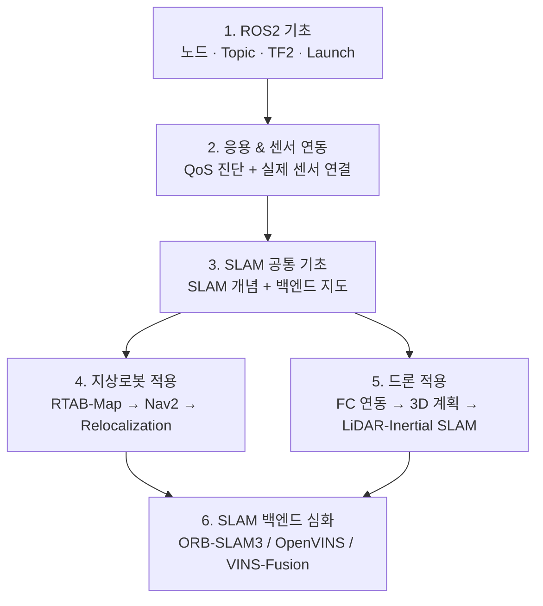

# ROS2 · SLAM · 자율주행 학습 자료

ROS2를 처음 배우는 단계부터 지상로봇과 드론에 SLAM을 적용하고, 백엔드를 논문 수준까지 파고드는 데까지를 한국어로 정리한 학습 자료다. 실제 하드웨어(Yahboom ROSMASTER X3, Livox Mid-360S + PX4 드론)로 겪은 실측과 사고 기록을 함께 담고 있다.

| | |
|---|---|
| 문서 | **94편** (약 75만 자) |
| 기준 환경 | Ubuntu 22.04, **ROS2 Humble** |
| 언어 | 한국어 |
| 형식 | Obsidian vault (문서 간 연결 **1,108개**) |

---

## ⚠ Obsidian으로 여는 것을 권합니다

이 저장소는 **Obsidian vault**다. 문서 사이가 `[[위키링크]]` **1,108개**로 엮여 있는데, **GitHub 웹에서는 이 링크가 렌더링되지 않고 대괄호가 붙은 글자 그대로 보인다.** 개별 문서를 읽는 데는 문제가 없지만, 이 자료의 핵심인 **"개념 사이를 오가는 경로"가 통째로 사라진다.**

```bash
git clone https://github.com/codebaragi23/ROS2-doc.git
```

받은 폴더를 [Obsidian](https://obsidian.md)에서 **"Open folder as vault"**로 열면 된다. 링크가 살아나고, 그래프 뷰로 문서 간 관계를 볼 수 있다.

> GitHub에서 그냥 훑어보는 경우라면 **[전체 학습 지도](00_전체_학습_지도.md)**부터 보면 된다. 이 README와 학습 지도만은 GitHub에서도 링크가 동작하도록 작성했다.

---

## 학습 경로



**폴더 번호가 곧 학습 순서다.** 지상로봇(4)과 드론(5)은 같은 기초 위에서 갈라지는 **동등한 두 갈래**이며, 한쪽이 다른 쪽의 부록이 아니다.

---

## 시리즈 구성

| # | 시리즈 | 편수 | 내용 |
|---|---|---|---|
| 1 | [ROS2 기초](1_ROS2%20기초) | 10 | 설치부터 노드·Topic·Service·Parameter·Launch·TF2·RViz2까지 |
| 2 | [응용 & 센서 연동](2_ROS2%20응용%20&%20센서%20연동) | 6 | DDS/QoS, RealSense·LiDAR 연동, colcon 오류, Executor 구조 |
| 3 | [SLAM 공통 기초](3_SLAM%20공통%20기초) | 2 | SLAM이 푸는 문제, 백엔드를 나누는 축 |
| 4 | [지상로봇 적용](4_지상로봇%20적용) | 20 | 지도제작(3) · Nav2 내비게이션(9) · Relocalization 심화(8) |
| 5 | [드론 적용](5_드론%20적용) | 21 + 12 | 일반론 21편 + [둠둠 프로젝트](5_드론%20적용/P1_둠둠_프로젝트) 12편 |
| 6 | [SLAM 백엔드 심화](6_SLAM%20백엔드%20심화) | 21 | ORB-SLAM3 · OpenVINS · VINS-Fusion을 논문·코드 수준까지 |

각 시리즈의 문서별 순서와 읽는 요령은 **[전체 학습 지도](00_전체_학습_지도.md)**에 있다.

### 드론 적용 안의 세 묶음

5번은 규모가 커서 안에서 다시 나뉜다.

- **`02-3` 조종 경로 전체 지도** — 조종기(RC)·지상국(MAVLink)·Offboard 세 경로를 한 장에. 드론 조종이 처음이라면 여기서 시작해도 된다.
- **PX4로 가는 두 축**(`01-2`, `02-2`) — **위치 축**(SLAM 결과를 EKF2에 넣기)과 **조종 축**(비행 모드·시동 명령). 시동 거부는 거의 항상 위치 축 문제다.
- **`02-1` 수동 조종과 제어 인터페이스 설계** — 지상로봇의 `teleop_twist_keyboard`에 해당하는 자리. `cmd_vel` 하나로는 드론이 안 움직이는 이유와, 그 간극을 메우는 어댑터 노드 설계.
- **3D 내비게이션 4부작**(`03`~`03-4`) — 지상로봇의 Nav2 시리즈에 대응한다. Nav2의 costmap·planner·controller·recovery가 드론에서 각각 무엇으로 바뀌는지.
- **LiDAR-Inertial SLAM 6부작**(`04-1`~`04-6`) — 센서 원리 → ESIKF 알고리즘 → ikd-tree → 매핑 실행 → 재위치.
- **둠둠 프로젝트**(P1) — 위 일반론을 실내 비행 미션 하나에 적용한 기록. 설계편(00~06)과 **실측편(07~11)**으로 나뉜다.

---

## 문서 규약

모든 문서는 세 형식 중 하나를 따른다.

| 형식 | 구성 | 쓰이는 곳 |
|---|---|---|
| **튜토리얼** | 개념 → 비유 → 실습 → 자주 발생하는 문제 → 이해도 점검 | 처음 배우는 주제 |
| **레퍼런스** | 개요 → 핵심 개념 → 적용 → 파라미터 → 진단 → 참고자료 | 찾아보는 주제 |
| **사례연구** | 증상 → 가설(신뢰도) → 실측 → 원인 → 채택/미채택 수정 → 교훈 | 실제 사고 기록 |

**형식과 무관하게 공통인 것**

- **문서 정보 표** (92/94) — 학습 단계, 선행 지식, 학습 목표, 기준 환경. 열자마자 *"지금 읽어도 되는지, 읽으면 뭘 할 수 있게 되는지"*를 판단할 수 있다.
- **이전/다음 링크** — 모든 문서가 앞뒤로 연결되어 순서대로 따라갈 수 있다.
- **진단 관점** (73/94) — *증상 → 확인 순서*. "되는 법"만큼 **"안 될 때 어디부터 보는지"**를 비중 있게 다룬다.
- **이해도 점검** (43/94) — 튜토리얼·사례연구 형식에 접힌 해설과 함께 들어 있다.

---

## 이 자료가 지키려는 것

- **일반 이론과 프로젝트 사례를 분리한다.** 본문은 일반적으로 통용되는 내용으로 쓰고, 특정 하드웨어에서 겪은 일은 "이 프로젝트에서의 적용" 절에 모은다.
- **확인한 것과 추정한 것을 구분해 적는다.** 검증하지 못한 항목은 `확인 필요`로 남기고, 가설에는 신뢰도를 붙인다.
- **정정 이력을 지우지 않는다.** 계획과 결과가 어긋난 기록, 틀렸다가 바로잡은 판단을 그대로 남긴다 — 계획대로 되지 않은 기록이 계획서보다 유용할 때가 많다.
- **출처를 단다.** 논문·공식 문서·저장소 이슈 등 외부 참고 **176종**을 문서별 참고자료에 링크했다.
- **죽은 정보를 표시한다.** 낡은 파라미터명이나 유지보수가 끊긴 패키지는 그 사실을 함께 적는다.

---

## 대상 하드웨어

실측 기록의 기준이 된 장비다. 다른 장비를 쓰더라도 일반론 부분은 그대로 적용된다.

| 구분 | 지상로봇 | 드론 |
|---|---|---|
| 플랫폼 | Yahboom ROSMASTER X3 (메카넘 휠) | 멀티로터 + PX4 |
| 연산 | Jetson + 호스트 PC | Jetson Orin NX |
| 주 센서 | RealSense D435i, RPLiDAR C1 (2D) | Livox Mid-360S (3D) |
| SLAM | RTAB-Map | FAST-LIO2 |

---

## 시작하기

| 상황 | 여기서 시작 |
|---|---|
| ROS2가 처음이다 | [ROS2 기초 00. ROS2란 무엇이고 왜 쓰는가](1_ROS2%20기초/00_ROS2란_무엇이고_왜_쓰는가.md) |
| ROS2는 알고 SLAM을 붙이고 싶다 | [SLAM 공통 기초 00](3_SLAM%20공통%20기초/00_SLAM이란_무엇이고_왜_쓰는가.md) |
| 드론으로 바로 가고 싶다 | [드론 적용 00. 지상로봇과 드론은 무엇이 다른가](5_드론%20적용/00_지상로봇과_드론은_무엇이_다른가.md) |
| 전체 구조부터 보고 싶다 | [전체 학습 지도](00_전체_학습_지도.md) |
