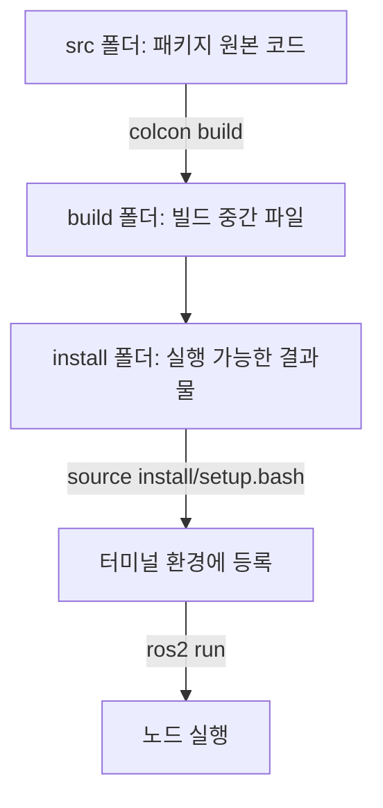

# ROS2 기초 - 개발 환경과 워크스페이스 구조

> 이 문서를 읽으면 ROS2 워크스페이스가 무엇인지, `colcon build`가 실제로 어떤 일을 하는지 이해하고, 나만의 첫 패키지를 만들어 빌드·실행할 수 있게 된다.

## 문서 정보

| 항목 | 내용 |
|---|---|
| 학습 단계 | Level 2 — 기초 실습 |
| 예상 선행 지식 | `ROS2 기초 - ROS2란 무엇이고 왜 쓰는가`, `ROS2 기초 - 노드란 무엇인가` |
| 학습 목표 | 워크스페이스 구조를 설명할 수 있다 / 패키지를 생성하고 빌드할 수 있다 / `source` 명령의 의미를 이해한다 |
| 기준 환경 | Ubuntu 22.04, ROS2 Humble |
| 관련 문서 | 이전: `ROS2 기초 - 노드란 무엇인가` / 다음: `ROS2 통신 - Topic과 Message` |

---

## 1. 먼저 알아야 할 핵심

1. ROS2로 무언가를 직접 만들려면, 코드를 아무 곳에나 두는 것이 아니라 정해진 폴더 구조인 **워크스페이스(Workspace)** 안에 둬야 한다.
2. 워크스페이스 안의 코드 묶음 하나하나를 **패키지(Package)** 라고 부르며, 지난 문서에서 실행했던 `turtlesim`도 하나의 패키지다.
3. ROS2는 코드를 실행 가능한 형태로 바꾸기 위해 **colcon**이라는 전용 빌드 도구를 사용한다.
4. 빌드가 끝나면 반드시 `source` 명령으로 "이 워크스페이스를 지금 이 터미널에서 쓰겠다"고 알려줘야 한다. 이 과정을 건너뛰면 방금 만든 패키지를 실행할 수 없다.
5. 이 구조를 모르면 이후 센서 드라이버(RealSense, LiDAR)를 직접 빌드하거나, Nav2/ORB-SLAM3 소스를 빌드하는 과정에서 계속 막히게 된다.

---

## 2. 이 개념은 무엇인가

워크스페이스는 **여러 개의 ROS2 패키지를 모아놓고 함께 빌드·관리하는 작업 폴더**다. 패키지는 그 안에 들어가는 "노드 코드 + 설정 파일 + 빌드 방법이 정의된 하나의 묶음"이다.

**비유로 이해하기**

책장을 떠올려보자.

- 워크스페이스는 책장 전체다.
- 패키지는 책장에 꽂힌 책 한 권 한 권이다. 각 책(패키지)은 독립적인 내용(노드, 코드)을 담고 있다.
- `colcon build`는 "책장에 새로 넣은 책들을 정리해서 바로 찾아볼 수 있게 색인을 만드는 작업"과 비슷하다.
- `source install/setup.bash`는 "이 책장의 색인을 지금 내가 보고 있는 책상 위에 펼쳐두는 것"이다. 색인을 펼쳐두지 않으면 책장에 책이 있어도 어디 있는지 찾을 수 없다(=`ros2 run`이 패키지를 못 찾음).

**비유가 실제와 다른 부분**

- 책은 한 번 정리하면 끝이지만, 코드는 수정할 때마다 다시 `colcon build`로 "재정리"해야 변경 사항이 반영된다.
- 책장 비유는 정적인 느낌이지만, 실제로는 `src`(원본 코드), `build`(빌드 중간 결과), `install`(최종 실행 가능 결과)이라는 서로 다른 폴더가 자동으로 생성되며 역할이 나뉘어 있다.

---

## 3. 왜 필요한가

**ROS 시스템 관점**

- 워크스페이스 구조가 없다면, 여러 패키지의 코드와 설정 파일이 뒤섞여 어떤 노드가 어떤 패키지 소속인지 알기 어렵다.
- `colcon`은 워크스페이스 안의 여러 패키지 간 의존 관계(어떤 패키지가 어떤 패키지를 필요로 하는지)를 자동으로 파악해서 순서에 맞게 빌드해준다. 이 기능이 없으면 의존성 순서를 사람이 직접 관리해야 한다.
- `source` 과정은 "지금 이 터미널이 어떤 버전의 패키지를 쓸지"를 명확히 구분해준다. 예를 들어 시스템에 설치된 `ros-humble-realsense2-camera`와 내가 직접 수정해서 새로 빌드한 버전을 구분할 때 이 구조가 필요하다.

**실제 로봇 관점 (ROSMASTER X3 기준)**

RealSense D435i, LiDAR C1 드라이버, ORB-SLAM3, Nav2는 대부분 apt로 바로 설치되지 않고 **소스 코드를 워크스페이스에 내려받아 직접 빌드**해야 하는 경우가 많다. 워크스페이스 구조를 모르면 이런 패키지들을 어디에 두고, 어떻게 빌드하고, 왜 실행이 안 되는지(source를 안 해서) 전혀 진단할 수 없다. 앞으로 이 프로젝트에서 다룰 거의 모든 센서/알고리즘 연동 문서의 "설치" 단계는 이 문서에서 배우는 절차를 기반으로 한다.

---

## 4. ROS2 시스템에서의 위치



**그림 읽는 방법**

- 왼쪽 `src` 폴더가 우리가 실제로 코드를 작성하거나 `git clone`으로 받아오는 곳이다.
- `colcon build`가 이 원본 코드를 컴파일/설치 가능한 형태로 변환해 `build`, `install` 폴더를 만든다.
- `source` 명령을 거쳐야 비로소 터미널이 이 install 결과물의 존재를 "인식"하게 되고, 그 이후에야 지난 문서에서 배운 `ros2 run`이 정상 동작한다. 즉 이 문서는 지난 문서(`ros2 run`)가 왜 가끔 실패했는지를 설명해주는 배경 지식이기도 하다.

---

## 5. 주요 구성 요소

| 구성 요소 | 역할 | 초보자가 기억할 점 |
|---|---|---|
| Workspace | 여러 패키지를 모아 관리하는 최상위 폴더 (보통 `~/ros2_ws`) | 폴더 이름은 자유지만 관례적으로 `_ws`를 붙인다 |
| `src/` | 패키지 원본 코드가 위치하는 폴더 | 직접 코드를 작성하거나 `git clone`할 위치는 항상 여기 |
| `build/` | 빌드 과정에서 생성되는 중간 파일 | 직접 건드릴 일 거의 없음, 문제 생기면 삭제 후 재빌드 가능 |
| `install/` | 실제로 실행 가능한 결과물이 설치되는 폴더 | `source`할 대상이 바로 이 안의 `setup.bash` |
| `colcon` | ROS2 표준 빌드 도구 | ROS1의 `catkin_make`에 해당하는 ROS2 버전 도구 |
| `package.xml` | 패키지의 이름, 의존성, 설명을 정의하는 파일 | 새 패키지를 만들면 자동 생성됨 |
| `setup.py` / `CMakeLists.txt` | 실제 빌드 방법을 정의하는 파일 | Python 패키지는 `setup.py`, C++ 패키지는 `CMakeLists.txt` 사용 |

---

## 6. 기본 동작 과정

1. **워크스페이스 생성**: `mkdir -p ~/ros2_ws/src`로 규칙에 맞는 폴더 구조를 만든다.
2. **패키지 생성 또는 배치**: `ros2 pkg create` 명령으로 새 패키지를 만들거나, 기존 패키지 코드를 `src` 폴더 안에 넣는다.
3. **빌드**: 워크스페이스 루트에서 `colcon build`를 실행하면, `src`의 모든 패키지를 순서대로 컴파일/설치해 `build`, `install` 폴더를 생성한다.
4. **환경 등록(source)**: `source install/setup.bash`를 실행해 현재 터미널이 이 워크스페이스의 패키지를 인식하도록 만든다.
5. **실행 및 확인**: `ros2 run <패키지명> <실행파일명>`으로 노드를 실행하고, 지난 문서에서 배운 `ros2 node list`로 정상 등록을 확인한다.

---

## 7. 기본 실습

### 실습 목표

빈 워크스페이스를 만들고, 나만의 첫 Python 패키지를 생성해서 빌드 → source → 실행까지 전체 과정을 직접 경험한다.

### 준비 사항

* 운영체제: Ubuntu 22.04
* ROS2 배포판: Humble (`source /opt/ros/humble/setup.bash` 완료 상태)
* 필요한 패키지: `python3-colcon-common-extensions` (colcon 빌드 도구)
* 실행 전 확인 사항: `ros2 pkg create --help` 실행 시 정상적으로 도움말이 출력되는지 확인

### 설치

```bash
sudo apt update
sudo apt install python3-colcon-common-extensions
```

* 이 명령어가 하는 일: `colcon build` 명령을 사용할 수 있게 해주는 빌드 도구를 설치한다.
* 정상 실행 시 예상 결과: 설치 완료 메시지가 출력된다. Humble 데스크톱 버전을 설치했다면 이미 포함되어 있을 수도 있다.
* 잘못 실행했을 때 나타날 수 있는 오류: 이미 설치되어 있으면 `colcon-common-extensions is already the newest version`이 출력되며 정상이다.

### 실행 (워크스페이스 및 패키지 생성)

```bash
# 1. 워크스페이스 폴더 생성
mkdir -p ~/ros2_ws/src
cd ~/ros2_ws/src

# 2. 새 Python 패키지 생성
ros2 pkg create --build-type ament_python my_first_pkg --dependencies rclpy
```

* `mkdir -p ~/ros2_ws/src`: 워크스페이스 규칙에 맞는 폴더 구조를 만든다. 반드시 `src`라는 이름의 하위 폴더를 만들어야 colcon이 코드를 인식한다.
* `ros2 pkg create --build-type ament_python my_first_pkg --dependencies rclpy`: `my_first_pkg`라는 이름의 Python 패키지를 생성한다. `--dependencies rclpy`는 이 패키지가 `rclpy`(ROS2 Python 라이브러리, 지난 문서의 예제 코드에서 사용했던 그것)를 필요로 한다고 미리 등록해두는 옵션이다.
* 정상 실행 시 예상 결과: `~/ros2_ws/src/my_first_pkg` 폴더 안에 `package.xml`, `setup.py`, `my_first_pkg/` 등의 기본 구조가 자동 생성된다.

```bash
# 3. 빌드
cd ~/ros2_ws
colcon build
```

* 워크스페이스 루트(`~/ros2_ws`)로 이동해서 실행해야 한다. `src` 폴더 안에서 실행하면 오류가 난다.
* 정상 실행 시 예상 결과: `Summary: 1 package finished` 와 같은 메시지와 함께 `build/`, `install/`, `log/` 폴더가 새로 생성된다.
* 잘못 실행했을 때 나타날 수 있는 오류: `package.xml` 문법 오류가 있으면 해당 패키지 이름과 함께 `Failed` 메시지가 출력된다.

### 실행

```bash
# 4. 환경 등록 및 실행
source ~/ros2_ws/install/setup.bash
ros2 pkg list | grep my_first_pkg
```

* `source ~/ros2_ws/install/setup.bash`: 방금 빌드한 워크스페이스를 현재 터미널이 인식하도록 등록한다.
* `ros2 pkg list | grep my_first_pkg`: 언제 사용하는가 → 내가 만든 패키지가 ROS2 시스템에 정상적으로 등록되었는지 확인할 때 사용한다.

### 확인

### 예상 결과

`ros2 pkg list | grep my_first_pkg` 실행 시 `my_first_pkg`가 출력되면 정상이다. 만약 아무것도 출력되지 않는다면 `colcon build`가 실패했거나 `source`를 하지 않은 것이므로, 10장 문제 해결 항목을 참고한다.

---

## 8. 코드 및 설정 해설

`ros2 pkg create`로 생성된 `package.xml`의 핵심 부분을 해설한다.

```xml
<?xml version="1.0"?>
<package format="3">
  <name>my_first_pkg</name>
  <version>0.0.0</version>
  <description>TODO: Package description</description>
  <maintainer email="user@example.com">user</maintainer>
  <license>TODO: License declaration</license>

  <depend>rclpy</depend>

  <test_depend>ament_copyright</test_depend>
  <test_depend>ament_flake8</test_depend>
  <test_depend>ament_pep257</test_depend>

  <export>
    <build_type>ament_python</build_type>
  </export>
</package>
```

* `<name>`: 패키지 이름. `ros2 run <이 이름> ...`, `ros2 pkg list`에 등장하는 값과 동일하다.
* `<depend>rclpy</depend>`: 이 패키지가 실행되려면 `rclpy` 패키지가 필요하다는 의존성 선언이다. colcon은 이 정보를 보고 빌드 순서를 결정한다. 앞으로 카메라나 LiDAR 패키지를 빌드할 때 "의존성 패키지가 없다"는 오류가 나면, 이 부분에 선언된 의존 패키지가 실제로 설치되어 있는지 확인해야 한다.
* `<build_type>ament_python</build_type>`: 이 패키지가 Python 기반(`ament_python`)으로 빌드된다는 표시다. C++ 패키지는 `ament_cmake`로 표시되며 `CMakeLists.txt`를 사용한다.

---

## 9. 자주 사용하는 명령어

| 목적 | 명령어 | 설명 |
|---|---|---|
| 새 패키지 생성 | `ros2 pkg create --build-type ament_python <이름>` | 워크스페이스에 새 Python 패키지의 기본 구조를 만들 때 사용 |
| 전체 빌드 | `colcon build` | 워크스페이스 루트에서 실행, `src`의 모든 패키지를 빌드 |
| 특정 패키지만 빌드 | `colcon build --packages-select <패키지명>` | 패키지가 많을 때 수정한 패키지만 빠르게 재빌드할 때 사용 |
| 환경 등록 | `source install/setup.bash` | 빌드 결과물을 현재 터미널에서 쓸 수 있게 등록할 때 사용 |
| 설치된 패키지 목록 확인 | `ros2 pkg list` | 특정 패키지가 인식되는지 확인할 때 사용 |
| 빌드 결과 초기화 | `rm -rf build install log` | 빌드가 꼬였을 때 완전히 새로 빌드하기 위해 사용 |

---

## 10. 자주 발생하는 문제

### 문제: `colcon build`는 성공했는데 `ros2 run`에서 패키지를 못 찾음

**증상**

```
Package 'my_first_pkg' not found
```

**가능한 원인**

1. 빌드 후 `source install/setup.bash`를 하지 않음
2. 다른 터미널(빌드는 터미널 A, 실행은 터미널 B)에서 실행하면서 터미널 B에서는 source를 안 함
3. `~/.bashrc`에 이전 워크스페이스 경로만 등록되어 있고 새 워크스페이스는 등록 안 함

**확인 방법**

```bash
echo $AMENT_PREFIX_PATH
```

이 환경 변수 목록에 `~/ros2_ws/install`이 포함되어 있는지 확인한다.

**해결 방법**

1. `source ~/ros2_ws/install/setup.bash`를 실행한다.
2. 매번 수동으로 입력하기 번거롭다면 `~/.bashrc` 마지막에 `source ~/ros2_ws/install/setup.bash`를 추가해 새 터미널을 열 때마다 자동 적용되게 한다. (단, 이 경우 워크스페이스를 여러 개 쓸 때 어떤 워크스페이스가 우선되는지 헷갈릴 수 있으므로 초반에는 수동 source를 권장한다.)

**초보자가 자주 하는 실수**

빌드한 터미널과 실행하는 터미널을 다른 창으로 열어두고, 실행하는 터미널에서는 `source`를 잊는 경우가 매우 흔하다. "빌드는 한 번만 하면 계속 유지된다"고 착각하지만, `source`는 **터미널 세션마다** 다시 해야 한다.

### 문제: `colcon build` 자체가 실패함

**증상**

```
Failed   <<< my_first_pkg [0.4s, exited with code 1]
```

**가능한 원인**

1. 코드에 문법 오류가 있음
2. `package.xml`에 선언한 의존성 패키지가 시스템에 실제로 설치되어 있지 않음
3. 이전에 실패한 빌드 캐시가 남아있어 충돌함

**확인 방법**

```bash
colcon build --packages-select my_first_pkg --event-handlers console_direct+
```

`--event-handlers console_direct+` 옵션을 붙이면 숨겨져 있던 상세 오류 로그가 그대로 출력된다.

**해결 방법**

1. 출력된 오류 로그에서 실제 원인(문법 오류 줄 번호, 누락된 모듈 이름 등)을 확인한다.
2. 의존성 문제라면 `rosdep install --from-paths src --ignore-src -r -y` 명령으로 워크스페이스에 필요한 의존 패키지를 한 번에 설치할 수 있다. (이 명령은 앞으로 RealSense, LiDAR, Nav2 소스 빌드 시 자주 사용하게 된다.)
3. 그래도 해결이 안 되면 `rm -rf build install log` 후 `colcon build`를 재시도한다.

**초보자가 자주 하는 실수**

빌드 실패 로그를 끝까지 읽지 않고 마지막 줄(`Failed`)만 보고 원인을 파악하려는 경우가 많다. 실제 원인은 대부분 로그 중간의 `error:` 또는 `ModuleNotFoundError` 부분에 있다.

---

## 11. 개념 간 연결

* 이 문서의 `ros2 run` 실행 단계는 이전 문서 `ROS2 기초 - 노드란 무엇인가`의 실습과 동일한 명령이다. 다른 점은, 지난 문서에서는 이미 설치된 시스템 패키지(`turtlesim`)를 실행했고, 이번 문서에서는 내가 직접 빌드한 워크스페이스의 패키지를 실행했다는 것이다.
* `package.xml`의 `<depend>` 항목은 다음 문서에서 다룰 통신 규약(Topic 등)을 사용하는 패키지를 만들 때도 동일한 방식(`rclpy`, `std_msgs` 등 의존성 추가)으로 계속 사용된다.
* 앞으로 다룰 `Launch 파일`(예정 문서)도 결국 이 워크스페이스의 `install` 폴더 안에 설치되는 파일이므로, 이 문서의 빌드/source 개념이 그대로 적용된다.

---

## 12. 한 단계 더 깊게 보기

> **심화 학습**
>
> 이 부분은 기본 실습을 완료한 후 읽는 것을 권장한다.

- **`--symlink-install` 옵션**: `colcon build --symlink-install`로 빌드하면, Python 코드 수정 시마다 다시 빌드하지 않고 `src`의 코드 수정 내용이 바로 반영된다. Python 패키지를 자주 수정하며 테스트할 때 유용하다. (C++ 코드는 여전히 재컴파일이 필요하다.)
- **오버레이(Overlay) 워크스페이스 개념**: 여러 워크스페이스를 겹쳐서 사용할 수 있다. 예를 들어 시스템 전체에 설치된 `/opt/ros/humble`(베이스) 위에, 내가 만든 `~/ros2_ws`(오버레이)를 source하면, 같은 이름의 패키지가 있을 경우 나중에 source한 오버레이 쪽이 우선 적용된다. ORB-SLAM3나 Nav2를 소스 빌드로 커스터마이징할 때 이 개념이 중요해진다.

---

## 13. 핵심 요약

1. 워크스페이스는 `src`(원본 코드), `build`(중간 결과), `install`(실행 가능 결과물)로 구성된다.
2. `colcon build`는 워크스페이스 루트에서 실행해야 하며, `src` 안의 모든 패키지를 빌드한다.
3. 빌드 후에는 반드시 `source install/setup.bash`를 실행해야 새 터미널에서 해당 패키지를 인식할 수 있다.
4. `package.xml`의 `<depend>` 항목은 패키지 간 의존 관계를 선언하며, 빌드 실패의 흔한 원인이 된다.
5. 앞으로 다룰 센서 드라이버, SLAM, Nav2 패키지의 설치 과정은 대부분 이 문서의 절차(생성/배치 → 빌드 → source → 실행)를 그대로 따른다.

---

## 14. 이해도 점검

1. `colcon build`는 왜 워크스페이스 루트에서 실행해야 하는가?
2. 빌드는 성공했는데 `ros2 run`이 실패한다면 가장 먼저 무엇을 의심해야 하는가?
3. `package.xml`의 `<depend>` 항목은 어떤 역할을 하는가?
4. 새 터미널을 열 때마다 왜 다시 `source`를 해야 하는가?
5. 앞으로 RealSense나 LiDAR 드라이버를 소스로 빌드할 때, 이 문서의 어떤 개념이 그대로 적용되는가?

<details>
<summary>정답 및 해설 보기</summary>

1. colcon은 실행된 위치를 기준으로 `src` 폴더를 찾아 그 안의 패키지들을 빌드하므로, 루트가 아닌 다른 위치에서 실행하면 패키지를 찾지 못하거나 잘못된 위치에 결과물이 생성된다.
2. `source install/setup.bash`를 현재 터미널에서 실행했는지부터 확인해야 한다.
3. 해당 패키지가 빌드/실행되기 위해 필요한 다른 패키지를 선언하며, colcon이 빌드 순서를 결정하고 누락 여부를 판단하는 데 사용된다.
4. `source`로 등록되는 환경 변수(`AMENT_PREFIX_PATH` 등)는 해당 터미널 세션에만 적용되고, 새 터미널은 그 정보를 갖고 있지 않기 때문이다.
5. 워크스페이스의 `src`에 소스 코드를 두고, `colcon build`로 빌드하고, `source install/setup.bash`로 등록한 뒤 `ros2 run` 또는 launch로 실행하는 절차가 그대로 적용된다.

</details>

---

## 15. 다음 학습 주제

1. **바로 다음**: `ROS2 통신 - Topic과 Message` — 이제 노드를 직접 만들고 빌드할 수 있으므로, 노드끼리 실제로 데이터를 주고받는 방법을 배울 차례다.
2. **함께 보면 좋은 주제**: `ROS2 기초 - Launch 파일 작성법` — 워크스페이스에 여러 패키지가 쌓이기 시작하면, 매번 `ros2 run`을 반복하지 않고 한 번에 실행하는 방법이 필요해진다.
3. **나중에 학습할 심화 주제**: `문제 해결 - colcon 빌드 오류 모음` — RealSense, LiDAR, ORB-SLAM3처럼 의존성이 복잡한 패키지를 빌드하다 보면 이 문서에서 다룬 것보다 다양한 빌드 오류를 만나게 된다.

---

## 16. 참고자료

| 구분 | 자료 | 핵심 내용 |
|---|---|---|
| 공식 문서 | ROS2 Documentation (Humble) – Creating a workspace | 워크스페이스의 `src`/`build`/`install`/`log` 구조와 생성 절차 확인 |
| 공식 문서 | ROS2 Documentation (Humble) – Creating a package | `ros2 pkg create` 사용법과 `ament_python`/`ament_cmake` 빌드 타입 차이 확인 |
| 공식 문서 | colcon documentation – colcon build | `colcon build`의 기본 옵션과 `--symlink-install`, `--packages-select` 옵션 확인 |
