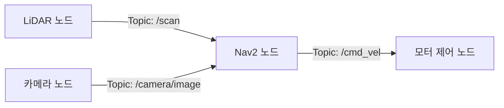

# ROS2 기초 - 노드란 무엇인가

> 이 문서를 읽으면 ROS2에서 "노드"가 무엇이고 왜 프로그램을 굳이 노드 단위로 쪼개는지 이해하고, 직접 노드를 실행하고 상태를 확인할 수 있게 된다.

## 문서 정보

| 항목 | 내용 |
|---|---|
| 학습 단계 | Level 1 (개념) ~ Level 2 (실습) |
| 예상 선행 지식 | ROS2 Humble 설치 완료, 터미널 기본 사용법 |
| 학습 목표 | 노드 개념을 설명할 수 있다 / 노드를 실행·종료·조회할 수 있다 / 노드 이름과 네임스페이스를 이해한다 |
| 기준 환경 | Ubuntu 22.04, ROS2 Humble |
| 관련 문서 | 이전: [[01_개발_환경과_워크스페이스_구조|ROS2 기초 - 개발 환경과 워크스페이스 구조]] (선행 문서 후보) / 다음: [[03_Topic과_Message|ROS2 통신 - Topic과 Message]] |

---

## 1. 먼저 알아야 할 핵심

1. ROS2 프로그램은 하나의 거대한 실행 파일이 아니라, 여러 개의 작은 실행 단위로 나뉘어 동시에 돌아간다.
2. 이 작은 실행 단위를 **노드(Node)** 라고 부른다.
3. 노드는 혼자 일하지 않고, 다른 노드와 정보를 주고받으며 협업한다.
4. 로봇 한 대는 보통 수십 개의 노드가 동시에 실행되면서 만들어진다.
5. 노드 개념을 모르면 이후에 배울 Topic, Service, Action, TF 모두 이해하기 어렵다. (이 문서가 통신 계열 문서보다 먼저 오는 이유)

---

## 2. 이 개념은 무엇인가

노드는 ROS2에서 **하나의 기능을 담당하는 독립적인 실행 프로그램**이다. 일반적인 프로그램의 "프로세스"와 비슷하지만, 다른 노드와 표준화된 방식으로 메시지를 주고받도록 설계되어 있다는 점이 다르다.

**비유로 이해하기**

레스토랑 주방을 떠올려보자.

- 재료 손질 담당, 굽기 담당, 소스 담당, 플레이팅 담당이 각각 따로 존재한다.
- 각 담당자(노드)는 자기 일만 하지만, 옆 사람에게 "재료 손질 끝났어요"라고 전달(메시지)해야 다음 사람이 일을 시작할 수 있다.
- 굽기 담당이 갑자기 자리를 비워도(노드 하나가 죽어도) 주방 전체가 멈추지 않고, 그 자리만 비게 된다.

**비유가 실제와 다른 부분**

- 실제 주방에서는 사람이 서로 얼굴을 보고 소통하지만, ROS2 노드는 서로의 존재를 몰라도 통신할 수 있다. 노드는 상대방이 누군지 지정하지 않고, "이 이름의 정보 통로(Topic)에 뭔가 올라오면 나는 그걸 쓴다"는 식으로만 동작한다. 이 방식은 다음 문서([[03_Topic과_Message|Topic과 Message]])에서 자세히 다룬다.
- 주방 비유는 순차적 흐름처럼 보이지만, 실제 노드들은 대부분 동시에(병렬로) 계속 실행되며 각자의 루프를 돈다.

**기술적으로 정리하면**

노드는 ROS2 미들웨어(DDS)를 통해 다른 노드와 통신하는, 독립적으로 실행·종료 가능한 프로세스다. ROS2 공식 문서는 노드를 "각각 하나의 목적(예: 센서 드라이버 하나, 모터 컨트롤러 하나)을 담당하도록 만드는 것을 권장한다"고 설명한다.

---

## 3. 왜 필요한가

**ROS 시스템 관점**

- 기능을 노드 단위로 쪼개면, 하나의 노드에 문제가 생겨도 전체 시스템이 한 번에 멈추지 않는다.
- 코드 재사용이 쉬워진다. 예를 들어 LiDAR 드라이버 노드는 다른 로봇 프로젝트에서도 그대로 가져다 쓸 수 있다.
- 여러 개발자가 각자 다른 노드를 담당해서 동시에 개발할 수 있다.
- `ros2 node list`, `ros2 node info` 같은 도구로 시스템 상태를 노드 단위로 관찰하고 디버깅할 수 있다.

**실제 로봇 관점 (ROSMASTER X3 기준)**

X3 같은 실제 로봇을 예로 들면, 다음과 같이 역할이 나뉜 여러 노드가 동시에 돌아간다.

- LiDAR C1 드라이버 노드 → 거리 데이터 발행
- RealSense D435i 드라이버 노드 → 영상/깊이 데이터 발행
- 모터 제어(base controller) 노드 → 바퀴 속도 명령 처리
- Nav2의 경로 계획 노드, 로컬라이제이션 노드 등

만약 이 모든 기능이 하나의 거대한 프로그램으로 합쳐져 있다면, 카메라 코드 한 줄 수정을 위해 로봇 전체를 다시 빌드하고 재시작해야 한다. 노드로 나뉘어 있으면 카메라 노드만 재시작하면 된다.

---

## 4. ROS2 시스템에서의 위치



**그림 읽는 방법**

- 각 사각형이 하나의 노드다. LiDAR 노드, 카메라 노드는 센서 데이터를 만들어내는(발행하는) 역할을 한다.
- 화살표는 노드 간 정보가 흐르는 통로(Topic)를 의미한다. 이 통로가 무엇인지는 다음 문서 [[03_Topic과_Message|ROS2 통신 - Topic과 Message]]에서 자세히 다룬다.
- 이 문서에서는 "화살표가 어떻게 동작하는지"보다 "각 사각형(노드)이 독립적인 실행 단위"라는 점에 집중하면 된다.

---

## 5. 주요 구성 요소

| 구성 요소 | 역할 | 초보자가 기억할 점 |
|---|---|---|
| 노드(Node) | 하나의 기능을 담당하는 실행 프로그램 | "실행 중인 프로그램 하나 = 노드 하나"라고 우선 이해해도 무방하다 |
| 노드 이름(Node Name) | 시스템 안에서 노드를 구분하는 고유 이름 | 같은 이름의 노드가 겹치면 경고나 충돌이 발생할 수 있다 |
| 네임스페이스(Namespace) | 노드 이름 앞에 붙는 그룹 경로 | 로봇을 여러 대 띄울 때 이름 충돌을 막는 용도 |
| 프로세스(Process) | 운영체제 관점에서 실제로 실행되는 단위 | 보통 노드 1개 = 프로세스 1개지만, 예외(컴포넌트 노드)도 있다 |

> **참고**: 하나의 프로세스 안에 여러 노드를 넣어 성능을 높이는 "컴포넌트(Component) 노드" 방식도 있다. 이는 이 문서의 범위를 넘어서므로 12장 심화 내용에서 짧게만 언급한다.

---

## 6. 기본 동작 과정

1. **실행**: 터미널에서 `ros2 run <패키지명> <실행파일명>` 명령을 입력하면, 해당 실행 파일이 프로세스로 실행된다.
2. **초기화**: 프로그램 내부에서 `rclpy.init()` (Python) 또는 `rclcpp::init()` (C++)이 호출되며 ROS2 통신 시스템에 접속을 준비한다.
3. **노드 생성 및 등록**: `Node` 클래스를 상속받은 객체가 만들어지면서 노드 이름으로 ROS2 네트워크에 자신을 알린다. 이 순간부터 `ros2 node list`에서 이 노드가 보이기 시작한다.
4. **루프 실행**: 노드는 보통 `spin()` 상태로 들어가 계속 대기하면서, 메시지가 들어오면 처리하고 필요하면 메시지를 내보낸다.
5. **종료**: `Ctrl+C` 등으로 종료 신호를 받으면 노드는 통신 네트워크에서 자신을 정리(destroy)하고 프로세스가 끝난다.

---

## 7. 기본 실습

### 실습 목표

ROS2에 기본 포함된 예제 노드(`turtlesim`)를 실행해서, 노드가 실제로 목록에 나타나고 이름을 갖는 것을 눈으로 확인한다.

### 준비 사항

* 운영체제: Ubuntu 22.04
* ROS2 배포판: Humble (설치 및 `source /opt/ros/humble/setup.bash` 완료 상태)
* 필요한 패키지: `ros-humble-turtlesim` (보통 데스크톱 설치 시 기본 포함)
* 실행 전 확인: 터미널에서 `ros2 --version` 실행 시 정상적으로 버전이 출력되는지 확인

### 설치

```bash
sudo apt update
sudo apt install ros-humble-turtlesim
```

* 이 명령어가 하는 일: `turtlesim` 예제 패키지를 설치한다. 화면에 거북이를 띄우고 움직이는 아주 간단한 시뮬레이션 노드가 들어 있다.
* 정상 실행 시 예상 결과: 마지막 줄에 `Setting up ros-humble-turtlesim ...` 과 함께 설치 완료 메시지가 뜬다.
* 잘못 실행했을 때 나타날 수 있는 오류: `Unable to locate package` → apt 소스 목록에 ROS2 저장소가 등록되지 않았거나 `sudo apt update`를 먼저 실행하지 않은 경우 발생한다.

### 실행

```bash
# 새 터미널 1
source /opt/ros/humble/setup.bash
ros2 run turtlesim turtlesim_node
```

이 명령어는 `turtlesim` 패키지 안의 `turtlesim_node`라는 실행 파일을 노드로 실행한다. 실행되면 파란 배경에 거북이가 있는 창이 뜬다.

### 확인

```bash
# 새 터미널 2 (터미널 1을 끄지 않은 상태에서)
source /opt/ros/humble/setup.bash
ros2 node list
```

```bash
ros2 node info /turtlesim
```

* `ros2 node list`: 현재 실행 중인 모든 노드의 이름을 보여준다. 언제 사용하는가 → "내가 실행한 노드가 정말 켜졌는지", "다른 사람이 만든 노드가 실행 중인지" 확인할 때 사용한다.
* `ros2 node info /turtlesim`: 특정 노드가 어떤 Topic, Service, Action을 갖고 있는지 상세히 보여준다. 지금은 목록에 낯선 용어(Publisher, Subscriber 등)가 보이겠지만, 다음 문서에서 그 의미를 다룬다.

### 예상 결과

* `ros2 node list` 실행 시 `/turtlesim` 이라는 이름이 출력되면 정상이다.
* 거북이 창이 뜬 터미널(터미널 1)에서 `Ctrl+C`를 누르면 프로세스가 종료되고, 이후 `ros2 node list`를 다시 실행하면 `/turtlesim`이 목록에서 사라진다. 이를 통해 "노드 실행 = 목록에 등장, 노드 종료 = 목록에서 소멸"이라는 관계를 직접 확인할 수 있다.

---

## 8. 코드 및 설정 해설

가장 단순한 형태의 노드를 Python으로 작성하면 다음과 같다. (아직 실행할 필요는 없고, 구조만 이해하면 된다.)

```python
import rclpy
from rclpy.node import Node

class MinimalNode(Node):
  def __init__(self):
    # "minimal_node" is the name this node will register as in the ROS2 graph
    super().__init__('minimal_node')
    self.get_logger().info('Node has started')

def main(args=None):
  rclpy.init(args=args)          # start ROS2 communication system
  node = MinimalNode()           # create and register the node
  rclpy.spin(node)                # keep the node alive and waiting
  node.destroy_node()            # clean shutdown
  rclpy.shutdown()

if __name__ == '__main__':
  main()
```

* `super().__init__('minimal_node')`: 이 노드가 ROS2 그래프(전체 네트워크)에 어떤 이름으로 등록될지 결정한다. 이 이름이 바로 `ros2 node list`에 나타나는 값이다.
* `rclpy.spin(node)`: 노드를 계속 살아있게 유지하며 이벤트(메시지 수신 등)를 기다리는 부분이다. 이 줄이 없으면 노드는 바로 종료돼 버린다.
* 이름을 비워두거나 특수문자를 넣으면 오류가 발생한다. 노드 이름은 영문, 숫자, 언더스코어(`_`) 조합을 사용하는 것이 안전하다.

> 사용자 preference에 맞춰 실제 프로젝트 코드에서는 들여쓰기를 2칸으로 통일하고 주석은 영어로 작성했다.

---

## 9. 자주 사용하는 명령어

| 목적 | 명령어 | 설명 |
|---|---|---|
| 노드 실행 | `ros2 run <package> <executable>` | 특정 패키지의 실행 파일을 노드로 실행할 때 사용 |
| 실행 중인 노드 목록 확인 | `ros2 node list` | 지금 시스템에 어떤 노드가 떠 있는지 확인할 때 사용 |
| 노드 상세 정보 확인 | `ros2 node info <노드이름>` | 특정 노드가 어떤 Topic/Service/Action을 쓰는지 확인할 때 사용 (디버깅 시 자주 사용) |
| 노드 이름 변경 실행 | `ros2 run <package> <executable> --ros-args -r __node:=<새이름>` | 같은 노드를 여러 개 띄워야 할 때 이름 충돌을 피하기 위해 사용 |

---

## 10. 자주 발생하는 문제

### 문제: `ros2 run` 실행 시 `Package not found` 오류

**증상**

```
Package 'turtlesim' not found
```

**가능한 원인**

1. 패키지가 설치되어 있지 않음
2. `source /opt/ros/humble/setup.bash`를 실행하지 않아 ROS2 환경이 터미널에 로드되지 않음
3. 워크스페이스에서 만든 커스텀 패키지인데 `colcon build` 후 `source install/setup.bash`를 하지 않음

**확인 방법**

```bash
ros2 pkg list | grep turtlesim
```

**해결 방법**

1. `source /opt/ros/humble/setup.bash`를 먼저 실행한다. (매 터미널마다 필요하며, `~/.bashrc`에 추가해두면 자동화 가능)
2. 위 명령으로도 안 보이면 `sudo apt install ros-humble-turtlesim`으로 설치한다.
3. 직접 만든 패키지라면 워크스페이스 루트에서 `colcon build` 후 `source install/setup.bash`를 실행한다.

**초보자가 자주 하는 실수**

새 터미널을 열 때마다 `source` 명령을 잊는 경우가 가장 흔하다. ROS2 환경은 터미널 세션 단위로 로드되므로, 새 터미널을 열 때마다 다시 설정해야 한다.

### 문제: 같은 이름의 노드가 두 개 실행되어 경고 발생

**증상**

두 번째 노드를 실행했을 때 첫 번째 노드가 이상하게 동작하거나, 로그에 이름 충돌 관련 경고가 뜬다.

**가능한 원인**

1. 같은 실행 파일을 이름 변경 없이 두 번 실행함
2. 여러 대의 로봇/시뮬레이션을 동시에 띄우면서 네임스페이스를 구분하지 않음

**확인 방법**

```bash
ros2 node list
```

목록에 동일한 이름이 두 번 이상 보이는지 확인한다.

**해결 방법**

`--ros-args -r __node:=<새이름>` 옵션으로 노드 이름을 다르게 지정하거나, 네임스페이스(`-r __ns:=/robot1`)를 사용해 그룹을 분리한다.

**초보자가 자주 하는 실수**

멀티 로봇 실습을 할 때 네임스페이스 개념을 모른 채 같은 노드를 여러 번 실행해서 어떤 노드가 어떤 로봇의 것인지 혼동하는 경우가 많다.

---

## 11. 개념 간 연결

* 노드는 앞으로 배울 **Topic**(다음 문서)을 통해 다른 노드와 데이터를 주고받는다. 즉 "노드 = 일하는 사람", "Topic = 정보를 전달하는 통로"로 이해하면 자연스럽게 연결된다.
* 노드는 **Parameter**(예정 문서)를 통해 실행 시 동작 방식을 조절한다. (예: LiDAR 노드의 스캔 주기 설정)
* 여러 노드를 한 번에 실행하는 방법은 **Launch 파일**(예정 문서)에서 다룬다. 실제 로봇을 켤 때는 `ros2 run`을 여러 번 반복하지 않고 launch 파일 하나로 필요한 노드를 전부 띄운다.

---

## 12. 한 단계 더 깊게 보기

> **심화 학습**
>
> 이 부분은 기본 실습을 완료한 후 읽는 것을 권장한다.

- **컴포넌트 노드(Composable Node)**: 여러 노드를 별도 프로세스가 아니라 하나의 프로세스 안에서 실행해, 노드 간 데이터 전달 시 메모리 복사를 줄이는 방식이다. 카메라처럼 대용량 이미지 데이터를 자주 주고받는 노드에서 성능 향상 효과가 크며, `ros2 component` 명령어로 다룬다.
- **DDS와 노드의 관계**: ROS2의 노드 간 통신은 실제로는 DDS(Data Distribution Service)라는 표준 미들웨어가 담당한다. 노드는 DDS 위에서 동작하는 "논리적 단위"이며, DDS 구현체(예: Fast DDS, Cyclone DDS)에 따라 세부 동작이 조금씩 달라질 수 있다. Humble의 기본 DDS는 Fast DDS다.

---

## 13. 핵심 요약

1. 노드는 ROS2에서 하나의 기능을 담당하는 독립 실행 단위다.
2. 로봇 시스템은 하나의 프로그램이 아니라 여러 노드가 동시에 협업하는 구조다.
3. `ros2 node list`, `ros2 node info`는 시스템 상태를 파악하는 가장 기본적인 진단 도구다.
4. 노드 이름/네임스페이스는 여러 노드나 여러 로봇을 동시에 다룰 때 충돌을 막는 핵심 개념이다.
5. 노드끼리 실제로 데이터를 주고받는 방법(Topic)은 다음 문서에서 이어진다.

---

## 14. 이해도 점검

1. 노드를 굳이 여러 개로 나누어 실행하는 이유는 무엇인가?
2. `ros2 run`을 실행했을 때 내부적으로 어떤 순서로 동작이 일어나는가?
3. 특정 노드가 정상적으로 실행 중인지 어떻게 확인하는가?
4. `ros2 run`에서 `Package not found` 오류가 나면 가장 먼저 무엇을 확인해야 하는가?
5. 실제 ROSMASTER X3 로봇에서는 어떤 기능들이 각각 별도의 노드로 나뉘어 실행되는가?

> [!info]- 정답 및 해설 보기
> 1. 기능별로 독립시켜야 한 부분이 죽어도 전체가 멈추지 않고, 재사용과 병렬 개발이 쉬워지기 때문이다.
> 2. 실행 파일 실행 → `rclpy.init()`/`rclcpp::init()` 초기화 → 노드 객체 생성 및 ROS2 그래프 등록 → `spin()`으로 대기 루프 진입 → 종료 신호 시 정리 후 종료.
> 3. `ros2 node list`로 목록에 이름이 보이는지 확인하고, 필요하면 `ros2 node info`로 세부 상태까지 확인한다.
> 4. `source /opt/ros/humble/setup.bash`(또는 워크스페이스의 `install/setup.bash`)를 실행했는지부터 확인한다.
> 5. 예: LiDAR 드라이버 노드, RealSense 카메라 드라이버 노드, 모터/베이스 컨트롤러 노드, Nav2 관련 여러 노드(경로 계획, 로컬라이제이션 등)가 각각 별도 노드로 실행된다.

---

## 15. 다음 학습 주제

1. **바로 다음**: [[03_Topic과_Message|ROS2 통신 - Topic과 Message]] — 방금 배운 노드들이 실제로 어떻게 데이터를 주고받는지 이해하기 위해 필요하다.
2. **함께 보면 좋은 주제**: [[01_개발_환경과_워크스페이스_구조|ROS2 기초 - 개발 환경과 워크스페이스 구조]] — 커스텀 노드를 직접 만들고 빌드하려면 워크스페이스 구조를 먼저 알아야 한다.
3. **나중에 학습할 심화 주제**: [[02_Composable_Node와_Executor_구조|ROS2 성능 - Composable Node와 실행기(Executor) 구조]] — 실제 로봇에서 카메라·LiDAR처럼 데이터량이 많은 노드를 최적화할 때 필요하다.

---

## 16. 참고자료

| 구분 | 자료 | 핵심 내용 |
|---|---|---|
| 공식 문서 | [ROS2 Documentation (Humble) – Understanding nodes](https://docs.ros.org/en/humble/Tutorials/Beginner-CLI-Tools/Understanding-ROS2-Nodes/Understanding-ROS2-Nodes.html) | 노드의 정의, 하나의 노드가 하나의 목적을 갖도록 설계하는 것을 권장한다는 공식 가이드라인 확인 |
| 공식 문서 | [ROS2 Documentation (Humble) – rclpy 예제 (Writing a simple publisher/subscriber)](https://docs.ros.org/en/humble/Tutorials/Beginner-Client-Libraries/Writing-A-Simple-Py-Publisher-And-Subscriber.html) | `rclpy.init`, `Node` 상속, `spin()` 구조 확인 |
