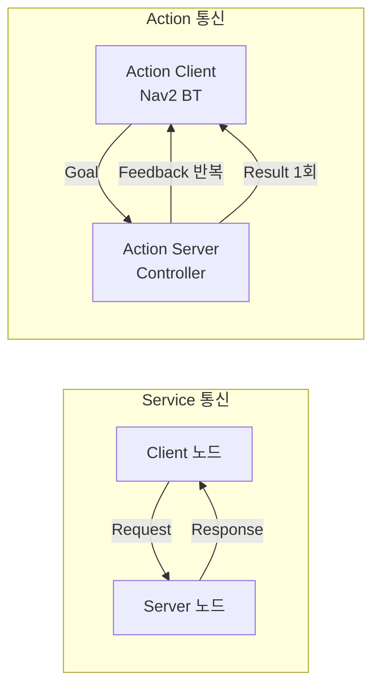

# ROS2 통신 - Service와 Action

> 이 문서를 읽으면 Topic만으로 해결하기 어려운 "요청-응답"과 "장시간 작업 처리" 상황에 Service와 Action을 각각 언제, 왜 사용하는지 이해하고, 두 방식을 직접 실행해볼 수 있게 된다.

## 문서 정보

| 항목 | 내용 |
|---|---|
| 학습 단계 | Level 2 — 기초 실습 |
| 예상 선행 지식 | `ROS2 통신 - Topic과 Message`, `ROS2 기초 - 개발 환경과 워크스페이스 구조` |
| 학습 목표 | Service와 Action의 개념과 차이를 설명할 수 있다 / 언제 Topic 대신 Service나 Action을 써야 하는지 판단할 수 있다 / `ros2 service`, `ros2 action` 명령으로 상태를 확인할 수 있다 |
| 기준 환경 | Ubuntu 22.04, ROS2 Humble |
| 관련 문서 | 이전: `ROS2 통신 - Topic과 Message` / 다음: `ROS2 기초 - Parameter와 실행 설정` |

---

## 1. 먼저 알아야 할 핵심

1. Topic은 "계속 흐르는 데이터"에 적합하지만, "한 번 요청하고 한 번 응답받는" 상황에는 맞지 않는다. 이런 상황을 위한 통신 방식이 **Service**다.
2. Service는 요청(Request)을 보내면 응답(Response)이 올 때까지 기다리는 방식이며, 응답은 보통 즉시(수 초 이내) 온다.
3. 지도 저장, 경로 계획처럼 **완료까지 시간이 오래 걸리고, 중간 진행 상황도 알아야 하는 작업**에는 Service도 부족하다. 이를 위한 통신 방식이 **Action**이다.
4. Action은 내부적으로 Topic과 Service를 조합해서 만들어진 구조로, "목표 전달 → 진행 상황 계속 받기 → 최종 결과 받기"가 모두 가능하다.
5. 이 프로젝트에서 다룰 Nav2의 "특정 좌표로 이동해줘" 명령이 바로 Action의 대표적인 실사용 예시다.

---

## 2. 이 개념은 무엇인가

**Service**는 한쪽 노드가 "요청"을 보내면, 다른 쪽 노드가 그 요청을 처리한 뒤 "응답"을 딱 한 번 돌려주는 통신 방식이다. **Action**은 처리 시간이 오래 걸리는 작업을 위해, "목표 전달 → 중간 진행 상황 계속 보고 → 최종 결과"까지 지원하는 통신 방식이다.

**비유로 이해하기**

- **Service = 패스트푸드 주문**: 카운터에서 "치즈버거 하나 주세요"(요청)라고 말하면, 잠시 후 "여기 있습니다"(응답)를 받는다. 기다리는 동안 중간 상황(지금 굽는 중, 포장 중)은 알 수 없고, 짧은 시간 안에 결과만 받는다.
- **Action = 택배 배송 주문**: 배송을 요청(목표 전달)하면, "출고 완료", "배송 중", "배송 완료" 같은 중간 상태를 계속 알려준다(진행 상황, Feedback). 그리고 배송이 다 끝나면 최종 결과(문 앞 배송 완료)를 받는다. 필요하면 중간에 "배송 취소"도 요청할 수 있다.

**비유가 실제와 다른 부분**

- 패스트푸드 주문은 대부분 순서를 기다려야 하지만, ROS2 Service를 요청한 노드는 응답을 기다리는 동안에도(비동기 방식으로 구현하면) 다른 작업을 계속할 수 있다.
- 택배는 한 번에 하나만 주문하는 경우가 많지만, ROS2 Action은 하나의 서버가 동시에 여러 목표(Goal) 요청을 받아 처리하도록 구현할 수도 있다.

---

## 3. 왜 필요한가

**ROS 시스템 관점**

- Topic만 사용한다면 "요청했는지, 응답이 왔는지"를 판단할 표준화된 방법이 없어 각자 다른 방식으로 구현해야 한다. Service는 이 요청-응답 패턴을 표준화한다.
- 오래 걸리는 작업(경로 이동, 지도 저장)을 Service로 구현하면, 응답이 올 때까지 요청자가 사실상 멈춰서 기다려야 하고, 중간에 취소하거나 진행률을 알 방법이 없다. Action은 이 문제를 구조적으로 해결한다.
- Service/Action은 Topic과 마찬가지로 이름과 타입 기반으로 자동 연결되므로, 지금까지 배운 노드 간 통신 원칙(이름/타입 일치)이 그대로 적용된다.

**실제 로봇 관점 (ROSMASTER X3 기준)**

- **Service 예시**: "현재 지도를 파일로 저장해줘"(`/map_saver/save_map`), "특정 파라미터 값을 바꿔줘" 같은 즉시 처리 가능한 명령.
- **Action 예시**: Nav2의 `NavigateToPose`. 로봇에게 "이 좌표로 이동해줘"라고 목표를 보내면, 이동하는 동안 "지금 몇 미터 남았는지"(Feedback)를 계속 받을 수 있고, 도착하면 "성공적으로 도착함"(Result)이라는 최종 결과를 받는다. 도중에 "그만 가"(Cancel)라고 취소도 가능하다.

이처럼 실제 로봇에서 "즉시 끝나는 일"과 "시간이 걸리는 일"은 명확히 다른 통신 방식으로 처리되며, 이 구분을 알아야 Nav2 문서를 읽을 때 왜 특정 인터페이스가 Action으로 구현되어 있는지 이해할 수 있다.

---

## 4. ROS2 시스템에서의 위치



**그림 읽는 방법**

- 위쪽 Service 상자는 요청(Request)을 보내면 응답(Response)이 딱 한 번, 비교적 빠르게 돌아오는 단순한 왕복 구조를 보여준다.
- 아래쪽 Action 상자는 목표(Goal)를 한 번 보낸 뒤, 작업이 끝날 때까지 진행 상황(Feedback)을 여러 번 받고, 마지막에 결과(Result)를 한 번 받는 구조를 보여준다. 화살표 개수 차이(Feedback은 "반복", Result는 "1회")가 Service와의 핵심 차이다.
- 세 방식(Topic, Service, Action) 모두 지난 문서에서 배운 "이름 + 타입 기반 자동 연결"이라는 원칙은 동일하게 적용된다.

---

## 5. 주요 구성 요소

| 구성 요소 | 역할 | 초보자가 기억할 점 |
|---|---|---|
| Service | 요청-응답 1회 통신 | 빠르게 끝나는 작업에 사용 |
| Client (Service) | 요청을 보내는 쪽 | 응답이 올 때까지 대기(또는 비동기 대기) |
| Server (Service) | 요청을 처리하고 응답하는 쪽 | 하나의 서버 이름에 여러 Client가 요청 가능 |
| Action | 목표 전달 + 진행 상황 + 최종 결과 | 시간이 오래 걸리는 작업에 사용 |
| Goal | Action에 전달하는 목표 정보 | 예: 목표 좌표 |
| Feedback | Action 진행 중 계속 전달되는 중간 상태 | 예: 남은 거리 |
| Result | Action 종료 시 1회 전달되는 최종 결과 | 예: 성공/실패 여부 |

---

## 6. 기본 동작 과정

### Service 동작 과정

1. **Server 등록**: 서버 노드가 특정 이름과 타입으로 Service를 만들어 요청을 기다린다.
2. **Client 요청**: 클라이언트 노드가 같은 이름과 타입으로 요청(Request)을 보낸다.
3. **처리 및 응답**: 서버가 요청을 처리한 뒤 결과를 응답(Response)으로 돌려준다.
4. **완료**: 클라이언트는 응답을 받은 시점에 통신이 끝난다.

### Action 동작 과정

1. **Server 등록**: 액션 서버가 특정 이름으로 목표를 받을 준비를 한다.
2. **Goal 전송**: 클라이언트가 목표(Goal)를 보낸다. 서버는 이를 수락(Accept)하거나 거절(Reject)할 수 있다.
3. **작업 수행 및 Feedback**: 서버가 작업을 진행하면서 주기적으로 Feedback을 클라이언트에 보낸다.
4. **Result 전달**: 작업이 끝나면(성공, 실패, 취소) 최종 Result를 한 번 전달하며 통신이 종료된다.

---

## 7. 기본 실습

이번 실습은 ROS2에 기본 포함된 예제 노드로 Service와 Action을 각각 체험한다. 새 코드를 작성하기보다, `ros2 service`/`ros2 action` CLI 도구로 실제 통신을 관찰하는 데 집중한다.

### 실습 목표

터틀심(turtlesim)의 Service와 Action을 직접 호출해보고, Topic과 어떻게 다르게 동작하는지 눈으로 확인한다.

### 준비 사항

* 1편 실습에서 사용한 `turtlesim` 패키지 (설치 완료 상태)
* ROS2 환경이 source된 터미널 3개 이상

### 실행

```bash
# 터미널 1
source /opt/ros/humble/setup.bash
ros2 run turtlesim turtlesim_node
```

거북이 화면을 띄운다. (2편 노드 실습과 동일)

### 확인 - Service

```bash
# 터미널 2
source /opt/ros/humble/setup.bash
ros2 service list
```

* `ros2 service list`: 언제 사용하는가 → 현재 시스템에 어떤 Service가 제공되고 있는지 확인할 때 사용한다. `ros2 topic list`의 Service 버전이다.

```bash
ros2 service call /spawn turtlesim/srv/Spawn "{x: 3.0, y: 3.0, theta: 0.0, name: 'turtle2'}"
```

* 이 명령어가 하는 일: `/spawn`이라는 Service에 "x=3.0, y=3.0 위치에 turtle2라는 이름의 새 거북이를 만들어줘"라는 요청을 보낸다.
* 정상 실행 시 예상 결과: 터미널 1의 화면에 새 거북이가 즉시 나타나고, 터미널 2에는 `response: turtlesim.srv.Spawn_Response(name='turtle2')`처럼 응답이 출력된다. **요청을 보내자마자 결과가 바로 오는 것**이 Topic과의 핵심 차이임을 여기서 확인할 수 있다.

### 확인 - Action

```bash
# 터미널 2 (계속)
ros2 action list
```

* `ros2 action list`: 언제 사용하는가 → 현재 시스템에 어떤 Action이 제공되고 있는지 확인할 때 사용한다.

```bash
ros2 action send_goal /turtle1/rotate_absolute turtlesim/action/RotateAbsolute "{theta: 1.57}" --feedback
```

* 이 명령어가 하는 일: `turtle1`에게 "절대 각도 1.57 라디안(약 90도)까지 회전해줘"라는 목표(Goal)를 보낸다.
* `--feedback` 옵션: 회전이 완료될 때까지의 중간 진행 상황(Feedback, 현재 남은 각도)을 터미널에 계속 출력하게 한다.

### 예상 결과

* Service(`/spawn`) 호출은 명령을 입력하자마자 즉시 응답이 오고 끝난다.
* Action(`rotate_absolute`) 호출은 거북이가 서서히 회전하는 동안 터미널에 `remaining: ...` 같은 Feedback이 여러 번 반복 출력되다가, 회전이 끝나면 최종 결과와 함께 명령이 종료된다. **이 반복 출력 여부가 Service와 Action을 구분하는 가장 직관적인 차이**다.

---

## 8. 코드 및 설정 해설

Action Client를 Python 코드로 작성하면 다음과 같은 구조를 가진다. (구조 이해 목적이며, 실습에서는 CLI로 대체했다.)

```python
import rclpy
from rclpy.node import Node
from rclpy.action import ActionClient
from turtlesim.action import RotateAbsolute

class RotateClient(Node):
  def __init__(self):
    super().__init__('rotate_client')
    # Create an action client for '/turtle1/rotate_absolute'
    self._client = ActionClient(self, RotateAbsolute, '/turtle1/rotate_absolute')

  def send_goal(self, theta):
    goal_msg = RotateAbsolute.Goal()
    goal_msg.theta = theta
    self._client.wait_for_server()
    # Send goal asynchronously and register feedback callback
    self._send_goal_future = self._client.send_goal_async(
      goal_msg, feedback_callback=self.feedback_callback)
    self._send_goal_future.add_done_callback(self.goal_response_callback)

  def feedback_callback(self, feedback_msg):
    # Called repeatedly while the goal is being executed
    self.get_logger().info(f'Remaining: {feedback_msg.feedback.remaining}')

  def goal_response_callback(self, future):
    goal_handle = future.result()
    if not goal_handle.accepted:
      self.get_logger().info('Goal rejected')
      return
    self._get_result_future = goal_handle.get_result_async()
    self._get_result_future.add_done_callback(self.get_result_callback)

  def get_result_callback(self, future):
    # Called once when the action finishes
    result = future.result().result
    self.get_logger().info(f'Result: delta={result.delta}')
```

* `ActionClient(self, RotateAbsolute, '/turtle1/rotate_absolute')`: Service의 Client와 비슷하지만, Action 전용 클래스를 사용한다. Message 타입 대신 **Action 타입**(`RotateAbsolute`)을 지정하는 점이 다르다.
* `feedback_callback`: Service에는 없는 부분이다. 작업이 진행되는 동안 여러 번 호출되며, 실습에서 확인한 `remaining` 값이 여기로 들어온다.
* `goal_response_callback` → `get_result_callback`: 목표가 수락되었는지 먼저 확인한 뒤, 최종 결과는 별도의 콜백에서 딱 한 번 받는 2단계 구조다. 이 2단계 구조가 Action을 Service보다 복잡하게 만드는 이유이며, 그만큼 시간이 걸리는 작업에 필요한 기능(중간 취소, 진행률 확인)을 제공한다.

---

## 9. 자주 사용하는 명령어

| 목적 | 명령어 | 설명 |
|---|---|---|
| Service 목록 확인 | `ros2 service list` | 현재 제공 중인 Service 확인 |
| Service 타입 확인 | `ros2 service type <서비스명>` | 해당 Service가 어떤 Request/Response 구조를 쓰는지 확인 |
| Service 직접 호출 | `ros2 service call <서비스명> <타입> "<데이터>"` | 노드 코드 없이 즉석에서 Service를 테스트할 때 사용 |
| Action 목록 확인 | `ros2 action list` | 현재 제공 중인 Action 확인 |
| Action 정보 확인 | `ros2 action info <액션명>` | 해당 Action의 Client/Server 개수 확인 |
| Action 목표 전송 | `ros2 action send_goal <액션명> <타입> "<데이터>" --feedback` | 노드 코드 없이 Action을 테스트하고 Feedback을 볼 때 사용 |

---

## 10. 자주 발생하는 문제

### 문제: `ros2 service call` 실행 후 응답 없이 멈춤

**증상**

명령을 입력했는데 터미널이 아무 반응 없이 계속 대기 상태로 멈춘다.

**가능한 원인**

1. 해당 이름의 Service를 제공하는 서버 노드가 실행되어 있지 않음
2. Service 이름 오타

**확인 방법**

```bash
ros2 service list
```

내가 호출하려는 Service 이름이 목록에 있는지 확인한다.

**해결 방법**

목록에 없다면 해당 Service를 제공하는 노드(예: `turtlesim_node`)가 실행 중인지 먼저 확인한다. `Ctrl+C`로 멈춘 요청은 취소해도 서버 자체에는 영향이 없다.

**초보자가 자주 하는 실수**

Service Request 데이터를 YAML 형식(`"{x: 3.0, ...}"`)으로 정확히 맞춰 입력하지 않아 문법 오류가 나는 경우가 많다. 필드 이름과 콜론(`:`) 뒤 공백까지 정확히 입력해야 한다.

### 문제: Action의 Feedback은 보이는데 Result가 안 옴

**증상**

`--feedback` 옵션으로 진행 상황은 계속 보이는데, 명령이 끝나지 않고 계속 대기한다.

**가능한 원인**

1. 목표(Goal) 값이 로봇/시뮬레이션이 도달할 수 없는 값(예: 물리적으로 불가능한 각도나 좌표)
2. 서버 노드 내부에서 오류가 발생해 작업이 끝나지 않음

**확인 방법**

```bash
ros2 action info /turtle1/rotate_absolute
```

Action Server가 여전히 정상적으로 등록되어 있는지 확인한다.

**해결 방법**

목표 값이 합리적인 범위인지 다시 확인하고, 서버 노드(터미널 1의 `turtlesim_node`)의 로그에 오류 메시지가 없는지 확인한다.

---

## 11. 개념 간 연결

* Service와 Action은 모두 앞선 문서에서 배운 **노드**가 주체가 되며, "이름 + 타입이 일치해야 연결된다"는 Topic 통신의 원칙을 그대로 공유한다.
* Action은 내부적으로 Topic(Feedback 전달)과 Service(Goal 요청/취소 처리) 요소를 함께 사용하는 조합 구조다. 즉 이 문서는 Topic 문서 없이는 완전히 이해하기 어렵다.
* 다음 문서에서 배울 **Parameter**는 Service를 기반으로 동작한다(파라미터 조회/설정 자체가 Service 호출로 이루어짐). 이 문서에서 배운 Service 개념이 Parameter 이해의 선행 지식이 된다.
* 앞으로 다룰 Nav2의 `NavigateToPose`(목표 좌표로 이동), `Spin`(제자리 회전) 등은 모두 이 문서에서 배운 Action 구조 그대로 동작한다.

---

## 12. 한 단계 더 깊게 보기

> **심화 학습**
>
> 이 부분은 기본 실습을 완료한 후 읽는 것을 권장한다.

**Service를 언제 Topic 대신 써야 하는가에 대한 실전 기준**

- 데이터가 계속 흘러야 하고, 여러 노드가 동시에 구독할 가능성이 있다 → **Topic**
- 특정 시점에 한 번 요청하고, 빠르게(수십 ms~수 초) 응답을 받아야 한다 → **Service**
- 작업 완료까지 오래 걸리고(수 초~수 분), 중간 진행 상황을 알아야 하거나 취소 가능해야 한다 → **Action**

> **공식 문서 기준**: ROS2 공식 문서는 Action을 "장시간 실행되는 작업을 위한 것으로, 진행 상황에 대한 정기적인 피드백을 제공하고 취소가 가능하다"고 설명하며, Service와 명확히 구분되는 용도로 안내하고 있다.

---

## 13. 핵심 요약

1. Service는 요청-응답이 1회로 끝나는 빠른 통신 방식이다.
2. Action은 목표 전달, 반복적인 Feedback, 1회의 최종 Result로 구성된, 시간이 걸리는 작업을 위한 통신 방식이다.
3. Action은 내부적으로 Topic과 Service 요소를 조합해 만들어진 구조다.
4. `ros2 service call`, `ros2 action send_goal`은 노드 코드 없이 즉석에서 통신을 테스트할 수 있는 핵심 진단 도구다.
5. 실제 로봇에서 즉시 처리되는 명령은 Service로, Nav2의 이동 명령처럼 오래 걸리고 중간 상태가 중요한 작업은 Action으로 구현된다.

---

## 14. 이해도 점검

1. Service와 Topic의 가장 큰 구조적 차이는 무엇인가?
2. Action에 Feedback이 필요한 이유는 무엇인가?
3. `ros2 service call`을 실행했는데 응답이 안 온다면 가장 먼저 무엇을 확인해야 하는가?
4. Nav2의 "특정 좌표로 이동" 기능이 Service가 아니라 Action으로 구현된 이유는 무엇인가?
5. Action이 Topic, Service와 완전히 별개의 새로운 기술이 아니라고 할 수 있는 이유는 무엇인가?

<details>
<summary>정답 및 해설 보기</summary>

1. Topic은 발행자가 계속 데이터를 흘려보내는 비동기·반복 구조이고, Service는 요청 한 번에 응답 한 번이 오는 왕복 구조다.
2. 이동, 회전처럼 시간이 오래 걸리는 작업의 진행 상태(예: 남은 거리)를 작업이 끝나기 전에 계속 확인할 수 있어야 하기 때문이다.
3. 해당 이름의 Service를 제공하는 서버 노드가 실제로 실행 중인지, 이름에 오타가 없는지 `ros2 service list`로 확인해야 한다.
4. 목표 좌표까지 이동하는 데 시간이 오래 걸리고, 이동 중 진행 상황을 계속 알아야 하며, 도중에 취소가 가능해야 하기 때문이다.
5. Action은 내부적으로 Goal 요청/취소 처리에는 Service와 유사한 요청-응답 구조를, Feedback 전달에는 Topic과 유사한 반복 전송 구조를 조합해서 구현되어 있기 때문이다.

</details>

---

## 15. 다음 학습 주제

1. **바로 다음**: `ROS2 기초 - Parameter와 실행 설정` — 이 문서에서 배운 Service 구조가 실제로 파라미터 조회/설정에 어떻게 쓰이는지 배운다.
2. **함께 보면 좋은 주제**: `ROS2 기초 - Launch 파일 작성법` — Action 서버/클라이언트처럼 여러 노드가 함께 실행되어야 하는 시스템을 한 번에 띄우는 방법이 필요해진다.
3. **나중에 학습할 심화 주제**: `Nav2 - Action 기반 경로 이동 구조 이해하기` — 이 문서의 Action 개념이 Nav2의 실제 동작 구조(BT Navigator, Action Server)로 어떻게 확장되는지 다룬다.

---

## 16. 참고자료

| 구분 | 자료 | 핵심 내용 |
|---|---|---|
| 공식 문서 | ROS2 Documentation (Humble) – Understanding services | Service의 요청-응답 구조, `ros2 service` CLI 사용법 확인 |
| 공식 문서 | ROS2 Documentation (Humble) – Understanding actions | Action의 Goal/Feedback/Result 구조와 Service·Topic 대비 사용 시점 확인 |
| 공식 문서 | ROS2 Documentation (Humble) – Writing an action server and client (Python) | `ActionClient`, `feedback_callback`, `get_result_async` 구조 확인 |
