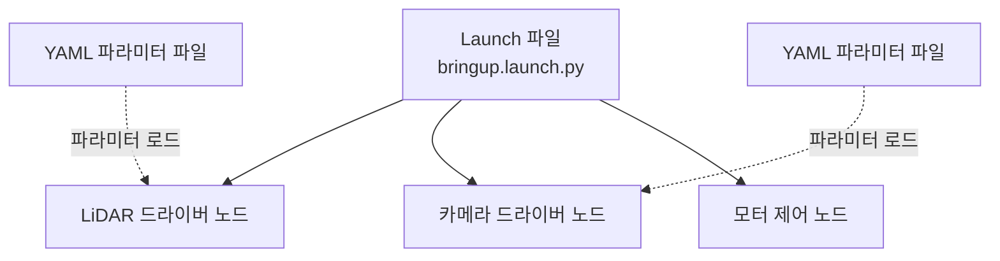

# ROS2 기초 - Launch 파일 작성법

> 이 문서를 읽으면 여러 노드와 파라미터 설정을 명령어 하나로 한 번에 실행하는 Launch 파일의 구조를 이해하고, 직접 Python Launch 파일을 작성해 실행할 수 있게 된다.

## 문서 정보

| 항목 | 내용 |
|---|---|
| 학습 단계 | Level 3 — 시스템 구성 |
| 예상 선행 지식 | [[02_노드란_무엇인가|ROS2 기초 - 노드란 무엇인가]], [[05_Parameter와_실행_설정|ROS2 기초 - Parameter와 실행 설정]] |
| 학습 목표 | Launch 파일이 왜 필요한지 설명할 수 있다 / 여러 노드를 하나의 Launch 파일로 동시에 실행할 수 있다 / YAML 파라미터 파일을 Launch 파일과 연결할 수 있다 |
| 기준 환경 | Ubuntu 22.04, ROS2 Humble |
| 관련 문서 | 이전: [[05_Parameter와_실행_설정|ROS2 기초 - Parameter와 실행 설정]] / 다음: [[07_TF2_기초|ROS2 좌표계 - TF2 기초]] |

---

## 1. 먼저 알아야 할 핵심

1. 실제 로봇은 노드 하나가 아니라 수십 개의 노드가 동시에 실행되어야 동작한다. 이걸 매번 터미널을 여러 개 열어서 `ros2 run`으로 실행하는 건 비현실적이다.
2. 이 문제를 해결하는 것이 **Launch 파일**이다. 명령어 한 번으로 여러 노드를 동시에, 각각의 파라미터와 함께 실행할 수 있다.
3. ROS2 Humble에서 Launch 파일은 주로 **Python 코드**로 작성한다. (XML, YAML 형식도 가능하지만 Python이 가장 널리 쓰이고 유연하다.)
4. Launch 파일은 앞선 문서에서 배운 **노드 실행 + 파라미터 지정**을 코드로 표현한 것에 가깝다. 완전히 새로운 개념이 아니라 지금까지 배운 것을 조합하는 방법이다.
5. 앞으로 다룰 LiDAR, 카메라, Nav2, ORB-SLAM3는 모두 Launch 파일을 통해 실행되며, 실제 로봇 개발에서 가장 자주 다루게 되는 파일 형태다.

---

## 2. 이 개념은 무엇인가

Launch 파일은 **여러 노드를 어떤 설정으로, 어떤 순서와 조건으로 실행할지 정의해둔 실행 스크립트**다. 하나의 파일을 실행하면 그 안에 정의된 모든 노드가 한 번에 켜진다.

**비유로 이해하기**

오케스트라 지휘자를 떠올려보자.

- 바이올린 연주자, 첼로 연주자, 트럼펫 연주자(각각의 노드)가 따로 존재하지만, 지휘자(Launch 파일)가 "다 같이 시작"이라는 신호를 주면 모두가 정해진 악보(파라미터 설정)에 맞춰 동시에 연주를 시작한다.
- 지휘자는 연주자 개개인의 연주 실력(노드의 내부 로직)에는 관여하지 않는다. 다만 "누가, 언제, 어떤 악보로 참여하는지"만 조율한다.

**비유가 실제와 다른 부분**

- 오케스트라는 보통 모든 연주자가 동시에 시작하지만, Launch 파일은 특정 노드가 먼저 실행된 뒤에야 다른 노드를 실행하도록 순서나 조건을 지정할 수도 있다(예: 카메라 드라이버가 켜진 뒤에 이미지 처리 노드 실행).
- 지휘자 비유는 정적인 악보를 떠올리게 하지만, 실제 Launch 파일은 Python 코드이므로 조건문, 변수, 환경에 따른 분기 등 프로그래밍적인 유연성을 가진다.

---

## 3. 왜 필요한가

**ROS 시스템 관점**

- Launch 파일이 없다면 노드 개수만큼 터미널을 열고 각각 `ros2 run`을 입력하고, 파라미터도 매번 명령줄에 나열해야 한다. 노드가 10개, 20개가 되면 사실상 관리가 불가능하다.
- 노드 간 실행 순서나 조건(예: 시뮬레이션 모드일 때만 특정 노드 실행)을 다루려면 사람이 수동으로 순서에 맞춰 터미널을 여는 것보다 코드로 명시하는 것이 안정적이다.
- 지난 문서에서 배운 YAML 파라미터 파일을 여러 노드에 각각 자동으로 연결해주는 역할도 Launch 파일이 담당한다.

**실제 로봇 관점 (ROSMASTER X3 기준)**

X3를 실제로 켜서 자율주행을 시키려면 다음과 같은 노드들이 동시에 필요하다.

- LiDAR C1 드라이버 노드
- RealSense D435i 카메라 드라이버 노드
- 모터/베이스 컨트롤러 노드
- TF 변환 관련 노드(다음 문서에서 다룸)
- (필요시) ORB-SLAM3 또는 Nav2의 여러 노드

이 모든 것을 하나하나 손으로 실행하는 대신, 보통 `bringup.launch.py` 같은 하나의 Launch 파일로 묶어서 `ros2 launch <패키지명> bringup.launch.py` 한 줄로 로봇 전체를 켠다. 앞으로의 센서 연동 문서에서 "실행" 단계는 대부분 이 Launch 파일 실행으로 이루어진다.

---

## 4. ROS2 시스템에서의 위치



**그림 읽는 방법**

- 맨 위 Launch 파일이 여러 노드를 동시에 실행시키는 시작점이다.
- 실선 화살표는 "Launch 파일이 이 노드를 실행한다"는 뜻이고, 점선 화살표는 지난 문서에서 배운 파라미터 YAML 파일이 각 노드에 연결되는 것을 의미한다.
- 즉 이 그림은 지금까지 배운 **노드 + 파라미터**를 **Launch 파일이라는 하나의 진입점**으로 묶는 구조를 보여준다.

---

## 5. 주요 구성 요소

| 구성 요소 | 역할 | 초보자가 기억할 점 |
|---|---|---|
| Launch 파일 | 여러 노드의 실행을 정의하는 Python 스크립트 | 보통 `xxx.launch.py`로 이름 짓는 관례가 있음 |
| `LaunchDescription` | 실행할 항목들을 담는 최상위 객체 | 모든 Launch 파일의 `generate_launch_description()`이 이걸 반환해야 함 |
| `Node` (launch_ros) | Launch 파일 안에서 노드 하나를 정의하는 액션 | `ros2 run`의 패키지명/실행파일명/파라미터를 코드로 표현한 것 |
| `IncludeLaunchDescription` | 다른 Launch 파일을 불러와 포함시키는 기능 | 큰 시스템을 여러 개의 작은 Launch 파일로 나눌 때 사용 |
| `DeclareLaunchArgument` | Launch 파일 실행 시 외부에서 값을 받을 수 있게 하는 인자 | 파라미터의 Launch 파일 버전이라고 이해하면 쉬움 |
| `ros2 launch` | Launch 파일을 실행하는 CLI 명령 | `ros2 run` 대신 사용 |

---

## 6. 기본 동작 과정

1. **작성**: `xxx.launch.py` 파일에서 `generate_launch_description()` 함수가 `LaunchDescription` 객체를 만들어 반환하도록 작성한다.
2. **노드 정의**: 그 안에 실행할 각 노드를 `Node(...)` 형태로 나열하며, 필요한 파라미터나 리매핑 정보를 함께 지정한다.
3. **실행**: `ros2 launch <패키지명> <launch파일명>`을 실행하면, ROS2가 파일 안의 모든 노드를 순서/조건에 맞게 한꺼번에 실행한다.
4. **모니터링**: 실행된 모든 노드의 로그가 하나의 터미널에 통합되어 출력되며, `Ctrl+C` 한 번으로 모든 노드를 한꺼번에 종료할 수 있다.

---

## 7. 기본 실습

### 실습 목표

지금까지 만든 `simple_publisher`와 `simple_subscriber`를 Launch 파일 하나로 동시에 실행하고, 파라미터(`publish_period`)도 함께 지정한다.

### 준비 사항

* 3편, 5편에서 만든 `my_first_pkg` 패키지 (`simple_publisher`, `simple_subscriber` 포함)
* `ros2 launch` 명령이 정상 동작하는 환경 (Humble 데스크톱 설치 시 기본 포함)

### 설치

이번 실습은 새 패키지 설치 없이, 기존 패키지에 `launch` 폴더만 추가한다.

```bash
mkdir -p ~/ros2_ws/src/my_first_pkg/launch
```

* 이 명령어가 하는 일: Launch 파일들을 모아둘 폴더를 생성한다. 관례적으로 패키지 루트에 `launch/`라는 이름의 폴더를 둔다.

이 폴더 안에 `bringup.launch.py`를 8장의 코드로 생성한다.

### 실행

```bash
cd ~/ros2_ws
colcon build --packages-select my_first_pkg
source install/setup.bash
ros2 launch my_first_pkg bringup.launch.py
```

* `colcon build`: Launch 파일도 `setup.py`에 등록해서 `install` 폴더로 복사되어야 인식되므로, 코드가 없어도 빌드 과정이 필요하다. (8장에서 `setup.py` 등록 부분 설명)
* `ros2 launch my_first_pkg bringup.launch.py`: 이전에는 터미널 두 개(Publisher, Subscriber)를 따로 열어야 했지만, 이제 이 한 줄로 두 노드가 동시에 실행된다.

### 확인

```bash
# 새 터미널
source /opt/ros/humble/setup.bash
ros2 node list
```

### 예상 결과

한 터미널 안에 `[simple_publisher-1]`, `[simple_subscriber-2]`처럼 각 노드의 로그가 접두어와 함께 섞여서 출력된다. `ros2 node list`에는 `/simple_publisher`와 `/simple_subscriber`가 모두 나타나야 정상이다. `Ctrl+C`를 누르면 두 노드가 동시에 종료된다 — 예전처럼 터미널 두 개를 각각 닫을 필요가 없다는 점이 이번 실습의 핵심 확인 포인트다.

---

## 8. 코드 및 설정 해설

### Launch 파일 (`bringup.launch.py`)

```python
from launch import LaunchDescription
from launch_ros.actions import Node

def generate_launch_description():
  # Publisher node with a custom parameter (publish_period = 0.5s)
  publisher_node = Node(
    package='my_first_pkg',
    executable='simple_publisher',
    name='simple_publisher',
    output='screen',
    parameters=[{'publish_period': 0.5}]
  )

  # Subscriber node with no extra parameters
  subscriber_node = Node(
    package='my_first_pkg',
    executable='simple_subscriber',
    name='simple_subscriber',
    output='screen'
  )

  return LaunchDescription([
    publisher_node,
    subscriber_node
  ])
```

* `from launch_ros.actions import Node`: `ros2 run`으로 실행하던 노드를 Launch 파일 안에서 실행 가능한 형태(`Node` 액션)로 표현하기 위해 가져온다.
* `package='my_first_pkg', executable='simple_publisher'`: `ros2 run my_first_pkg simple_publisher`와 정확히 동일한 의미다. 즉 Launch 파일은 지금까지 손으로 입력하던 `ros2 run` 명령을 코드로 옮긴 것에 가깝다.
* `parameters=[{'publish_period': 0.5}]`: 5편에서 배운 `--ros-args -p publish_period:=0.5`와 동일한 역할을 한다. 여러 파라미터가 필요하면 딕셔너리에 계속 추가하거나, YAML 파일 경로를 이 리스트에 넣을 수도 있다. (아래 참고)
* `output='screen'`: 노드의 로그를 터미널 화면에 바로 출력하라는 옵션이다. 이 옵션이 없으면 로그가 파일로만 저장되고 화면에는 안 보일 수 있다.
* `return LaunchDescription([publisher_node, subscriber_node])`: 정의한 두 노드를 리스트에 담아 반환한다. 실행할 노드가 늘어나면 이 리스트에 계속 추가하면 된다.

### YAML 파라미터 파일을 Launch 파일에 연결하는 방법 (5편과의 연결)

```python
from launch_ros.actions import Node
import os
from ament_index_python.packages import get_package_share_directory

config_path = os.path.join(
  get_package_share_directory('my_first_pkg'),
  'config',
  'publisher_params.yaml'
)

publisher_node = Node(
  package='my_first_pkg',
  executable='simple_publisher',
  name='simple_publisher',
  output='screen',
  parameters=[config_path]   # YAML file path instead of a dict
)
```

* `get_package_share_directory('my_first_pkg')`: 빌드된 후 `install` 폴더 안에 설치된 패키지 경로를 코드가 실행되는 시점에 자동으로 찾아준다. 경로를 직접 하드코딩하지 않는 이유는, 사용자마다 워크스페이스 위치(`~/ros2_ws`)가 다를 수 있기 때문이다.
* `parameters=[config_path]`: 딕셔너리 대신 YAML 파일 경로를 그대로 넣으면, 5편에서 만든 YAML 파일의 모든 파라미터가 한 번에 적용된다. 실제 LiDAR나 카메라 드라이버 Launch 파일은 대부분 이 방식을 사용한다.

### `setup.py`에 launch 폴더 등록

```python
data_files=[
  ('share/ament_index/resource_index/packages', ['resource/' + package_name]),
  ('share/' + package_name, ['package.xml']),
  (os.path.join('share', package_name, 'launch'), ['launch/bringup.launch.py']),
],
```

* `(os.path.join('share', package_name, 'launch'), ['launch/bringup.launch.py'])`: `launch/bringup.launch.py` 파일을 빌드 시 `install/my_first_pkg/share/my_first_pkg/launch/` 경로로 복사하라는 설정이다. 이 등록이 없으면 코드가 `src`에 있어도 `ros2 launch`가 파일을 찾지 못한다. (`setup.py` 상단에 `import os`가 필요하다.)

---

## 9. 자주 사용하는 명령어

| 목적 | 명령어 | 설명 |
|---|---|---|
| Launch 파일 실행 | `ros2 launch <패키지명> <launch파일명>` | 여러 노드를 한 번에 실행할 때 사용 |
| Launch 인자 확인 | `ros2 launch <패키지명> <launch파일명> --show-args` | 해당 Launch 파일이 어떤 외부 인자를 받는지 확인 |
| 인자와 함께 실행 | `ros2 launch <패키지명> <launch파일명> <인자명>:=<값>` | `DeclareLaunchArgument`로 정의된 값을 실행 시 바꿀 때 사용 |

---

## 10. 자주 발생하는 문제

### 문제: `ros2 launch`에서 "Package or launch file not found" 오류

**증상**

```
Package 'my_first_pkg' not found
```
또는
```
No launch file named 'bringup.launch.py'
```

**가능한 원인**

1. `setup.py`의 `data_files`에 launch 폴더를 등록하지 않음
2. `colcon build` 이후 `source`를 다시 하지 않음
3. Launch 파일 이름에 오타가 있음

**확인 방법**

```bash
ros2 pkg prefix my_first_pkg
ls $(ros2 pkg prefix my_first_pkg)/share/my_first_pkg/launch
```

이 경로에 실제로 `bringup.launch.py`가 존재하는지 확인한다.

**해결 방법**

1. `setup.py`의 `data_files`에 launch 폴더 등록 코드를 추가했는지 확인하고, 추가/수정했다면 반드시 재빌드한다.
2. 재빌드 후 새 터미널에서 `source install/setup.bash`를 다시 실행한다.

**초보자가 자주 하는 실수**

`launch/` 폴더에 파일을 넣기만 하면 자동으로 인식될 것이라 생각하고 `setup.py` 등록을 빠뜨리는 경우가 매우 흔하다. 3편에서 배운 `entry_points` 등록을 빠뜨렸을 때와 같은 종류의 실수다.

### 문제: Launch로 실행한 노드 중 하나만 죽고 나머지는 계속 실행됨

**증상**

한 노드에서 오류가 발생해 종료됐는데, 나머지 노드들은 터미널에 계속 로그를 출력한다.

**가능한 원인**

기본적으로 ROS2 Launch는 노드 하나가 죽어도 나머지 노드를 자동으로 종료하지 않는 설계다.

**확인 방법**

```bash
ros2 node list
```

죽은 노드의 이름이 목록에서 빠졌는지 확인해 실제로 어떤 노드가 종료됐는지 파악한다.

**해결 방법**

의도적으로 모두 함께 종료되게 하려면 `launch.actions.Shutdown`이나 `on_exit` 이벤트 핸들러를 사용해야 한다. 이는 시스템이 커진 뒤 다루는 심화 내용이므로, 초반에는 어떤 노드가 죽었는지 로그를 통해 원인을 파악하는 것에 집중한다.

**초보자가 자주 하는 실수**

노드 하나가 죽은 걸 못 알아채고, 나머지 노드가 정상 실행 중이라는 이유로 시스템 전체가 정상이라고 오해하는 경우가 많다. Launch 실행 후에는 항상 `ros2 node list`로 기대한 노드 개수가 모두 떠 있는지 확인하는 습관이 필요하다.

---

## 11. 개념 간 연결

* Launch 파일의 `Node(...)` 액션은 1편(노드)에서 배운 `ros2 run`을, `parameters=[...]`는 5편(Parameter)에서 배운 파라미터 지정 방식을 그대로 코드로 옮긴 것이다. 즉 이 문서는 새로운 통신 개념이 아니라, 지금까지 배운 것을 "동시에, 반복 가능하게" 실행하는 방법을 다룬다.
* 다음 문서에서 배울 **TF2**는 여러 좌표계 변환 노드가 동시에 실행되어야 제대로 동작하므로, 대부분 Launch 파일과 함께 실행된다. 이 문서가 TF2 실습의 실행 기반이 된다.
* 앞으로 다룰 LiDAR C1, RealSense D435i, Nav2, ORB-SLAM3의 "실행" 단계는 대부분 `ros2 launch` 명령으로 시작되며, 이 문서의 `Node`, `IncludeLaunchDescription`, `DeclareLaunchArgument` 구조가 반복적으로 등장한다.

---

## 12. 한 단계 더 깊게 보기

> **심화 학습**
>
> 이 부분은 기본 실습을 완료한 후 읽는 것을 권장한다.

**여러 Launch 파일을 조합하기 (`IncludeLaunchDescription`)**

실제 로봇 시스템은 하나의 거대한 Launch 파일보다, 기능별로 나눈 여러 Launch 파일을 조합하는 방식을 선호한다. 예를 들어 LiDAR 전용 Launch 파일, 카메라 전용 Launch 파일을 각각 만들어두고, 최상위 `bringup.launch.py`에서 이들을 모두 포함시키는 식이다.

```python
from launch.actions import IncludeLaunchDescription
from launch.launch_description_sources import PythonLaunchDescriptionSource
import os
from ament_index_python.packages import get_package_share_directory

lidar_launch = IncludeLaunchDescription(
  PythonLaunchDescriptionSource(
    os.path.join(get_package_share_directory('ldlidar_node'), 'launch', 'ld14.launch.py')
  )
)
```

이 구조는 실제 X3 로봇의 LiDAR C1, RealSense D435i 드라이버 패키지가 이미 자체 Launch 파일을 제공하는 경우, 이를 직접 수정하지 않고 그대로 재사용하면서 내 시스템에 포함시킬 때 사용하게 된다. 앞으로의 센서 연동 문서에서 이 패턴이 실제로 등장한다.

> **공식 문서 기준**: ROS2 공식 문서는 Launch 시스템을 "여러 노드를 포함한 복잡한 시스템을 동시에 시작하고 구성하기 위한 도구"로 설명하며, 큰 시스템일수록 기능 단위로 Launch 파일을 나누고 조합하는 구조를 권장한다.

---

## 13. 핵심 요약

1. Launch 파일은 여러 노드를 하나의 명령으로 동시에 실행하기 위한 Python 스크립트다.
2. `Node(...)` 액션 안의 `package`, `executable`, `parameters`는 각각 지금까지 배운 `ros2 run`과 파라미터 지정 방식을 코드로 표현한 것이다.
3. Launch 파일과 노드 실행 파일 모두 `setup.py`의 `data_files`/`entry_points`에 등록되어야 `ros2 launch`/`ros2 run`에서 인식된다.
4. YAML 파라미터 파일은 `parameters=[config_path]` 형태로 Launch 파일에 연결해 여러 파라미터를 한 번에 적용할 수 있다.
5. 노드 하나가 죽어도 나머지 노드는 자동으로 종료되지 않으므로, 실행 후 `ros2 node list`로 상태를 확인하는 습관이 중요하다.

---

## 14. 이해도 점검

1. Launch 파일이 없다면 실제 로봇을 켤 때 어떤 불편함이 생기는가?
2. Launch 파일 안의 `Node(...)` 액션은 어떤 명령어를 코드로 옮긴 것인가?
3. `ros2 launch`가 "파일을 찾을 수 없다"는 오류를 낼 때 가장 먼저 확인해야 할 것은 무엇인가?
4. `parameters=[{'key': value}]`와 `parameters=[config_path]`는 각각 어떤 상황에 사용하는가?
5. 실제 X3 로봇의 LiDAR와 카메라 드라이버를 하나의 시스템으로 묶을 때 어떤 Launch 기능을 활용할 수 있는가?

> [!info]- 정답 및 해설 보기
> 1. 노드 개수만큼 터미널을 열어 하나씩 `ros2 run`을 입력하고 파라미터도 매번 나열해야 하는 매우 번거롭고 실수하기 쉬운 상황이 발생한다.
> 2. `ros2 run <package> <executable> --ros-args -p ...` 명령을 코드로 표현한 것이다.
> 3. `setup.py`의 `data_files`에 launch 폴더가 등록되어 있는지, 등록 후 재빌드와 재source를 했는지 확인해야 한다.
> 4. 파라미터 개수가 적을 때는 딕셔너리로 직접 지정하고, 파라미터가 많거나 재사용이 필요할 때는 YAML 파일 경로를 지정한다.
> 5. 각 드라이버 패키지가 제공하는 기존 Launch 파일을 `IncludeLaunchDescription`으로 불러와 하나의 상위 Launch 파일에 조합할 수 있다.

---

## 15. 다음 학습 주제

1. **바로 다음**: [[07_TF2_기초|ROS2 좌표계 - TF2 기초]] — 여러 노드(센서, 로봇 본체)를 동시에 실행할 수 있게 되었으니, 이제 이 노드들이 서로 다른 위치/방향(좌표계)을 어떻게 일관되게 표현하는지 배운다.
2. **함께 보면 좋은 주제**: [[05_Parameter와_실행_설정|ROS2 기초 - Parameter와 실행 설정]] (작성 완료) — YAML 파라미터 파일이 Launch 파일과 어떻게 연결되는지 복습하며 읽으면 좋다.
3. **나중에 학습할 심화 주제**: [[04_Launch_시스템_디버깅|문제 해결 - Launch 시스템 디버깅]] — 노드가 여러 개로 늘어난 실제 로봇 환경에서 특정 노드만 실행이 안 되는 문제를 진단하는 방법을 다룬다.

---

## 16. 참고자료

| 구분 | 자료 | 핵심 내용 |
|---|---|---|
| 공식 문서 | [ROS2 Documentation (Humble) – Creating a launch file](https://docs.ros.org/en/humble/Tutorials/Intermediate/Launch/Creating-Launch-Files.html) | `LaunchDescription`, `Node` 액션의 기본 작성법 확인 |
| 공식 문서 | [ROS2 Documentation (Humble) – Using substitutions](https://docs.ros.org/en/humble/Tutorials/Intermediate/Launch/Using-Substitutions.html) | `get_package_share_directory`, 경로 관련 substitution 사용법 확인 |
| 공식 문서 | [ROS2 Documentation (Humble) – Integrating launch files into ROS 2 packages](https://docs.ros.org/en/humble/Tutorials/Intermediate/Launch/Launch-system.html) | `setup.py`의 `data_files`에 launch 폴더를 등록하는 정확한 절차 확인 |
