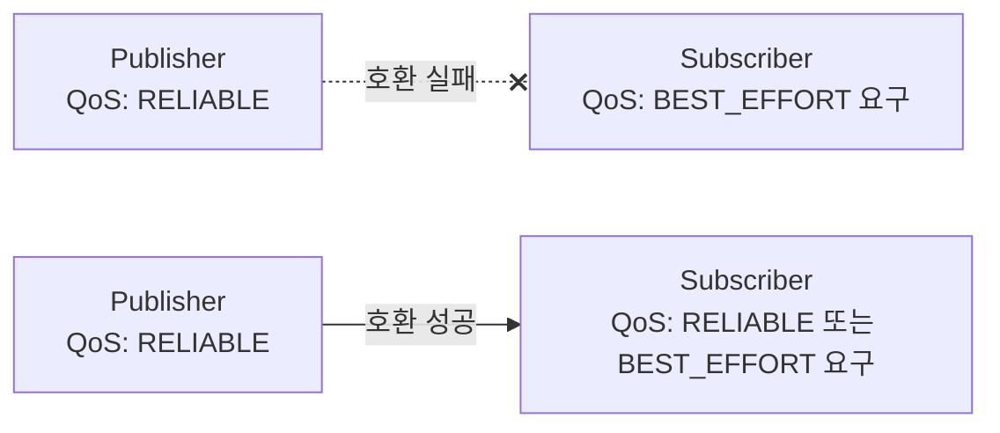

# ROS2 통신 심화 - DDS와 QoS 이해하기

> ROS2 응용 & 센서 연동 시리즈 · 3편
> 선행 학습: ROS2 기초 3편(Topic과 Message), 9편(문제 해결)

## 문서 정보

| 항목 | 내용 |
|---|---|
| 학습 단계 | Level 3 — 통신 심화 |
| 예상 선행 지식 | ROS2 기초 3편(Topic), 9편(ROS_DOMAIN_ID 소개) |
| 학습 목표 | DDS가 ROS2 통신을 어떻게 처리하는지 이해한다 / QoS 프로파일의 각 항목을 설명하고 진단할 수 있다 |
| 기준 환경 | Ubuntu 22.04, ROS2 Humble |
| 관련 문서 | ROS2 기초 0편, 3편에서 예고된 심화 주제 |

---

## 1. 먼저 알아야 할 핵심

1. ROS2 기초 3편에서 "Topic 이름과 타입이 같으면 자동으로 연결된다"고 배웠지만, 실제로는 **QoS(Quality of Service)가 호환되지 않으면 이름·타입이 같아도 연결되지 않는다.**
2. QoS 불일치는 "Topic은 보이는데(`ros2 topic list`) 데이터가 안 온다(`ros2 topic echo`가 멈춤)"는 증상으로 나타나는 대표적인 원인이다.
3. DDS(Data Distribution Service)는 ROS2 노드 간 통신을 실제로 처리하는 표준 미들웨어이며, `ROS_DOMAIN_ID`로 통신 영역을 격리한다.

## 2. 이 개념은 무엇인가

DDS는 "발행자와 구독자가 서로를 몰라도 이름 기반으로 자동 연결된다"는 ROS2 통신의 실제 구현체다. DDS 위에서 두 endpoint(Publisher/Subscriber)가 연결되려면 이름·타입이 같아야 할 뿐 아니라, **QoS 프로파일이 호환되어야 한다.**

QoS는 "이 통신이 얼마나 신뢰성 있게, 얼마나 최근 데이터를 유지하며 이루어질지"를 정의하는 설정 묶음이다.

| QoS 항목 | 옵션 | 의미 |
|---|---|---|
| **Reliability** | `RELIABLE` / `BEST_EFFORT` | 모든 메시지를 반드시 전달할지, 손실 가능성을 감수하고 빠르게 보낼지 |
| **History** | `KEEP_LAST(N)` / `KEEP_ALL` | 최근 N개만 유지할지, 모두 유지할지 |
| **Durability** | `VOLATILE` / `TRANSIENT_LOCAL` | 새로 연결된 구독자에게 과거 메시지를 줄지 여부 |
| **Deadline** | 시간 값 | 이 시간 안에 메시지가 와야 정상으로 간주 |
| **Liveliness** | `AUTOMATIC` / `MANUAL_BY_TOPIC` | 발행자가 살아있음을 어떻게 증명할지 |

## 3. 왜 필요한가

- LiDAR·카메라처럼 빠르게 계속 들어오는 센서 데이터는 손실을 좀 감수하더라도(`BEST_EFFORT`) 최신 데이터가 빨리 오는 게 중요하다.
- 로봇 제어 명령이나 지도(map) 데이터처럼 "반드시 전달돼야 하는" 데이터는 `RELIABLE`을 쓴다.
- RViz2에 `/map`이 늦게 구독해도 마지막 지도를 받을 수 있는 것은 `Durability: TRANSIENT_LOCAL` 덕분이다 — nav_docs B3에서 `map_subscribe_transient_local: True`로 이미 다룬 설정이 바로 이 QoS 항목이다.

## 4. ROS2 시스템에서의 위치



**그림 읽는 방법**: Reliability는 "Publisher가 제공하는 수준이 Subscriber가 요구하는 수준 이상이어야" 연결된다. Publisher가 `BEST_EFFORT`인데 Subscriber가 `RELIABLE`을 요구하면 연결이 실패한다 — 반대(Publisher `RELIABLE`, Subscriber `BEST_EFFORT` 요구)는 성공한다.

## 5. 주요 구성 요소

| 구성 요소 | 역할 |
|---|---|
| DDS 구현체 | 실제 통신을 처리하는 소프트웨어. Humble 기본값은 Fast DDS |
| Discovery | 노드들이 서로를 자동으로 찾는 과정. 중앙 서버 없이 브로드캐스트로 이루어짐 |
| `ROS_DOMAIN_ID` | 같은 네트워크에서 서로 다른 ROS2 시스템을 격리하는 값 |
| QoS Profile | Reliability/History/Durability 등을 묶은 설정 세트 |
| Sensor Data QoS | ROS2가 제공하는 사전 정의 프로파일 — `BEST_EFFORT` + `KEEP_LAST(5)` 조합, 센서 데이터용 |

## 6. 기본 동작 과정

1. **초기화**: 노드가 `rclpy.init()`을 호출하면 DDS가 `ROS_DOMAIN_ID`로 지정된 네트워크 영역에서 통신을 시작한다.
2. **Discovery**: 새 노드가 실행되면 DDS가 브로드캐스트로 다른 노드들에게 자신을 알린다.
3. **QoS 매칭**: Publisher와 Subscriber가 같은 Topic 이름·타입을 가졌는지 확인한 뒤, QoS 프로파일이 호환되는지 검사한다.
4. **연결/거부**: 호환되면 데이터 전송이 시작되고, 호환되지 않으면 조용히 연결되지 않는다(에러 메시지가 명확하지 않은 경우가 많아 진단이 까다롭다).

## 7. 진단 예시

```bash
# Publisher/Subscriber의 실제 QoS 확인
ros2 topic info /scan --verbose
```

출력에서 Publisher와 Subscriber 각각의 `Reliability`, `Durability` 값을 비교해 불일치가 있는지 확인한다.

## 8. 자주 발생하는 문제

### 문제: Topic은 보이는데 `echo`가 멈춤(QoS 불일치)

**증상**: `ros2 topic list`에는 있고 `ros2 topic info`에도 Publisher/Subscriber count가 1 이상인데 `ros2 topic echo`가 데이터를 안 받음.

**원인**: `ros2 topic echo`(구독 측)의 기본 QoS와 Publisher의 QoS가 호환되지 않는 경우.

**해결**: `ros2 topic echo --qos-reliability best_effort <topic>` 처럼 echo 자체의 QoS를 Publisher에 맞춰준다.

### 문제: 같은 네트워크의 다른 로봇/시뮬레이션과 데이터가 섞임

**원인**: `ROS_DOMAIN_ID`가 기본값(0)으로 겹침.

**해결**: `export ROS_DOMAIN_ID=<고유번호>`로 프로젝트별 영역을 분리한다. (9편에서 이미 소개된 내용의 QoS/DDS 원리 차원 설명)

## 9. 핵심 요약

1. QoS가 호환되지 않으면 이름·타입이 같아도 Topic 연결이 조용히 실패한다.
2. Reliability는 "Publisher 수준 ≥ Subscriber 요구 수준"이어야 호환된다.
3. 센서 데이터는 보통 `BEST_EFFORT`, 제어 명령·지도는 `RELIABLE`을 쓰는 경향이 있다.
4. `ROS_DOMAIN_ID`는 DDS Discovery의 범위를 격리하는 값이다.

## 10. 다음 학습 주제

- 다음: **Launch 시스템 디버깅** — QoS처럼 겉보기에 정상 같지만 실제로는 실패하는 상황을 Launch 레벨에서 진단하는 방법으로 이어진다.

## 11. 참고자료

- ROS2 공식 문서 — About Quality of Service settings, QoS 호환성 규칙
- ROS2 공식 문서 — DDS Implementations, ROS_DOMAIN_ID
