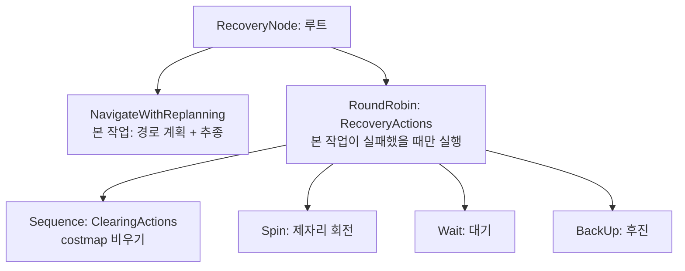

# B6. Behavior Tree와 표준 Recovery

> RTAB-Map & Nav2 심화 시리즈 · Part B. Nav2 내비게이션
> 이전 문서: B5. Local Controller (MPPI)

## 1. 개요

`bt_navigator`는 목표 지점까지의 전체 행동 흐름(경로 계획 → 추종 → 도착 판정 → 실패 시 recovery)을 관리한다. 이 문서에서는 Nav2가 기본 제공하는 recovery 동작을 정리하고, **이것이 relocalization과는 다른 개념**이라는 점을 명확히 한다.

## 2. 핵심 개념: Behavior Tree 읽는 법

아래 XML을 읽으려면 Behavior Tree(BT)의 기본 규칙 세 가지만 알면 된다.

**규칙 1 — 모든 노드는 세 가지 중 하나를 반환한다**

| 반환값 | 의미 |
|---|---|
| `SUCCESS` | 이 동작이 성공했다 |
| `FAILURE` | 이 동작이 실패했다 |
| `RUNNING` | 아직 진행 중이다 (다음 tick에 다시 물어봐 달라) |

**규칙 2 — 루트에서 tick(신호)이 주기적으로 흘러내린다**

BT는 한 번 실행하고 끝나는 순서도가 아니라, **초당 수십 번씩 루트부터 아래로 신호를 흘려보내며 매번 "지금 어떤 상태냐"를 묻는 구조**다. 그래서 `RUNNING`이라는 반환값이 존재한다 — 상태 기계(FSM)와 달리 "현재 상태"를 따로 저장하지 않고, 매 tick마다 트리를 다시 훑어 판단한다는 점이 핵심 차이다.

**규칙 3 — 제어 노드가 자식들을 어떤 순서/조건으로 실행할지 정한다**

| 제어 노드 | 동작 |
|---|---|
| `Sequence` | 자식을 왼쪽부터 차례로 실행. **하나라도 실패하면 즉시 전체 실패.** (= 논리 AND) |
| `Fallback` | 자식을 왼쪽부터 차례로 시도. **하나라도 성공하면 즉시 전체 성공.** (= 논리 OR, "이게 안 되면 저거") |
| `RoundRobin` | 호출될 때마다 **다음 자식으로 넘어가며** 하나씩 시도. 실패하면 다음 차례 자식으로. |
| `RecoveryNode` | 첫 번째 자식(본 작업)이 실패하면 두 번째 자식(복구)을 실행한 뒤 본 작업을 재시도. |

이 네 가지만 알면 Nav2의 기본 트리가 읽힌다.

### 전체 트리 구조



**그림 읽는 방법**: 평소에는 왼쪽 `NavigateWithReplanning`만 돌아간다. 그것이 `FAILURE`를 반환하면 그때 오른쪽 `RecoveryActions`로 넘어가고, `RoundRobin`이므로 **첫 실패에는 costmap 클리어, 그다음 실패에는 Spin, 또 실패하면 Wait…** 순으로 매번 다른 복구를 시도한다. 복구가 끝나면 다시 본 작업으로 돌아가 재시도한다.

## 2-1. 표준 Recovery 동작

Nav2 공식 `nav_to_pose_recovery` Behavior Tree는 실패 시 두 단계로 회복을 시도한다.

1. **Contextual Recovery(맥락별 복구)**: Planner가 실패하면 Global costmap 클리어, Controller가 실패하면 Local costmap 클리어처럼, 실패한 부분에 맞춘 좁은 범위의 복구를 먼저 시도한다.
2. **System-level Recovery(시스템 전체 복구)**: 위 방법으로도 실패하면 아래 네 가지를 라운드로빈 방식으로 순서대로 시도한다.

```xml
<RoundRobin name="RecoveryActions">
  <Sequence name="ClearingActions">
    <ClearEntireCostmap name="ClearLocalCostmap-Subtree" .../>
    <ClearEntireCostmap name="ClearGlobalCostmap-Subtree" .../>
  </Sequence>
  <Spin spin_dist="1.57" .../>
  <Wait wait_duration="5.0" .../>
  <BackUp backup_dist="0.30" backup_speed="0.15" .../>
</RoundRobin>
```

이 네 가지(Costmap Clear, Spin, Wait, BackUp)는 모두 **"로봇이 물리적으로 막혔거나 경로를 못 찾는" 상황에 대한 범용 복구 동작**이지, 위치 추정 자체를 다시 계산하는 relocalization이 아니다.

## 3. 이 프로젝트에서의 적용: "표준 Recovery ≠ Relocalization"

이 구분이 이 시리즈에서 반복해서 강조하는 핵심이다.

- Nav2 공식 문서는 **`ReinitializeGlobalLocalization`이라는 별도의 BT 액션**을 제공하며, "심각한 위치 추정 실패(delocalization)나 kidnapped robot 문제 시 AMCL을 이용한 전역 relocalization을 트리거한다"고 명시한다. 즉 Nav2 생태계에는 relocalization 전용 BT 노드가 이미 존재한다.
- 하지만 이 노드는 **AMCL 전용**이다. 내부적으로 `reinitialize_global_localization`이라는 AMCL 서비스를 호출한다.
- 이 프로젝트는 AMCL이 아니라 RTAB-Map localization을 쓰므로, `ReinitializeGlobalLocalization` BT 노드를 기본 트리에 넣어도 대응하는 서버가 없어 아무 효과가 없다.
- 그래서 이 프로젝트의 relocalization 대응(Part C)은 Nav2 BT 표준 기능이 아니라, **RTAB-Map 레이어에서 별도로 설계한 프로젝트 자체 전략**이다. 예를 들어 "Kidnapped 상황에서 Spin Recovery로 재매칭을 유도"하는 것은 Nav2의 `Spin` 액션(위 표준 recovery 목록에 이미 있는 것)을 **relocalization 목적으로 재해석해서 사용하는 것**이지, Nav2가 그렇게 하라고 설계해준 것이 아니다.

## 4. 관련 파라미터

| 구성요소 | 파라미터 | 역할 |
|---|---|---|
| `progress_checker` | `required_movement_radius` | 이 거리 이상 움직여야 "진행 중"으로 판단. 너무 크면 좁은 곳 회피 중을 stuck으로 오판 |
| `progress_checker` | `movement_time_allowance` | 위 이동량 달성 제한시간(현재 20.0초). MPPI가 잠시 정지하거나 localization이 흔들릴 때 recovery 남발을 줄이는 여유값 |
| `goal_checker` | `general_goal_checker` (xy: 0.6m, yaw: 1.0) | waypoint 이동용 느슨한 도착 판정 |
| `goal_checker` | `precise_goal_checker` (xy: 0.12m, yaw: 0.2) | 도킹/정밀 정차용 엄격한 도착 판정. **localization이 5~10cm 이상 흔들리는 환경에서는 0.12m가 너무 빡빡할 수 있음** |
| `behavior_server` | `spin`/`backup`/`wait` plugin | 표준 recovery 동작 자체를 실행하는 서버 |

## 5. 진단 관점

- Recovery가 너무 자주 발동하면 recovery 자체보다 planner/controller/costmap/**localization**을 먼저 의심한다 — 특히 RTAB-Map localization이 흔들리면 로봇이 실제로는 정상 진행 중인데도 progress_checker가 stuck으로 오판할 수 있다.
- 목표 도착 판정이 안 되는 경우: 사용 중인 goal checker가 `general`인지 `precise`인지 먼저 확인 → RTAB-Map localization이 `map` 프레임에서 흔들리는지 확인(Part C) → goal pose 주변 costmap 장애물 확인 → tolerance 값 확인.
- 좁은 사무실에서는 `Spin` recovery가 주변 장애물과 충돌 위험을 만들 수 있어 footprint/robot_radius(B3)가 정확해야 한다.

## 6. 다음 문서와의 연결

- 다음: **B7. Waypoint Follower & Velocity Smoother** — recovery로도 해결 안 되는 실패를 다중 목표 상황에서 어떻게 다루는지.
- 이 문서에서 정리한 "표준 Recovery ≠ Relocalization" 구분은 **B8과 Part C 전체의 출발점**이다.

## 7. 참고자료

- Nav2 공식 문서 — `nav_to_pose_recovery` Behavior Tree 상세 설명, RoundRobin 기반 recovery 순서
- Nav2 공식 문서 — `ReinitializeGlobalLocalization` BT 액션(AMCL 전용, kidnapped robot 대응 명시)
- Nav2 공식 문서 — Behavior Server 설정 가이드(spin/backup/wait/drive_on_heading/assisted_teleop)
