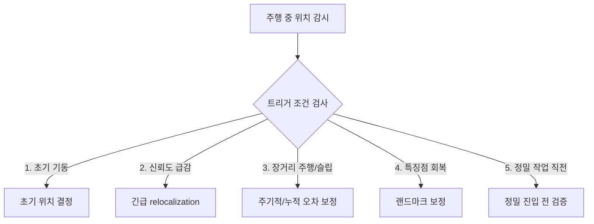

# C2. 트리거 시점 5분류

> RTAB-Map & Nav2 심화 시리즈 · Part C. Relocalization 심화
> 이전 문서: C1. 개요와 학술적 정의
> 이 문서는 업로드된 `relocalization_strategy_guide.md`의 5분류를 검토·보강한 버전이다.

## 1. 개요

주행 중 relocalization을 트리거해야 하는 5가지 시점을 정리한다. 각 항목은 원문 내용에 공식 문서 근거를 추가하고, "Nav2 표준 기능인지 / 이 프로젝트의 커스텀 전략인지"를 명확히 구분해 표기한다.

## 2. 핵심 개념: 5분류 개요

## 3. 트리거 시점별 정리

### ① 초기 기동 및 서비스 시작 시

- **상황**: 로봇 부팅 직후, 또는 Navigation 스택 재시작 직후.
- **판단 기준**: 위치 신뢰도(공분산)가 임계값 이상이거나, 초기 pose가 아직 수신되지 않은 상태.
- **수행 방식**: 고정 마커(AprilTag) 인식으로 자동 초기화, 또는 저장된 랜드마크 스캔 매칭.
- **분류**: 🔧 **프로젝트 커스텀**. RTAB-Map은 `/rtabmap/initialpose` 토픽으로 초기 pose를 받을 수 있지만(AMCL의 `/initialpose`와 유사한 별도 메커니즘), AprilTag로 이를 자동화하는 절차 자체는 RTAB-Map/Nav2 표준 기능이 아니다.

### ② 위치 추정 유실 및 센서 신뢰도 급감 시 (Kidnapped / Lost Tracking)

- **상황**: 로봇을 임의로 옮겼거나, 카메라 시야가 가려져 매칭 포인트를 잃은 경우.
- **판단 기준**: `/rtabmap/info`의 inlier 수 급감, 포즈 공분산 급증, Nav2 Global Planner의 반복적 경로 실패.
- **수행 방식**: 주행 일시 정지 → Spin Recovery로 카메라/LiDAR가 다각도로 스캔해 재매칭 유도.
- **분류**: 🔧 **프로젝트 커스텀 (Nav2 표준 기능을 재활용)**. C1에서 다뤘듯 Nav2 공식 `ReinitializeGlobalLocalization`은 AMCL 전용이라 이 프로젝트에는 적용되지 않는다. 여기서 쓰는 "Spin"은 B6에서 다룬 **Nav2 표준 Recovery 액션**을 relocalization 목적으로 빌려 쓰는 것이다 — Nav2 자체가 이 상황을 relocalization으로 인식하고 발동하는 것이 아니라, 프로젝트가 직접 감시 로직을 만들어 Spin 액션을 호출하는 구조여야 한다는 뜻이다.

### ③ 누적 드리프트가 큰 장거리 주행 또는 슬립 발생 후

- **상황**: 미끄러운 바닥에서 급가속/급회전으로 슬립 발생, 또는 특징 없는 긴 복도를 장시간 주행.
- **판단 기준**: 특징 없는 구간을 약 10m 이상 통과, 조향 각속도와 IMU 간 슬립 감지 시그널 누적.
- **수행 방식**: 특징점이 풍부한 지점 도달 시 속도를 늦추고 loop closure 완료까지 대기.
- **분류**: 🔧 **프로젝트 커스텀, 단 RTAB-Map 내부 메커니즘과 연결됨**. `RGBD/OptimizeMaxError`가 실제로 "잘못된 loop closure를 거부"하는 임계값으로 존재하며(공식 GitHub 이슈에서 `Rejecting localization... maximum graph error ratio...` 로그로 확인됨), 이 값이 너무 낮으면 정상적인 드리프트 보정 loop closure까지 거부될 수 있어 이 트리거 전략과 함께 튜닝해야 한다.

### ④ 랜드마크(AprilTag 등) 검출 가능 영역 진입 시

- **상황**: 신뢰성 높은 인공 표식의 관측 범위 진입.
- **판단 기준**: AprilTag 검출 노드가 임계값 이상 신뢰도의 마커 Pose 발행.
- **수행 방식**: SLAM 추정치보다 AprilTag 좌표 변환을 우선해 글로벌 포즈를 갱신(Hard Correct).
- **분류**: 🔧 **프로젝트 커스텀 + RTAB-Map 내장 대안 존재**. AprilTag 없이도 RTAB-Map 자체가 `RGBD/SavedLocalizationIgnored` 파라미터로 "새 loop closure 감지 시 저장된 localization을 무시하고 강제 relocalization"하는 옵션을 제공한다. 원문이 AprilTag를 전제로만 서술한 부분은, RTAB-Map 자체 loop closure로도 유사한 효과를 낼 수 있다는 점을 보강해야 한다.

### ⑤ 정밀 작업 및 복귀 직전 (Pre-task/Docking Verification)

- **상황**: 충전 도킹, 홈 포지션 정착처럼 센티미터 단위 정밀도가 필요한 최종 접근 직전.
- **판단 기준**: 정밀 궤적(Docking path) 진입 시점.
- **수행 방식**: 1~2초 완전 정지 → 카메라/LiDAR 데이터로 RTAB-Map+AprilTag 보정 → 공분산·Sync 검증 통과 시에만 도킹 시작.
- **분류**: 🔧 **완전한 프로젝트 커스텀**. Nav2/RTAB-Map 어디에도 "도킹 전 정지 검증"이라는 표준 절차는 없다. B6에서 다룬 `precise_goal_checker`(xy: 0.12m)의 엄격한 도착 판정과 짝을 이루는 절차로 볼 수 있다.

## 4. 관련 파라미터 요약

| 트리거 | 관련 파라미터/서비스 |
|---|---|
| ① 초기 기동 | `/rtabmap/initialpose` |
| ② 긴급 relocalization | Nav2 `Spin` 액션(B6), RTAB-Map inlier/공분산 모니터링(프로젝트 자체 구현 필요) |
| ③ 누적 드리프트 | `RGBD/OptimizeMaxError` |
| ④ 랜드마크 보정 | `RGBD/SavedLocalizationIgnored` |
| ⑤ 정밀 작업 직전 | `precise_goal_checker` (Nav2), 프로젝트 자체 정지-검증 로직 |

## 5. 진단 관점

각 트리거를 실제로 감시하려면 RTAB-Map이 발행하는 다음 정보를 프로젝트 레벨에서 구독/감시하는 노드가 필요하다.

- `/rtabmap/info` — inlier 수, loop closure 성공/실패 여부
- 포즈 공분산 — `map→odom` TF의 신뢰도 (직접 노출되지 않는 경우 커스텀 노드로 추출하는 사례가 커뮤니티에 존재)

이 감시 로직 자체가 Nav2나 RTAB-Map이 기본 제공하는 기능이 아니므로, "왜 relocalization이 트리거되지 않았는가"를 진단할 때는 먼저 **이 감시 노드가 실제로 살아 있고 임계값이 적절한지**부터 확인해야 한다.

## 6. 다음 문서와의 연결

- 다음: **C3. RTAB-Map 핵심 파라미터 대응표** — 이 문서에서 언급한 파라미터들을 한곳에 모아 정리한다.

## 7. 참고자료

- 원본 자료: `relocalization_strategy_guide.md` (프로젝트 내부, 다른 agent 작성분)
- [rtabmap_ros GitHub 이슈 #1371](https://github.com/introlab/rtabmap_ros/issues/1371) — `RGBD/OptimizeMaxError` 기반 잘못된 loop closure 거부 실사례
- [rtabmap_ros GitHub 이슈 #1155](https://github.com/introlab/rtabmap_ros/issues/1155) — `RGBD/SavedLocalizationIgnored` 파라미터 정의
- Nav2 공식 문서 — `ReinitializeGlobalLocalization`(AMCL 전용) 설명
