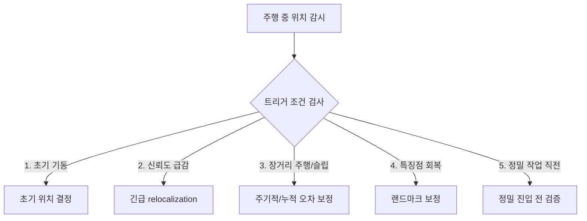

# C2. 트리거 시점 5분류

> RTAB-Map & Nav2 심화 시리즈 · Part C. Relocalization 심화
> 이전 문서: C1. 개요와 학술적 정의

## 1. 개요

주행 중 relocalization을 트리거해야 하는 5가지 일반적인 시점을 정리한다. 이는 특정 SLAM 라이브러리에 국한되지 않는 일반적인 분류이며, 이 프로젝트가 각 시점을 실제로 어떻게 구현했는지는 별도 문서 **[[C2-1_이_프로젝트의_트리거_구현|C2-1. 이 프로젝트의 트리거 구현]]**에서 다룬다.

## 2. 핵심 개념: 5분류 개요

## 3. 트리거 시점별 정리 (일반)

### ① 초기 기동 및 서비스 시작 시

- **상황**: 로봇 부팅 직후, 또는 Navigation 스택 재시작 직후.
- **판단 기준**: 위치 신뢰도(공분산)가 임계값 이상이거나, 초기 pose가 아직 수신되지 않은 상태.
- **일반적으로 필요한 것**: 어떤 방식으로든 "지도 안에서 내가 대략 어디에 있는지"를 처음 한 번 확정해주는 절차가 필요하다 — 사용자가 직접 초기 위치를 지정하거나, 고정된 표식/랜드마크를 인식하거나, 지도 전체를 재탐색하는 방식이 흔히 쓰인다.

### ② 위치 추정 유실 및 센서 신뢰도 급감 시 (Kidnapped / Lost Tracking)

- **상황**: 로봇을 임의로 옮겼거나, 카메라 시야가 가려져 매칭 포인트를 잃은 경우.
- **판단 기준**: 매칭 포인트(inlier) 수 급감, 포즈 공분산 급증, 경로 계획의 반복적 실패 등 "지금 위치를 신뢰할 수 없다"는 신호.
- **일반적으로 필요한 것**: 위치를 잃었다는 것을 감지한 뒤, 로봇이 스스로 다시 매칭할 기회를 만드는 동작(제자리 회전, 정지 후 재탐색 등)이 필요하다. C1에서 다룬 "Global Relocalization"이 바로 이 상황에 해당한다.

### ③ 누적 드리프트가 큰 장거리 주행 또는 슬립 발생 후

- **상황**: 미끄러운 바닥에서 급가속/급회전으로 슬립 발생, 또는 특징 없는 긴 복도를 장시간 주행.
- **판단 기준**: 특징이 부족한 구간을 오래 통과했거나, 바퀴/IMU 기반 추정과 실제 움직임 사이에 슬립이 의심되는 신호가 누적됨.
- **일반적으로 필요한 것**: Odometry만으로 누적된 오차를 Loop Closure(재방문 인식)로 보정할 기회를 확보하는 것 — 특징점이 풍부한 지점에 도달하면 보정이 완료될 때까지 기다려주는 전략이 일반적이다.

### ④ 랜드마크(고정 표식 등) 검출 가능 영역 진입 시

- **상황**: 신뢰성 높은 인공 표식(마커 등)의 관측 범위 진입.
- **판단 기준**: 표식 검출 노드가 임계값 이상 신뢰도의 위치 정보를 발행.
- **일반적으로 필요한 것**: SLAM 자체 추정치보다 신뢰도가 높은 외부 기준(마커 등)이 있을 때, 이를 우선해 위치를 강하게 보정하는 절차가 일반적으로 유용하다.

### ⑤ 정밀 작업 및 복귀 직전 (Pre-task/Docking Verification)

- **상황**: 충전 도킹, 홈 포지션 정착처럼 센티미터 단위 정밀도가 필요한 최종 접근 직전.
- **판단 기준**: 정밀 궤적(Docking path) 진입 시점.
- **일반적으로 필요한 것**: 정밀 동작을 시작하기 전에 위치 추정의 신뢰도를 한 번 더 검증하는 절차 — 정지 상태에서 센서 데이터를 안정적으로 확보해 공분산이 충분히 낮아졌는지 확인하는 방식이 흔히 쓰인다.

## 4. 다음 문서와의 연결

- 다음: **[[C2-1_이_프로젝트의_트리거_구현|C2-1. 이 프로젝트의 트리거 구현]]** — 위 5가지 시점을 이 프로젝트(RTAB-Map + Nav2)가 실제로 어떤 파라미터와 로직으로 구현했는지 다룬다.
- 이후: **C3. RTAB-Map 핵심 파라미터 대응표** — 관련 파라미터들을 한곳에 모아 정리한다.

## 5. 참고자료

- C1. 개요와 학술적 정의 — Global Relocalization / Pose Tracking 구분
- Nav2 공식 문서 — `ReinitializeGlobalLocalization`(AMCL 전용) 설명
