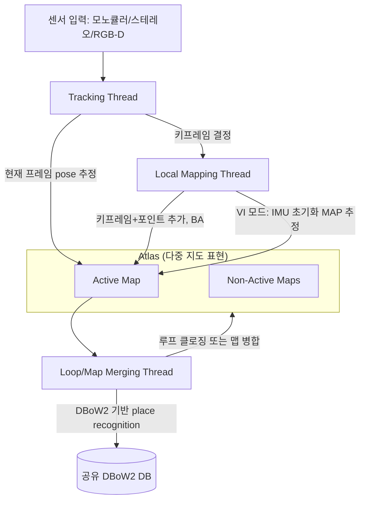

# D1-1. ORB-SLAM3 시스템 개요

> RTAB-Map & Nav2 심화 시리즈 · Part D. 대안 SLAM 백엔드
> 이 문서부터 D1-5까지는 기존 D1(ORB-SLAM3 구조와 실행)을 GitHub 공식 저장소가 인용하는 논문들을 근거로 확장·분할한 것이다.
> 참고 논문: Campos et al., "ORB-SLAM3: An Accurate Open-Source Library for Visual, Visual-Inertial and Multi-Map SLAM," IEEE T-RO, 2021 (arXiv:2007.11898)

## 1. 개요

"RTAB-Map 내부 ORB 검출기 vs 독립 라이브러리"라는 최소한의 구분을 넘어, ORB-SLAM3 공식 논문(Campos et al., 2021)이 정의하는 시스템 구조를 그대로 정리한다. GitHub 공식 저장소(UZ-SLAMLab/ORB_SLAM3)는 이 논문을 1차 인용 문헌으로 명시하고 있다.

## 2. 핵심 개념: 세 가지 병렬 스레드 + Atlas

논문 3장(System Overview)은 ORB-SLAM3를 ORB-SLAM2와 ORB-SLAM-VI를 기반으로 확장한 시스템으로 소개하며, 핵심 구성요소를 다음과 같이 정의한다.

- **Atlas**: 서로 연결되지 않은 여러 지도(map)의 집합으로 구성된 다중 지도 표현. 그중 하나가 **Active Map**(현재 tracking이 위치를 찾는 대상, local mapping이 계속 확장)이고 나머지는 **Non-Active Maps**로 취급된다. 전체 Atlas의 키프레임에 대해 **하나의 통합 DBoW2 데이터베이스**를 구축해 relocalization, loop closing, map merging에 공통으로 사용한다.
- **Tracking Thread**: 센서 정보를 처리해 현재 프레임의 pose를 Active Map 기준으로 실시간 추정한다(매칭된 맵 특징점의 재투영 오차 최소화). 키프레임 여부를 결정하며, visual-inertial 모드에서는 관성 잔차(inertial residual)를 최적화에 포함시켜 body velocity와 IMU bias도 함께 추정한다. **tracking이 유실되면 Atlas의 모든 지도에서 재위치인정(relocalization)을 시도**하며, 성공하면 필요 시 active map을 전환한다. 실패가 일정 시간 지속되면 기존 active map은 non-active로 저장되고 **새 active map이 처음부터 초기화**된다.
- **Local Mapping Thread**: Active Map에 키프레임과 포인트를 추가하고, 중복 요소를 제거하며, 현재 프레임 주변의 로컬 윈도우에서 visual 또는 visual-inertial bundle adjustment로 지도를 정제한다. **VI 모드에서 이 스레드가 IMU 초기화(MAP estimation)도 함께 수행한다** — 이 지점이 D1-5에서 다룰 프로젝트 이슈와 직결된다.

## 3. 이 프로젝트에서의 적용 (Yahboom X3)

- 이 프로젝트는 RGB-D 및 RGB-D-Inertial 모드를 사용하므로, 위 세 스레드 중 **Tracking**과 **Local Mapping**이 우선 관련된다(단일 세션이라 Loop/Map Merging의 "여러 세션 병합" 기능은 아직 본격적으로 쓰이지 않을 가능성이 높다).
- [[ros2-nav-yahboom]]에서 관찰된 "active-map IMU reset"이라는 용어는 사실 이 문서의 Atlas 구조와 정확히 대응한다 — Local Mapping이 활성 지도(active map)에 대해 IMU 초기화를 반복 시도하다 실패를 감지해 리셋하는 것으로, Atlas가 "실패 시 새 지도를 만든다"는 논문의 설계 철학과 같은 메커니즘 계열에 있다.

## 4. RTAB-Map과의 구조적 차이

| 항목 | RTAB-Map | ORB-SLAM3 |
|---|---|---|
| 지도 표현 | 그래프(노드+엣지) + WM/STM/LTM 메모리 관리(A1 참고) | Atlas(여러 개의 분리된 지도 집합) |
| 유실 시 동작 | Loop closure 재탐색에 의존, 명시적 "새 지도 생성" 개념은 약함 | 일정 시간 실패 지속 시 자동으로 새 active map 생성 |
| Place Recognition DB | 자체 bag-of-words(appearance-based) | DBoW2 기반, Atlas 전체 키프레임 대상 |
| IMU 처리 | 외부 파라미터로 옵션 융합 | MAP 추정을 시스템 설계 자체에 내재화(D1-2) |

## 5. 진단 관점

Atlas 구조를 이해하면 [[ros2-nav-yahboom]]의 로그에서 "새 맵이 생성됨" 같은 메시지를 단순 오류가 아니라 **설계된 복구 메커니즘의 정상 동작**으로 먼저 해석할 수 있다. 문제는 이 메커니즘이 "발동한 것" 자체가 아니라, **왜 발동이 이렇게 잦은가**(D1-2, D1-5)이다.

## 6. 다음 문서와의 연결

- 다음: **D1-2. Visual-Inertial 초기화 알고리즘** — 이 문서에서 짚은 "Local Mapping 스레드의 IMU 초기화"를 논문 4장 기준으로 상세히 다룬다.

## 7. 참고자료

- Campos, Elvira, Gómez Rodríguez, Montiel, Tardós, "ORB-SLAM3: An Accurate Open-Source Library for Visual, Visual-Inertial and Multi-Map SLAM," IEEE T-RO 37(6), 2021. (arXiv:2007.11898, System Overview 3장)
- GitHub UZ-SLAMLab/ORB_SLAM3 공식 저장소 — 인용 문헌 목록
