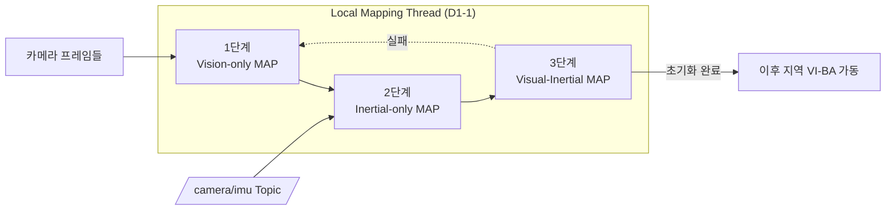

# SLAM 백엔드 - Visual-Inertial 초기화 알고리즘

> 이 문서를 읽으면 카메라와 IMU를 함께 쓰는 SLAM에서 왜 "초기화"라는 별도 단계가 필요한지, ORB-SLAM3가 이를 3단계 MAP 추정으로 어떻게 몇 초 만에 끝내는지, 그리고 이 알고리즘이 이 프로젝트의 리셋 현상과 어떻게 연결되는지 이해하게 된다.

## 문서 정보

| 항목 | 내용 |
|---|---|
| 학습 단계 | Level 4 — SLAM 백엔드 심화 |
| 예상 선행 지식 | [[D1-1_ORB-SLAM3_시스템_개요|SLAM 백엔드 - D1-1. ORB-SLAM3 시스템 개요]](세 스레드 구조, 특히 Local Mapping Thread) |
| 학습 목표 | Visual-Inertial 초기화가 왜 필요한지 설명할 수 있다 / 3단계 MAP 추정 알고리즘의 각 단계가 무엇을 추정하는지 설명할 수 있다 / 이 프로젝트의 리셋 현상을 3단계 중 어디와 연결할 수 있는지 판단할 수 있다 |
| 기준 환경 | ORB-SLAM3 RGB-D-Inertial 모드, Yahboom X3 (RealSense D435i) |
| 관련 문서 | 이전: [[D1-1_ORB-SLAM3_시스템_개요|SLAM 백엔드 - D1-1. ORB-SLAM3 시스템 개요]] / 다음: [[D1-3_Multi-Map_System_Atlas와_재추적_병합|SLAM 백엔드 - D1-3. Multi-Map System(Atlas)과 재추적·병합]] |

> 참고 논문: Campos, Montiel, Tardós, "Inertial-Only Optimization for Visual-Inertial Initialization," ICRA 2020 ([arXiv:2003.05766](https://arxiv.org/abs/2003.05766)) / ORB-SLAM3 논문 4장(IMU Initialization)

---

## 1. 먼저 알아야 할 핵심

1. 카메라와 IMU를 함께 쓰려면 시작 시점에 **스케일(모노큘러의 경우), 중력 방향, 초기 속도, 센서 바이어스**를 알아야 하는데, 이 값들을 처음부터 정확히 알 방법이 없어 별도의 "초기화" 단계가 필요하다.
2. 초기화를 대충 하면(관성 변수를 처음부터 본 최적화에 섞어 넣으면) 수렴에 최대 30초까지 걸릴 수 있다는 것이 기존 방식(VI-DSO 등)의 문제였다.
3. ORB-SLAM3는 이 문제를 **3단계 MAP(Maximum-a-Posteriori) 추정**으로 재정의해, 몇 초 안에 초기화를 끝내는 것을 목표로 설계됐다.
4. 이 초기화는 D1-1에서 배운 **Local Mapping Thread**에서 실행된다 — 즉 "Local Mapping이 IMU 초기화를 반복 시도하다 실패한다"는 이 프로젝트의 관찰은, 곧 이 문서의 3단계 알고리즘이 어딘가에서 실패하고 있다는 뜻이다.
5. 이 프로젝트(RGB-D-Inertial)는 모노큘러와 달리 **스케일은 깊이 정보로 이미 알려져 있어** 1단계 결과가 처음부터 metric 스케일이라는 차이가 있다. 다만 이 이론적 장점이 실제로 그대로 활용되는지는 별개 문제다 — **ORB-SLAM3 공식 저장소가 지원을 명시하는 조합은 monocular, monocular-inertial, stereo, stereo-inertial, RGB-D뿐이며, RGB-D-Inertial은 원저자가 설계·검증한 조합이 아니라 커뮤니티가 별도로 얹은 비공식 확장**이다(자세한 근거는 12장 참고). 중력 방향·바이어스·속도 추정(2단계)은 어느 모드든 동일하게 필요하다.

---

## 2. 이 개념은 무엇인가

Visual-Inertial 초기화는 "카메라만으로 만든 지도"와 "IMU가 측정한 관성 정보"를 하나로 묶기 전에, 그 둘을 정확히 이어 붙이는 데 필요한 몇 가지 미지수(스케일, 중력 방향, 속도, 바이어스)를 짧은 시간 안에 추정해내는 준비 단계다.
**비유로 이해하기**

두 사람이 처음 만나 한 팀으로 물건을 옮기는 상황을 떠올려보자.

- 한 사람(카메라, Vision)은 "이 방향으로 몇 걸음 걸었다"는 것을 정확히 보고 기억한다. 다만 실제 보폭(스케일)이 몇 cm인지는 모른다(모노큘러의 경우).
- 다른 사람(IMU)은 자기가 "얼마나 기울었는지, 얼마나 빨리 흔들렸는지"는 즉시 느끼지만, 손이 떨리는 습관(바이어스)이 있어서 그 느낌이 항상 정확하지는 않다.
- 두 사람이 손발을 맞추려면, 먼저 **카메라 쪽 사람이 몇 걸음 걸어보며 자기만의 지도를 대략 그리고(1단계)**, 그다음 **IMU 쪽 사람이 그 지도에 맞춰 자기 감각(중력 방향, 손 떨림 습관, 속도 감각)을 보정하고(2단계)**, 마지막으로 **둘이 손을 맞잡고 함께 걸으며 서로의 정보를 실시간으로 맞춰나간다(3단계)**.
- 이 세 단계를 순서대로 밟지 않고 처음부터 둘의 정보를 억지로 한꺼번에 맞추려 하면(기존 VI-DSO 방식), 서로 다른 습관 때문에 손발이 맞을 때까지 시간이 오래 걸린다.

**비유가 실제와 다른 부분**

- 사람은 감각적으로 "대충 맞춰간다"고 표현할 수 있지만, ORB-SLAM3의 각 단계는 **MAP(Maximum-a-Posteriori) 추정**이라는 명확한 확률 최적화 문제로 정식화되어 있다 — 즉 "대충"이 아니라 센서의 불확실성(노이즈 특성)까지 수식에 반영해 최적값을 계산한다.
- 두 사람은 손을 맞잡으면 계속 함께 걷지만, ORB-SLAM3는 3단계(Joint **VI-BA**, Visual-Inertial Bundle Adjustment — visual 잔차와 inertial 잔차를 함께 최소화하는 Bundle Adjustment)가 끝난 뒤에도 이후 문서(D1-3)에서 다루듯 초기화가 실패로 판정되면 **처음(1단계)부터 다시 시작**할 수 있다.

---

## 3. 왜 필요한가

**SLAM 시스템 관점 (초기화 단계가 없다면)**

- 스케일, 중력 방향, 바이어스를 모른 채로 바로 본 최적화(BA)에 IMU 잔차를 섞으면, 초기 추정값이 부정확해 최적화가 엉뚱한 지점으로 수렴하거나 수렴 자체가 매우 느려진다.
- 특히 모노큘러에서는 스케일이라는 근본적으로 **관측 불가능한(unobservable)** 값을 카메라만으로는 알 수 없으므로, IMU의 도움 없이는 절대 실제 크기 단위(metric, 미터 단위)의 지도를 만들 수 없다 — 초기화 단계가 바로 이 스케일을 IMU로부터 얻어내는 과정이다.

> **용어 — 관측 가능성(observability)**: 센서 데이터를 아무리 많이 모아도 **원리적으로 값을 특정할 수 없는** 양이 있다. 모노큘러 카메라의 스케일이 대표적인 예다 — 사진 한 장만 보고는 "작은 물체가 가까이 있는 것"인지 "큰 물체가 멀리 있는 것"인지 구분할 방법이 없다. 이런 양을 관측 불가능하다고 하며, 관측 가능하게 만들려면 다른 종류의 센서(여기서는 IMU)를 추가해야 한다.
>
> 이 개념은 이후 D2-2(FEJ가 관측 불가능한 방향을 다루는 방식), D3-4(IMU 덕분에 roll·pitch가 관측 가능해져 4-DOF만 최적화하면 되는 이유)에서 핵심 논거로 다시 등장하므로 여기서 정확히 잡아두는 것이 좋다.

**실제 로봇 관점 (Yahboom X3, RGB-D-Inertial 기준)**

- 이 프로젝트는 RGB-D라 스케일 문제는 없지만, **중력 방향과 IMU 바이어스를 정확히 추정하지 못하면** 이후 관성 정보를 신뢰할 수 없어 결국 순수 시각 정보(RGB-D-only)로 되돌아가는 것과 큰 차이가 없어진다 — IMU를 쓰는 의미(빠른 회전이나 저텍스처 구간에서 시각 정보를 보완하는 것)가 사라진다.
- `[[ros2-nav-yahboom]]`에서 관찰된 "active-map IMU reset"이 왜 반복되는지 이해하려면, 정확히 어느 단계(1/2/3단계)에서 실패 판정이 나는지 구분할 수 있어야 한다 — 이 구분이 이후 D1-5의 진단 우선순위를 결정한다.
- 이 프로젝트에서 실측으로 먼저 확인된 것은 **stereo-inertial 모드가 RGB-D-Inertial보다 초기화·리셋 문제가 뚜렷이 덜하다**는 경향이었다. 처음에는 이를 "RGB-D는 스케일을 몰라서 초기화 부담이 크다"는 가설로 설명하려 했지만, 이는 정확하지 않다 — RGB-D는 오히려 스케일을 이미 알고 있다. 실제 원인은 12장에서 다루듯 **RGB-D-Inertial 자체의 구현 성숙도 문제(비공식 확장)**일 가능성이 훨씬 크다.

---

## 4. ROS2 시스템에서의 위치



**그림 읽는 방법**

- 이 3단계는 D1-1에서 배운 **Local Mapping Thread 내부**에서 일어나는 일이다. 즉 ROS2 노드 외부에서는 이 단계들이 직접 보이지 않고, 노드 로그를 통해서만 확인할 수 있다.
- 화살표가 왼쪽에서 오른쪽으로 순서대로 흐르는 것은 세 단계가 반드시 순차적으로 진행됨을 뜻한다 — 2단계는 1단계의 결과 없이는 시작할 수 없다.
- 점선 화살표(3단계 → 1단계)는 초기화가 실패로 판정되면 **처음부터 다시 시작**한다는 것을 나타낸다. 이 프로젝트에서 관찰된 반복 리셋이 바로 이 점선 경로를 계속 타고 있는 상황이다.

---

## 5. 주요 구성 요소

| 구성 요소 | 역할 | 초보자가 기억할 점 |
|---|---|---|
| 1단계: Vision-only MAP Estimation | 순수 시각 정보만으로 짧은 시간(2초, 4Hz) 동안 스케일 미정(모노큘러 기준) 지도를 만듦 | RGB-D에서는 스케일이 이미 metric이라는 점이 다름 (단, RGB-D-Inertial 조합 자체는 비공식 확장 — 12장 참고) |
| 2단계: Inertial-only MAP Estimation | 1단계 궤적 + 관성 측정값으로 자이로 바이어스, 중력 방향, 속도, (모노큘러의 경우) 스케일을 추정 | 이 프로젝트 리셋 진단에서 가장 자주 언급되는 단계 |
| 3단계: Visual-Inertial MAP Estimation | 1·2단계 결과를 시드로 visual+inertial 잔차를 함께 최소화하는 완전한 Joint VI-BA | 성공하면 이후 지역 VI-BA가 본격 가동됨 |
| MAP(Maximum-a-Posteriori) 추정 | 센서 노이즈 불확실성을 반영해 사후 확률이 최대가 되는 값을 찾는 최적화 방식 | 기존 방식(대수방정식, 임시 최소자승법)과의 핵심 차별점 |
| IMU preintegration | 연속된 IMU 측정값을 두 키프레임 사이 구간에 대해 미리 적분해두는 기법 | 키프레임 삽입 주기를 짧게(4~10Hz) 잡는 이유와 직결 |

---

## 6. 기본 동작 과정

1. **1단계 진입**: 순수 모노큘러(또는 RGB-D) SLAM 방식으로 2초 동안 4Hz 주기로 키프레임을 삽입해, k=10개 정도의 카메라 pose와 수백 개의 포인트로 이루어진 지도를 만들고 visual-only BA로 최적화한다.
2. **좌표계 변환**: 1단계에서 얻은 카메라 기준 pose들을 IMU(body) 기준 좌표계로 변환한다.
3. **2단계 진입**: 1단계 궤적과 그 사이의 관성 측정값(preintegration)만을 이용해, 자이로 바이어스·중력 방향(**SO(3)** — 3차원 회전을 표현하는 수학적 공간. 중력이 "어느 쪽을 향하는지"를 이 회전 값으로 표현한다)·(모노큘러의 경우) 스케일·가속도계 바이어스·각 키프레임 시점의 속도를 MAP 추정으로 계산한다.
4. **3단계 진입**: 1·2단계 결과를 초기값(시드)으로 삼아 visual 잔차와 inertial 잔차를 함께 최소화하는 완전한 Joint VI-BA를 수행한다.
5. **성공 판정**: 3단계 결과가 시스템 내부 수렴/일관성 기준을 만족하면 초기화가 완료되고, 이후 지역 VI-BA(일반적인 Visual-Inertial 추적)가 본격 가동된다.
6. **실패 시 재시도**: 어느 단계든 기준을 만족하지 못하면, Local Mapping Thread는 해당 Active Map에 대한 초기화를 **1단계부터 다시** 시작한다 — 이것이 이 프로젝트에서 관찰되는 "active-map IMU reset"이다.

---

## 7. 진단 실습

이 문서는 알고리즘 자체를 재구현하는 실습 대신, **로그에서 3단계 중 어디까지 진행됐는지 구분해서 읽는 진단 실습**으로 진행한다.

### 실습 목표

ORB-SLAM3 RGB-D-Inertial 실행 로그에서 "IMU 초기화가 몇 초 만에 끝났는지", "재시도가 몇 번 발생했는지"를 확인한다.

### 준비 사항

* ORB-SLAM3 RGB-D-Inertial 모드가 실행 가능한 환경
* IMU 데이터가 포함된 rosbag (또는 실시간 D435i 입력)

### 실행

```bash
ros2 bag play imu_test.bag &
ros2 run orb_slam3_ros rgbd_inertial \
  --ros-args -p use_imu:=true 2>&1 | tee vi_init.log
```

* 이 명령어가 하는 일: 사전 녹화된 IMU 포함 rosbag을 재생하면서, ORB-SLAM3를 RGB-D-Inertial 모드로 실행하고 로그를 저장한다.

### 확인

```bash
grep -i "imu initializ\|vi-ba\|inertial.*converg\|reset" vi_init.log | nl
```

* 이 명령어가 하는 일: IMU 초기화 관련 로그 줄에 번호를 매겨 순서대로 보여준다(`nl`). 같은 실행 안에서 초기화 시작~완료(또는 실패~재시도)까지의 시간 간격을 눈으로 추적할 수 있다.

### 예상 결과

- 정상적으로 초기화된다면, 6장에서 설명한 논문 수치(약 2~4초 이내)와 비슷한 시간 안에 "초기화 완료" 계열의 로그가 나타난다.
- 이 프로젝트처럼 초기화가 반복 실패하는 경우, `reset` 계열 로그가 짧은 간격으로 여러 번 나타난다 — 이 횟수가 D1-5에서 다룰 "몇 회 리셋" 수치의 근거가 된다.

---

## 8. 코드 및 설정 해설

```yaml
# orb_slam3 RGB-D-Inertial 설정 예시 (일부)
IMU.NoiseGyro: 1.7e-4      # 자이로 노이즈 밀도
IMU.NoiseAcc: 2.0e-3       # 가속도계 노이즈 밀도
IMU.GyroWalk: 1.9e-5       # 자이로 바이어스 랜덤워크
IMU.AccWalk: 3.0e-3        # 가속도계 바이어스 랜덤워크
IMU.Frequency: 200         # IMU 측정 주파수(Hz)

IMU.fastInit: 0            # 1이면 빠른 초기화(게이팅 완화) 모드 사용
```

* `IMU.NoiseGyro` / `IMU.NoiseAcc` / `IMU.GyroWalk` / `IMU.AccWalk`: 이 네 값이 바로 2단계(Inertial-only MAP Estimation)에서 "센서 불확실성을 얼마나 신뢰할지"를 결정하는 파라미터다. 실제 IMU의 노이즈 특성과 이 값이 잘 맞지 않으면, 2단계 최적화가 수렴 기준을 만족하기 어려워진다(이 프로젝트의 진단 사례는 D1-5 참고).
* `IMU.Frequency`: IMU preintegration의 입력 주파수다. 6장에서 설명한 "키프레임 삽입 주기를 짧게(4~10Hz) 잡는 이유"와 함께, 이 값이 실제 카메라 사이 preintegration 구간의 불확실성 크기를 좌우한다.
* `IMU.fastInit`: 값을 켜면 게이팅(자극/이동거리 조건)을 완화해 초기화를 더 빨리 시도하게 만든다 — 즉 2단계 **진입 조건**만 완화할 뿐, 그 이후 단계의 수렴 문제는 해결하지 못한다(이 프로젝트에서 이 옵션을 켜도 리셋이 줄지 않았던 진단 사례는 D1-5 참고).

---

## 9. 자주 사용하는 명령어

| 목적 | 명령어 | 설명 |
|---|---|---|
| IMU 관련 로그만 추출 | `grep -i "imu\|inertial" vi_init.log` | 방대한 로그에서 IMU 초기화 관련 줄만 걸러낼 때 사용 |
| 리셋 횟수 세기 | `grep -ci "reset" vi_init.log` | 한 실행에서 초기화 실패(재시도)가 몇 번 있었는지 정량화 |
| rosbag 재생 속도 조절 | `ros2 bag play imu_test.bag --rate 0.5` | 재현성을 확인하기 위해 재생 속도를 낮춰 동일 조건에서 재시도 |
| IMU Topic 주기 확인 | `ros2 topic hz /camera/imu` | 실제 IMU 데이터가 `IMU.Frequency` 설정값대로 들어오는지 확인 |

---

## 10. 자주 발생하는 문제

### 문제: 가속도 자극(움직임)이 충분한데도 초기화가 계속 실패함

**증상**

로봇을 충분히 회전·이동시켜(가속도 게이트, 이동거리 게이트를 모두 통과) IMU 데이터가 풍부한데도 `active-map IMU reset`이 반복된다.

**가능한 원인**

1. 게이팅(2단계 **진입** 조건)은 통과했지만, 2단계 **최적화 자체**가 수렴 기준(중력/스케일 오차 임계값 등)을 만족하지 못함
2. 1단계(Vision-only)에서 만들어진 궤적 자체의 품질이 낮음(저텍스처, 모션 블러 등)
3. IMU 센서(D435i)가 공장 출고 상태에서 정밀 보정되지 않아, 실제 노이즈 특성이 8장 설정값과 어긋남

**확인 방법**

```bash
grep -i "gate\|excitation\|gravity\|scale.*error" vi_init.log
```

게이팅 통과 로그와 실패 판정 로그 사이에 "무엇을 기준으로 실패했는지"를 나타내는 메시지가 있는지 확인한다.

**해결 방법**

1. 게이팅은 통과했는데 실패가 반복된다면, "충분히 움직였는가"가 원인이 아니므로 자극을 더 주는 방향의 조치는 효과가 없다는 것부터 확인한다(D1-5에서 이미 이 경로로 원인이 좁혀졌다).
2. `rs-imu-calibration`으로 D435i IMU를 공장 보정해, 2단계 입력 품질(노이즈 특성 일치)을 개선하는 것을 최우선으로 시도한다.
3. RGB-D 전용 모드와 VI 모드의 1단계 궤적을 직접 비교해, 1단계 자체의 품질 차이가 있는지 별도로 검증한다.

**초보자가 자주 하는 실수**

"IMU 리셋이 잦다 = 로봇을 더 흔들어야 한다"고 단순하게 결론 내리는 경우가 많다. 이 프로젝트의 실제 진단 이력(D1-5)은 이 가설이 이미 배제됐음을 보여준다 — 게이팅을 통과해도 리셋이 남는다는 사실 자체가, 원인이 "자극 부족"이 아니라 "최적화 수렴/입력 품질"에 있다는 반증이다.

---

## 11. 개념 간 연결

* 이 문서의 세 단계는 D1-1에서 배운 **Local Mapping Thread** 안에서 일어난다 — 즉 D1-1의 스레드 구조를 모르면 이 문서에서 "누가 이 계산을 하는지"를 놓치게 된다.
* 초기화가 실패해 Active Map 자체가 리셋되는 상황은, 다음 문서(D1-3)에서 다룰 "Tracking 유실 → 새 지도 생성"과 원인이 다르지만 겉보기 현상(새 지도가 자꾸 생김)은 비슷할 수 있어 로그로 구분해서 봐야 한다.
* 이 문서에서 다룬 "MAP 추정에서 센서 노이즈 불확실성을 반영한다"는 개념은, [[03_DDS와_QoS_이해하기|ROS2 응용 & 센서 연동 - 03. DDS와 QoS 이해하기]]에서 다룬 "신뢰성(Reliability)"과는 다른 층위의 개념이다 — QoS는 통신 신뢰성, 이 문서의 불확실성은 센서 측정값 자체의 물리적 노이즈다. 혼동하지 않도록 주의한다.

---

## 12. 한 단계 더 깊게 보기

> **심화 학습**
>
> 이 부분은 기본 개념을 이해한 후 읽는 것을 권장한다.

**성능 특성 (논문 수치, EuRoC 데이터셋 기준)**

| 지표 | 값 |
|---|---|
| 초기화 소요 시간 | 약 2~4초 이내 — 기존 방법 대비 최대 30초 이상 걸리던 것을 크게 단축 |
| 초기 스케일 오차 | 평균 약 5.3%(~5.29%) |
| 2초 시점 스케일 오차 | 5% 미만으로 수렴 |
| 15초 시점 스케일 오차 | 약 1% 수준까지 추가 수렴(루프가 없는 시퀀스에서도) |

**정정: RGB-D-Inertial은 사실 공식 지원 조합이 아니다**

이 문서는 원래 "RGB-D는 depth로 스케일을 이미 알고 있어 초기화가 더 간단하다"는 뉘앙스로 서술되어 있었다. 스케일을 이미 안다는 사실 자체는 SLAM의 일반 원리로서 틀리지 않지만, 여기서 "그래서 초기화가 더 수월할 것"이라는 결론으로 이어간 것은 검증 부족이었다. 실제로 확인한 근거는 다음과 같다.

- **공식 저장소가 명시하는 지원 조합**: ORB-SLAM3 공식 GitHub(UZ-SLAMLab/ORB_SLAM3) README는 지원 조합을 "monocular, monocular-inertial, stereo, stereo-inertial, **RGB-D**"로 나열한다 — 다른 모드와 달리 RGB-D 뒤에만 "-inertial"이 빠져 있다. 즉 **RGB-D-Inertial은 원저자가 공식적으로 지원한다고 밝힌 조합이 아니다.**
- **논문의 헤드라인 정확도**도 전부 mono-inertial/stereo-inertial 기준이며, RGB-D-Inertial 조합에 대한 검증 수치는 원 논문에 없다.
- 실제로 RGB-D-Inertial을 지원하는 저장소(예: `xiefei2929/ORB_SLAM3-RGBD-Inertial`, `flymu/ORB_SLAM3-RGBD-Inertial`)는 **전부 커뮤니티가 별도로 얹은 포크**다 — 원 저자가 만든 것도 아니고, 이 문서에서 다룬 MAP 기반 IMU 초기화가 이 조합을 대상으로 설계·검증된 것도 아니다.
- D435i를 RGB-D+IMU로 쓴 제3자 보고에서도 "Unfortunately, for RGB-D+IMU systems such as the RealSense D435i, ORB-SLAM3 does not have great performance and can sometimes lose track in featureless areas"라는 관찰이 확인되어, 이 프로젝트의 경험과 정확히 일치한다.

**재해석**: "스케일을 이미 안다"는 이론적 장점은 맞지만, RGB-D-Inertial 자체가 미검증·비공식 확장이라 이 장점이 실제 구현에서 그대로 활용된다는 보장이 없다. 이 프로젝트에서 **stereo-inertial이 RGB-D-Inertial보다 초기화·리셋 문제가 뚜렷이 덜했던 실측 경향**은, 단순한 스케일 유무 문제가 아니라 **stereo-inertial은 공식 지원·검증 대상이고 RGB-D-Inertial은 아니라는 구현 성숙도 차이**로 설명하는 것이 훨씬 설득력이 있다. 이 재해석은 D1-5의 진단 우선순위에도 반영되어, `rs-imu-calibration`보다 **stereo-inertial 재검토**가 더 우선순위 높은 다음 단계로 조정됐다.

**이 프로젝트에서 관찰된 리셋 유형과 알고리즘 단계 대응**

`[[ros2-nav-yahboom]]`에서 확인된 리셋 유형을 이 3단계와 대응시키면 다음과 같이 재해석할 수 있다.

| 프로젝트에서 관찰된 리셋 유형 | 대응 가능한 알고리즘 단계 |
|---|---|
| "not enough acceleration" 리셋 | 2단계 진입 조건(자극/게이팅) — "센서 불확실성을 무시하면 예측 불가능한 큰 오차가 난다"는 논문의 문제의식과 관련 |
| active-map IMU reset (Local Mapping 재초기화) | 2~3단계 결과가 시스템 내부 수렴/일관성 기준을 통과하지 못해 1단계부터 다시 시작하는 것으로 추정됨 |

이 표는 이 시리즈의 마지막 문서인 D1-5에서 실제 진단 이력과 함께 다시 다룬다.

---

## 13. 핵심 요약

1. Visual-Inertial 초기화는 스케일·중력 방향·초기 속도·센서 바이어스를 짧은 시간 안에 추정하는 준비 단계다.
2. ORB-SLAM3는 이를 Vision-only → Inertial-only → Visual-Inertial 3단계 MAP 추정으로 나눠, 몇 초 안에 끝내도록 설계했다.
3. 이 초기화는 D1-1의 Local Mapping Thread에서 실행되며, 실패하면 1단계부터 다시 시작한다.
4. RGB-D-Inertial 모드는 스케일이 이미 알려져 있지만, **ORB-SLAM3 공식 저장소가 지원을 명시하는 조합이 아니라 커뮤니티가 얹은 비공식 확장**이라 이 이론적 장점이 실제 구현에서 그대로 활용된다는 보장이 없다 — 이것이 "stereo가 RGB-D보다 리셋이 적다"는 실측 경향의 더 설득력 있는 원인으로 재해석된다.
5. "게이팅(자극)을 통과했는데도 리셋이 남는다"는 관찰은 원인이 "충분히 움직이지 않아서"가 아니라 "1단계 입력 품질 또는 2·3단계 수렴 기준"에 있음을 시사한다.

---

## 14. 이해도 점검

1. 초기화 3단계 중 스케일(모노큘러 기준)을 처음 추정하는 것은 몇 단계인가?
2. 2단계(Inertial-only MAP Estimation)가 추정하는 값 네 가지는 무엇인가?
3. 이 프로젝트가 RGB-D-Inertial 모드를 쓸 때, 모노큘러와 달리 1단계에서 이미 확보되는 값은 무엇인가?
4. "가속도 게이트와 이동거리 게이트를 모두 통과했는데도 리셋이 반복된다"는 관찰이 배제하는 가설은 무엇인가?
5. 초기화가 실패로 판정되면 Local Mapping Thread는 몇 단계부터 다시 시작하는가?

> [!info]- 정답 및 해설 보기
> 1. 1단계(Vision-only MAP Estimation)에서 스케일 미정 지도가 먼저 만들어지고, 그 스케일 값 자체는 2단계(Inertial-only MAP Estimation)에서 추정된다.
> 2. 자이로 바이어스, 중력 방향(SO(3)), (모노큘러의 경우) 스케일, 가속도계 바이어스, 각 키프레임 시점의 속도다.
> 3. 스케일이 depth 정보로부터 이미 metric 단위로 확보된다 — 즉 1단계 결과가 처음부터 실제 크기 단위의 지도다.
> 4. "IMU 자극(움직임)이 부족해서 초기화가 실패한다"는 가설을 배제한다 — 자극 조건을 다 만족해도 실패가 남기 때문이다.
> 5. 1단계(Vision-only MAP Estimation)부터 다시 시작한다.

---

## 15. 다음 학습 주제

1. **바로 다음**: [[D1-3_Multi-Map_System_Atlas와_재추적_병합|SLAM 백엔드 - D1-3. Multi-Map System(Atlas)과 재추적·병합]] — 이 문서에서 다룬 초기화가 반복 실패할 때, Atlas가 실제로 어떻게 새 지도를 만들고 나중에 병합하는지 다룬다.
2. **함께 보면 좋은 주제**: [[D1-1_ORB-SLAM3_시스템_개요|SLAM 백엔드 - D1-1. ORB-SLAM3 시스템 개요]] — 이 초기화가 어느 스레드에서 실행되는지 복습하면 이 문서를 다시 읽을 때 더 명확해진다.
3. **나중에 학습할 심화 주제**: [[D1-5_이_프로젝트의_VIO_이슈_재해석|SLAM 백엔드 - D1-5. 이 프로젝트의 VIO 이슈 재해석]] — 이 문서의 3단계 알고리즘을 근거로 이 프로젝트의 실제 진단 이력을 재해석한다.

---

## 16. 참고자료

| 구분 | 자료 | 핵심 내용 |
|---|---|---|
| 논문 | Campos, Montiel, Tardós, "Inertial-Only Optimization for Visual-Inertial Initialization," ICRA 2020 ([arXiv:2003.05766](https://arxiv.org/abs/2003.05766)) | 2단계(Inertial-only MAP Estimation)의 수학적 정식화와 novelty 근거 |
| 논문 | ORB-SLAM3 논문(Campos et al., 2021) 4장 "IMU Initialization" | 3단계 전체 알고리즘과 성능 수치(초기화 시간, 스케일 오차) |
| 프로젝트 진단 노트 | `[[ros2-nav-yahboom]]` | `IMU.fastInit` 진단, 게이팅 격리 테스트 이력, stereo-inertial 대비 RGB-D-Inertial 실측 비교 |
| 공식 저장소 | [GitHub UZ-SLAMLab/ORB_SLAM3](https://github.com/UZ-SLAMLab/ORB_SLAM3) README | 공식 지원 조합 목록(RGB-D-Inertial 미포함) 확인 |
| 커뮤니티 포크 | `xiefei2929/ORB_SLAM3-RGBD-Inertial`, `flymu/ORB_SLAM3-RGBD-Inertial` | RGB-D-Inertial이 비공식 커뮤니티 확장임을 보여주는 근거 |
