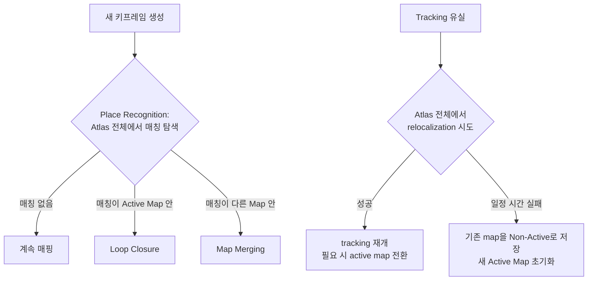

# SLAM 백엔드 - Multi-Map System(Atlas)과 재추적·병합

> 이 문서를 읽으면 ORB-SLAM3가 위치를 완전히 잃어버렸을 때 정확히 무슨 일이 벌어지는지, 왜 "새 지도 생성"이 오류가 아니라 설계된 복구 전략인지, 그리고 예전 지도를 다시 만났을 때 어떻게 하나로 합쳐지는지 이해하게 된다.

## 문서 정보

| 항목 | 내용 |
|---|---|
| 학습 단계 | Level 4 — SLAM 백엔드 심화 |
| 예상 선행 지식 | [[D1-1_ORB-SLAM3_시스템_개요|SLAM 백엔드 - D1-1. ORB-SLAM3 시스템 개요]](Atlas, 세 스레드), [[D1-2_Visual-Inertial_초기화_알고리즘|SLAM 백엔드 - D1-2. Visual-Inertial 초기화 알고리즘]](초기화 실패 개념) |
| 학습 목표 | Tracking 유실 이후 시스템이 거치는 세 단계(relocalization 시도 → 실패 시 새 지도 생성 → 재방문 시 병합)를 설명할 수 있다 / Loop Closing과 Map Merging이 같은 메커니즘의 두 결과임을 설명할 수 있다 / Welding Window의 역할을 설명할 수 있다 |
| 기준 환경 | ORB-SLAM3 (RGB-D / RGB-D-Inertial 모드), Yahboom X3 |
| 관련 문서 | 이전: [[D1-2_Visual-Inertial_초기화_알고리즘|SLAM 백엔드 - D1-2. Visual-Inertial 초기화 알고리즘]] / 다음: [[D1-4_Loop_Closing과_Place_Recognition|SLAM 백엔드 - D1-4. Loop Closing과 Place Recognition]] |

> 참고 논문: ORB-SLAM3 논문(Campos et al., 2021) 6장(Map Merging and Loop Closing), Elvira et al., "ORBSLAM-Atlas: a robust and accurate multi-map system," IROS 2019

---

## 1. 먼저 알아야 할 핵심

1. D1-2에서 IMU 초기화가 반복 실패할 수 있다는 것을 배웠다. 이 문서는 "초기화가 실패해서 tracking을 완전히 잃으면 그다음 무슨 일이 일어나는가"를 다룬다.
2. Tracking을 유실하면 시스템은 곧바로 Atlas의 **모든 지도**를 대상으로 relocalization을 시도한다.
3. relocalization이 일정 시간 계속 실패하면, 기존 Active Map은 **Non-Active로 보존**되고 완전히 **새로운 Active Map이 처음부터 초기화**된다 — 지도를 버리는 것이 아니라 "잠시 접어두고 새 노트를 편다."
4. **Loop Closing**과 **Map Merging**은 서로 다른 두 기능이 아니라, **같은 place recognition 절차의 결과가 어디서 매칭됐는지에 따라 갈리는 하나의 메커니즘**이다 — 같은 지도 안이면 Loop Closing, 다른 지도면 Map Merging이다.
5. 이 프로젝트에서 반복 관찰된 "active-map IMU reset"은, 곧 **Atlas가 지도를 만들었다 접었다 하는 상황**과 같다 — 매번 새 Active Map이 만들어지면, 그 지도가 이전 지도와 병합되기 전까지는 누적된 위치 정보가 끊긴 채로 남는다.

---

## 2. 이 개념은 무엇인가

Multi-Map System(Atlas)은 "위치를 완전히 잃어버려도 시스템이 멈추지 않고, 대신 새로운 지도를 만들어 계속 작동하며, 나중에 예전 지도와 자동으로 다시 합친다"는 ORB-SLAM3의 복구 전략이다.

**비유로 이해하기**

여행 중 일기를 쓰는 사람을 떠올려보자.

- 이 사람은 여행하는 동안 계속 일기(지도)를 쓴다. 그런데 갑자기 일기장을 통째로 잃어버렸다(tracking 유실)고 해보자.
- 처음에는 "혹시 방금 있던 장소 근처에 떨어뜨렸나?" 하고 주변을 둘러본다(relocalization 시도). 찾으면 원래 쓰던 일기장을 이어서 쓴다.
- 끝내 못 찾으면, 포기하고 **새 일기장을 사서 처음부터 다시 쓰기 시작**한다(새 Active Map 생성). 예전 일기장은 버린 게 아니라 가방 어딘가에 그대로 들어있다(Non-Active Map).
- 여행을 계속하다가 우연히 예전에 갔던 장소를 다시 지나가게 됐다. 그 순간 "어? 여기 예전 일기장에 적어놨던 곳이잖아!"라고 알아채고, **가방에서 예전 일기장을 꺼내 지금 쓰던 새 일기장과 내용을 이어 붙인다**(Map Merging).
- 만약 잃어버렸던 게 아니라 그냥 하루 전에 지나간 곳을 오늘 다시 지나간 것이라면(같은 일기장을 계속 쓰고 있었다면), 그건 "아, 여기 어제도 왔었지" 하고 **같은 일기장 안에서** 기록을 이어 붙이는 것과 같다(Loop Closing).

**비유가 실제와 다른 부분**

- 사람은 "여기 와본 곳 같은데"라는 직관적 느낌으로 알아채지만, ORB-SLAM3는 새 키프레임이 생성될 때마다 기계적으로 DBoW2 데이터베이스를 검색해 후보를 찾는 절차(D1-4)를 거친다.
- 일기장을 "이어 붙인다"는 것은 실제로는 손으로 옮겨 쓰는 작업이지만, ORB-SLAM3의 병합은 두 지도 좌표계 사이의 상대 변환(Sim(3)/SE(3))을 즉시 계산해 수학적으로 정합시키는 것이다 — 종이를 다시 쓰는 게 아니라 두 좌표계를 하나로 겹쳐 놓는 것에 가깝다.

---

## 3. 왜 필요한가

**SLAM 시스템 관점 (이 구조가 없다면)**

- 단일 지도만 유지하는 시스템(RTAB-Map 계열)은 tracking을 완전히 잃으면 복구 전략이 "같은 지도 안에서 loop closure를 계속 재탐색하는 것"에 의존한다 — 위치를 아예 못 찾는 동안은 사실상 매핑이 멈춘 것과 같다.
- Atlas 구조가 없다면, 위치를 잃은 뒤 되찾을 때까지의 공백 구간을 시스템이 아무것도 만들지 못한 채 흘려보내야 한다. Atlas는 이 공백 구간에도 "새 지도"라는 형태로 계속 작업을 이어갈 수 있게 해준다.
- Loop Closing과 Map Merging을 하나의 메커니즘으로 통합하지 않으면, 두 기능을 각각 별도로 구현하고 검증해야 해서 시스템이 복잡해지고 일관성이 떨어진다.

**실제 로봇 관점 (Yahboom X3 기준)**

- X3가 실내에서 사람이나 가구에 가려 tracking을 완전히 잃어도, Atlas 구조 덕분에 로봇은 "새 지도"로 매핑을 계속하며 완전히 멈추지 않는다.
- 다만 실제 배포 환경에서 이 리셋이 너무 자주 발생한다면, [[B8_Relocalization이_일어나는_위치|RTAB-Map & Nav2 심화 - B8. Relocalization은 Nav2 파이프라인의 어디에 위치하는가]]에서 다룬 Nav2 관점의 relocalization과는 다른, **훨씬 심각한 상황**으로 이어질 수 있다 — [[C1_개요와_학술적_정의|C1. 개요와 학술적 정의]]에서 구분한 "Global Relocalization vs Pose Tracking" 중 전자(전역 재탐색)가 계속 반복되는 셈이기 때문이다.

---

## 4. ROS2 시스템에서의 위치



**그림 읽는 방법**

- 위쪽 흐름은 "정상적으로 매핑 중일 때" 매 키프레임마다 반복되는 place recognition 절차이고, 아래쪽 흐름은 "tracking을 완전히 잃었을 때"의 복구 절차다 — 이 둘은 서로 다른 상황에서 작동하는 별개의 흐름이지만, **둘 다 같은 place recognition/DBoW2 메커니즘을 공유**한다.
- 위쪽 흐름의 결과(Loop Closure 또는 Map Merging)는 이 ROS2 노드 외부에는 직접 드러나지 않지만, 결과적으로 로봇의 pose(TF) 추정이 갑자기 보정되는 형태(pose jump)로 나타날 수 있다 — 이는 [[C4_Pose_Jump_제어와_안정화|RTAB-Map & Nav2 심화 - C4. Pose Jump 제어와 안정화]]에서 다룬 개념과 같은 계열의 현상이다.
- 아래쪽 흐름에서 "새 Active Map 초기화"에 도달하면, D1-2에서 다룬 IMU 초기화(3단계 MAP 추정)가 그 새 지도에 대해 처음부터 다시 실행된다.

---

## 5. 주요 구성 요소

| 구성 요소 | 역할 | 초보자가 기억할 점 |
|---|---|---|
| Relocalization | Tracking 유실 직후 Atlas 전체에서 현재 프레임의 위치를 재탐색 | 성공하면 즉시 tracking 재개, 지도가 바뀔 수도(active map 전환) |
| Loop Closure | Place recognition 매칭이 **같은(Active) 지도** 안에서 나왔을 때의 처리 | 그래프 최적화로 누적 드리프트를 전체적으로 편다(A1과 원리 동일) |
| Map Merging | Place recognition 매칭이 **다른(Non-Active) 지도** 안에서 나왔을 때의 처리 | 두 지도의 좌표계를 하나로 정합시킴 |
| Welding Window | 매칭된 키프레임과 covisibility graph 상 이웃들로 구성된 국소 탐색 영역 | 여기서 중기(mid-term) 데이터 연관을 집중 탐색해 정확도를 높임 |
| Covisibility Graph | 같은 지점을 함께 관측한 키프레임들끼리 연결된 그래프 | Welding Window를 정의하는 데 쓰임 |

---

## 6. 기본 동작 과정

1. **정상 매핑**: Local Mapping Thread가 새 키프레임을 만들 때마다, Loop/Map Merging Thread가 Atlas 전체에서 place recognition을 실행한다.
2. **매칭 없음**: 매칭이 없으면 아무 조치 없이 계속 매핑을 진행한다.
3. **같은 지도 매칭 → Loop Closure**: 매칭된 키프레임이 Active Map에 속하면, 상대 pose를 추정하고 그래프 최적화로 누적 드리프트를 전체적으로 편다.
4. **다른 지도 매칭 → Map Merging**: 매칭된 키프레임이 Non-Active Map에 속하면, 두 지도 사이의 상대 변환(Sim(3)/SE(3))을 계산해 정합시키고, Welding Window에서 중기 데이터 연관을 집중 탐색해 정확도를 보강한 뒤 두 지도를 하나로 합친다.
5. **Tracking 유실 발생**: 카메라 정보 품질 저하 등으로 현재 프레임의 pose 추정이 실패하면, 시스템은 즉시 Atlas 전체에서 relocalization을 시도한다.
6. **복구 또는 재초기화**: Relocalization이 성공하면 tracking이 재개된다(필요 시 active map 전환). 일정 시간 계속 실패하면 기존 Active Map은 Non-Active로 저장되고, 새 Active Map이 D1-2의 3단계 초기화부터 다시 시작된다.

---

## 7. 진단 실습

이 문서는 새 코드를 작성하는 대신, **로그에서 "새 map ID가 몇 번 생성됐는지", "병합이 실제로 일어났는지"를 추적하는 진단 실습**으로 진행한다.

### 실습 목표

같은 경로를 두 번 지나가는 rosbag을 재생해, 첫 번째 통과 시 새 지도가 생성되고 두 번째 통과 시 병합이 일어나는지 로그로 확인한다.

### 준비 사항

* ORB-SLAM3가 실행 가능한 환경
* 같은 장소를 두 번 이상 지나가도록 녹화된 rosbag (또는 그런 경로로 실시간 주행)

### 실행

```bash
ros2 bag play revisit_test.bag &
ros2 run orb_slam3_ros rgbd \
  --ros-args -p camera:=D435i 2>&1 | tee revisit.log
```

* 이 명령어가 하는 일: 같은 장소를 두 번 지나가는 경로가 담긴 rosbag을 재생하며 ORB-SLAM3를 실행하고, 전체 로그를 저장한다.

### 확인

```bash
grep -in "new map\|track lost\|merg\|loop clos" revisit.log
```

* 이 명령어가 하는 일: 새 지도 생성, tracking 유실, 병합, 루프 클로징 관련 로그를 줄 번호(`-n`)와 함께 보여준다. 줄 번호 순서로 "언제 새 지도가 생겼고, 언제 병합됐는지"를 시간 순으로 재구성할 수 있다.

### 예상 결과

- 중간에 tracking 유실이 있었다면 그 직후 `new map` 로그가 나타난다.
- 이후 같은 장소를 다시 지나가는 시점 근처에서 `merg` 계열 로그가 나타나면, Atlas의 지도 개수가 줄어드는(병합되는) 것이 정상적으로 재현된 것이다.
- 재현되지 않는다면, D1-4에서 다룰 place recognition의 검증 임계값(Hamming distance, distance ratio)이 이 환경(저텍스처 등)에 비해 너무 엄격하게 작동하고 있을 가능성을 의심할 수 있다.

---

## 8. 코드 및 설정 해설

```yaml
# orb_slam3 설정 예시 (Atlas/재초기화 관련)
System.SaveAtlasToFile: "atlas_x3"

Tracking.MaxTimeLost: 5.0     # tracking 유실 후 relocalization을 포기하고
                               # 새 map을 생성하기까지 대기하는 최대 시간(초), 패키지별 상이
LoopClosing.CovisibilityConsistencyTh: 3  # welding window 관련 일관성 검증 임계값(예시)
```

* `Tracking.MaxTimeLost`(패키지 구현에 따라 이름이 다를 수 있음): 6장 5~6단계의 "일정 시간 계속 실패하면"에 해당하는 실제 숫자 값이다. 이 값이 너무 짧으면 정상적으로 곧 복구될 수 있었던 상황에서도 성급하게 새 지도를 만들어버릴 수 있고, 너무 길면 실제로 유실된 상태에서 불필요하게 오래 기다리게 된다.
* `System.SaveAtlasToFile`: D1-1에서 다룬 것과 같은 항목으로, 여기서는 "저장된 Atlas 파일 안에 Non-Active Map들이 실제로 몇 개 들어있는지"를 확인하는 용도로 다시 언급한다 — 파일 크기나 로드 시 출력되는 지도 개수 로그로 병합이 잘 되고 있는지(지도 개수가 과도하게 누적되지 않는지) 점검할 수 있다.
* `LoopClosing.CovisibilityConsistencyTh`: Welding Window 내에서 매칭을 최종 승인하기 전 요구하는 일관성 검증 강도다. 값이 높을수록 오탐(false positive)은 줄지만, 실제로는 맞는 매칭도 놓치는(recall 저하) 트레이드오프가 있다 — 이는 D1-4에서 다룰 precision-recall 긴장 관계와 동일한 구조다.

---

## 9. 자주 사용하는 명령어

| 목적 | 명령어 | 설명 |
|---|---|---|
| 지도 생성/병합 이벤트 시간순 확인 | `grep -in "new map\|merg" revisit.log` | 줄 번호로 정렬해 지도 생성과 병합의 순서를 재구성 |
| 현재 Active Map ID 확인 | `ros2 topic echo /orb_slam3/active_map_id` (패키지별 상이) | 실시간으로 지도가 몇 번 바뀌었는지 모니터링 |
| Atlas 저장 파일 크기 확인 | `ls -lh atlas_x3.osa` | 지도 개수가 비정상적으로 누적되는지 대략적으로 확인(병합이 안 되면 파일이 계속 커짐) |
| 재생 속도 낮춰 재현성 확인 | `ros2 bag play revisit_test.bag --rate 0.5` | 같은 조건에서 반복 재현이 되는지 확인할 때 사용 |

---

## 10. 자주 발생하는 문제

### 문제: 같은 장소를 여러 번 지나가도 지도 개수가 계속 늘어나기만 함(병합이 안 됨)

**증상**

로그에 `new map`은 반복해서 나타나지만 `merg` 계열 로그는 거의 나타나지 않는다.

**가능한 원인**

1. D1-4에서 다룰 place recognition 검증 임계값(Hamming distance, distance ratio)이 너무 엄격해 매칭 후보 자체가 기각됨
2. 저텍스처 환경(흰 벽, 복도)이라 애초에 특징점 매칭이 부족함
3. 두 방문 시점의 조명·시점 차이가 너무 커서 같은 장소로 인식되지 않음

**확인 방법**

```bash
grep -in "candidate\|reject\|geometric" revisit.log
```

매칭 후보가 애초에 발견되지 않는지, 발견됐지만 기하학적 검증에서 기각되는지 구분한다.

**해결 방법**

1. 후보 자체가 안 나온다면 조명, 경로의 텍스처 다양성을 먼저 점검한다.
2. 후보는 나오는데 기각된다면, D1-4의 검증 임계값 설정을 이 환경에 맞게 완화하는 것을 검토한다.

**초보자가 자주 하는 실수**

지도가 여러 개로 나뉘는 것 자체를 "실패"로 단정하는 경우가 많다. 2장 비유에서 설명했듯, **새 지도가 만들어지는 것 자체는 정상 동작**이다 — 문제는 "나중에 다시 만났을 때도 합쳐지지 않는 것"이다.

---

## 11. 개념 간 연결

* 이 문서의 relocalization/새 지도 생성 흐름은 D1-1에서 배운 Atlas 구조를 실제로 "언제, 왜" 쓰는지 보여주는 구체적 사례다.
* Loop Closure에서 일어나는 그래프 최적화는 [[A1_RTAB-Map_매핑_원리|RTAB-Map & Nav2 심화 - A1. RTAB-Map 매핑 원리]]에서 배운 "Loop Closure가 그래프 최적화로 드리프트를 전체적으로 편다"는 개념과 원리상 동일하다.
* Map Merging 이후 로봇 pose가 갑자기 보정되는 현상은 [[C4_Pose_Jump_제어와_안정화|RTAB-Map & Nav2 심화 - C4. Pose Jump 제어와 안정화]]에서 다룬 pose jump 문제와 같은 계열이며, Nav2 쪽에서 이를 다루는 방식은 [[B8_Relocalization이_일어나는_위치|B8. Relocalization은 Nav2 파이프라인의 어디에 위치하는가]]를 참고한다.
* 매칭을 정확히 어떤 알고리즘으로 찾는지는 다음 문서 D1-4의 주제다.

---

## 12. 한 단계 더 깊게 보기

> **심화 학습**
>
> 이 부분은 기본 개념을 이해한 후 읽는 것을 권장한다.

**"잃어도 괜찮다"는 설계 철학**

논문이 강조하는 ORB-SLAM3의 핵심 장점은 "장시간의 열악한 시각 정보에도 생존할 수 있다 — 위치를 잃으면 새 지도를 시작하고, 이미 매핑된 영역을 재방문하면 이전 지도들과 매끄럽게 병합된다"는 것이다. 이는 RTAB-Map처럼 "위치를 잃으면 곤란하다"는 태도와 대비되는 설계 철학이다. 이 프로젝트에서도 반대 방향의 활용을 검토할 수 있다: `[[ros2-nav-yahboom]]`의 리셋을 무조건 억제하려 하기보다, ORB-SLAM3의 철학대로 "잃어도 괜찮다, 새 지도로 계속 매핑하고 나중에 병합한다"는 관점으로 파이프라인을 설계하는 것도 대안이 될 수 있다 — 다만 이는 병합이 실제로 신뢰성 있게 일어난다는 전제가 있어야 성립한다.

**리셋 유형 구분의 중요성**

로그에서 새 map ID가 계속 생성되는 패턴이 보인다면, 이는 D1-2에서 다룬 초기화 실패가 "단순 재시도"가 아니라 **"완전히 새 지도 생성"**으로 이어지고 있다는 뜻이다. 두 가지는 시스템 부하와 이후 병합 필요성 측면에서 의미가 다르므로, 로그를 볼 때 반드시 구분해야 한다.

---

## 13. 핵심 요약

1. Tracking이 유실되면 Atlas 전체에서 relocalization을 즉시 시도하고, 일정 시간 실패하면 새 Active Map을 처음부터 만든다.
2. Loop Closing과 Map Merging은 같은 place recognition 메커니즘의 결과다 — 매칭이 같은 지도 안이면 Loop Closing, 다른 지도면 Map Merging이다.
3. Welding Window는 매칭 지점 주변의 covisibility graph 이웃들에서 중기 데이터 연관을 집중 탐색해 정확도를 높인다.
4. 이 프로젝트의 "active-map IMU reset" 반복은 Atlas가 지도를 만들었다 접었다 하는 상황과 같으며, 병합되기 전까지는 위치 정보가 끊긴 채로 남는다.
5. 지도가 여러 개로 나뉘는 것 자체는 설계된 정상 동작이며, 진짜 문제는 재방문 시에도 병합되지 않는 경우다.

---

## 14. 이해도 점검

1. Tracking 유실 이후 시스템이 거치는 두 단계는 무엇인가?
2. Loop Closing과 Map Merging을 가르는 기준은 무엇인가?
3. Welding Window는 무엇을 위해 정의되는가?
4. 새 지도가 계속 생성되기만 하고 병합되지 않는 상황이 문제가 되는 이유는 무엇인가?
5. "지도가 여러 개로 나뉘는 것"과 "재방문해도 병합되지 않는 것" 중 어느 쪽이 진짜 문제로 봐야 하는가?

> [!info]- 정답 및 해설 보기
> 1. 먼저 Atlas 전체에서 relocalization을 시도하고, 일정 시간 계속 실패하면 기존 Active Map을 Non-Active로 저장한 뒤 새 Active Map을 처음부터 초기화한다.
> 2. Place recognition으로 찾은 매칭 후보가 Active Map(같은 지도) 안에 있으면 Loop Closing, 다른(Non-Active) 지도에 있으면 Map Merging이다.
> 3. 매칭된 키프레임과 covisibility graph 상의 이웃들로 구성된 국소 영역에서 중기 데이터 연관을 집중적으로 탐색해, 정합의 정확도를 높이기 위해 정의된다.
> 4. 매번 새 Active Map이 생성되면 그 지도가 이전 지도와 병합되기 전까지는 누적된 위치 정보가 끊긴 상태로 남아, 로봇의 전역 위치 추정이 불안정해지기 때문이다.
> 5. 지도가 여러 개로 나뉘는 것 자체는 설계된 복구 메커니즘의 정상 동작이다. 진짜 문제는 재방문해도 병합되지 않는 경우다.

---

## 15. 다음 학습 주제

1. **바로 다음**: [[D1-4_Loop_Closing과_Place_Recognition|SLAM 백엔드 - D1-4. Loop Closing과 Place Recognition]] — 이 문서에서 "매칭을 어떻게 찾는가"로 넘어간 부분, 즉 DBoW2 기반 검색과 기하학적 검증 과정을 자세히 다룬다.
2. **함께 보면 좋은 주제**: [[C1_개요와_학술적_정의|RTAB-Map & Nav2 심화 - C1. 개요와 학술적 정의]] — Global Relocalization과 Pose Tracking의 구분을 복습하면 이 문서 3장의 "심각한 상황" 설명을 더 명확히 이해할 수 있다.
3. **나중에 학습할 심화 주제**: [[D1-5_이_프로젝트의_VIO_이슈_재해석|SLAM 백엔드 - D1-5. 이 프로젝트의 VIO 이슈 재해석]] — 이 문서와 D1-2에서 다룬 개념을 근거로 이 프로젝트의 실제 리셋 진단 이력을 종합한다.

---

## 16. 참고자료

| 구분 | 자료 | 핵심 내용 |
|---|---|---|
| 논문 | ORB-SLAM3 논문(Campos et al., 2021) 6장 "Map Merging and Loop Closing" | Place recognition, Loop Closing/Map Merging 분기 로직, Welding Window |
| 논문 | Elvira, Montiel, Tardós, "ORBSLAM-Atlas: a robust and accurate multi-map system," IROS 2019 | Atlas 구조의 원 설계와 다중 지도 관리 근거 |
| 프로젝트 진단 노트 | `[[ros2-nav-yahboom]]` | active-map IMU reset 관찰 이력 |
