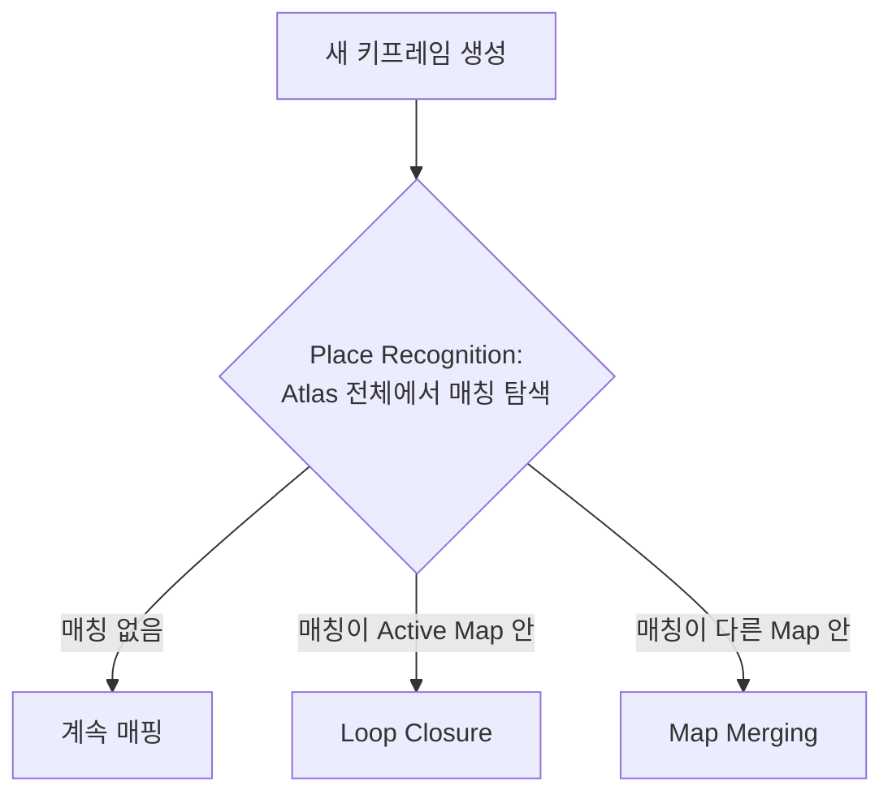

# D1-3. Multi-Map System(Atlas)과 재추적·병합

> RTAB-Map & Nav2 심화 시리즈 · Part D. 대안 SLAM 백엔드
> 이전 문서: D1-2. Visual-Inertial 초기화 알고리즘
> 참고 논문: ORB-SLAM3 논문(Campos et al., 2021) 6장(Map Merging and Loop Closing), Elvira et al., "ORBSLAM-Atlas: a robust and accurate multi-map system," IROS 2019

## 1. 개요

D1-2에서 IMU 초기화가 반복 실패할 수 있다는 것을 확인했다. 이 문서는 "초기화가 실패해서 tracking을 완전히 잃으면 그다음 무슨 일이 일어나는가"를 Atlas 구조 기준으로 정리한다.

## 2. 핵심 개념: Tracking 유실 → 새 지도 생성 → 재방문 시 병합

D1-1에서 요약한 대로, tracking이 유실되면:

1. 시스템은 즉시 Atlas의 **모든 지도**에서 재위치인정(relocalization)을 시도한다.
2. 성공하면 tracking이 재개되고, 필요하면 active map을 전환한다(다른 지도로 돌아온 경우).
3. 실패가 일정 시간 지속되면, 기존 active map은 **non-active로 저장**되고 **완전히 새로운 active map이 처음부터 초기화**된다.

이것이 논문이 강조하는 ORB-SLAM3의 핵심 장점이다: "장시간의 열악한 시각 정보에도 생존할 수 있다 — 위치를 잃으면 새 지도를 시작하고, 이미 매핑된 영역을 재방문하면 이전 지도들과 매끄럽게 병합된다."

## 3. Place Recognition이 Loop Closing과 Map Merging을 가르는 기준

논문 6장의 핵심 로직:

> "Local Mapping 스레드가 새 키프레임을 만들 때마다, place recognition이 실행되어 Atlas에 있는 **모든** 키프레임과의 매칭을 시도한다. 매칭된 키프레임이 **active map**에 속하면 loop closure를 수행한다. 그렇지 않으면(**다른 map**에 속하면) multi-map data association이며, active map과 매칭된 map을 병합한다."

즉 **Loop Closing과 Map Merging은 같은 place recognition 메커니즘의 두 가지 결과**다 — "어디서 매칭이 됐는가(같은 지도냐 다른 지도냐)"만 다를 뿐이다.

## 4. Welding Window: ORB-SLAM3의 두 번째 novelty

새 키프레임과 매칭된 지도 사이의 상대 pose가 추정되면, ORB-SLAM3는 매칭된 키프레임과 **covisibility graph 상의 이웃들**로 구성된 "welding window"(용접 창)를 정의하고, 이 창 안에서 **중기(mid-term) 데이터 연관을 집중적으로 탐색**해 loop closing과 map merging의 정확도를 높인다. 논문은 이 두 가지 novelty(개선된 place recognition + welding window)가 ORB-SLAM3가 ORB-SLAM2보다 EuRoC 실험에서 더 정확한 이유라고 설명한다.

## 5. 이 프로젝트에서의 적용 (Yahboom X3)

- D1-2에서 다룬 "active-map IMU reset"이 반복된다는 것은, 곧 **Atlas가 계속 새 지도를 만들었다 지웠다 하는 상황**과 같다. 매번 새 active map이 초기화되면 그 지도가 이전 지도와 다시 병합되기 전까지는 누적된 위치 정보가 끊긴 상태로 남는다.
- 만약 실제 배포 환경에서 이 리셋이 자주 발생한다면, Nav2 관점(B8)에서는 **정상적인 relocalization이 아니라 "지도 자체가 자꾸 새로 만들어지는" 훨씬 심각한 상황**으로 이어질 수 있다 — C1에서 다룬 "Global Relocalization vs Pose Tracking" 구분 중 전자(전역 재탐색)가 계속 반복되는 셈이다.
- 반대로 이 구조를 활용하는 방향도 있다: RTAB-Map처럼 "위치를 잃으면 곤란하다"는 태도 대신, ORB-SLAM3의 철학대로 "잃어도 괜찮다, 새 지도로 계속 매핑하고 나중에 병합한다"는 관점으로 설계를 바꾸는 것도 검토 가능한 대안이다.

## 6. 진단 관점

- 로그에서 새 map ID가 계속 생성되는 패턴이 보인다면, 이는 D1-2에서 다룬 초기화 실패가 "재시도"가 아니라 **"완전히 새 지도 생성"**으로 이어지고 있다는 뜻이다. 두 가지는 시스템 부하와 이후 병합 필요성 측면에서 의미가 다르므로 로그에서 구분해서 봐야 한다.
- 병합이 실제로 일어나는지 확인하려면, 이전에 지나간 장소를 다시 방문했을 때 place recognition이 이를 탐지해 map 개수가 줄어드는지(병합되는지) 관찰한다.

## 7. 다음 문서와의 연결

- 다음: **D1-4. Loop Closing과 Place Recognition** — 이 문서에서 "매칭을 어떻게 찾는가"로 넘어간 부분, 즉 DBoW2 기반 검색과 기하학적 검증 과정을 자세히 다룬다.

## 8. 참고자료

- ORB-SLAM3 논문(Campos et al., 2021) 6장 "Map Merging and Loop Closing"
- Elvira, Montiel, Tardós, "ORBSLAM-Atlas: a robust and accurate multi-map system," IROS 2019
- [[ros2-nav-yahboom]] — active-map IMU reset 관찰 이력
